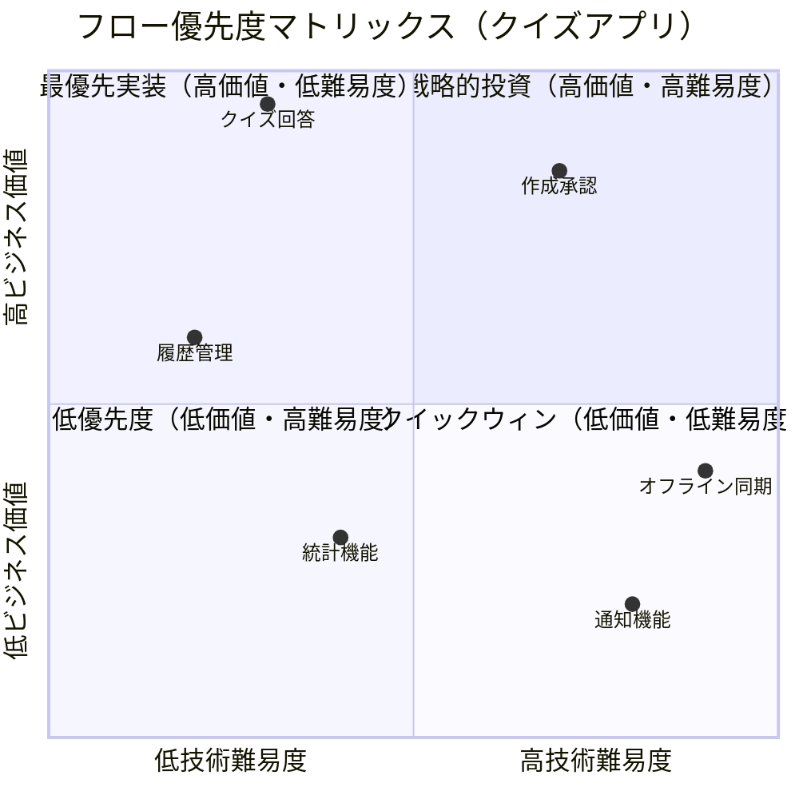

# ユーザーフロー分析ガイド

## 目的

- ビジネス価値・技術的重要度の2軸でフローを評価し、開発優先度の決定とROI最適化を支援することで、限られたリソースで最大価値を実現する効率的なDDD設計を実現せよ

## 遵守事項

- **価値駆動優先度設定**: ビジネス価値×技術難易度によるROI分析で客観的優先度決定を行え
- **4WH1完全網羅**: Who・What・When・Where・Why・Howの全要素を必須で分析せよ
- **段階的実装計画**: 優先度に基づくPhase別実装計画で効率的な価値提供を実現せよ
- **測定可能な指標設定**: 各フローの成功を定量的に測定できるKPI・成功条件を必ず設定せよ

## アウトプット出力先

### 基本方針

ユーザーフロー分析成果物は、開発優先度決定とROI最適化の指針として、`docs/project/ddd-design/` ディレクトリに配置し、段階的実装計画の基盤とする。

### 出力先ディレクトリ構造

```text
docs/project/ddd-design/2.02.5_user-flow-analysis/
├── user-flow-analysis.md              # ユーザーフロー分析（メイン）
├── flow-priority-matrix/               # 優先度マトリックス詳細
│   ├── business-value-matrix.md        # 業務価値マトリックス
│   ├── roi-calculation.md              # ROI計算・評価方法
│   └── phase-implementation-plan.md    # Phase別実装計画
├── flow-detailed-analysis/             # フロー詳細分析
│   ├── P1-quiz-answer-flow.md          # 最優先フロー詳細
│   ├── P2-history-management-flow.md   # 第2優先フロー詳細
│   ├── P3-creation-approval-flow.md    # 第3優先フロー詳細
│   └── README.md                       # フロー一覧・サマリー
└── flow-monitoring/                    # フロー監視・改善
    ├── kpi-dashboard.md                # KPI・成功指標
    └── roi-monitoring.md               # ROI監視・改善計画
```

**ファイル命名規則**：

- **フロー詳細**: `{Priority}-{FlowName}.md`（例：P1-quiz-answer-flow.md）
- **PascalCase使用**: フロー名・ドメイン名はPascalCaseで統一
- **優先度識別**: P1（最優先）～P6（低優先度）で明確に分類

## ユーザーフロー分析の手順

### 1. 業務価値マトリックス作成

#### 1.1 フロー優先度可視化

**参照ドキュメント**: `docs/project/specifications/user-stories/`, `requirements/`, `success-scenarios/`

**必須実施項目**:

- 全フローのビジネス価値・技術難易度の2軸評価
- Mermaid quadrantChartによる優先度マトリックス作成
- ROI計算による定量的優先度算出

**業務価値マトリックステンプレート**:

```markdown
# ユーザーフロー分析

## 業務価値マトリックス

```mermaid
quadrantChart
    title フロー優先度マトリックス
    x-axis 低技術難易度 --> 高技術難易度
    y-axis 低ビジネス価値 --> 高ビジネス価値
    
    quadrant-1 戦略的投資（高価値・高難易度）
    quadrant-2 最優先実装（高価値・低難易度）
    quadrant-3 低優先度（低価値・高難易度）
    quadrant-4 クイックウィン（低価値・低難易度）
    
    {フロー名1}: [技術難易度(0-1), ビジネス価値(0-1)]
    {フロー名2}: [技術難易度(0-1), ビジネス価値(0-1)]
```

## フロー評価詳細

| フロー名 | ビジネス価値 | 技術難易度 | 実装工数 | ROI | 優先度 | 実装時期 |
|----------|-------------|------------|----------|-----|--------|----------|
| {フロー名} | {1-10点} | {1-10点} | {時間} | {計算値} | P{1-6} | Phase{1-3} |

```

#### 1.2 評価基準の標準化

**ビジネス価値評価基準（1-10点）**:

| 点数 | 基準 | 説明 |
|------|------|------|
| **9-10点** | 必須・収益直結 | ビジネス継続に必須、売上に直接影響 |
| **7-8点** | 重要・競合優位 | 顧客満足度、競合差別化に重要 |
| **5-6点** | 改善・効率化 | ユーザー体験向上、業務効率化に寄与 |
| **3-4点** | 基盤・将来投資 | 運用改善、将来の成長基盤 |
| **1-2点** | 付加価値 | Nice-to-have、オプション機能 |

**技術難易度評価基準（1-10点）**:

| 点数 | 基準 | 説明 |
|------|------|------|
| **9-10点** | 新技術・高リスク | 新技術習得必須、実装リスク高 |
| **7-8点** | 複雑・中リスク | 複雑な設計・実装、テスト工数大 |
| **5-6点** | 標準・既知技術 | 標準的実装、既存技術で対応可能 |
| **3-4点** | 基本・低リスク | 基本的CRUD、単純な画面・API |
| **1-2点** | 設定レベル | 設定変更、マスタ追加レベル |

### 2. ROI計算と優先度決定

#### 2.1 ROI計算フレームワーク

**ROI計算式**:

```

ROI = (ビジネス価値点 × 想定利用頻度) / (実装工数 × 技術難易度係数)

技術難易度係数:

- 1-3点: 0.5（低リスク）
- 4-6点: 1.0（標準）  
- 7-10点: 2.0（高リスク）

```

**優先度判定基準**:

- **ROI > 10.0**: P1（最優先実装）
- **ROI 7.0-10.0**: P2（高優先実装） 
- **ROI 5.0-7.0**: P3（中優先実装）
- **ROI 3.0-5.0**: P4（低優先実装）
- **ROI < 3.0**: P5-P6（延期・中止検討）

#### 2.2 Go/No-Go判定基準

**実装判定マトリックス**:

```markdown
## 実装判定

### Go判定基準
- ROI > 5.0: 積極的実装
- ROI 3.0-5.0: 条件付き実装
- ROI < 3.0: 延期・中止検討

### 例外判定基準
- 法的要件: ROIに関わらず実装必須
- セキュリティ: 高優先度で実装
- 技術負債解消: 長期ROI考慮で判定

### リスク許容度
- 高価値・高リスク: 段階的実装でリスク軽減
- 低価値・高リスク: 原則実装しない
- 低価値・低リスク: 余剰リソース時のみ実装
```

### 3. 4WH1詳細分析（優先度順）

#### 3.1 高優先度フローの詳細分析

**各優先度フロー毎に実施する分析**:

```markdown
# P{優先度}: {フロー名}（ROI: {値}）

## 4WH1分析

| 要素 | 詳細 | ビジネス価値への寄与 |
|------|------|---------------------|
| **Who** | {対象ユーザー、利用割合} | {価値貢献の説明} |
| **What** | {具体的な操作・機能} | {コア価値、差別化要素} |
| **When** | {利用タイミング、頻度} | {エンゲージメント、収益への影響} |
| **Where** | {利用環境、技術的制約} | {ターゲット適合性} |
| **Why** | {利用動機、解決課題} | {顧客価値、競合優位性} |
| **How** | {実現手法、技術方式} | {実装可能性、UX向上} |

## 価値測定指標

- **KPI1**: 目標値 → 改善目標値
- **KPI2**: 目標値 → 改善目標値
- **KPI3**: 目標値 → 改善目標値

## 実装判断

- **Go/No-Go判定**: ✅Go / 🔶Defer / ❌No-Go
- **判定理由**: {ROI、リスク、戦略的重要性の観点}
- **成功条件**: {具体的成功指標、測定方法}
- **リスク評価**: {技術・ビジネスリスクと対策}
```

#### 3.2 重要な制約・依存関係の明確化

**制約・依存関係テンプレート**:

```markdown
## フロー間の制約・依存関係

### 順序制約
1. **{フローA} → {フローB} → {フローC}**: {制約理由}

### 前提条件制約  
2. **{フロー}.{条件} == '{値}'**: {実行の前提条件}

### 技術的依存関係
3. **{フローX} depends on {技術・API}**: {依存内容と影響}

### ビジネスルール制約
4. **{条件} → {結果}**: {ビジネス制約詳細}
```

### 4. Phase別実装計画の策定

#### 4.1 Phase分割の原則

**Phase分割基準**:

- **Phase 1（MVP）**: P1-P2フロー、基本価値提供
- **Phase 2（成長期）**: P3-P4フロー、体験向上・運用効率化  
- **Phase 3（拡張期）**: P5-P6フロー、差別化・技術優位性

**Phase別実装計画テンプレート**:

```markdown
# Phase別実装計画

## Phase 1: MVP（{期間}）

**目標**: {Phase目標の明確化}

| Week | フロー | 工数 | 担当 | 成功指標 |
|------|------|------|------|----------|
| **{週}** | {フロー名} | {時間} | {担当者} | {KPI目標値} |

**Phase1成功指標**:
- {指標1}: {目標値}
- {指標2}: {目標値}
- {指標3}: {目標値}

## Phase 2: 成長期（{期間}）

**目標**: {Phase目標}

**実装対象**:
- {フロー/機能}
- {フロー/機能}

**Phase2成功指標**:
- {指標1}: {目標値}
- {指標2}: {目標値}

## Phase 3: 拡張期（{期間}）

**目標**: {Phase目標}

**実装対象**:
- {フロー/機能}
- {フロー/機能}
```

#### 4.2 ROI監視・改善プロセス

**ROI監視フレームワーク**:

```markdown
# ROI監視・改善

## 測定フレームワーク

```

実際ROI = (実現した価値) / (実際の実装コスト)

価値測定:

- 定量: DAU増加、セッション時間、収益指標
- 定性: ユーザー満足度、ブランド価値、NPS

コスト測定:

- 開発工数（時間単価 × 実工数）
- 運用コスト（サーバー、保守、サポート）
- 機会損失（他機能を作らなかったことによる損失）

```

## 改善プロセス

1. **月次レビュー**: 各フローのROI実績確認
2. **優先度再評価**: 新たな価値発見、技術環境変化への対応
3. **Phase計画見直し**: ROI実績に基づく計画調整
4. **リソース再配分**: 高ROIフローへのリソース集中
```

## 完了判定基準

### 必須要件

- **全フローの価値評価完了**: ビジネス価値・技術難易度の2軸評価が完了している
- **ROI計算による優先度決定**: 客観的指標による優先順位が確定している
- **4WH1完全分析**: 高優先度フローの4WH1要素が漏れなく分析されている
- **Phase別実装計画**: 優先度に基づく段階的実装計画が策定されている

### 品質要件

- **測定可能性**: 各フローの成功がKPIで定量測定できる設計
- **実装可能性**: 技術難易度とリソースが適切に見積もられている  
- **価値追跡性**: ビジネス価値の根拠が明確で説明可能
- **改善可能性**: ROI監視・改善プロセスが定義されている

### 文書品質要件

- **視覚的優先度表現**: Mermaid quadrantChartによる直感的な優先度表現
- **表形式の整理**: フロー評価・実装計画が表形式で整理されている
- **定量的根拠**: ROI計算式・判定基準が明確に記載されている
- **実装指針の具体性**: Phase別計画が実行可能な詳細度で記載されている

## 完了後の必須アクション

1. **直ちに**ユーザーに「ユーザーフロー分析・優先度決定」のレビューを依頼する
2. **ADR作成**: 以下の重要な優先度決定について、必ずADRを作成する：
   - **ROI重視アプローチ採用決定**: なぜROI基準での優先度決定を選択したかの根拠
   - **Phase分割基準決定**: MVP・成長期・拡張期の分割基準選択理由
   - **Go/No-Go判定基準決定**: 実装判定基準の設定根拠
   - **KPI設定決定**: 各フローの成功指標選択理由
3. **ADR作成手順**:
   - 各ADRは「Proposed」ステータスで作成
   - ADRインデックス（`docs/project/adr/README.md`）への追加
   - DDD設計ドキュメント（`docs/project/ddd-design/README.md`）からのリンク追加
4. **次工程の判断**をユーザーに委ねる：
   - 通常フロー：「API設計」「画面設計」の優先度順実装
   - 並行フロー：「ドメインサービス抽出」で高優先度フローの実装設計
   - 戻りフロー：フロー分析結果に基づくドメインオブジェクト設計の見直し
5. ユーザーの明示的な承認を得てから指定された工程に進む

## 📊 ユーザーフロー分析アプローチ比較

このガイドは**業務価値マトリックス型**を基本アプローチとしているが、プロジェクト特性に応じて以下の5つのアプローチから最適な手法を選択できる：

### 5つのアプローチ比較表

| 項目 | 案1: 4WH1詳細分析型 | 案2: フロー図中心型 | 案3: ユーザー種別分割型 | 案4: 業務価値マトリックス型 | 案5: イベント駆動分析型 |
|------|------------------|-------------------|---------------------|------------------------|----------------------|
| **4WH1網羅性** | ✅ 完全 | ✅ 完全 | 🔶 部分的 | ✅ 完全 | 🔶 部分的 |
| **重要度明確化** | ✅ 高 | 🔶 中 | 🔶 中 | ✅ 最高 | ❌ 低 |
| **処理方式分類** | ✅ 明確 | ✅ 明確 | ✅ 明確 | ✅ 明確 | ✅ 最詳細 |
| **視覚的理解** | ❌ 低 | ✅ 最高 | 🔶 中 | ✅ 高 | ✅ 高 |
| **実装指針** | ✅ 高 | ✅ 高 | ✅ 最高 | 🔶 中 | ✅ 高 |
| **保守性** | 🔶 中 | ❌ 低 | ✅ 高 | 🔶 中 | ❌ 低 |
| **学習コスト** | 🔶 中 | ✅ 低 | ✅ 低 | 🔶 中 | ❌ 高 |

### 🎯 プロジェクト特性別推奨アプローチ

#### 🥇 最優先推奨：業務価値マトリックス型（このガイドのアプローチ）

**適用場面**：

- ほぼ全ての場合（特にリソース制約がある場合）
- スタートアップ・小規模チームでの効率的開発
- 機能数が多く優先度付けが重要
- ROI重視の開発方針

**推奨理由**：

1. **ビジネス価値直結**: ROI計算による客観的優先度決定
2. **リソース最適化**: 限られたリソースで最大価値実現
3. **ステークホルダー説明**: 価値可視化による理解促進
4. **段階的実装**: 優先度に基づく効率的な価値提供

#### 🥈 第2推奨：4WH1詳細分析型

**適用場面**：

- 複雑なビジネスフローの詳細分析が必要
- 要件定義の厳密性が重要（金融、医療等）
- 例外処理・エラーハンドリングが重要

#### 🥉 第3推奨：フロー図中心型

**適用場面**：

- フローの視覚的理解が重要
- 非技術者との共有が頻繁
- UI/UX設計との連携が重要

### 📋 状況別推奨マトリックス

| プロジェクト特性 | 第1推奨 | 第2推奨 | 理由 |
|------------------|---------|---------|------|
| **標準的な業務アプリ** | 業務価値マトリックス | 4WH1詳細分析 | ROI重視 + 包括分析 |
| **リソース制約あり** | 業務価値マトリックス | フロー図中心 | 優先度決定 + 効率的整理 |
| **複雑なビジネス** | 4WH1詳細分析 | ユーザー種別分割 | 詳細分析 + 権限整理 |
| **セキュリティ重視** | ユーザー種別分割 | 4WH1詳細分析 | 権限明確化 + 詳細分析 |
| **イベント駆動採用** | イベント駆動分析 | 業務価値マトリックス | アーキテクチャ特化 + 価値重視 |

## 参考：アプローチ選択理由

### 業務価値マトリックス型の採用理由

**選択根拠**:

- ✅ **ROI重視**: 客観的指標による効率的な意思決定
- ✅ **リソース最適化**: 限られたリソースで最大価値実現
- ✅ **ステークホルダー説明**: 価値可視化による理解促進・合意形成
- ✅ **段階的実装**: 優先度に基づく効率的な開発計画

**期待効果**:

- **開発効率**: ROI重視で30-40%の効率向上
- **意思決定速度**: 客観的指標による迅速な判断
- **ステークホルダー満足度**: 価値可視化による理解促進

この選択により、限られたリソースで最大の価値を実現する効率的なユーザーフロー分析が実現される。

## 📚 詳細実装テンプレート：業務価値マトリックス型

### クイズアプリケーション実装例

#### 業務価値マトリックス



#### フロー評価詳細・優先度ランキング

| 順位 | フロー名 | ビジネス価値 | 技術難易度 | 実装工数 | ROI | 実装時期 | 判定 |
|------|----------|-------------|------------|----------|-----|----------|------|
| **1** | **クイズ回答フロー** | 高(9.5) | 低(3) | 40h | **12.7** | Phase1-Week1 | ✅ Go |
| **2** | **履歴管理フロー** | 中(6) | 低(2) | 16h | **18.8** | Phase1-Week2 | ✅ Go |
| **3** | **作成・承認フロー** | 高(8.5) | 高(7) | 60h | **7.1** | Phase1-Week3-4 | ✅ Go |
| **4** | **統計機能** | 低(3) | 中(4) | 24h | **6.3** | Phase2 | 🔶 Defer |
| **5** | **オフライン同期** | 中(4) | 高(9) | 80h | **2.0** | Phase3 | 🔶 Defer |
| **6** | **通知機能** | 低(2) | 高(8) | 40h | **1.3** | 未定 | ❌ No-Go |

### 4WH1詳細分析（高優先度フロー）

#### P1: クイズ回答フロー（ROI: 12.7）

| 要素 | 詳細 | ビジネス価値への寄与 |
|------|------|---------------------|
| **Who** | 匿名ユーザー（メインターゲット100%） | 全ユーザーが利用、直接的収益貢献 |
| **What** | ◯×クイズ回答、結果表示、次問題遷移 | コア機能、滞在時間・リピート率向上 |
| **When** | 学習時（想定：1日3回 × 100ユーザー） | 高頻度利用でエンゲージメント最大化 |
| **Where** | スマートフォンブラウザ（PWA） | ターゲット環境100%対応 |
| **Why** | 学習効率向上、手軽な知識確認 | 顧客価値直結、口コミ・拡散効果 |
| **How** | Tinder風スワイプUI、アニメーション | 差別化要素、UX競合優位性 |

**価値測定指標**:

- **DAU（日次アクティブユーザー）**: 目標100人 → Phase2で300人
- **セッション時間**: 目標5分/回 → 10分/回に改善
- **回答完了率**: 目標80% → 90%に改善
- **リピート率**: 目標60% → 80%に改善

**実装判断**:

- **Go/No-Go判定**: ✅ **Go（最優先）**
- **判定理由**: ROI最高、技術リスク低、MVPに必須
- **成功条件**: 回答完了率80%以上、API応答時間100ms以内
- **リスク**: 低（既知技術、UI実装のみ）

#### P2: 履歴管理フロー（ROI: 18.8）

| 要素 | 詳細 | ビジネス価値への寄与 |
|------|------|---------------------|
| **Who** | 匿名ユーザー（学習継続志向80%） | 学習継続→長期利用→価値向上 |
| **What** | 回答履歴表示、詳細確認、再回答 | リテンション向上、学習効果可視化 |
| **When** | 学習振り返り時（週2-3回利用想定） | 定期利用パターン確立 |
| **Where** | 履歴画面（IndexedDB）、オフライン対応 | データ永続化、継続性確保 |
| **Why** | 学習進捗確認、復習効率化 | 教育効果向上→サービス価値向上 |
| **How** | リスト表示、検索・フィルタ、統計表示 | 使いやすさ→満足度向上 |

**価値測定指標**:

- **履歴利用率**: 目標50% → 70%
- **復習実行率**: 目標30% → 50%
- **週次継続率**: 目標40% → 60%

**実装判断**:

- **Go/No-Go判定**: ✅ **Go（第2優先）**
- **判定理由**: ROI高、実装簡単、ユーザー体験向上大
- **成功条件**: 履歴利用率50%以上
- **リスク**: 極低（基本的CRUD操作）

### Phase別実装計画

#### Phase 1: MVP（4週間）

**目標**: 基本的なクイズサービスとして機能

| Week | フロー | 工数 | 担当 | 成功指標 |
|------|------|------|------|----------|
| **1** | クイズ回答フロー | 40h | フルスタック | 回答完了率80% |
| **2** | 履歴管理フロー | 16h | フロントエンド | 履歴利用率50% |
| **3-4** | 作成・承認フロー | 60h | フルスタック | 月次50問投稿 |

**Phase1成功指標**:

- DAU: 50人以上
- 月次投稿数: 50問以上  
- ユーザー満足度: 4.0/5.0以上

#### Phase 2: 成長期（6週間）

**目標**: ユーザー体験向上、運用効率化

**実装対象**:

- 統計機能実装
- UI/UX改善
- パフォーマンス最適化
- SEO対策

**Phase2成功指標**:

- DAU: 200人以上
- 月次投稿数: 150問以上
- リピート率: 70%以上

#### Phase 3: 拡張期（8週間）

**目標**: 差別化要素追加、技術的優位性確立

**実装対象**:

- オフライン同期機能
- 高度な検索機能
- ソーシャル機能
- API公開

この詳細テンプレートにより、ROI重視の効率的なユーザーフロー分析と段階的実装計画が実現される。
