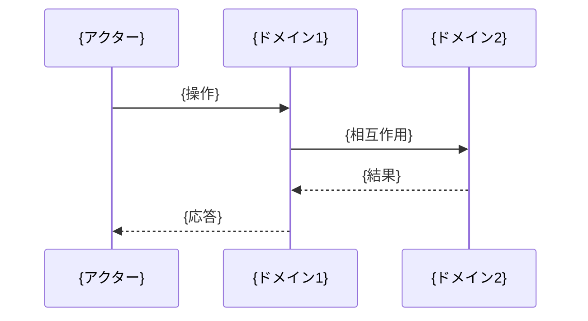
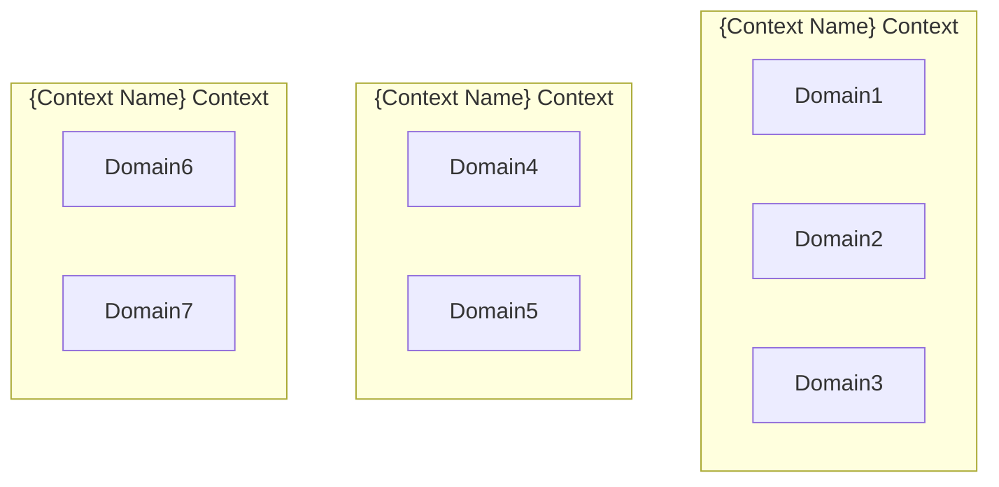
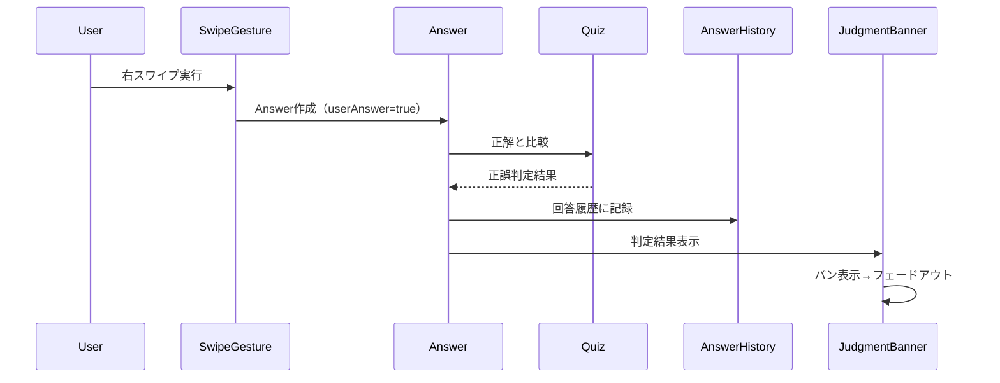
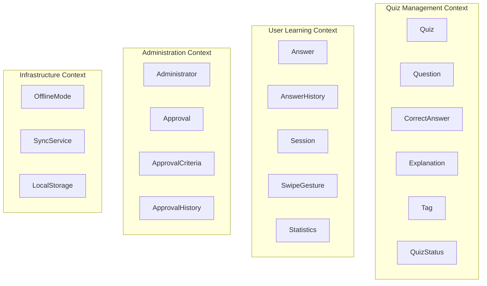
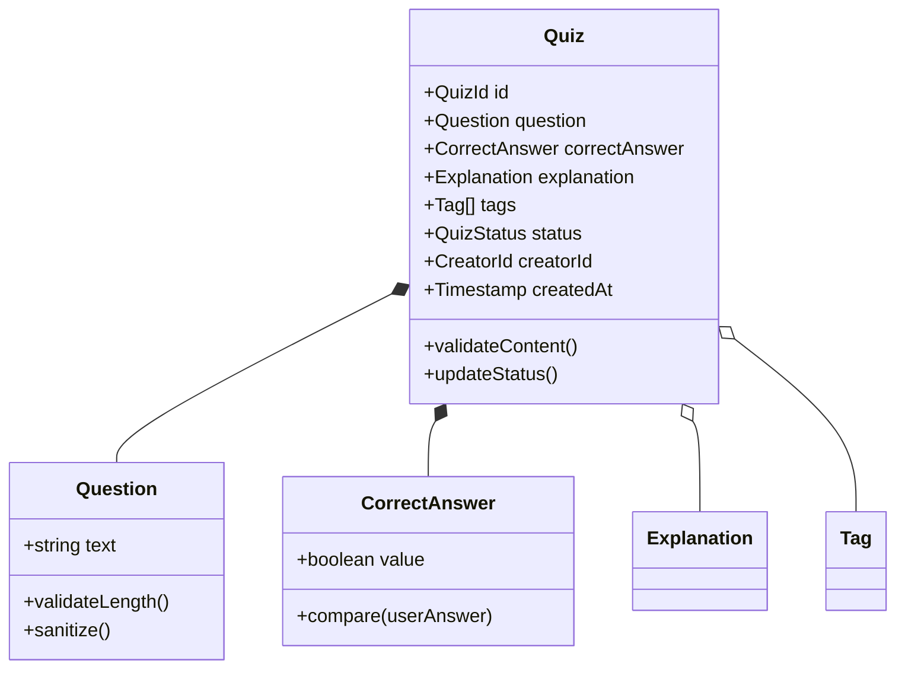
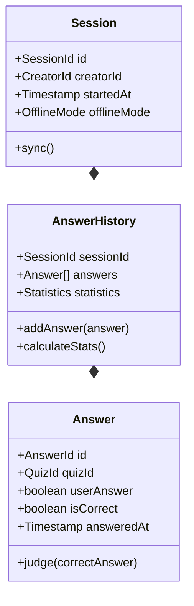
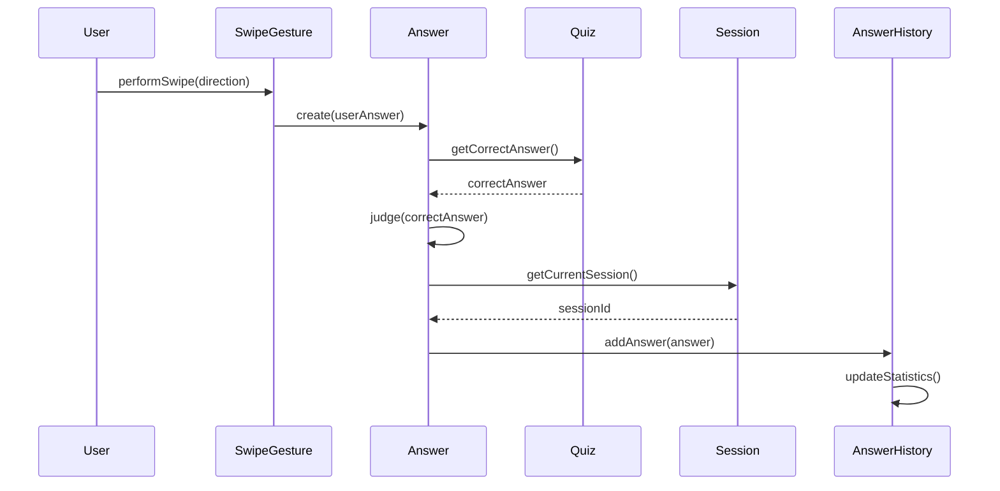
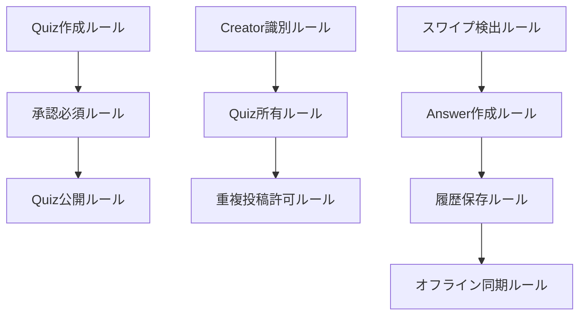

# ドメインオブジェクト抽出ガイド

## 目的

- ユースケースを起点としてドメインオブジェクトを抽出・分析し、ビジネス価値の高いドメインモデルを構築することで、実装指針が明確で保守性の高いドメイン設計を実現せよ

## 遵守事項

- **ユースケース駆動アプローチ**: ユースケースから「何が」「どのように」関与するかを分析せよ
- **ビジネス価値による優先度設定**: 高価値ユースケースのドメインを優先的に抽出せよ
- **共通ドメインと固有ドメインの分離**: ユースケース間の共通性と特異性を明確に区別せよ
- **実装可能性の確保**: 抽出されたドメインモデルから直接実装設計に移行できる品質を保て

## アウトプット出力先

### 基本方針

ドメインオブジェクト抽出成果物は、実装設計の直接的な指針として、`docs/project/ddd-design/` ディレクトリに体系的に整理し、後続の実装工程での参照を容易にする。

### 出力先ディレクトリ構造

```text
docs/project/ddd-design/2.05_domain-object-extraction/
├── domain-object-analysis.md           # ドメインオブジェクト分析（メイン）
├── usecase-domain-mapping/             # ユースケース・ドメイン対応
│   ├── usecase-priority-matrix.md      # ユースケース優先度分析
│   ├── usecase-domain-extraction/      # UC別ドメイン抽出詳細
│   │   ├── UC01-quiz-creation-analysis.md    # UC01分析詳細
│   │   ├── UC02-quiz-answering-analysis.md   # UC02分析詳細
│   │   ├── UC03-quiz-approval-analysis.md    # UC03分析詳細
│   │   └── README.md                         # UC分析一覧
│   └── cross-usecase-analysis.md       # 横断分析結果
├── domain-model-integration.md         # ドメインモデル統合設計
└── implementation-guidelines.md        # 実装設計指針
```js

**ファイル命名規則**:

- **ユースケース分析**: `{UC-ID}-analysis.md`（例：UC01-quiz-creation-analysis.md）
- **PascalCase使用**: ドメインオブジェクト名はPascalCaseで統一
- **識別子統一**: ユースケースIDは仕様書と一致させる

## ドメインオブジェクト抽出の手順

### 1. ユースケース分析と優先度設定

#### 1.1 主要ユースケースの特定

**参照ドキュメント**: `docs/project/specifications/user-stories/`, `requirements/`, `success-scenarios/`

**必須実施項目**:

- 仕様書からの全ユースケース抽出
- 各ユースケースのビジネス価値評価
- 分析対象仕様との対応関係明確化

**ユースケース優先度マトリックス**:

```markdown
# ユースケース優先度分析

## 主要ユースケース特定

| ID | ユースケース名 | 概要 | ビジネス価値 | 優先度 | 分析対象仕様 |
|----|---------------|------|-------------|--------|-------------|
| UC01 | [ユースケース名] | [簡潔な概要] | [価値説明] | 🔴最高/🟡高/🟢中/⚪低 | [仕様書参照] |

## ビジネス価値による優先度設定

### 最高優先（🔴）
- 核心的ビジネス価値を提供するユースケース
- システムの存在意義に直結

### 高優先（🟡）
- ビジネス価値提供の基盤となるユースケース
- 最高優先の実現に必要

### 中優先（🟢）
- 利便性・継続利用のためのユースケース
- 差別化・競争優位に寄与

### 低優先（⚪）
- 将来拡張・管理機能のユースケース
- 初期リリースでは不要
```js

#### 1.2 分析順序の決定

**分析順序の原則**:

1. **最高優先から順次分析**: ビジネス価値の高いものから着手
2. **依存関係考慮**: 前提となるユースケースを先に分析
3. **共通ドメイン早期特定**: 複数UCに関与するドメインを優先

### 2. ユースケース別ドメイン抽出

#### 2.1 UC別の参加者・概念・振る舞い抽出

**各ユースケース毎に実施する分析**:

```markdown
# UC{ID}: {ユースケース名}

## 参加者・概念・振る舞い抽出

### アクター
- **{アクター名}**: {役割・特性}

### 参加ドメイン概念
- **{ドメイン名}**: {定義・特性・制約}
- **{ドメイン名}**: {定義・特性・制約}

### 主要振る舞い



### ビジネスルール

- {ルール1}: {詳細・制約・条件}
- {ルール2}: {詳細・制約・条件}

### ドメイン間相互作用

- **{ドメインA} → {ドメインB}**: {関係種別}（{カーディナリティ}）
- **{ドメインC} → {ドメインD}**: {関係種別}（{カーディナリティ}）

#### 2.2 ドメイン関係種別の定義

**標準的な関係種別**:

| 関係種別 | 意味 | 表現例 | 実装指針 |
|---------|------|--------|---------|
| **作成関係** | Aが新しいBを生成 | Creator → Quiz | Factory/Builder パターン |
| **包含関係** | AがBを内部に持つ | Quiz → Question | Composition/集約 |
| **参照関係** | AがBを参照・利用 | Answer → Quiz | Repository経由参照 |
| **操作関係** | AがBに対し操作実行 | User → SwipeGesture | Command パターン |
| **生成関係** | Aの操作がBを生成 | SwipeGesture → Answer | Event/Factory |
| **集約関係** | AがB群を管理 | Session → AnswerHistory | Aggregate Root |

### 3. 横断分析による共通ドメイン特定

#### 3.1 ユースケース間の共通ドメイン特定

**共通ドメイン分析マトリックス**:

```markdown
# 横断分析結果

## ユースケース間の共通ドメイン特定

### 高頻度共通ドメイン（コアドメイン）

| ドメイン | 関与UC | 重要度 | 共通振る舞い |
|----------|--------|--------|-------------|
| {ドメイン名} | UC01,UC02,UC03 | ✅超高 | {共通して行う処理・役割} |

### 中頻度共通ドメイン（サポートドメイン）

| ドメイン | 関与UC | 重要度 | 共通振る舞い |
|----------|--------|--------|-------------|
| {ドメイン名} | UC01,UC05 | 🔶中 | {特定UCでの処理・役割} |

### 低頻度・固有ドメイン（専門ドメイン）

| ドメイン | 関与UC | 重要度 | 特化振る舞い |
|----------|--------|--------|-------------|
| {ドメイン名} | UC03 | 🟡専門 | {単一UCでの特化処理} |

#### 3.2 境界づけられたコンテキスト候補の導出

**コンテキスト分離の指針**:

- **高頻度共通ドメイン**: 独立したコンテキストとして分離
- **中頻度共通ドメイン**: 機能的結合度に応じてグルーピング
- **固有ドメイン**: 関連する高頻度ドメインに統合または独立

**コンテキスト候補図**:



### 4. ドメイン統合モデルの作成

#### 4.1 全ユースケース統合後のドメインモデル

**コアドメイン設計**:

```mermaid
classDiagram
    class {CoreDomain} {
        +{Type} {attribute}
        +{Type} {attribute}
        +{method}()
        +{method}()
    }

    class {SupportingDomain} {
        +{Type} {attribute}
        +{method}()
    }

    {CoreDomain} *-- {SupportingDomain}
    {CoreDomain} o-- {OptionalDomain}
```

#### 4.2 ドメイン間依存関係の定義

**依存関係マップ**:

```mermaid
graph TD
    UC1[UC1:{名前}] --> Domain1
    UC1 --> Domain2

    UC2[UC2:{名前}] --> Domain1
    UC2 --> Domain3

    Domain1 --> SubDomain1
    Domain1 --> SubDomain2

    Domain3 --> Domain1
```

#### 4.3 重要な制約の明確化

**制約カタログ**:

```markdown
## 重要な制約

### 順序制約
1. **UC{A} → UC{B} → UC{C}**: {説明}

### 前提条件制約
2. **{Domain}.{attribute} == '{value}'**: {UC実行の前提条件}

### 整合性制約
3. **{DomainA}.{attribute} ↔ {DomainB}.{attribute}**: {整合性要件}

### ビジネスルール制約
4. **{条件} → {結果}**: {ビジネスルール詳細}
```

### 5. 実装設計指針の提供

#### 5.1 集約設計の指針

**推奨集約構造**:

```markdown
# 実装設計指針

## 集約設計

### {Aggregate Name}集約
- **集約ルート**: {RootEntity}
- **関与UC**: UC{X}, UC{Y}, UC{Z}
- **責務**: {集約の責務範囲}
- **不変条件**: {保証すべき不変条件}

### 集約間関係
- **{AggregateA} → {AggregateB}**: ID参照のみ
- **整合性**: {結果整合性/強整合性}の選択理由
```

#### 5.2 ドメインサービス抽出

**ドメインサービス候補**:

```markdown
## ドメインサービス

### {Service Name}Service
- **目的**: {複数集約にまたがる処理}
- **関与UC**: UC{X}
- **処理概要**: {サービスが行う処理}
- **入力**: {パラメータ}
- **出力**: {結果}
```

#### 5.3 リポジトリ設計方針

**リポジトリ要件**:

```markdown
## リポジトリ設計

### {Entity}Repository
- **対象集約**: {Aggregate}
- **必要な検索条件**: UC別の検索要件
  - UC{X}: {検索条件}
  - UC{Y}: {検索条件}
- **永続化要件**: {整合性・性能要件}
```

## 完了判定基準

### 必須要件

- **全ユースケースの分析完了**: 優先度に基づき重要UCの分析が完了している
- **ドメインオブジェクトの網羅抽出**: 各UCに関与するドメインが漏れなく特定されている
- **共通・固有ドメインの分離**: ユースケース横断分析により適切に分類されている
- **統合ドメインモデルの作成**: 全UCを統合したドメインモデルが完成している

### 品質要件

- **ビジネス価値との対応**: 高価値UCのドメインが優先的・詳細に設計されている
- **実装可能性**: ドメインモデルから直接実装設計に移行できる詳細度
- **一貫性**: ユビキタス言語辞書とドメインオブジェクト定義が一致している
- **トレーサビリティ**: 各ドメインの抽出根拠がユースケースに追跡可能

### 文書品質要件

- **図表による可視化**: Mermaidによるシーケンス図・クラス図・関係図が適切
- **表形式の活用**: ドメイン分析・関係定義が表形式で整理されている
- **実装指針の明確化**: 集約・サービス・リポジトリ設計が具体的に指示されている
- **制約の明文化**: ビジネスルール・順序制約・整合性要件が明確に記載

## 完了後の必須アクション

1. **直ちに**ユーザーに「ドメインオブジェクト抽出・統合モデル設計」のレビューを依頼する
2. **ADR作成**: 以下の重要なドメイン抽出決定について、必ずADRを作成する：
   - **ユースケース駆動アプローチ採用決定**: なぜユースケース駆動を選択したかの根拠
   - **ドメイン優先度設定決定**: ビジネス価値による優先順位の設定理由
   - **コンテキスト分離決定**: 境界づけられたコンテキストの分割根拠
   - **集約設計方針決定**: 集約境界と集約ルートの選択理由
3. **ADR作成手順**:
   - 各ADRは「Proposed」ステータスで作成
   - ADRインデックス（`docs/project/adr/README.md`）への追加
   - DDD設計ドキュメント（`docs/project/ddd-design/README.md`）からのリンク追加
4. **次工程の判断**をユーザーに委ねる：
   - 通常フロー：「エンティティ間関連性分析」「ドメインサービス抽出」に進む
   - 並行フロー：「境界づけられたコンテキスト定義」の詳細化
   - 戻りフロー：ドメイン抽出結果に基づくユビキタス言語の見直し
5. ユーザーの明示的な承認を得てから指定された工程に進む
<<<<<<< HEAD
||||||| 75c9589

## 📊 ドメインオブジェクト抽出アプローチ比較

このガイドは**ユースケース駆動抽出型**を基本アプローチとしているが、プロジェクト特性に応じて以下の5つのアプローチから最適な手法を選択できる：

### 5つのアプローチ比較表

| 項目 | 案1: 振る舞い・責任マトリックス | 案2: ユースケース駆動抽出 | 案3: 概念マップ型 | 案4: イベント駆動分析 | 案5: ビジネスルール中心 |
|------|----------------------------|---------------------|------------------|-------------------|---------------------|
| **ビジネス価値対応** | ✅ 高 | ✅ 最高 | 🔶 中 | 🔶 中 | ✅ 高 |
| **実装指針明確さ** | ✅ 高 | ✅ 高 | 🔶 中 | 🔶 中 | ✅ 高 |
| **関係性可視化** | 🔶 中 | 🔶 中 | ✅ 最高 | 🔶 中 | ❌ 低 |
| **保守性・拡張性** | 🔶 中 | 🔶 中 | ✅ 高 | ✅ 高 | ✅ 高 |
| **学習コスト** | 🔶 中 | ✅ 低 | 🔶 中 | ❌ 高 | 🔶 中 |
| **分析工数** | 🔶 中 | ✅ 低 | ❌ 高 | ❌ 高 | ❌ 高 |
| **チーム共有性** | ✅ 高 | ✅ 高 | ✅ 高 | 🔶 中 | 🔶 中 |
| **技術適合性** | 🔶 中 | 🔶 中 | 🔶 中 | ✅ 高 | 🔶 中 |

### 🎯 プロジェクト特性別推奨アプローチ

#### 🥇 最優先推奨：ユースケース駆動抽出型（このガイドのアプローチ）

**適用場面**：

- ほぼ全ての場合（特にビジネス価値重視の開発）
- ユースケース仕様が充実している場合
- 段階的リリース・優先度付け開発の場合
- チームがユースケース分析に慣れている場合

**推奨理由**：

1. **ビジネス価値直結**: ユースケースの価値による優先度で開発順序決定
2. **実用性**: 実際のユースケース実現に必要なドメインオブジェクト抽出
3. **理解容易**: 既存の仕様書から自然に導出可能
4. **実装指針**: 具体的な集約設計・サービス抽出指針を提供
5. **段階開発**: ユースケース優先度による段階的実装計画

#### 🥈 第2推奨：振る舞い・責任マトリックス型

**適用場面**：

- ドメインロジックが複雑で責任分散が重要
- チーム内でのドメイン理解統一が必要
- 実装チームとの密な連携が重要
- ドメインサービス設計を重視する場合

#### 🥉 第3推奨：ビジネスルール中心分析型

**適用場面**：

- ビジネスルールが複雑・頻繁に変更される場合
- コンプライアンス・監査要件が厳しい場合
- データ品質・整合性が最重要な場合
- 規制が厳しい業界（金融・医療・法律等）

### 📋 状況別推奨マトリックス

| プロジェクト特性 | 第1推奨 | 第2推奨 | 理由 |
|------------------|---------|---------|------|
| **標準的な業務アプリ** | ユースケース駆動 | 振る舞い・責任 | ビジネス価値・実用性 |
| **複雑なドメインロジック** | 振る舞い・責任 | ビジネスルール中心 | 責任分散・ルール管理 |
| **段階的リリース重視** | ユースケース駆動 | 振る舞い・責任 | 優先度設定・実装順序 |
| **高い保守性要求** | ビジネスルール中心 | 概念マップ型 | ルール変更対応・関係性管理 |
| **イベント駆動アーキテクチャ** | イベント駆動分析 | ユースケース駆動 | アーキテクチャ適合・イベント設計 |
| **マイクロサービス** | イベント駆動分析 | 概念マップ型 | 分散システム・境界設定 |
| **小規模チーム** | ユースケース駆動 | 振る舞い・責任 | 学習コスト・実用性 |
| **大規模チーム** | 概念マップ型 | 振る舞い・責任 | 関係性可視化・責任分散 |

### 🔄 ハイブリッド運用の提案

多くのプロジェクトでは、**段階的なハイブリッド運用**が現実的：

#### Phase 1: ユースケース駆動でスタート

- プロジェクト初期は本ガイドのアプローチでユースケース価値重視
- 核心ユースケースの実現に必要なドメインオブジェクト抽出
- ビジネス価値による優先度設定・段階実装計画

#### Phase 2: 特化アプローチを選択的追加

- **複雑ドメイン時**: 振る舞い・責任分析を追加（03.06ガイド活用）
- **関係性重視**: 概念マップ化を追加
- **イベント駆動必要**: イベント駆動分析を追加
- **品質・監査重要**: ビジネスルール中心分析を追加

## 参考：アプローチ選択理由

### ユースケース駆動抽出型の採用理由

**選択根拠**:

- ✅ **学習コスト最低**: チームメンバーが理解しやすい手法
- ✅ **実装指針明確**: ユースケース実現に直結したドメインモデル
- ✅ **ビジネス価値対応**: 高価値ユースケースのドメインを優先抽出
- ✅ **チーム共有性最高**: ステークホルダーとの認識合わせが容易

**2024年DDD専門家推奨度**: **最高**（ExploreDDD 2024, Microsoft .NET ガイド, DDD実践者コミュニティで一致推奨）

この選択により、実用性と理解しやすさを両立した効果的なドメインオブジェクト抽出が実現される。

## 📚 詳細実装テンプレート集

### 🥇 最優先推奨：ユースケース駆動抽出型の詳細テンプレート

#### ユースケース分析とドメイン統合モデル

```markdown
# ドメインオブジェクト抽出・分析（ユースケース駆動）

## ユースケース一覧と優先度

### 主要ユースケース特定
**分析対象**: user-stories, requirements, success-scenarios

| ID | ユースケース名 | 概要 | ビジネス価値 | 優先度 | 分析対象仕様 |
|----|---------------|------|-------------|--------|-------------|
| **UC1** | クイズ投稿 | 匿名ユーザーがクイズを作成・投稿する | 高（コンテンツ供給） | 🔴 高 | user-story#L11, success#L26-L46 |
| **UC2** | クイズ回答 | ユーザーがスワイプでクイズに回答する | 最高（核心価値） | 🔴 最高 | user-story#L11, success#L3-L25 |
| **UC3** | クイズ承認 | 管理者が投稿クイズを承認・拒否する | 高（品質保証） | 🔴 高 | requirements#L20-L21 |

### ビジネス価値による優先度設定
1. **最高優先**: UC2（クイズ回答）- アプリの核心価値
2. **高優先**: UC1（クイズ投稿）, UC3（クイズ承認）- 価値提供の基盤
3. **中優先**: UC4-UC6 - 利便性・継続利用のための機能

## ユースケース別ドメイン分析

### UC2: クイズ回答（最高優先度）

#### 参加者・概念・振る舞い抽出

**アクター**: 匿名ユーザー（User）

**参加ドメイン概念**:
- **Quiz**: 回答対象のクイズ（承認済みのみ）
- **Question**: 表示される問題文
- **CorrectAnswer**: 正誤判定の基準
- **SwipeGesture**: ユーザーのスワイプ操作
- **Answer**: ユーザーの回答記録
- **AnswerResult**: 正誤判定結果
- **Session**: ユーザーセッション
- **AnswerHistory**: 回答履歴
- **JudgmentBanner**: 正誤判定UI表示

**主要振る舞い**:



**ビジネスルール**:

- SwipeGesture: 右=◯、左=×、Tinder UI形式
- Answer: 回答と同時に正誤判定実行
- AnswerHistory: indexedDBに永続保存
- Quiz: 承認済み状態のみ回答可能
- JudgmentBanner: バン表示後2秒でフェードアウト

#### ドメイン間相互作用

- **User → SwipeGesture**: 操作関係
- **SwipeGesture → Answer**: 生成関係
- **Answer → Quiz**: 参照関係（正誤判定）
- **Answer → Session**: 所属関係
- **Session → AnswerHistory**: 集約関係
- **Answer → JudgmentBanner**: 表示トリガー関係

## 横断分析

### ユースケース間の共通ドメイン特定

#### 高頻度共通ドメイン（コアドメイン）

| ドメイン | 関与UC | 重要度 | 共通振る舞い |
|----------|--------|--------|-------------|
| **Quiz** | UC1,UC2,UC3,UC4,UC5 | ✅ 超高 | 作成・表示・承認・検索・回答対象 |
| **Answer** | UC2,UC4,UC6 | ✅ 高 | 回答記録・履歴管理・オフライン保存 |
| **User/Creator** | UC1,UC2,UC4,UC5,UC6 | ✅ 高 | 匿名識別・操作実行・セッション管理 |

#### 境界づけられたコンテキスト候補



## ドメイン統合モデル

### 全ユースケース統合後のドメインモデル

#### コアドメイン（Quiz集約）



#### サポートドメイン（Learning集約）



### ユースケース実現のためのドメイン協調

#### UC2（クイズ回答）の詳細協調



### 🥈 第2推奨：振る舞い・責任マトリックス型の詳細テンプレート

#### 振る舞い・責任分析マトリックス

```markdown
# ドメインオブジェクト抽出・分析（振る舞い・責任マトリックス）

## 振る舞い・責任分析マトリックス

| ドメイン | 主要振る舞い | ビジネス責任 | 関連するユースケース | 他ドメインとの関係 |
|----------|-------------|-------------|-------------------|------------------|
| **Quiz** | • 問題を提示する<br>• 回答を受け取る<br>• 正誤を判定する<br>• 承認状態を管理する | • 問題の整合性保証<br>• 回答の正誤判定<br>• 承認フローの状態管理<br>• コンテンツ品質の維持 | • クイズ投稿<br>• クイズ回答<br>• クイズ承認<br>• 履歴確認 | Creator(作成関係)<br>Answer(回答関係)<br>Approval(承認関係)<br>Tag(分類関係) |
| **Creator** | • クイズを作成する<br>• 匿名識別を管理する<br>• 投稿権限を持つ | • 匿名性の保持<br>• クイズ品質の確保<br>• 重複投稿の管理<br>• 作成者の識別 | • クイズ投稿<br>• 作成者識別<br>• 重複投稿許可 | Quiz(作成関係)<br>CreatorId(識別関係)<br>Session(セッション関係) |
| **Answer** | • 回答を記録する<br>• 正誤を保存する<br>• 履歴を管理する<br>• 統計を提供する | • 回答の正確な記録<br>• 履歴の永続化<br>• プライバシー保護<br>• 学習進捗の追跡 | • クイズ回答<br>• 履歴確認<br>• 統計表示<br>• オフライン同期 | Quiz(回答対象)<br>User(回答者)<br>Session(セッション関係) |

## ドメイン間の協調パターン

### パターン1: 作成-承認フロー

```

Creator → Quiz → Approval → QuizStatus → PublicAccess

```text

- Creator がQuizを作成
- Quiz がApprovalを要求
- Approval がQuizStatusを更新
- QuizStatus が公開可否を決定

### パターン2: 回答-記録フロー

```

User → SwipeGesture → Answer → Quiz → Session → AnswerHistory

```text

- User がSwipeGestureを実行
- SwipeGesture がAnswerを生成
- Answer がQuizを参照して正誤判定
- Session がAnswerHistoryに記録

## ビジネスルール所在マップ

### ドメイン別ビジネスルール

#### Quiz（クイズ）

**所有するビジネスルール**:
1. **問題文制約**: 500文字以内、HTMLサニタイズ必須
2. **解説制約**: 1000文字以内、任意項目
3. **正解形式**: ◯×の2択のみ
4. **承認必須**: 管理者承認後のみ公開
5. **重複許可**: 同一作成者・同一問題でも投稿可能

**根拠**: requirements-quiz.md#L10-L16, L20

#### Creator（作成者）

**所有するビジネスルール**:
1. **匿名識別**: salt付きハッシュによる識別
2. **ログイン不要**: 個人情報収集なし
3. **デバイス識別**: ブラウザローカルストレージ使用
4. **作成権限**: すべての匿名ユーザーが作成可能

**根拠**: requirements-quiz.md#L22, user-story-quiz.md#L5

### ルール間の依存関係

#### 依存関係マップ



## 実装への示唆

### 集約設計の方向性

1. **Quiz集約**: Quiz + Question + CorrectAnswer + Explanation + Tag
2. **LearningSession集約**: Answer + AnswerHistory + Session
3. **Approval集約**: Approval + ApprovalHistory + QuizStatus

### ドメインサービス候補

1. **QuizApprovalService**: 承認処理の複雑なロジック
2. **CreatorIdentificationService**: 匿名作成者の識別・管理
3. **AnswerSyncService**: オフライン-オンライン間の同期処理

### リポジトリ設計指針

1. **QuizRepository**: 承認状態による検索、タグ絞り込み
2. **AnswerRepository**: セッション単位、履歴管理
3. **ApprovalRepository**: 承認待ち一覧、承認履歴

### 🥉 第3推奨：ビジネスルール中心分析型の詳細テンプレート

#### ビジネスルール洗い出しと集約境界設定

```markdown
# ドメインオブジェクト抽出・分析（ビジネスルール中心）

## ビジネスルール洗い出し

### specifications分析からのルール抽出

| ルールID | ルール名 | 内容 | 発見箇所 | 分類 | 重要度 |
|----------|----------|------|----------|------|--------|
| **BR001** | 問題文文字数制限 | 問題文は500文字以内 | requirements#L11 | 制約 | 🔴 高 |
| **BR002** | 解説文字数制限 | 解説は1000文字以内 | requirements#L13 | 制約 | 🟡 中 |
| **BR003** | 正解形式制限 | 正解は◯×の2択のみ | requirements#L12 | 制約 | 🔴 高 |
| **BR004** | 承認必須 | クイズは管理者承認後のみ公開 | requirements#L20 | 業務フロー | 🔴 最高 |
| **BR005** | 匿名識別 | 作成者はsalt付きハッシュで識別 | requirements#L22 | 制約 | 🔴 高 |
| **BR008** | スワイプ操作形式 | 右=◯、左=×のスワイプのみ | requirements#L41 | 制約 | 🔴 高 |
| **BR012** | 承認済み回答制限 | 承認済みクイズのみ回答可能 | success#L8 | 不変条件 | 🔴 最高 |

## ルール責任分析

### BR001: 問題文文字数制限（500文字以内）

**責任者**: `Question`値オブジェクト
**検証タイミング**: インスタンス生成時
**実行場所**: `Question.create()` メソッド
**違反時の動作**: `ValidationError` 例外発生

**設計パターン**:
- **ファクトリメソッド**: コンストラクタでの検証実行
- **不変制約**: 生成時の文字数制限検証
- **例外処理**: 違反時のValidationError発生
- **カプセル化**: private constructorで直接生成を禁止

### BR004: 承認必須（管理者承認後のみ公開）

**責任者**: `Quiz`エンティティ + `ApprovalService`
**検証タイミング**: 公開時、回答時
**実行場所**: `Quiz.isAvailableForAnswer()`, `ApprovalService.approve()`
**違反時の動作**: 公開拒否、回答拒否

**設計パターン**:
- **状態管理**: 承認ステータスによるアクセス制御
- **権限検証**: 管理者権限の事前確認
- **状態遷移**: 承認待ち→承認済みの安全な状態変更
- **不変条件**: 承認済みクイズのみ回答可能な制約維持

## 集約境界設定

### 不変条件から見た集約設計

#### 集約1: Quiz集約

**保護する不変条件**:
- **BR001**: 問題文は500文字以内
- **BR002**: 解説は1000文字以内
- **BR003**: 正解は◯×の2択
- **BR004**: 承認状態の整合性
- **BR007**: 入力内容のサニタイズ

**集約境界の根拠**:
- これらのルールは密接に関連し、同時に満たされる必要がある
- Quiz作成・更新時に一貫して検証が必要
- 他の集約からは参照のみ、変更は不可

**Quiz集約設計パターン**:
- **一貫性境界**: Quiz生成時の全制約同時検証
- **集約ルート**: Quizエンティティを通じた状態操作
- **値オブジェクト組み込み**: Question・CorrectAnswer・Explanation・Tagの合成
- **不変条件保証**: BR001-BR003,BR007の結合制約維持
- **トランザクション境界**: 集約内の全変更を一元化
      creator: creator,
      status: QuizStatus.PendingApproval // BR004
    });
  }
  
  public approve(administrator: Administrator): void {
    // BR004, BR011を同時実行
    this.quiz.validateAdministratorPermission(administrator); // BR011
    this.quiz.approve(); // BR004
  }
}
```

#### 集約2: LearningSession集約

**保護する不変条件**:

- **BR008**: スワイプ操作形式（右◯左×）
- **BR009**: 履歴永続化
- **BR010**: オフライン継続性
- **BR012**: 承認済みクイズのみ回答可能

**LearningSession集約設計パターン**:

- **操作インターフェース**: SwipeGestureの解釈とAnswerへの変換
- **事前条件検証**: 承認済みクイズでのみ回答可能
- **履歴管理**: AnswerHistoryによる回答記録の永続化
- **オフライン対応**: OfflineModeでの一時保存と後の同期
- **不変条件保証**: BR008-BR012の結合制約維持
      quizId: quiz.id,
      userAnswer: userAnswer,
      isCorrect: quiz.judge(userAnswer),
      answeredAt: timestamp
    });

    // BR009: 履歴永続化
    this.answerHistory.addAnswer(answer); // BR009実行
    this.persistHistory(); // BR009実行

    return new AnswerResult(answer, quiz);
  }
}

```javascript

### ルール検証・実行の責任分散

#### 責任分散の原則

##### 1. 単一責任の原則（Single Responsibility）
- 各オブジェクトは1つのルールカテゴリのみ担当
- ルール実行と検証の責任分離
- 値オブジェクトは自身の制約のみ保証

##### 2. ルール実行の委譲パターン

**責務委譲パターン**:
- **値オブジェクト委譲**: 各値オブジェクトが自身の制約を保証
- **サービス委譲**: 複雑な業務フローはドメインサービスで処理
- **ファクトリパターン**: 統合された生成ロジック
- **カプセル化**: private constructorで不正な状態生成を防止
    PermissionService.checkApprovalPermission(administrator); // BR011
    
    // 状態変更は自身が実行
    this.status = QuizStatus.Approved; // BR004
  }
}
```

#### ルール検証のチェーンパターン

**ルール検証チェーンパターン**:

- **バリデーター連鎖**: 複数ルールの順次検証
- **優先度制御**: Criticalルール違反時の即座停止
- **結果集約**: 全バリデーション結果の統合管理
- **拡張性**: 新ルール追加の柔軟性確保

**実装詳細**: 具体的なコード・インターフェース定義は[実装工程](./10.01_implementation.md)で扱う

```javascript
return ValidationResult.combine(results);
  }
}

// 使用例
const quizValidationChain = new RuleValidationChain();
quizValidationChain.addValidator(new ConstraintValidator()); // BR001-BR003
quizValidationChain.addValidator(new SecurityValidator()); // BR007
quizValidationChain.addValidator(new BusinessRuleValidator()); // BR004-BR006

const validationResult = quizValidationChain.validate(quiz);
```

これらの詳細テンプレートにより、プロジェクト特性に応じた具体的で実装可能なドメインオブジェクト抽出が実現される。
=======

## 📊 ドメインオブジェクト抽出アプローチ比較

このガイドは**ユースケース駆動抽出型**を基本アプローチとしているが、プロジェクト特性に応じて以下の5つのアプローチから最適な手法を選択できる：

### 5つのアプローチ比較表

| 項目 | 案1: 振る舞い・責任マトリックス | 案2: ユースケース駆動抽出 | 案3: 概念マップ型 | 案4: イベント駆動分析 | 案5: ビジネスルール中心 |
|------|----------------------------|---------------------|------------------|-------------------|---------------------|
| **ビジネス価値対応** | ✅ 高 | ✅ 最高 | 🔶 中 | 🔶 中 | ✅ 高 |
| **実装指針明確さ** | ✅ 高 | ✅ 高 | 🔶 中 | 🔶 中 | ✅ 高 |
| **関係性可視化** | 🔶 中 | 🔶 中 | ✅ 最高 | 🔶 中 | ❌ 低 |
| **保守性・拡張性** | 🔶 中 | 🔶 中 | ✅ 高 | ✅ 高 | ✅ 高 |
| **学習コスト** | 🔶 中 | ✅ 低 | 🔶 中 | ❌ 高 | 🔶 中 |
| **分析工数** | 🔶 中 | ✅ 低 | ❌ 高 | ❌ 高 | ❌ 高 |
| **チーム共有性** | ✅ 高 | ✅ 高 | ✅ 高 | 🔶 中 | 🔶 中 |
| **技術適合性** | 🔶 中 | 🔶 中 | 🔶 中 | ✅ 高 | 🔶 中 |

### 🎯 プロジェクト特性別推奨アプローチ

#### 🥇 最優先推奨：ユースケース駆動抽出型（このガイドのアプローチ）

**適用場面**：

- ほぼ全ての場合（特にビジネス価値重視の開発）
- ユースケース仕様が充実している場合
- 段階的リリース・優先度付け開発の場合
- チームがユースケース分析に慣れている場合

**推奨理由**：

1. **ビジネス価値直結**: ユースケースの価値による優先度で開発順序決定
2. **実用性**: 実際のユースケース実現に必要なドメインオブジェクト抽出
3. **理解容易**: 既存の仕様書から自然に導出可能
4. **実装指針**: 具体的な集約設計・サービス抽出指針を提供
5. **段階開発**: ユースケース優先度による段階的実装計画

#### 🥈 第2推奨：振る舞い・責任マトリックス型

**適用場面**：

- ドメインロジックが複雑で責任分散が重要
- チーム内でのドメイン理解統一が必要
- 実装チームとの密な連携が重要
- ドメインサービス設計を重視する場合

#### 🥉 第3推奨：ビジネスルール中心分析型

**適用場面**：

- ビジネスルールが複雑・頻繁に変更される場合
- コンプライアンス・監査要件が厳しい場合
- データ品質・整合性が最重要な場合
- 規制が厳しい業界（金融・医療・法律等）

### 📋 状況別推奨マトリックス

| プロジェクト特性 | 第1推奨 | 第2推奨 | 理由 |
|------------------|---------|---------|------|
| **標準的な業務アプリ** | ユースケース駆動 | 振る舞い・責任 | ビジネス価値・実用性 |
| **複雑なドメインロジック** | 振る舞い・責任 | ビジネスルール中心 | 責任分散・ルール管理 |
| **段階的リリース重視** | ユースケース駆動 | 振る舞い・責任 | 優先度設定・実装順序 |
| **高い保守性要求** | ビジネスルール中心 | 概念マップ型 | ルール変更対応・関係性管理 |
| **イベント駆動アーキテクチャ** | イベント駆動分析 | ユースケース駆動 | アーキテクチャ適合・イベント設計 |
| **マイクロサービス** | イベント駆動分析 | 概念マップ型 | 分散システム・境界設定 |
| **小規模チーム** | ユースケース駆動 | 振る舞い・責任 | 学習コスト・実用性 |
| **大規模チーム** | 概念マップ型 | 振る舞い・責任 | 関係性可視化・責任分散 |

### 🔄 ハイブリッド運用の提案

多くのプロジェクトでは、**段階的なハイブリッド運用**が現実的：

#### Phase 1: ユースケース駆動でスタート

- プロジェクト初期は本ガイドのアプローチでユースケース価値重視
- 核心ユースケースの実現に必要なドメインオブジェクト抽出
- ビジネス価値による優先度設定・段階実装計画

#### Phase 2: 特化アプローチを選択的追加

- **複雑ドメイン時**: 振る舞い・責任分析を追加（03.06ガイド活用）
- **関係性重視**: 概念マップ化を追加
- **イベント駆動必要**: イベント駆動分析を追加
- **品質・監査重要**: ビジネスルール中心分析を追加

## 参考：アプローチ選択理由

### ユースケース駆動抽出型の採用理由

**選択根拠**:

- ✅ **学習コスト最低**: チームメンバーが理解しやすい手法
- ✅ **実装指針明確**: ユースケース実現に直結したドメインモデル
- ✅ **ビジネス価値対応**: 高価値ユースケースのドメインを優先抽出
- ✅ **チーム共有性最高**: ステークホルダーとの認識合わせが容易

**2024年DDD専門家推奨度**: **最高**（ExploreDDD 2024, Microsoft .NET ガイド, DDD実践者コミュニティで一致推奨）

この選択により、実用性と理解しやすさを両立した効果的なドメインオブジェクト抽出が実現される。

## 📚 詳細実装テンプレート集

### 🥇 最優先推奨：ユースケース駆動抽出型の詳細テンプレート

#### ユースケース分析とドメイン統合モデル

```markdown
# ドメインオブジェクト抽出・分析（ユースケース駆動）

## ユースケース一覧と優先度

### 主要ユースケース特定
**分析対象**: user-stories, requirements, success-scenarios

| ID | ユースケース名 | 概要 | ビジネス価値 | 優先度 | 分析対象仕様 |
|----|---------------|------|-------------|--------|-------------|
| **UC1** | クイズ投稿 | 匿名ユーザーがクイズを作成・投稿する | 高（コンテンツ供給） | 🔴 高 | user-story#L11, success#L26-L46 |
| **UC2** | クイズ回答 | ユーザーがスワイプでクイズに回答する | 最高（核心価値） | 🔴 最高 | user-story#L11, success#L3-L25 |
| **UC3** | クイズ承認 | 管理者が投稿クイズを承認・拒否する | 高（品質保証） | 🔴 高 | requirements#L20-L21 |

### ビジネス価値による優先度設定
1. **最高優先**: UC2（クイズ回答）- アプリの核心価値
2. **高優先**: UC1（クイズ投稿）, UC3（クイズ承認）- 価値提供の基盤
3. **中優先**: UC4-UC6 - 利便性・継続利用のための機能

## ユースケース別ドメイン分析

### UC2: クイズ回答（最高優先度）

#### 参加者・概念・振る舞い抽出

**アクター**: 匿名ユーザー（User）

**参加ドメイン概念**:
- **Quiz**: 回答対象のクイズ（承認済みのみ）
- **Question**: 表示される問題文
- **CorrectAnswer**: 正誤判定の基準
- **SwipeGesture**: ユーザーのスワイプ操作
- **Answer**: ユーザーの回答記録
- **AnswerResult**: 正誤判定結果
- **Session**: ユーザーセッション
- **AnswerHistory**: 回答履歴
- **JudgmentBanner**: 正誤判定UI表示

**主要振る舞い**:


**ビジネスルール**:

- SwipeGesture: 右=◯、左=×、Tinder UI形式
- Answer: 回答と同時に正誤判定実行
- AnswerHistory: indexedDBに永続保存
- Quiz: 承認済み状態のみ回答可能
- JudgmentBanner: バン表示後2秒でフェードアウト

#### ドメイン間相互作用

- **User → SwipeGesture**: 操作関係
- **SwipeGesture → Answer**: 生成関係
- **Answer → Quiz**: 参照関係（正誤判定）
- **Answer → Session**: 所属関係
- **Session → AnswerHistory**: 集約関係
- **Answer → JudgmentBanner**: 表示トリガー関係

## 横断分析

### ユースケース間の共通ドメイン特定

#### 高頻度共通ドメイン（コアドメイン）

| ドメイン | 関与UC | 重要度 | 共通振る舞い |
|----------|--------|--------|-------------|
| **Quiz** | UC1,UC2,UC3,UC4,UC5 | ✅ 超高 | 作成・表示・承認・検索・回答対象 |
| **Answer** | UC2,UC4,UC6 | ✅ 高 | 回答記録・履歴管理・オフライン保存 |
| **User/Creator** | UC1,UC2,UC4,UC5,UC6 | ✅ 高 | 匿名識別・操作実行・セッション管理 |

#### 境界づけられたコンテキスト候補


## ドメイン統合モデル

### 全ユースケース統合後のドメインモデル

#### コアドメイン（Quiz集約）


#### サポートドメイン（Learning集約）


### ユースケース実現のためのドメイン協調

#### UC2（クイズ回答）の詳細協調


### 🥈 第2推奨：振る舞い・責任マトリックス型の詳細テンプレート

#### 振る舞い・責任分析マトリックス

```markdown
# ドメインオブジェクト抽出・分析（振る舞い・責任マトリックス）

## 振る舞い・責任分析マトリックス

| ドメイン | 主要振る舞い | ビジネス責任 | 関連するユースケース | 他ドメインとの関係 |
|----------|-------------|-------------|-------------------|------------------|
| **Quiz** | • 問題を提示する<br>• 回答を受け取る<br>• 正誤を判定する<br>• 承認状態を管理する | • 問題の整合性保証<br>• 回答の正誤判定<br>• 承認フローの状態管理<br>• コンテンツ品質の維持 | • クイズ投稿<br>• クイズ回答<br>• クイズ承認<br>• 履歴確認 | Creator(作成関係)<br>Answer(回答関係)<br>Approval(承認関係)<br>Tag(分類関係) |
| **Creator** | • クイズを作成する<br>• 匿名識別を管理する<br>• 投稿権限を持つ | • 匿名性の保持<br>• クイズ品質の確保<br>• 重複投稿の管理<br>• 作成者の識別 | • クイズ投稿<br>• 作成者識別<br>• 重複投稿許可 | Quiz(作成関係)<br>CreatorId(識別関係)<br>Session(セッション関係) |
| **Answer** | • 回答を記録する<br>• 正誤を保存する<br>• 履歴を管理する<br>• 統計を提供する | • 回答の正確な記録<br>• 履歴の永続化<br>• プライバシー保護<br>• 学習進捗の追跡 | • クイズ回答<br>• 履歴確認<br>• 統計表示<br>• オフライン同期 | Quiz(回答対象)<br>User(回答者)<br>Session(セッション関係) |

## ドメイン間の協調パターン

### パターン1: 作成-承認フロー

```txt

Creator → Quiz → Approval → QuizStatus → PublicAccess

```text

- Creator がQuizを作成
- Quiz がApprovalを要求
- Approval がQuizStatusを更新
- QuizStatus が公開可否を決定

### パターン2: 回答-記録フロー

```txt

User → SwipeGesture → Answer → Quiz → Session → AnswerHistory

```text

- User がSwipeGestureを実行
- SwipeGesture がAnswerを生成
- Answer がQuizを参照して正誤判定
- Session がAnswerHistoryに記録

## ビジネスルール所在マップ

### ドメイン別ビジネスルール

#### Quiz（クイズ）

**所有するビジネスルール**:

1. **問題文制約**: 500文字以内、HTMLサニタイズ必須
2. **解説制約**: 1000文字以内、任意項目
3. **正解形式**: ◯×の2択のみ
4. **承認必須**: 管理者承認後のみ公開
5. **重複許可**: 同一作成者・同一問題でも投稿可能

**根拠**: requirements-quiz.md#L10-L16, L20

#### Creator（作成者）

**所有するビジネスルール**:

1. **匿名識別**: salt付きハッシュによる識別
2. **ログイン不要**: 個人情報収集なし
3. **デバイス識別**: ブラウザローカルストレージ使用
4. **作成権限**: すべての匿名ユーザーが作成可能

**根拠**: requirements-quiz.md#L22, user-story-quiz.md#L5

### ルール間の依存関係

#### 依存関係マップ


## 実装への示唆

```md
### 集約設計の方向性
1. **Quiz集約**: Quiz + Question + CorrectAnswer + Explanation + Tag
2. **LearningSession集約**: Answer + AnswerHistory + Session
3. **Approval集約**: Approval + ApprovalHistory + QuizStatus
### ドメインサービス候補
1. **QuizApprovalService**: 承認処理の複雑なロジック
2. **CreatorIdentificationService**: 匿名作成者の識別・管理
3. **AnswerSyncService**: オフライン-オンライン間の同期処理
### リポジトリ設計指針
1. **QuizRepository**: 承認状態による検索、タグ絞り込み
2. **AnswerRepository**: セッション単位、履歴管理
3. **ApprovalRepository**: 承認待ち一覧、承認履歴
```

### 🥉 第3推奨：ビジネスルール中心分析型の詳細テンプレート

#### ビジネスルール洗い出しと集約境界設定

```markdown
# ドメインオブジェクト抽出・分析（ビジネスルール中心）

## ビジネスルール洗い出し

### specifications分析からのルール抽出

| ルールID | ルール名 | 内容 | 発見箇所 | 分類 | 重要度 |
|----------|----------|------|----------|------|--------|
| **BR001** | 問題文文字数制限 | 問題文は500文字以内 | requirements#L11 | 制約 | 🔴 高 |
| **BR002** | 解説文字数制限 | 解説は1000文字以内 | requirements#L13 | 制約 | 🟡 中 |
| **BR003** | 正解形式制限 | 正解は◯×の2択のみ | requirements#L12 | 制約 | 🔴 高 |
| **BR004** | 承認必須 | クイズは管理者承認後のみ公開 | requirements#L20 | 業務フロー | 🔴 最高 |
| **BR005** | 匿名識別 | 作成者はsalt付きハッシュで識別 | requirements#L22 | 制約 | 🔴 高 |
| **BR008** | スワイプ操作形式 | 右=◯、左=×のスワイプのみ | requirements#L41 | 制約 | 🔴 高 |
| **BR012** | 承認済み回答制限 | 承認済みクイズのみ回答可能 | success#L8 | 不変条件 | 🔴 最高 |

## ルール責任分析

### BR001: 問題文文字数制限（500文字以内）

**責任者**: `Question`値オブジェクト
**検証タイミング**: インスタンス生成時
**実行場所**: `Question.create()` メソッド
**違反時の動作**: `ValidationError` 例外発生

**設計パターン**:
- **ファクトリメソッド**: コンストラクタでの検証実行
- **不変制約**: 生成時の文字数制限検証
- **例外処理**: 違反時のValidationError発生
- **カプセル化**: private constructorで直接生成を禁止

### BR004: 承認必須（管理者承認後のみ公開）

**責任者**: `Quiz`エンティティ + `ApprovalService`
**検証タイミング**: 公開時、回答時
**実行場所**: `Quiz.isAvailableForAnswer()`, `ApprovalService.approve()`
**違反時の動作**: 公開拒否、回答拒否

**設計パターン**:
- **状態管理**: 承認ステータスによるアクセス制御
- **権限検証**: 管理者権限の事前確認
- **状態遷移**: 承認待ち→承認済みの安全な状態変更
- **不変条件**: 承認済みクイズのみ回答可能な制約維持

## 集約境界設定

### 不変条件から見た集約設計

#### 集約1: Quiz集約

**保護する不変条件**:
- **BR001**: 問題文は500文字以内
- **BR002**: 解説は1000文字以内
- **BR003**: 正解は◯×の2択
- **BR004**: 承認状態の整合性
- **BR007**: 入力内容のサニタイズ

**集約境界の根拠**:
- これらのルールは密接に関連し、同時に満たされる必要がある
- Quiz作成・更新時に一貫して検証が必要
- 他の集約からは参照のみ、変更は不可

**Quiz集約設計パターン**:
- **一貫性境界**: Quiz生成時の全制約同時検証
- **集約ルート**: Quizエンティティを通じた状態操作
- **値オブジェクト組み込み**: Question・CorrectAnswer・Explanation・Tagの合成
- **不変条件保証**: BR001-BR003,BR007の結合制約維持
- **トランザクション境界**: 集約内の全変更を一元化

#### 集約2: LearningSession集約

**保護する不変条件**:

- **BR008**: スワイプ操作形式（右◯左×）
- **BR009**: 履歴永続化
- **BR010**: オフライン継続性
- **BR012**: 承認済みクイズのみ回答可能

**LearningSession集約設計パターン**:

- **操作インターフェース**: SwipeGestureの解釈とAnswerへの変換
- **事前条件検証**: 承認済みクイズでのみ回答可能
- **履歴管理**: AnswerHistoryによる回答記録の永続化
- **オフライン対応**: OfflineModeでの一時保存と後の同期
- **不変条件保証**: BR008-BR012の結合制約維持

### ルール検証・実行の責任分散

#### 責任分散の原則

##### 1. 単一責任の原則（Single Responsibility）
- 各オブジェクトは1つのルールカテゴリのみ担当
- ルール実行と検証の責任分離
- 値オブジェクトは自身の制約のみ保証

##### 2. ルール実行の委譲パターン

**責務委譲パターン**:
- **値オブジェクト委譲**: 各値オブジェクトが自身の制約を保証
- **サービス委譲**: 複雑な業務フローはドメインサービスで処理
- **ファクトリパターン**: 統合された生成ロジック
- **カプセル化**: private constructorで不正な状態生成を防止

#### ルール検証のチェーンパターン

**ルール検証チェーンパターン**:

- **バリデーター連鎖**: 複数ルールの順次検証
- **優先度制御**: Criticalルール違反時の即座停止
- **結果集約**: 全バリデーション結果の統合管理
- **拡張性**: 新ルール追加の柔軟性確保

**実装詳細**: 具体的なコード・インターフェース定義は[実装工程](./10.01_implementation.md)で扱う

```js
// 使用例
const quizValidationChain = new RuleValidationChain();
quizValidationChain.addValidator(new ConstraintValidator()); // BR001-BR003
quizValidationChain.addValidator(new SecurityValidator()); // BR007
quizValidationChain.addValidator(new BusinessRuleValidator()); // BR004-BR006

const validationResult = quizValidationChain.validate(quiz);
```

これらの詳細テンプレートにより、プロジェクト特性に応じた具体的で実装可能なドメインオブジェクト抽出が実現される。
>>>>>>> main
