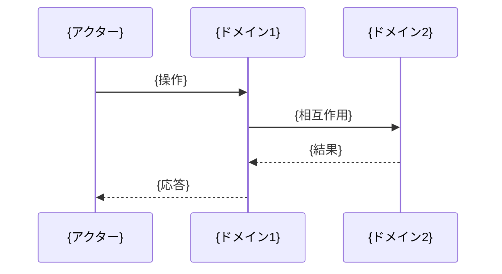
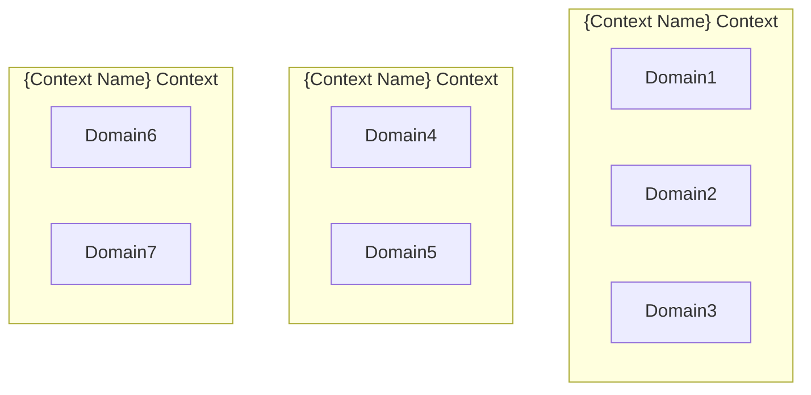

# ドメインオブジェクト抽出ガイド

## 目的

- ユースケースを起点としてドメインオブジェクトを抽出・分析し、ビジネス価値の高いドメインモデルを構築することで、実装指針が明確で保守性の高いドメイン設計を実現せよ

## 遵守事項

- **ユースケース駆動アプローチ**: ユースケースから「何が」「どのように」関与するかを分析せよ
- **ビジネス価値による優先度設定**: 高価値ユースケースのドメインを優先的に抽出せよ
- **共通ドメインと固有ドメインの分離**: ユースケース間の共通性と特異性を明確に区別せよ
- **実装可能性の確保**: 抽出されたドメインモデルから直接実装設計に移行できる品質を保て

## アウトプット出力先

### 基本方針

ドメインオブジェクト抽出成果物は、実装設計の直接的な指針として、`docs/project/ddd-design/` ディレクトリに体系的に整理し、後続の実装工程での参照を容易にする。

### 出力先ディレクトリ構造

```text
docs/project/ddd-design/2.05_domain-object-extraction/
├── domain-object-analysis.md           # ドメインオブジェクト分析（メイン）
├── usecase-domain-mapping/             # ユースケース・ドメイン対応
│   ├── usecase-priority-matrix.md      # ユースケース優先度分析
│   ├── usecase-domain-extraction/      # UC別ドメイン抽出詳細
│   │   ├── UC01-quiz-creation-analysis.md    # UC01分析詳細
│   │   ├── UC02-quiz-answering-analysis.md   # UC02分析詳細
│   │   ├── UC03-quiz-approval-analysis.md    # UC03分析詳細
│   │   └── README.md                         # UC分析一覧
│   └── cross-usecase-analysis.md       # 横断分析結果
├── domain-model-integration.md         # ドメインモデル統合設計
└── implementation-guidelines.md        # 実装設計指針
```js

**ファイル命名規則**:

- **ユースケース分析**: `{UC-ID}-analysis.md`（例：UC01-quiz-creation-analysis.md）
- **PascalCase使用**: ドメインオブジェクト名はPascalCaseで統一
- **識別子統一**: ユースケースIDは仕様書と一致させる

## ドメインオブジェクト抽出の手順

### 1. ユースケース分析と優先度設定

#### 1.1 主要ユースケースの特定

**参照ドキュメント**: `docs/project/specifications/user-stories/`, `requirements/`, `success-scenarios/`

**必須実施項目**:

- 仕様書からの全ユースケース抽出
- 各ユースケースのビジネス価値評価
- 分析対象仕様との対応関係明確化

**ユースケース優先度マトリックス**:

```markdown
# ユースケース優先度分析

## 主要ユースケース特定

| ID | ユースケース名 | 概要 | ビジネス価値 | 優先度 | 分析対象仕様 |
|----|---------------|------|-------------|--------|-------------|
| UC01 | [ユースケース名] | [簡潔な概要] | [価値説明] | 🔴最高/🟡高/🟢中/⚪低 | [仕様書参照] |

## ビジネス価値による優先度設定

### 最高優先（🔴）
- 核心的ビジネス価値を提供するユースケース
- システムの存在意義に直結

### 高優先（🟡）
- ビジネス価値提供の基盤となるユースケース
- 最高優先の実現に必要

### 中優先（🟢）
- 利便性・継続利用のためのユースケース
- 差別化・競争優位に寄与

### 低優先（⚪）
- 将来拡張・管理機能のユースケース
- 初期リリースでは不要
```js

#### 1.2 分析順序の決定

**分析順序の原則**:

1. **最高優先から順次分析**: ビジネス価値の高いものから着手
2. **依存関係考慮**: 前提となるユースケースを先に分析
3. **共通ドメイン早期特定**: 複数UCに関与するドメインを優先

### 2. ユースケース別ドメイン抽出

#### 2.1 UC別の参加者・概念・振る舞い抽出

**各ユースケース毎に実施する分析**:

```markdown
# UC{ID}: {ユースケース名}

## 参加者・概念・振る舞い抽出

### アクター
- **{アクター名}**: {役割・特性}

### 参加ドメイン概念
- **{ドメイン名}**: {定義・特性・制約}
- **{ドメイン名}**: {定義・特性・制約}

### 主要振る舞い



### ビジネスルール

- {ルール1}: {詳細・制約・条件}
- {ルール2}: {詳細・制約・条件}

### ドメイン間相互作用

- **{ドメインA} → {ドメインB}**: {関係種別}（{カーディナリティ}）
- **{ドメインC} → {ドメインD}**: {関係種別}（{カーディナリティ}）

#### 2.2 ドメイン関係種別の定義

**標準的な関係種別**:

| 関係種別 | 意味 | 表現例 | 実装指針 |
|---------|------|--------|---------|
| **作成関係** | Aが新しいBを生成 | Creator → Quiz | Factory/Builder パターン |
| **包含関係** | AがBを内部に持つ | Quiz → Question | Composition/集約 |
| **参照関係** | AがBを参照・利用 | Answer → Quiz | Repository経由参照 |
| **操作関係** | AがBに対し操作実行 | User → SwipeGesture | Command パターン |
| **生成関係** | Aの操作がBを生成 | SwipeGesture → Answer | Event/Factory |
| **集約関係** | AがB群を管理 | Session → AnswerHistory | Aggregate Root |

### 3. 横断分析による共通ドメイン特定

#### 3.1 ユースケース間の共通ドメイン特定

**共通ドメイン分析マトリックス**:

```markdown
# 横断分析結果

## ユースケース間の共通ドメイン特定

### 高頻度共通ドメイン（コアドメイン）

| ドメイン | 関与UC | 重要度 | 共通振る舞い |
|----------|--------|--------|-------------|
| {ドメイン名} | UC01,UC02,UC03 | ✅超高 | {共通して行う処理・役割} |

### 中頻度共通ドメイン（サポートドメイン）

| ドメイン | 関与UC | 重要度 | 共通振る舞い |
|----------|--------|--------|-------------|
| {ドメイン名} | UC01,UC05 | 🔶中 | {特定UCでの処理・役割} |

### 低頻度・固有ドメイン（専門ドメイン）

| ドメイン | 関与UC | 重要度 | 特化振る舞い |
|----------|--------|--------|-------------|
| {ドメイン名} | UC03 | 🟡専門 | {単一UCでの特化処理} |

#### 3.2 境界づけられたコンテキスト候補の導出

**コンテキスト分離の指針**:

- **高頻度共通ドメイン**: 独立したコンテキストとして分離
- **中頻度共通ドメイン**: 機能的結合度に応じてグルーピング
- **固有ドメイン**: 関連する高頻度ドメインに統合または独立

**コンテキスト候補図**:



### 4. ドメイン統合モデルの作成

#### 4.1 全ユースケース統合後のドメインモデル

**コアドメイン設計**:

```mermaid
classDiagram
    class {CoreDomain} {
        +{Type} {attribute}
        +{Type} {attribute}
        +{method}()
        +{method}()
    }

    class {SupportingDomain} {
        +{Type} {attribute}
        +{method}()
    }

    {CoreDomain} *-- {SupportingDomain}
    {CoreDomain} o-- {OptionalDomain}
```

#### 4.2 ドメイン間依存関係の定義

**依存関係マップ**:

```mermaid
graph TD
    UC1[UC1:{名前}] --> Domain1
    UC1 --> Domain2

    UC2[UC2:{名前}] --> Domain1
    UC2 --> Domain3

    Domain1 --> SubDomain1
    Domain1 --> SubDomain2

    Domain3 --> Domain1
```

#### 4.3 重要な制約の明確化

**制約カタログ**:

```markdown
## 重要な制約

### 順序制約
1. **UC{A} → UC{B} → UC{C}**: {説明}

### 前提条件制約
2. **{Domain}.{attribute} == '{value}'**: {UC実行の前提条件}

### 整合性制約
3. **{DomainA}.{attribute} ↔ {DomainB}.{attribute}**: {整合性要件}

### ビジネスルール制約
4. **{条件} → {結果}**: {ビジネスルール詳細}
```

### 5. 実装設計指針の提供

#### 5.1 集約設計の指針

**推奨集約構造**:

```markdown
# 実装設計指針

## 集約設計

### {Aggregate Name}集約
- **集約ルート**: {RootEntity}
- **関与UC**: UC{X}, UC{Y}, UC{Z}
- **責務**: {集約の責務範囲}
- **不変条件**: {保証すべき不変条件}

### 集約間関係
- **{AggregateA} → {AggregateB}**: ID参照のみ
- **整合性**: {結果整合性/強整合性}の選択理由
```

#### 5.2 ドメインサービス抽出

**ドメインサービス候補**:

```markdown
## ドメインサービス

### {Service Name}Service
- **目的**: {複数集約にまたがる処理}
- **関与UC**: UC{X}
- **処理概要**: {サービスが行う処理}
- **入力**: {パラメータ}
- **出力**: {結果}
```

#### 5.3 リポジトリ設計方針

**リポジトリ要件**:

```markdown
## リポジトリ設計

### {Entity}Repository
- **対象集約**: {Aggregate}
- **必要な検索条件**: UC別の検索要件
  - UC{X}: {検索条件}
  - UC{Y}: {検索条件}
- **永続化要件**: {整合性・性能要件}
```

## 完了判定基準

### 必須要件

- **全ユースケースの分析完了**: 優先度に基づき重要UCの分析が完了している
- **ドメインオブジェクトの網羅抽出**: 各UCに関与するドメインが漏れなく特定されている
- **共通・固有ドメインの分離**: ユースケース横断分析により適切に分類されている
- **統合ドメインモデルの作成**: 全UCを統合したドメインモデルが完成している

### 品質要件

- **ビジネス価値との対応**: 高価値UCのドメインが優先的・詳細に設計されている
- **実装可能性**: ドメインモデルから直接実装設計に移行できる詳細度
- **一貫性**: ユビキタス言語辞書とドメインオブジェクト定義が一致している
- **トレーサビリティ**: 各ドメインの抽出根拠がユースケースに追跡可能

### 文書品質要件

- **図表による可視化**: Mermaidによるシーケンス図・クラス図・関係図が適切
- **表形式の活用**: ドメイン分析・関係定義が表形式で整理されている
- **実装指針の明確化**: 集約・サービス・リポジトリ設計が具体的に指示されている
- **制約の明文化**: ビジネスルール・順序制約・整合性要件が明確に記載

## 完了後の必須アクション

1. **直ちに**ユーザーに「ドメインオブジェクト抽出・統合モデル設計」のレビューを依頼する
2. **ADR作成**: 以下の重要なドメイン抽出決定について、必ずADRを作成する：
   - **ユースケース駆動アプローチ採用決定**: なぜユースケース駆動を選択したかの根拠
   - **ドメイン優先度設定決定**: ビジネス価値による優先順位の設定理由
   - **コンテキスト分離決定**: 境界づけられたコンテキストの分割根拠
   - **集約設計方針決定**: 集約境界と集約ルートの選択理由
3. **ADR作成手順**:
   - 各ADRは「Proposed」ステータスで作成
   - ADRインデックス（`docs/project/adr/README.md`）への追加
   - DDD設計ドキュメント（`docs/project/ddd-design/README.md`）からのリンク追加
4. **次工程の判断**をユーザーに委ねる：
   - 通常フロー：「エンティティ間関連性分析」「ドメインサービス抽出」に進む
   - 並行フロー：「境界づけられたコンテキスト定義」の詳細化
   - 戻りフロー：ドメイン抽出結果に基づくユビキタス言語の見直し
5. ユーザーの明示的な承認を得てから指定された工程に進む
