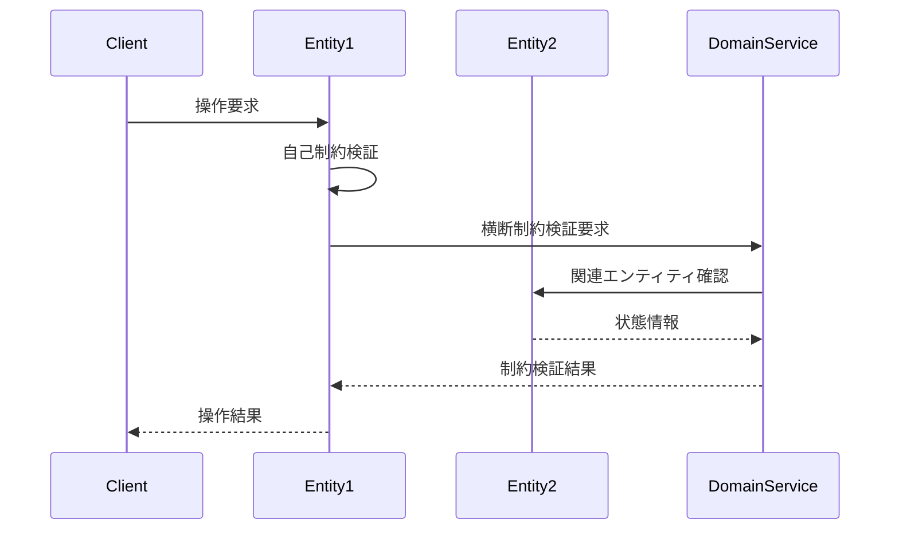
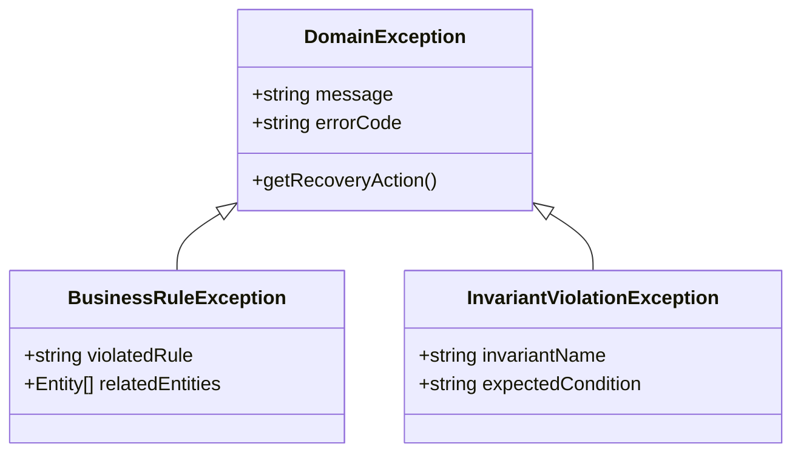

# エンティティ間関連性分析ガイド

## 目的

- ビジネスルールとインバリアント（不変条件）を中心としてエンティティ間の関連性を分析し、ドメインの制約とビジネスロジックの適切な配置により、データ整合性と業務要件を満たすドメインモデル設計を実現せよ

## 遵守事項

- **ビジネスルール中心設計**: ドメインの制約とビジネスロジックを起点とした関連性分析を行え
- **インバリアント保証**: エンティティ・集約・システムレベルの不変条件を明確に定義せよ
- **制約配置の最適化**: ビジネスルールを適切なドメインオブジェクトに配置し実装指針を提供せよ
- **例外設計の体系化**: ビジネスルール違反時の例外処理戦略を整備せよ

## アウトプット出力先

### 基本方針

エンティティ間関連性分析成果物は、ドメインモデル設計の詳細仕様として、`docs/project/ddd-design/` ディレクトリに配置し、実装時の制約設計と例外処理の指針を提供する。

### 出力先ディレクトリ構造

```text
docs/project/ddd-design/
├── entity-relationship-analysis.md         # エンティティ間関連性分析（メイン）
├── business-rules-catalog/                 # ビジネスルールカタログ
│   ├── core-business-rules.md              # 核心的ビジネスルール定義
│   ├── invariants-specification.md         # インバリアント（不変条件）仕様
│   └── constraints-matrix.md               # 制約依存関係マトリックス
├── logic-placement-design/                 # ロジック配置設計
│   ├── entity-responsibilities.md          # エンティティ責任分析
│   ├── domain-services-design.md           # ドメインサービス設計
│   └── aggregate-boundaries.md             # 集約境界・ルート設計
└── exception-handling-strategy.md          # 例外処理戦略
```

**ファイル命名規則**:

- **ビジネスルール**: `{rule-category}-rules.md`
- **インバリアント**: `{scope-level}-invariants.md`
- **PascalCase使用**: エンティティ名・例外名はPascalCaseで統一

## エンティティ間関連性分析の手順

### 1. ビジネスルール体系の分析

#### 1.1 核心的ビジネスルールの抽出

**参照ドキュメント**: [ドメイン理解ドキュメント作成ガイド](./03.02_domain-understanding-guide.md)、[ユビキタス言語辞書](./03.03_ubiquitous-language-creation-guide.md)の成果物

**必須実施項目**:

- ドメインエキスパートとの対話から抽出されたビジネスルールの体系化
- ルール優先度・複雑度・影響範囲の評価
- エンティティ横断ルールと単一エンティティルールの分離

**コアビジネスルール抽出テンプレート**:

```markdown
# コアビジネスルール抽出

## ビジネスルールカタログ

| ルール名 | ルール内容 | 対象エンティティ | 実装場所 | 優先度 |
|---------|-----------|----------------|----------|--------|
| {Rule名} | {具体的制約内容} | {関係するエンティティ} | Entity/Service/Factory | High/Medium/Low |

## ルール分類マトリックス

| ルールカテゴリ | ルール数 | 複雑度 | エンティティ横断 | 実装戦略 |
|-------------|--------|-------|----------------|----------|
| データ整合性 | {件数} | High/Medium/Low | Yes/No | {実装アプローチ} |
| ビジネス制約 | {件数} | High/Medium/Low | Yes/No | {実装アプローチ} |
| 業務フロー | {件数} | High/Medium/Low | Yes/No | {実装アプローチ} |
| セキュリティ | {件数} | High/Medium/Low | Yes/No | {実装アプローチ} |

#### 1.2 ルール依存関係の特定

**ルール依存関係分析**:

- **前提条件関係**: ルールAの成立がルールBの前提となる関係
- **競合関係**: 複数ルールが同時に適用される際の優先順位
- **派生関係**: 基本ルールから派生する詳細ルール

### 2. インバリアント（不変条件）の設計

#### 2.1 階層別インバリアント定義

**インバリアント階層構造**:

```markdown
## エンティティレベルインバリアント

| エンティティ名 | インバリアント名 | 条件式 | 検証タイミング | 違反時動作 |
|-------------|----------------|--------|-------------|-----------|
| {Entity名} | {条件名} | {論理式} | {検証時点} | {Exception/対応策} |

## 集約レベルインバリアント

| 集約名 | インバリアント名 | 関与エンティティ | 条件式 | 保証レベル |
|-------|----------------|----------------|--------|-----------|
| {Aggregate名} | {条件名} | {エンティティリスト} | {論理式} | Strong/Eventual |

## システムレベルインバリアント

| インバリアント名 | 関与集約 | 条件式 | 保証戦略 | 検証頻度 |
|----------------|----------|--------|----------|----------|
| {条件名} | {Aggregateリスト} | {論理式} | {実装方法} | {検証タイミング} |

#### 2.2 制約検証戦略の設計

**検証戦略の分類**:

- **即座検証**: エンティティ操作時の即座チェック
- **遅延検証**: トランザクション終了時の一括チェック
- **非同期検証**: イベント駆動による結果整合性チェック

### 3. ビジネスロジック配置の設計

#### 3.1 エンティティ責任の分析

**エンティティ責任分析テンプレート**:

```markdown
# エンティティ責任分析

## エンティティ責任マトリックス

| エンティティ名 | ビジネス責任 | 含有ルール | メソッド設計 | 協調パターン |
|-------------|-------------|-----------|-------------|-------------|
| {Entity名} | {責任内容} | {ルールリスト} | {主要メソッド} | {他エンティティとの協調} |

## 責任境界の明確化

### 単一責任エンティティ
- **{EntityName}**: {単一責任の内容}

### 協調責任エンティティ
- **{EntityName}**: {協調が必要な責任内容}
#### 3.2 ドメインサービス抽出

**ドメインサービス抽出基準**:

- **複数集約操作**: 複数の集約に跨るビジネスロジック
- **複雑な計算**: エンティティに属さない複雑な計算処理
- **外部連携ロジック**: 外部システムとの連携を伴うビジネスルール

**ドメインサービス設計テンプレート**:

```markdown
# ドメインサービス設計

## ドメインサービス一覧

| サービス名 | 担当ルール | 関与エンティティ | サービス理由 | インターフェース |
|----------|-----------|----------------|-------------|----------------|
| {Service名} | {ルール内容} | {エンティティリスト} | {サービス化理由} | {主要メソッド} |

## サービス依存関係

```mermaid
graph TD
    A[{ServiceA}] --> B[{EntityB}]
    A --> C[{EntityC}]
    D[{ServiceD}] --> A
    D --> E[{EntityE}]
```

### 4. 制約充足関係の分析

#### 4.1 制約依存関係の可視化

**制約依存関係テンプレート**:

```markdown
# 制約充足関係分析

## 制約依存関係マトリックス

| 制約A | 制約B | 依存関係 | 検証順序 | 競合解決 |
|------|------|----------|----------|----------|
| {制約名} | {制約名} | {依存型} | {実行順} | {競合時対応} |

## 制約実行計画

| 制約グループ | 実行順序 | 並列実行可否 | 失敗時処理 | パフォーマンス影響 |
|-------------|----------|-------------|-----------|-------------------|
| {グループ名} | {順序} | 可/不可 | {ロールバック戦略} | {処理時間影響} |
```

#### 4.2 制約実行フローの設計

**制約実行フロー図**:



### 5. ビジネス例外設計

#### 5.1 例外体系の設計

**例外体系テンプレート**:

```markdown
# ビジネス例外設計

## 例外階層構造



## 例外詳細定義

| 例外名 | 発生条件 | 関連ルール | 回復可能性 | ユーザー対応 |
|-------|----------|-----------|-----------|-------------|
| {Exception名} | {発生条件} | {違反ルール} | 可/不可 | {ユーザーアクション} |

### 5.2 例外処理戦略

**レイヤー別例外処理戦略**:

```markdown
## 例外処理戦略

| 処理レイヤー | 処理方針 | ログ出力 | ユーザー通知 | システム動作 |
|-------------|----------|----------|-------------|-------------|
| Entity | 不変条件維持 | DEBUG | - | Exception throw |
| Domain Service | ビジネスルール実行 | INFO | - | Exception throw |
| Application Service | 例外変換・処理 | WARN | エラーメッセージ | 処理中断 |
| Infrastructure | システム例外処理 | ERROR | システムエラー | 状態復旧 |
```

## 完了判定基準

### 必須要件

- **ビジネスルールの体系化**: 全てのビジネスルールが分類・優先度付けされている
- **インバリアント定義**: エンティティ・集約・システムレベルの不変条件が定義されている
- **ロジック配置設計**: ビジネスロジックの責任分担が明確に設計されている
- **制約実行計画**: 制約検証の順序・並列性・失敗処理が計画されている

### 品質要件

- **実装指針の明確性**: ドメインオブジェクトの責任とメソッド設計が具体的
- **例外処理の体系性**: ビジネス例外の階層と処理戦略が一貫している
- **パフォーマンス考慮**: 制約検証のパフォーマンス影響が評価されている
- **保守性**: ビジネスルール変更時の影響範囲が明確

### 文書品質要件

- **表形式の活用**: ルール・制約・例外が表形式で整理されている
- **図表による可視化**: Mermaidによる依存関係・フロー図が提供されている
- **実装例の提供**: TypeScriptでのインターフェース・例外クラス例が記載
- **トレーサビリティ**: 各制約の根拠がビジネス要件に追跡可能

## 完了後の必須アクション

1. **直ちに**ユーザーに「エンティティ間関連性分析・ビジネスルール設計」のレビューを依頼する
2. **ADR作成**: 以下の重要な設計決定について、必ずADRを作成する：
   - **ビジネスルール配置戦略決定**: Entity vs Domain Service配置の選択理由
   - **インバリアント保証レベル決定**: Strong vs Eventual consistency選択理由
   - **制約検証戦略決定**: 即座検証 vs 遅延検証 vs 非同期検証の選択根拠
   - **例外処理階層設計決定**: 例外体系とレイヤー別処理方針の設計理由
3. **ADR作成手順**:
   - 各ADRは「Proposed」ステータスで作成
   - ADRインデックス（`docs/project/adr/README.md`）への追加
   - DDD設計ドキュメント（`docs/project/ddd-design/README.md`）からのリンク追加
4. **次工程の判断**をユーザーに委ねる：
   - 通常フロー：「ドメインサービス抽出」「集約設計」の詳細化に進む
   - 並行フロー：「API設計」「DB設計」でビジネスルール実装仕様を作成
   - 戻りフロー：ビジネスルール分析に基づくドメイン理解の見直し
5. ユーザーの明示的な承認を得てから指定された工程に進む
