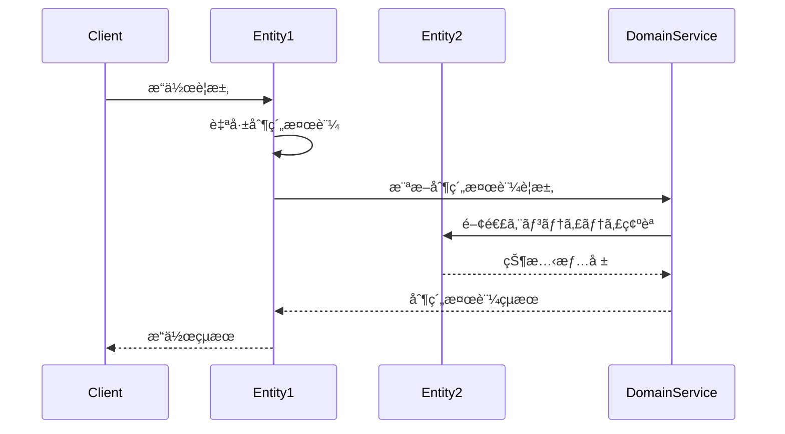
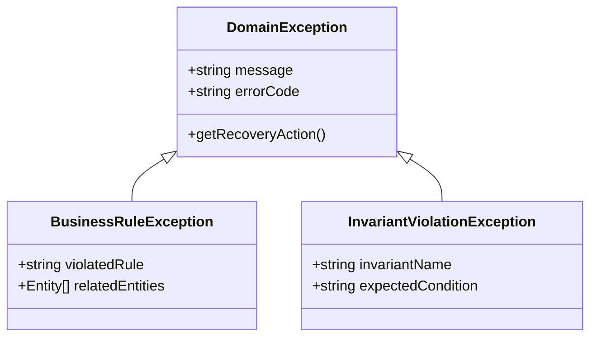

# エンティティ間関連性分æガイド

## 目的

- ビジãƒã‚¹ãƒ«ãƒ¼ãƒ«ã¨ã‚¤ãƒ³ãƒãƒªã‚¢ãƒ³ãƒˆï¼ˆä¸å¤‰æ¡ä»¶ï¼‰ã‚’中心ã¨ã—ã¦ã‚¨ãƒ³ãƒ†ã‚£ãƒ†ã‚£é–“ã®é–¢é€£æ€§ã‚’分æã—ã€ãƒ‰ãƒ¡ã‚¤ãƒ³ã®åˆ¶ç´„ã¨ãƒ“ジãƒã‚¹ãƒ­ã‚¸ãƒƒã‚¯ã®é©åˆ‡ãªé…ç½®ã«ã‚ˆã‚Šã€ãƒ‡ãƒ¼ã‚¿æ•´åˆæ€§ã¨æ¥­å‹™è¦ä»¶ã‚’満ãŸã™ãƒ‰ãƒ¡ã‚¤ãƒ³ãƒ¢ãƒ‡ãƒ«è¨­è¨ˆã‚’実ç¾ã›ã‚ˆ

## éµå®ˆäº‹é …

- **ビジãƒã‚¹ãƒ«ãƒ¼ãƒ«ä¸­å¿ƒè¨­è¨ˆ**: ドメインã®åˆ¶ç´„ã¨ãƒ“ジãƒã‚¹ãƒ­ã‚¸ãƒƒã‚¯ã‚’起点ã¨ã—ãŸé–¢é€£æ€§åˆ†æã‚’è¡Œãˆ
- **インãƒãƒªã‚¢ãƒ³ãƒˆä¿è¨¼**: エンティティ・集約・システムレベルã®ä¸å¤‰æ¡ä»¶ã‚’æ˜ç¢ºã«å®šç¾©ã›ã‚ˆ
- **制約é…ç½®ã®æœ€é©åŒ–**: ビジãƒã‚¹ãƒ«ãƒ¼ãƒ«ã‚’é©åˆ‡ãªãƒ‰ãƒ¡ã‚¤ãƒ³ã‚ªãƒ–ジェクトã«é…ç½®ã—実装指é‡ã‚’æä¾›ã›ã‚ˆ
- **例外設計ã®ä½“系化**: ビジãƒã‚¹ãƒ«ãƒ¼ãƒ«é•å時ã®ä¾‹å¤–処ç†æˆ¦ç•¥ã‚’æ•´å‚™ã›ã‚ˆ

## アウトプット出力先

### 基本方é‡

エンティティ間関連性分ææˆæœç‰©ã¯ã€ãƒ‰ãƒ¡ã‚¤ãƒ³ãƒ¢ãƒ‡ãƒ«è¨­è¨ˆã®è©³ç´°ä»•æ§˜ã¨ã—ã¦ã€`docs/project/ddd-design/` ディレクトリã«é…ç½®ã—ã€å®Ÿè£…時ã®åˆ¶ç´„設計ã¨ä¾‹å¤–処ç†ã®æŒ‡é‡ã‚’æä¾›ã™ã‚‹ã€‚

### 出力先ディレクトリ構造

```text
docs/project/ddd-design/
├── entity-relationship-analysis.md         # エンティティ間関連性分æ（メイン）
├── business-rules-catalog/                 # ビジãƒã‚¹ãƒ«ãƒ¼ãƒ«ã‚«ã‚¿ãƒ­ã‚°
│   ├── core-business-rules.md              # 核心的ビジãƒã‚¹ãƒ«ãƒ¼ãƒ«å®šç¾©
│   ├── invariants-specification.md         # インãƒãƒªã‚¢ãƒ³ãƒˆï¼ˆä¸å¤‰æ¡ä»¶ï¼‰ä»•æ§˜
│   └── constraints-matrix.md               # 制約ä¾å­˜é–¢ä¿‚ãƒãƒˆãƒªãƒƒã‚¯ã‚¹
├── logic-placement-design/                 # ロジックé…置設計
│   ├── entity-responsibilities.md          # エンティティ責任分æ
│   ├── domain-services-design.md           # ドメインサービス設計
│   └── aggregate-boundaries.md             # 集約境界・ルート設計
└── exception-handling-strategy.md          # 例外処ç†æˆ¦ç•¥
```

**ファイル命åè¦å‰‡**:

- **ビジãƒã‚¹ãƒ«ãƒ¼ãƒ«**: `{rule-category}-rules.md`
- **インãƒãƒªã‚¢ãƒ³ãƒˆ**: `{scope-level}-invariants.md`
- **PascalCase使用**: エンティティå・例外åã¯PascalCaseã§çµ±ä¸€

## エンティティ間関連性分æã®æ‰‹é †

### 1. ビジãƒã‚¹ãƒ«ãƒ¼ãƒ«ä½“ç³»ã®åˆ†æ

#### 1.1 核心的ビジãƒã‚¹ãƒ«ãƒ¼ãƒ«ã®æŠ½å‡º

**å‚照ドキュメント**: [ドメインç†è§£ãƒ‰ã‚­ãƒ¥ãƒ¡ãƒ³ãƒˆä½œæˆã‚¬ã‚¤ãƒ‰](./03.02_domain-understanding-guide.md)ã€[ユビキタス言èªè¾æ›¸](./03.03_ubiquitous-language-creation-guide.md)ã®æˆæœç‰©

**必須実施項目**:

- ドメインエキスパートã¨ã®å¯¾è©±ã‹ã‚‰æŠ½å‡ºã•ã‚ŒãŸãƒ“ジãƒã‚¹ãƒ«ãƒ¼ãƒ«ã®ä½“系化
- ルール優先度・複雑度・影響範囲ã®è©•ä¾¡
- エンティティ横断ルールã¨å˜ä¸€ã‚¨ãƒ³ãƒ†ã‚£ãƒ†ã‚£ãƒ«ãƒ¼ãƒ«ã®åˆ†é›¢

**コアビジãƒã‚¹ãƒ«ãƒ¼ãƒ«æŠ½å‡ºãƒ†ãƒ³ãƒ—レート**:

```markdown
# コアビジãƒã‚¹ãƒ«ãƒ¼ãƒ«æŠ½å‡º

## ビジãƒã‚¹ãƒ«ãƒ¼ãƒ«ã‚«ã‚¿ãƒ­ã‚°

| ルールå | ルール内容 | 対象エンティティ | 実装場所 | 優先度 |
|---------|-----------|----------------|----------|--------|
| {Ruleå} | {具体的制約内容} | {関係ã™ã‚‹ã‚¨ãƒ³ãƒ†ã‚£ãƒ†ã‚£} | Entity/Service/Factory | High/Medium/Low |

## ルール分é¡ãƒãƒˆãƒªãƒƒã‚¯ã‚¹

| ルールカテゴリ | ルール数 | 複雑度 | エンティティ横断 | 実装戦略 |
|-------------|--------|-------|----------------|----------|
| データ整åˆæ€§ | {件数} | High/Medium/Low | Yes/No | {実装アプローãƒ} |
| ビジãƒã‚¹åˆ¶ç´„ | {件数} | High/Medium/Low | Yes/No | {実装アプローãƒ} |
| 業務フロー | {件数} | High/Medium/Low | Yes/No | {実装アプローãƒ} |
| セキュリティ | {件数} | High/Medium/Low | Yes/No | {実装アプローãƒ} |
```

#### 1.2 ルールä¾å­˜é–¢ä¿‚ã®ç‰¹å®š

**ルールä¾å­˜é–¢ä¿‚分æ**:

- **å‰ææ¡ä»¶é–¢ä¿‚**: ルールAã®æˆç«‹ãŒãƒ«ãƒ¼ãƒ«Bã®å‰æã¨ãªã‚‹é–¢ä¿‚
- **競åˆé–¢ä¿‚**: 複数ルールãŒåŒæ™‚ã«é©ç”¨ã•ã‚Œã‚‹éš›ã®å„ªå…ˆé †ä½
- **派生関係**: 基本ルールã‹ã‚‰æ´¾ç”Ÿã™ã‚‹è©³ç´°ãƒ«ãƒ¼ãƒ«

### 2. インãƒãƒªã‚¢ãƒ³ãƒˆï¼ˆä¸å¤‰æ¡ä»¶ï¼‰ã®è¨­è¨ˆ

#### 2.1 éšå±¤åˆ¥ã‚¤ãƒ³ãƒãƒªã‚¢ãƒ³ãƒˆå®šç¾©

**インãƒãƒªã‚¢ãƒ³ãƒˆéšå±¤æ§‹é€ **:

```markdown
## エンティティレベルインãƒãƒªã‚¢ãƒ³ãƒˆ

| エンティティå | インãƒãƒªã‚¢ãƒ³ãƒˆå | æ¡ä»¶å¼ | 検証タイミング | é•å時動作 |
|-------------|----------------|--------|-------------|-----------|
| {Entityå} | {æ¡ä»¶å} | {è«–ç†å¼} | {検証時点} | {Exception/対応策} |

## 集約レベルインãƒãƒªã‚¢ãƒ³ãƒˆ

| 集約å | インãƒãƒªã‚¢ãƒ³ãƒˆå | é–¢ä¸ã‚¨ãƒ³ãƒ†ã‚£ãƒ†ã‚£ | æ¡ä»¶å¼ | ä¿è¨¼ãƒ¬ãƒ™ãƒ« |
|-------|----------------|----------------|--------|-----------|
| {Aggregateå} | {æ¡ä»¶å} | {エンティティリスト} | {è«–ç†å¼} | Strong/Eventual |

## システムレベルインãƒãƒªã‚¢ãƒ³ãƒˆ

| インãƒãƒªã‚¢ãƒ³ãƒˆå | é–¢ä¸é›†ç´„ | æ¡ä»¶å¼ | ä¿è¨¼æˆ¦ç•¥ | 検証頻度 |
|----------------|----------|--------|----------|----------|
| {æ¡ä»¶å} | {Aggregateリスト} | {è«–ç†å¼} | {実装方法} | {検証タイミング} |
```

#### 2.2 制約検証戦略ã®è¨­è¨ˆ

**検証戦略ã®åˆ†é¡**:

- **å³åº§æ¤œè¨¼**: エンティティæ“作時ã®å³åº§ãƒã‚§ãƒƒã‚¯
- **é…延検証**: トランザクション終了時ã®ä¸€æ‹¬ãƒã‚§ãƒƒã‚¯
- **éåŒæœŸæ¤œè¨¼**: イベント駆動ã«ã‚ˆã‚‹çµæœæ•´åˆæ€§ãƒã‚§ãƒƒã‚¯

### 3. ビジãƒã‚¹ãƒ­ã‚¸ãƒƒã‚¯é…ç½®ã®è¨­è¨ˆ

#### 3.1 エンティティ責任ã®åˆ†æ

**エンティティ責任分æテンプレート**:

```markdown
# エンティティ責任分æ

## エンティティ責任ãƒãƒˆãƒªãƒƒã‚¯ã‚¹

| エンティティå | ビジãƒã‚¹è²¬ä»» | å«æœ‰ãƒ«ãƒ¼ãƒ« | メソッド設計 | å”調パターン |
|-------------|-------------|-----------|-------------|-------------|
| {Entityå} | {責任内容} | {ルールリスト} | {主è¦ãƒ¡ã‚½ãƒƒãƒ‰} | {他エンティティã¨ã®å”調} |

## 責任境界ã®æ˜ç¢ºåŒ–

### å˜ä¸€è²¬ä»»ã‚¨ãƒ³ãƒ†ã‚£ãƒ†ã‚£
- **{EntityName}**: {å˜ä¸€è²¬ä»»ã®å†…容}

### å”調責任エンティティ  
- **{EntityName}**: {å”調ãŒå¿…è¦ãªè²¬ä»»å†…容}
```

#### 3.2 ドメインサービス抽出

**ドメインサービス抽出基準**:

- **複数集約æ“作**: 複数ã®é›†ç´„ã«è·¨ã‚‹ãƒ“ジãƒã‚¹ãƒ­ã‚¸ãƒƒã‚¯
- **複雑ãªè¨ˆç®—**: エンティティã«å±ã•ãªã„複雑ãªè¨ˆç®—処ç†
- **外部連æºãƒ­ã‚¸ãƒƒã‚¯**: 外部システムã¨ã®é€£æºã‚’ä¼´ã†ãƒ“ジãƒã‚¹ãƒ«ãƒ¼ãƒ«

**ドメインサービス設計テンプレート**:

```markdown
# ドメインサービス設計

## ドメインサービス一覧

| サービスå | 担当ルール | é–¢ä¸ã‚¨ãƒ³ãƒ†ã‚£ãƒ†ã‚£ | サービスç†ç”± | インターフェース |
|----------|-----------|----------------|-------------|----------------|
| {Serviceå} | {ルール内容} | {エンティティリスト} | {サービス化ç†ç”±} | {主è¦ãƒ¡ã‚½ãƒƒãƒ‰} |

## サービスä¾å­˜é–¢ä¿‚

```mermaid
graph TD
    A[{ServiceA}] --> B[{EntityB}]
    A --> C[{EntityC}]
    D[{ServiceD}] --> A
    D --> E[{EntityE}]
```

```

### 4. 制約充足関係ã®åˆ†æ

#### 4.1 制約ä¾å­˜é–¢ä¿‚ã®å¯è¦–化

**制約ä¾å­˜é–¢ä¿‚テンプレート**:

```markdown
# 制約充足関係分æ

## 制約ä¾å­˜é–¢ä¿‚ãƒãƒˆãƒªãƒƒã‚¯ã‚¹

| 制約A | 制約B | ä¾å­˜é–¢ä¿‚ | æ¤œè¨¼é †åº | 競åˆè§£æ±º |
|------|------|----------|----------|----------|
| {制約å} | {制約å} | {ä¾å­˜å‹} | {実行順} | {競åˆæ™‚対応} |

## 制約実行計画

| 制約グループ | å®Ÿè¡Œé †åº | 並列実行å¯å¦ | å¤±æ•—æ™‚å‡¦ç† | パフォーãƒãƒ³ã‚¹å½±éŸ¿ |
|-------------|----------|-------------|-----------|-------------------|
| {グループå} | {é †åº} | å¯/ä¸å¯ | {ロールãƒãƒƒã‚¯æˆ¦ç•¥} | {処ç†æ™‚間影響} |
```

#### 4.2 制約実行フローã®è¨­è¨ˆ

**制約実行フロー図**:


```mermaid
sequenceDiagram
    participant C as Client
    participant E1 as Entity1
    participant E2 as Entity2
    participant S as DomainService
    
    C->>E1: æ“作è¦æ±‚
    E1->>E1: 自己制約検証
    E1->>S: 横断制約検証è¦æ±‚
    S->>E2: 関連エンティティ確èª
    E2-->>S: 状態情報
    S-->>E1: 制約検証çµæœ
    E1-->>C: æ“作çµæœ
```

### 5. ビジãƒã‚¹ä¾‹å¤–設計

#### 5.1 例外体系ã®è¨­è¨ˆ

**例外体系テンプレート**:

```markdown
# ビジãƒã‚¹ä¾‹å¤–設計

## 例外éšå±¤æ§‹é€ 


```mermaid
classDiagram
    class DomainException {
        +string message
        +string errorCode
        +getRecoveryAction()
    }
    
    class BusinessRuleException {
        +string violatedRule
        +Entity[] relatedEntities
    }
    
    class InvariantViolationException {
        +string invariantName
        +string expectedCondition
    }
    
    DomainException <|-- BusinessRuleException
    DomainException <|-- InvariantViolationException
```

## 例外詳細定義

| 例外å | 発生æ¡ä»¶ | 関連ルール | å›å¾©å¯èƒ½æ€§ | ユーザー対応 |
|-------|----------|-----------|-----------|-------------|
| {Exceptionå} | {発生æ¡ä»¶} | {é•åルール} | å¯/ä¸å¯ | {ユーザーアクション} |

```

#### 5.2 例外処ç†æˆ¦ç•¥

**レイヤー別例外処ç†æˆ¦ç•¥**:

```markdown
## 例外処ç†æˆ¦ç•¥

| 処ç†ãƒ¬ã‚¤ãƒ¤ãƒ¼ | 処ç†æ–¹é‡ | ログ出力 | ユーザー通知 | システム動作 |
|-------------|----------|----------|-------------|-------------|
| Entity | ä¸å¤‰æ¡ä»¶ç¶­æŒ | DEBUG | - | Exception throw |
| Domain Service | ビジãƒã‚¹ãƒ«ãƒ¼ãƒ«å®Ÿè¡Œ | INFO | - | Exception throw |
| Application Service | 例外変æ›ãƒ»å‡¦ç† | WARN | エラーメッセージ | 処ç†ä¸­æ–­ |
| Infrastructure | ã‚·ã‚¹ãƒ†ãƒ ä¾‹å¤–å‡¦ç† | ERROR | システムエラー | 状態復旧 |
```

## 完了判定基準

### å¿…é ˆè¦ä»¶

- **ビジãƒã‚¹ãƒ«ãƒ¼ãƒ«ã®ä½“系化**: å…¨ã¦ã®ãƒ“ジãƒã‚¹ãƒ«ãƒ¼ãƒ«ãŒåˆ†é¡ãƒ»å„ªå…ˆåº¦ä»˜ã‘ã•ã‚Œã¦ã„ã‚‹
- **インãƒãƒªã‚¢ãƒ³ãƒˆå®šç¾©**: エンティティ・集約・システムレベルã®ä¸å¤‰æ¡ä»¶ãŒå®šç¾©ã•ã‚Œã¦ã„ã‚‹
- **ロジックé…置設計**: ビジãƒã‚¹ãƒ­ã‚¸ãƒƒã‚¯ã®è²¬ä»»åˆ†æ‹…ãŒæ˜ç¢ºã«è¨­è¨ˆã•ã‚Œã¦ã„ã‚‹
- **制約実行計画**: 制約検証ã®é †åºãƒ»ä¸¦åˆ—性・失敗処ç†ãŒè¨ˆç”»ã•ã‚Œã¦ã„ã‚‹

### å“質è¦ä»¶

- **実装指é‡ã®æ˜ç¢ºæ€§**: ドメインオブジェクトã®è²¬ä»»ã¨ãƒ¡ã‚½ãƒƒãƒ‰è¨­è¨ˆãŒå…·ä½“çš„
- **例外処ç†ã®ä½“系性**: ビジãƒã‚¹ä¾‹å¤–ã®éšå±¤ã¨å‡¦ç†æˆ¦ç•¥ãŒä¸€è²«ã—ã¦ã„ã‚‹
- **パフォーãƒãƒ³ã‚¹è€ƒæ…®**: 制約検証ã®ãƒ‘フォーãƒãƒ³ã‚¹å½±éŸ¿ãŒè©•ä¾¡ã•ã‚Œã¦ã„ã‚‹
- **ä¿å®ˆæ€§**: ビジãƒã‚¹ãƒ«ãƒ¼ãƒ«å¤‰æ›´æ™‚ã®å½±éŸ¿ç¯„囲ãŒæ˜ç¢º

### 文書å“質è¦ä»¶

- **表形å¼ã®æ´»ç”¨**: ルール・制約・例外ãŒè¡¨å½¢å¼ã§æ•´ç†ã•ã‚Œã¦ã„ã‚‹
- **図表ã«ã‚ˆã‚‹å¯è¦–化**: Mermaidã«ã‚ˆã‚‹ä¾å­˜é–¢ä¿‚・フロー図ãŒæä¾›ã•ã‚Œã¦ã„ã‚‹
- **実装例ã®æä¾›**: TypeScriptã§ã®ã‚¤ãƒ³ã‚¿ãƒ¼ãƒ•ã‚§ãƒ¼ã‚¹ãƒ»ä¾‹å¤–クラス例ãŒè¨˜è¼‰
- **トレーサビリティ**: å„制約ã®æ ¹æ‹ ãŒãƒ“ジãƒã‚¹è¦ä»¶ã«è¿½è·¡å¯èƒ½

## 完了後ã®å¿…須アクション

1. **ç›´ã¡ã«**ユーザーã«ã€Œã‚¨ãƒ³ãƒ†ã‚£ãƒ†ã‚£é–“関連性分æ・ビジãƒã‚¹ãƒ«ãƒ¼ãƒ«è¨­è¨ˆã€ã®ãƒ¬ãƒ“ューをä¾é ¼ã™ã‚‹
2. **ADR作æˆ**: 以下ã®é‡è¦ãªè¨­è¨ˆæ±ºå®šã«ã¤ã„ã¦ã€å¿…ãšADRを作æˆã™ã‚‹ï¼š
   - **ビジãƒã‚¹ãƒ«ãƒ¼ãƒ«é…置戦略決定**: Entity vs Domain Serviceé…ç½®ã®é¸æŠç†ç”±
   - **インãƒãƒªã‚¢ãƒ³ãƒˆä¿è¨¼ãƒ¬ãƒ™ãƒ«æ±ºå®š**: Strong vs Eventual consistencyé¸æŠç†ç”±
   - **制約検証戦略決定**: å³åº§æ¤œè¨¼ vs é…延検証 vs éåŒæœŸæ¤œè¨¼ã®é¸æŠæ ¹æ‹ 
   - **例外処ç†éšå±¤è¨­è¨ˆæ±ºå®š**: 例外体系ã¨ãƒ¬ã‚¤ãƒ¤ãƒ¼åˆ¥å‡¦ç†æ–¹é‡ã®è¨­è¨ˆç†ç”±
3. **ADR作æˆæ‰‹é †**:
   - å„ADRã¯ã€ŒProposedã€ã‚¹ãƒ†ãƒ¼ã‚¿ã‚¹ã§ä½œæˆ
   - ADRインデックス（`docs/project/adr/README.md`）ã¸ã®è¿½åŠ 
   - DDD設計ドキュメント（`docs/project/ddd-design/README.md`）ã‹ã‚‰ã®ãƒªãƒ³ã‚¯è¿½åŠ 
4. **次工程ã®åˆ¤æ–­**をユーザーã«å§”ã­ã‚‹ï¼š
   - 通常フロー：「ドメインサービス抽出ã€ã€Œé›†ç´„設計ã€ã®è©³ç´°åŒ–ã«é€²ã‚€
   - 並行フロー：「API設計ã€ã€ŒDB設計ã€ã§ãƒ“ジãƒã‚¹ãƒ«ãƒ¼ãƒ«å®Ÿè£…仕様を作æˆ
   - 戻りフロー：ビジãƒã‚¹ãƒ«ãƒ¼ãƒ«åˆ†æã«åŸºã¥ãドメインç†è§£ã®è¦‹ç›´ã—
5. ユーザーã®æ˜ç¤ºçš„ãªæ‰¿èªã‚’å¾—ã¦ã‹ã‚‰æŒ‡å®šã•ã‚ŒãŸå·¥ç¨‹ã«é€²ã‚€

## 📊 エンティティ関係分æアプローãƒæ¯”較

ã“ã®ã‚¬ã‚¤ãƒ‰ã¯**ビジãƒã‚¹ãƒ«ãƒ¼ãƒ«ä¸­å¿ƒå‹**を基本アプローãƒã¨ã—ã¦ã„ã‚‹ãŒã€ãƒ—ロジェクト特性ã«å¿œã˜ã¦ä»¥ä¸‹ã®5ã¤ã®ã‚¢ãƒ—ローãƒã‹ã‚‰æœ€é©ãªæ‰‹æ³•ã‚’é¸æŠã§ãる：

### 5ã¤ã®ã‚¢ãƒ—ローãƒæ¯”較表

| 評価項目 | 案1: トランザクション境界中心 | 案2: ドメインイベント駆動 | 案3: ビジãƒã‚¹ãƒ«ãƒ¼ãƒ«ä¸­å¿ƒ | 案4: æ°¸ç¶šåŒ–ãƒ‘ã‚¿ãƒ¼ãƒ³å‹ | 案5: パフォーãƒãƒ³ã‚¹æœ€é©åŒ– |
|----------|----------------------------|-------------------------|----------------------|---------------------|----------------------|
| **学習コスト** | 高 | 最高 | 中 | 中 | 高 |
| **実装複雑度** | 高 | 最高 | 中 | 中 | 高 |
| **ä¿å®ˆæ€§** | 中 | 高 | 高 | 中 | ä½ |
| **スケーラビリティ** | 中 | 最高 | ä½ | 中 | 最高 |
| **パフォーãƒãƒ³ã‚¹** | 中 | 高 | ä½ | 高 | 最高 |
| **ビジãƒã‚¹å¯¾å¿œ** | 高 | 中 | 最高 | ä½ | ä½ |
| **技術的柔軟性** | 中 | 最高 | 中 | ä½ | 中 |
| **監査・追跡** | 中 | 最高 | 高 | 中 | 中 |

### 🯠プロジェクト特性別æ¨å¥¨ã‚¢ãƒ—ローãƒ

#### 🦠エンタープライズ系（金è・医療・官公åºï¼‰

**æ¨å¥¨é †ä½**: ビジãƒã‚¹ãƒ«ãƒ¼ãƒ«ä¸­å¿ƒ → トランザクション境界中心 → 永続化パターンå‹

- **ç†ç”±**: å³æ ¼ãªæ¥­å‹™åˆ¶ç´„ã¨ã‚³ãƒ³ãƒ—ライアンスè¦æ±‚
- **é‡è¦è¦ç´ **: データ整åˆæ€§ã€ç›£æŸ»è¨¼è·¡ã€è¦åˆ¶éµå®ˆ
- **実装方é‡**: 本ガイドã®ã‚¢ãƒ—ローãƒã‚’ベースã¨ã—ã€ãƒˆãƒ©ãƒ³ã‚¶ã‚¯ã‚·ãƒ§ãƒ³å¢ƒç•Œè¨­è¨ˆã‚’組ã¿åˆã‚ã›

#### 🚀 スタートアップ・アジャイル開発

**æ¨å¥¨é †ä½**: æ°¸ç¶šåŒ–ãƒ‘ã‚¿ãƒ¼ãƒ³å‹ â†’ ビジãƒã‚¹ãƒ«ãƒ¼ãƒ«ä¸­å¿ƒ → トランザクション境界中心

- **ç†ç”±**: 迅速ãªé–‹ç™ºã¨é‹ç”¨ã€æŠ€è¡“スタック統一
- **é‡è¦è¦ç´ **: 開発効ç‡ã€ä¿å®ˆã®ã—ã‚„ã™ã•ã€æŠ€è¡“習得コスト
- **実装方é‡**: 永続化設計ã‹ã‚‰åŸºç›¤ã‚’構築ã—ã€æˆé•·ã«å¿œã˜ã¦ãƒ“ジãƒã‚¹ãƒ«ãƒ¼ãƒ«åˆ¶ç´„を追加

#### 🌠大è¦æ¨¡Webサービス

**æ¨å¥¨é †ä½**: ドメインイベント駆動 → パフォーãƒãƒ³ã‚¹æœ€é©åŒ– → トランザクション境界中心

- **ç†ç”±**: 高トラフィック対応ã€ã‚¹ã‚±ãƒ¼ãƒ©ãƒ“リティã€å¯ç”¨æ€§
- **é‡è¦è¦ç´ **: 性能ã€æ‹¡å¼µæ€§ã€éšœå®³è€æ€§
- **実装方é‡**: イベント駆動設計をベースã«ã€ãƒ‘フォーãƒãƒ³ã‚¹æœ€é©åŒ–戦略をé©ç”¨

#### 🮠リアルタイム系（ゲーム・IoT・å–引）

**æ¨å¥¨é †ä½**: パフォーãƒãƒ³ã‚¹æœ€é©åŒ– → ドメインイベント駆動 → トランザクション境界中心

- **ç†ç”±**: ä½ãƒ¬ã‚¤ãƒ†ãƒ³ã‚·ã€é«˜ã‚¹ãƒ«ãƒ¼ãƒ—ットã€ãƒªã‚¢ãƒ«ã‚¿ã‚¤ãƒ å‡¦ç†
- **é‡è¦è¦ç´ **: 応答速度ã€åŒæ™‚実行性ã€ãƒªã‚½ãƒ¼ã‚¹åŠ¹ç‡
- **実装方é‡**: パフォーãƒãƒ³ã‚¹åŸºç›¤ã‚’構築ã—ã€ã‚¤ãƒ™ãƒ³ãƒˆé§†å‹•ã§éåŒæœŸå‡¦ç†ã‚’実装

#### 🭠レガシー統åˆãƒ»æ—¢å­˜ã‚·ã‚¹ãƒ†ãƒ é€£æº

**æ¨å¥¨é †ä½**: æ°¸ç¶šåŒ–ãƒ‘ã‚¿ãƒ¼ãƒ³å‹ â†’ トランザクション境界中心 → ビジãƒã‚¹ãƒ«ãƒ¼ãƒ«ä¸­å¿ƒ

- **ç†ç”±**: 既存データベース活用ã€æ®µéšçš„移行ã€æŠ€è¡“制約
- **é‡è¦è¦ç´ **: 既存システム連æºã€ç§»è¡Œã‚³ã‚¹ãƒˆã€æŠ€è¡“的実ç¾æ€§
- **実装方é‡**: 永続化層統一ã‹ã‚‰é–‹å§‹ã—ã€æ®µéšçš„ã«ãƒ“ジãƒã‚¹åˆ¶ç´„を強化

### 🔄 段éšçš„é©ç”¨æˆ¦ç•¥

#### Phase 1: 基盤構築（全プロジェクト共通）

1. **永続化パターンå‹ã‚’基盤ã¨ã—ã¦é©ç”¨**
   - データモデルã®è¨­è¨ˆã¨å®Ÿè£…
   - 基本的ãªCRUDæ“作ã®ç¢ºç«‹
   - 基本的ãªæ•´åˆæ€§åˆ¶ç´„ã®å®Ÿè£…

#### Phase 2: ドメイン強化

- **エンタープライズ系**: ビジãƒã‚¹ãƒ«ãƒ¼ãƒ«ä¸­å¿ƒå‹ã‚’追加（本ガイドé©ç”¨ï¼‰
- **スケーラビリティé‡è¦–**: ドメインイベント駆動å‹ã‚’追加
- **パフォーãƒãƒ³ã‚¹é‡è¦–**: パフォーãƒãƒ³ã‚¹æœ€é©åŒ–å‹ã‚’追加

#### Phase 3: 高度化

3. **トランザクション境界中心å‹ã§è¨­è¨ˆã‚’æ´—ç·´**
   - アグリゲート境界ã®æœ€é©åŒ–
   - トランザクション戦略ã®ç¢ºç«‹
   - 一貫性戦略ã®æ˜ç¢ºåŒ–

### 📋 実装ガイドライン

#### 🯠クイズアプリケーションã®å ´åˆã®æ¨å¥¨ã‚¢ãƒ—ローãƒ

##### 第1段éšï¼šMVPリリース（3ヶ月）

- **æ¡ç”¨ãƒ•ã‚©ãƒ¼ãƒãƒƒãƒˆ**: 永続化パターンå‹
- **ç†ç”±**: シンプルãªå®Ÿè£…ã§åŸºæœ¬æ©Ÿèƒ½ã‚’早期リリース
- **é‡ç‚¹é …ç›®**: 基本的ãªCRUDã€ãƒ‡ãƒ¼ã‚¿æ•´åˆæ€§ã€ãƒ‘フォーãƒãƒ³ã‚¹ç›£è¦–

##### 第2段éšï¼šæ©Ÿèƒ½æ‹¡å¼µï¼ˆ6ヶ月）

- **æ¡ç”¨ãƒ•ã‚©ãƒ¼ãƒãƒƒãƒˆ**: ビジãƒã‚¹ãƒ«ãƒ¼ãƒ«ä¸­å¿ƒå‹ã‚’追加（本ガイドé©ç”¨ï¼‰
- **ç†ç”±**: クイズ作æˆãƒ»æ‰¿èªã®è¤‡é›‘ãªåˆ¶ç´„ã‚’é©åˆ‡ã«å®Ÿè£…
- **é‡ç‚¹é …ç›®**: 承èªãƒ¯ãƒ¼ã‚¯ãƒ•ãƒ­ãƒ¼ã€åˆ¶ç´„検証ã€ä¾‹å¤–処ç†

##### 第3段éšï¼šã‚¹ã‚±ãƒ¼ãƒ«å¯¾å¿œï¼ˆ12ヶ月）

- **æ¡ç”¨ãƒ•ã‚©ãƒ¼ãƒãƒƒãƒˆ**: パフォーãƒãƒ³ã‚¹æœ€é©åŒ–å‹ã‚’追加
- **ç†ç”±**: ユーザー増加ã«ä¼´ã†æ€§èƒ½è¦æ±‚ã«å¯¾å¿œ
- **é‡ç‚¹é …ç›®**: キャッシュ戦略ã€åˆ†æ•£å‡¦ç†ã€è² è·åˆ†æ•£

## å‚考：アプローãƒé¸æŠç†ç”±

### ビジãƒã‚¹ãƒ«ãƒ¼ãƒ«ä¸­å¿ƒå‹ã®æ¡ç”¨ç†ç”±

**é¸æŠæ ¹æ‹ **:

- ✅ **制約æ˜ç¢ºåŒ–**: ドメインã®åˆ¶ç´„ãŒæ˜ç¢ºã«æ–‡æ›¸åŒ–ã•ã‚Œã‚‹
- ✅ **実装指é‡å…·ä½“性**: ã©ã“ã«ä½•ã®ãƒ­ã‚¸ãƒƒã‚¯ã‚’é…ç½®ã™ã‚‹ã‹æ˜ç¢º
- ✅ **å“質å‘上**: 制約é•åã«ã‚ˆã‚‹ä¸å…·åˆã‚’事å‰é˜²æ­¢
- ✅ **ä¿å®ˆæ€§å‘上**: ビジãƒã‚¹ãƒ«ãƒ¼ãƒ«å¤‰æ›´æ™‚ã®å½±éŸ¿ç¯„囲ãŒæ˜ç¢º

**2024å¹´DDDé©ç”¨åº¦**: **エンタープライズ系ã§æœ€é«˜**（å³æ ¼ãªæ¥­å‹™åˆ¶ç´„ã¨ã‚³ãƒ³ãƒ—ライアンスè¦æ±‚ã¸ã®å¯¾å¿œåŠ›ã§è©•ä¾¡ï¼‰

ã“ã®é¸æŠã«ã‚ˆã‚Šã€åˆ¶ç´„é‡è¦–ã®ãƒ‰ãƒ¡ã‚¤ãƒ³ãƒ¢ãƒ‡ãƒ«è¨­è¨ˆã¨é«˜å“質ãªå®Ÿè£…指é‡ãŒå®Ÿç¾ã•ã‚Œã‚‹ã€‚
