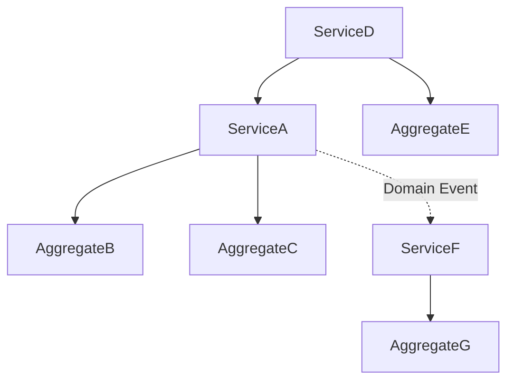

# ドメインサービス抽出ガイド

## 目的

- アグリゲート間の協調処理を中心としてドメインサービスを抽出し、複数のアグリゲートにまたがるビジネスロジックの適切な配置により、疎結合で保守性の高いドメインモデル設計を実現せよ

## 遵守事項

- **アグリゲート間協調重視**: 複数アグリゲートにまたがるビジネスロジックを適切にサービス化せよ
- **責任境界の明確化**: サービスの責任範囲を明確に定義し、過度な抽象化を避けよ
- **疎結合設計**: アグリゲート間の依存を最小化し、依存関係を明確に管理せよ
- **実装指針の具体化**: インターフェース設計・状態管理・パフォーマンス考慮を含む実装方針を提供せよ

## アウトプット出力先

### 基本方針

ドメインサービス抽出成果物は、ドメイン層の中核設計として、`docs/project/ddd-design/` ディレクトリに配置し、アグリゲート設計と連携したサービス境界の指針を提供する。

### 出力先ディレクトリ構造

```text
docs/project/ddd-design/
├── domain-service-extraction.md            # ドメインサービス抽出（メイン）
├── domain-services/                        # 個別サービス詳細設計
│   ├── {service-name}.service.md           # サービス詳細仕様
│   └── README.md                           # サービス一覧・関係図
├── service-coordination/                   # サービス協調設計
│   ├── cross-aggregate-analysis.md         # アグリゲート間協調分析
│   ├── service-dependencies.md             # サービス依存関係
│   └── coordination-patterns.md            # 協調パターン設計
└── service-boundaries.md                   # サービス境界・責任設計
```

**ファイル命名規則**:

- **サービス詳細**: `{ServiceName}.service.md`
- **協調パターン**: `{pattern-name}-coordination.md`
- **PascalCase使用**: サービス名はPascalCaseで統一（例：QuizApprovalService）

## ドメインサービス抽出の手順

### 1. アグリゲート間協調処理の分析

#### 1.1 クロスアグリゲート操作の特定

**参照ドキュメント**: [ドメインオブジェクト抽出ガイド](./03.05_domain-object-extraction-guide.md)、[エンティティ間関連性分析ガイド](./03.06_entity-relationship-analysis-guide.md)の成果物

**必須実施項目**:

- 複数アグリゲートが関与するビジネス操作の洗い出し
- 各操作のビジネス重要度・技術複雑度の評価
- アグリゲート境界を越える理由の明確化

**クロスアグリゲート操作分析テンプレート**:

```markdown
# アグリゲート間協調処理分析

## クロスアグリゲート操作の特定

| 操作名 | 関与アグリゲート | 協調の理由 | ビジネス重要度 | 複雑度 |
|-------|----------------|-----------|-------------|-------|
| {Operation名} | {Aggregateリスト} | {なぜ複数アグリゲートが必要か} | High/Medium/Low | High/Medium/Low |

## アグリゲート境界制約分析

| 制約名 | 制約対象アグリゲート | 制約内容 | 検証タイミング | サービス候補 |
|-------|-------------------|----------|-------------|-------------|
| {Constraint名} | {Aggregateリスト} | {具体的制約} | {いつ検証するか} | {候補サービス名} |
```

#### 1.2 サービス化判定基準の適用

**サービス化判定基準**:

```markdown
## サービス化判定チェックリスト

### 必須条件（いずれか）
- [ ] 複数のアグリゲートが関与する
- [ ] 単一エンティティでは実現できない複雑なビジネスロジック
- [ ] ステートレスな計算・変換処理
- [ ] 外部システムとの統合ロジック

### 除外条件（該当する場合はエンティティで実装）
- [ ] 単一エンティティの状態変更のみ
- [ ] 単純なCRUD操作
- [ ] UI表示用のフォーマット処理
- [ ] インフラストラクチャ層の責任
```

### 2. ドメインサービス候補の抽出

#### 2.1 サービス候補一覧作成

**サービス候補抽出テンプレート**:

```markdown
# ドメインサービス候補抽出

## サービス候補一覧

| サービス名 | 責任範囲 | 関与アグリゲート | 抽出理由 | 代替案検討 |
|----------|----------|----------------|----------|-----------|
| {Service名} | {責任内容} | {Aggregateリスト} | {なぜサービスが必要か} | {Entity/ValueObjectでは不可な理由} |

## サービス協調パターン

| サービス名 | 協調パターン | 実行順序 | 失敗時処理 | 一貫性レベル |
|----------|-------------|----------|-----------|-------------|
| {Service名} | Orchestration/Choreography | {実行順} | {エラー処理} | Strong/Eventual |
```

#### 2.2 協調パターンの選択

**協調パターンの分類**:

| パターン | 特徴 | 適用場面 | 実装方針 |
|---------|------|----------|----------|
| **Orchestration** | 中央制御・順次実行 | 複雑なビジネス処理・トランザクション必要 | ドメインサービスで制御 |
| **Choreography** | 分散制御・イベント駆動 | 疎結合・非同期処理可能 | ドメインイベント使用 |

### 3. サービス間依存関係の設計

#### 3.1 依存関係マップの作成

**サービス依存関係テンプレート**:

```markdown
# サービス間依存関係設計

## サービス依存マップ

| サービスA | サービスB | 依存関係 | 依存理由 | 疎結合化方針 |
|----------|----------|----------|----------|-------------|
| {ServiceA名} | {ServiceB名} | {依存種別} | {なぜ依存するか} | {疎結合化方法} |

## 循環依存チェック

| 依存チェーン | 循環有無 | 問題点 | 解決策 | 実装方針 |
|-------------|----------|--------|--------|----------|
| {A→B→C→...} | Yes/No | {問題内容} | {解決方法} | {実装アプローチ} |
```

#### 3.2 依存関係可視化

**依存関係図**:



### 4. サービス境界の設計

#### 4.1 責任分離設計

**責任分離テンプレート**:

```markdown
# サービス境界設計

## 責任分離設計

| サービス名 | コア責任 | 除外する責任 | 境界理由 | インターフェース設計 |
|----------|----------|-------------|----------|-------------------|
| {Service名} | {主責任} | {含めない責任} | {境界設定理由} | {メソッドシグネチャ} |

## 外部依存管理

| サービス名 | 外部依存 | 依存理由 | 抽象化方法 | テスト戦略 |
|----------|----------|----------|-----------|-----------|
| {Service名} | {外部システム/DB等} | {なぜ依存するか} | {Interface/Port等} | {Mock/Stub戦略} |
```

#### 4.2 インターフェース設計

**インターフェース設計原則**:

- **入力検証**: サービス境界で入力値の妥当性を検証
- **戻り値設計**: 成功・失敗・部分成功を明確に表現
- **例外設計**: ドメイン例外とシステム例外を区別
- **型安全性**: TypeScriptの型システムを活用した設計

### 5. サービス実装方針

#### 5.1 状態管理方針

**状態管理設計テンプレート**:

```markdown
# サービス実装方針

## 状態管理方針

| サービス名 | ステートレス度 | 状態保持理由 | 状態管理方法 | スレッドセーフ対応 |
|----------|-------------|-------------|-------------|-------------------|
| {Service名} | 完全/部分/ステートフル | {状態が必要な理由} | {状態管理方法} | {同期化戦略} |

## パフォーマンス考慮

| サービス名 | 性能要件 | ボトルネック要因 | 最適化戦略 | 監視項目 |
|----------|----------|----------------|-----------|----------|
| {Service名} | {レスポンス時間等} | {予想ボトルネック} | {最適化方法} | {監視指標} |
```

#### 5.2 実装テンプレート

**TypeScript実装テンプレート**:

```typescript
// ドメインサービスインターフェース
interface {ServiceName}Service {
  {methodName}({parameters}): Promise<{ResultType}>;
}

// 実装例
class {ServiceName}ServiceImpl implements {ServiceName}Service {
  constructor(
    private {aggregateA}Repository: {AggregateA}Repository,
    private {aggregateB}Repository: {AggregateB}Repository
  ) {}

  async {methodName}({parameters}): Promise<{ResultType}> {
    // 入力検証
    // ビジネスロジック実行
    // 結果返却
  }
}
```

## 完了判定基準

### 必須要件

- **アグリゲート間協調の明確化**: 複数アグリゲートが関与する処理が適切にサービス化されている
- **サービス責任の明確化**: 各サービスのコア責任と境界が明確に定義されている
- **依存関係の管理**: サービス間・サービス-アグリゲート間の依存が適切に設計されている
- **実装指針の提供**: インターフェース・状態管理・パフォーマンスの実装方針が明確

### 品質要件

- **疎結合性**: アグリゲート間の依存が最小化され、変更影響が局所化されている
- **テスタビリティ**: 外部依存が抽象化され、単体テストが容易
- **拡張性**: 新しい協調処理の追加・既存サービスの変更が容易
- **保守性**: ビジネスロジックが適切に分離され、変更時の影響範囲が明確

### 文書品質要件

- **表形式の活用**: サービス分析・依存関係・実装方針が表形式で整理されている
- **図表による可視化**: Mermaidによる依存関係・協調パターンが可視化されている
- **実装例の提供**: TypeScriptでのインターフェース・実装例が記載されている
- **判定基準の明確化**: サービス化の判定基準・代替案検討が明確に記録されている

## 完了後の必須アクション

1. **直ちに**ユーザーに「ドメインサービス抽出・協調設計」のレビューを依頼する
2. **ADR作成**: 以下の重要なサービス設計決定について、必ずADRを作成する：
   - **サービス抽出基準決定**: アグリゲート間協調を重視した抽出基準選択理由
   - **協調パターン選択決定**: Orchestration vs Choreographyの選択根拠
   - **依存関係管理戦略決定**: サービス間依存の疎結合化戦略選択理由
   - **状態管理方針決定**: ステートレス vs ステートフル設計の選択根拠
3. **ADR作成手順**:
   - 各ADRは「Proposed」ステータスで作成
   - ADRインデックス（`docs/project/adr/README.md`）への追加
   - DDD設計ドキュメント（`docs/project/ddd-design/README.md`）からのリンク追加
4. **次工程の判断**をユーザーに委ねる：
   - 通常フロー：「集約設計」「境界づけられたコンテキスト定義」に進む
   - 並行フロー：「API設計」でサービスインターフェースの詳細化
   - 戻りフロー：サービス設計に基づくアグリゲート境界・責任の見直し
5. ユーザーの明示的な承認を得てから指定された工程に進む
