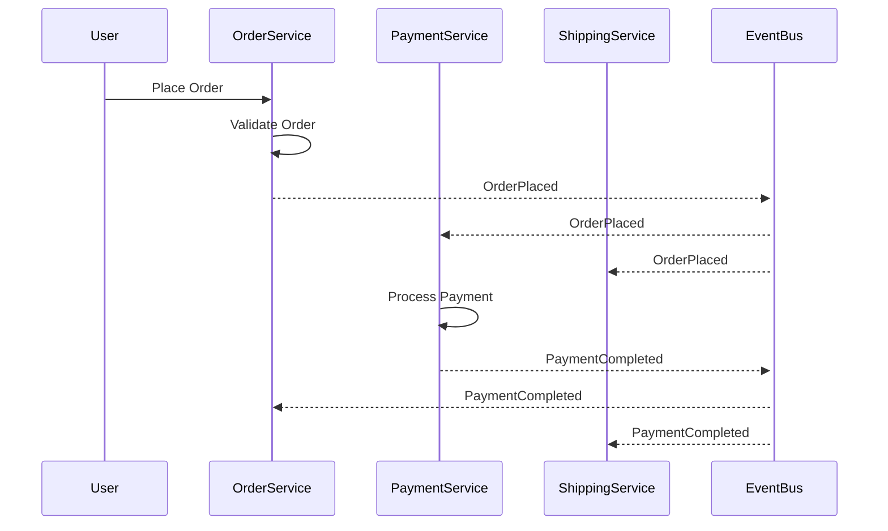

# ドメインイベント一覧作成ガイド

## 目的

- 主要な状態変化をドメインイベントとして定義し、名称とペイロードで共有することで、システム間の疎結合な通信設計とイベント駆動アーキテクチャの基盤を構築せよ

## 遵守事項

- **Event Stormingとの連携**: Event Stormingワークショップで特定されたドメインイベントを基に体系化せよ
- **ユビキタス言語の統一**: イベント名・属性名はユビキタス言語辞書と完全に一致させよ
- **ペイロード設計の一貫性**: 全イベントで統一されたペイロード構造・命名規則を適用せよ
- **実装トレーサビリティ**: イベント定義から実装コードまでの追跡可能性を確保せよ

## アウトプット出力先

### 基本方針

ドメインイベント一覧は、イベント駆動アーキテクチャの中核仕様として、`docs/project/ddd-design/` ディレクトリに集約し、実装・テスト・運用での参照を容易にする。

### 出力先ディレクトリ構造

```text
docs/project/ddd-design/2.10_domain-events-catalog/
├── domain-events-catalog.md            # ドメインイベントカタログ（メイン）
├── event-categories/                   # イベント分類
│   ├── business-events.md              # ビジネスイベント
│   ├── system-events.md                # システムイベント
│   ├── integration-events.md           # 統合イベント
│   └── notification-events.md          # 通知イベント
├── event-specifications/               # イベント仕様
│   ├── QuizCreated.event.md            # QuizCreatedイベント仕様
│   ├── QuizApproved.event.md           # QuizApprovedイベント仕様
│   ├── AnswerSubmitted.event.md        # AnswerSubmittedイベント仕様
│   ├── SessionCompleted.event.md       # SessionCompletedイベント仕様
│   └── README.md                       # イベント仕様一覧
├── event-flows/                        # イベントフロー
│   ├── quiz-lifecycle-events.md        # クイズライフサイクルイベント
│   ├── user-interaction-events.md      # ユーザーインタラクションイベント
│   └── system-maintenance-events.md    # システムメンテナンスイベント
└── event-store-design/                 # イベントストア設計
    ├── event-schema-design.md          # イベントスキーマ設計
    ├── event-versioning-strategy.md    # イベントバージョニング戦略
    └── event-replay-mechanisms.md      # イベント再生機構
```

**ファイル命名規則**:

- **イベント仕様**: `{EventName}.event.md`（例：QuizCreated.event.md）
- **フロー分析**: `{category}-events.md`（例：quiz-lifecycle-events.md）
- **PascalCase使用**: イベント名はPascalCaseで統一（QuizCreated, AnswerSubmitted）

## ドメインイベント一覧作成の手順

### 1. Event Stormingからのイベント抽出

#### 1.1 Event Stormingワークショップ結果の分析

**参照ドキュメント**: [Event Stormingワークショップガイド](./03.04_event-storming-workshop-guide.md)の成果物

**必須実施項目**:

- Big Picture Event Stormingで特定されたドメインイベントの収集
- Pivotal Eventsの重要度・優先度評価
- コンテキスト境界を跨ぐイベントの特定

#### 1.2 イベント分類・整理

**分類基準**:

| 分類 | 特徴 | 例 | 重要度 |
|------|------|----|----|
| **ビジネス核心イベント** | ビジネス価値創出の直接的な状態変化 | OrderPlaced, PaymentCompleted | 最高 |
| **ワークフローイベント** | 業務プロセスの進行状況変化 | OrderApproved, ShippingStarted | 高 |
| **システムイベント** | 技術的な状態変化・通知 | EmailSent, CacheUpdated | 中 |
| **統合イベント** | 外部システムとの連携イベント | ExternalAPICallCompleted | 中 |

### 2. イベント詳細定義

#### 2.1 イベント基本情報の定義

**必須定義項目**:

```markdown
| 項目 | 内容 |
|------|------|
| **Event Name** | PascalCaseでのイベント名 |
| **Aggregate** | イベントを発生させる集約 |
| **Meaning** | ビジネス的意味・発生条件 |
| **Trigger** | イベント発生のトリガー条件 |
| **Frequency** | 発生頻度（毎日/毎時/リアルタイム等） |
| **Downstream** | このイベントを購読するコンテキスト |
| **SLA** | 配信保証レベル・遅延要件 |
```

#### 2.2 ペイロード設計

**ペイロード設計原則**:

- **最小必要情報**: 受信者が処理に必要な最小限の情報のみ含める
- **非正規化**: 参照のための追加クエリを避けるため、必要な関連情報を含める
- **バージョニング**: スキーマ進化に対応できる構造にする
- **プライバシー**: 機密情報は含めず、必要に応じて参照IDのみ提供

**ペイロード例テンプレート**:

```json
{
  "eventId": "uuid",
  "eventType": "EventName",
  "aggregateId": "uuid", 
  "aggregateType": "AggregateName",
  "version": "1.0",
  "timestamp": "2025-01-01T00:00:00Z",
  "causationId": "uuid",
  "correlationId": "uuid",
  "data": {
    // イベント固有のデータ
  },
  "metadata": {
    "source": "service-name",
    "traceId": "trace-uuid"
  }
}
```

### 3. イベントカタログ作成

#### 3.1 ドメインイベント一覧表の作成

**必須フォーマット**:

```markdown
# ドメインイベント一覧

## Core Business Events

| Event | Aggregate | Meaning | Example Payload | SLA | 
|-------|-----------|---------|-----------------|-----|
| OrderPlaced | Order | 顧客が注文を確定した | [リンク](event-schemas/order/OrderPlaced.payload.json) | < 100ms |
| PaymentCompleted | Payment | 決済処理が正常完了した | [リンク](event-schemas/payment/PaymentCompleted.payload.json) | < 200ms |

## Workflow Events  

| Event | Aggregate | Meaning | Example Payload | SLA |
|-------|-----------|---------|-----------------|-----|
| OrderApproved | Order | 注文が承認プロセスを通過した | [リンク](event-schemas/order/OrderApproved.payload.json) | < 500ms |

## System Events

| Event | Aggregate | Meaning | Example Payload | SLA |
|-------|-----------|---------|-----------------|-----|
| EmailSent | Notification | メール送信が完了した | [リンク](event-schemas/notification/EmailSent.payload.json) | < 1s |
```

#### 3.2 イベントスキーマ詳細ドキュメント

**各イベント毎に作成する詳細ドキュメント**:

```markdown
# {EventName} イベントスキーマ

## 概要
- **イベント名**: {EventName}
- **発生集約**: {AggregateName}
- **ビジネス意味**: {詳細な説明}

## トリガー条件
{イベント発生の具体的条件}

## ペイロード構造
{JSON Schema または詳細な構造説明}

## 配信保証
- **配信方式**: At-least-once / Exactly-once
- **再試行戦略**: {戦略説明}
- **DLQ処理**: {失敗時の処理}

## 購読者
| Service | 処理内容 | SLA要件 |
|---------|----------|---------|
| {Service名} | {処理概要} | {要件} |

## バージョン履歴
| Version | 変更内容 | 日付 |
|---------|----------|------|
| 1.0 | 初版作成 | 2025-01-01 |
```

### 4. イベントフロー・相関関係の可視化

#### 4.1 イベントフロー図の作成

**Mermaidを使用したイベントフロー例**:



#### 4.2 イベント相関関係マトリックス

**イベント間の因果関係を表形式で整理**:

| Cause Event | Effect Event | Relationship | Timing |
|-------------|--------------|--------------|---------|
| OrderPlaced | PaymentRequested | 1:1 Direct | Immediate |
| PaymentCompleted | OrderConfirmed | 1:1 Conditional | < 5s |
| OrderConfirmed | ShippingScheduled | 1:1 Direct | < 30s |

## 完了判定基準

### 必須要件

- **全ドメインイベントの網羅**: Event Stormingで特定された全イベントがカタログ化されている
- **ペイロード設計の完了**: 各イベントのペイロード構造が定義され、JSON例が提供されている
- **実装指針の明確化**: 各イベントの配信保証・SLA・エラーハンドリングが仕様化されている
- **トレーサビリティの確保**: イベント定義からEvent Stormingワークショップ結果への追跡が可能

### 品質要件

- **ユビキタス言語の一貫性**: イベント名・属性名がユビキタス言語辞書と一致している
- **実装可能性**: 定義された仕様で実際のイベント駆動システムが構築可能
- **運用考慮**: 監視・ログ・デバッグに必要な情報が含まれている
- **スケーラビリティ**: 大量イベント処理・高頻度配信に対応できる設計

### 文書品質要件

- **表形式の活用**: イベント一覧・相関関係が表形式で整理されている
- **図表による可視化**: MermaidやPlantUMLでイベントフローが可視化されている
- **JSON例の提供**: 全イベントで実際のペイロード例がJSON形式で提供されている
- **バージョン管理**: スキーマ変更履歴が適切に記録されている

## 完了後の必須アクション

1. **直ちに**ユーザーに「ドメインイベント一覧・スキーマ設計」のレビューを依頼する
2. **ADR作成**: 以下の重要なイベント設計決定について、必ずADRを作成する：
   - **イベント駆動アーキテクチャ採用決定**: なぜイベント駆動を選択したかの根拠
   - **イベント配信保証レベル決定**: At-least-once vs Exactly-onceの選択理由  
   - **イベントペイロード設計方針決定**: 最小ペイロード vs 非正規化の選択理由
   - **イベントバージョニング戦略決定**: スキーマ進化戦略の設計選択理由
3. **ADR作成手順**:
   - 各ADRは「Proposed」ステータスで作成
   - ADRインデックス（`docs/project/adr/README.md`）への追加  
   - DDD設計ドキュメント（`docs/project/ddd-design/README.md`）からのリンク追加
4. **次工程の判断**をユーザーに委ねる：
   - 通常フロー：「API設計」または「DB設計」に進む
   - 並行フロー：「BDDテスト実装」でイベントテストシナリオを作成
   - 戻りフロー：イベント設計に基づくドメインモデル見直し
5. ユーザーの明示的な承認を得てから指定された工程に進む
