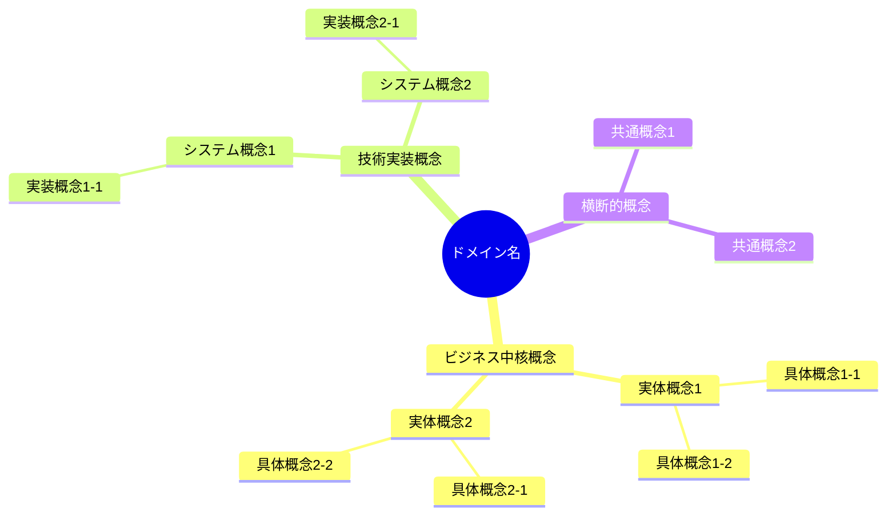
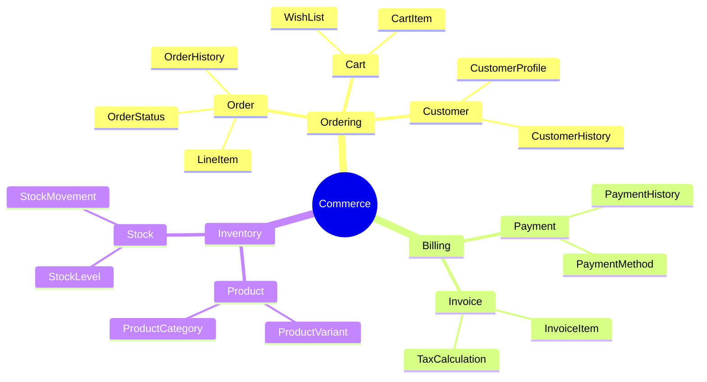
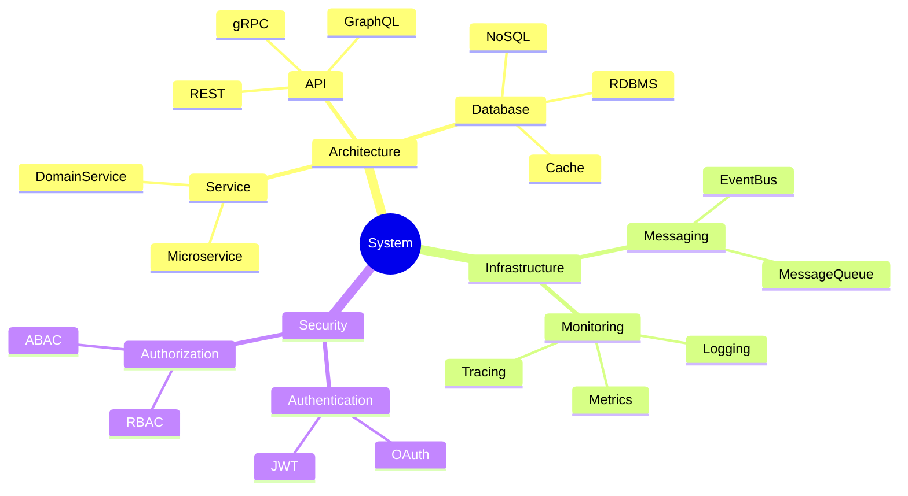
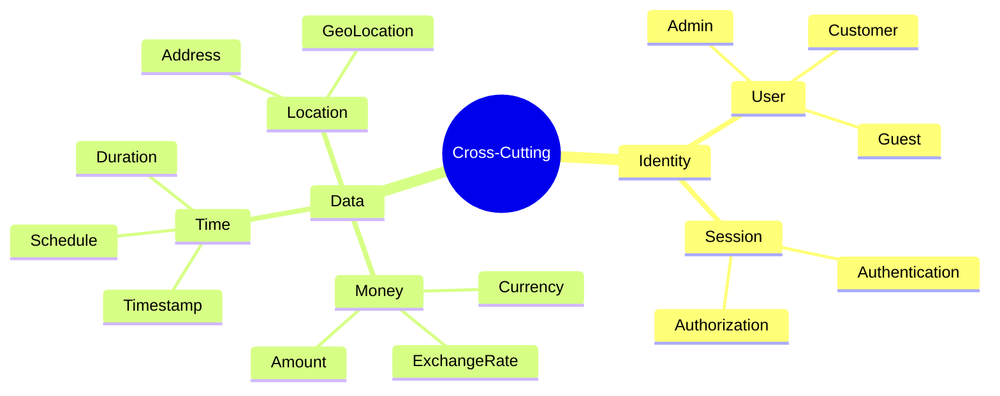
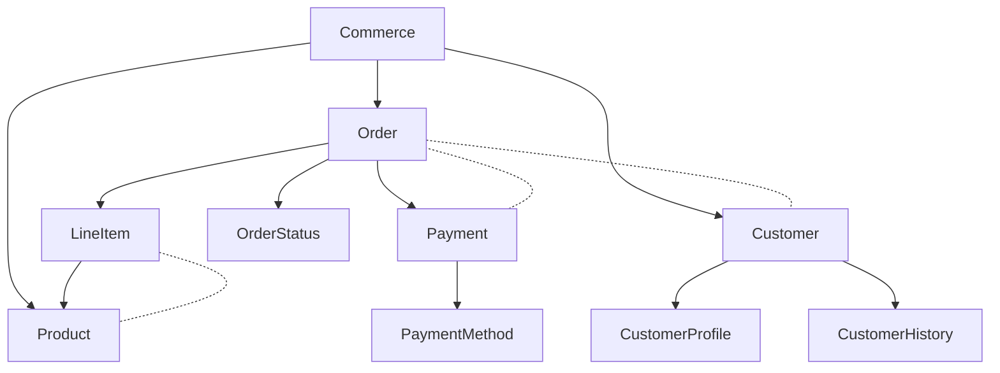

# 用語系統図（オントロジー）作成ガイド

## 目的

- 上位・下位概念、同義語を整理し命名衝突を防ぐことで、ドメイン用語の階層関係を明確化し、ユビキタス言語の体系的な理解と一貫した使用を実現せよ

## 遵守事項

- **ユビキタス言語との完全連携**: ユビキタス言語辞書の用語を階層化・体系化せよ
- **概念階層の明確化**: is-a関係・part-of関係・同義語関係を明確に区別せよ
- **命名衝突の防止**: 同音異義語・多義語の曖昧さを排除せよ
- **視覚的理解の促進**: Mermaid mindmapを活用して直感的に理解できる表現にせよ

## アウトプット出力先

### 基本方針

用語系統図は、ドメイン知識の体系的理解の基盤として、`docs/project/ddd-design/` ディレクトリに配置し、ユビキタス言語辞書と密接に連携させる。

### 出力先ディレクトリ構造

```text
docs/project/ddd-design/
├── ontology.md                         # 用語系統図（メイン）
├── concept-hierarchies/                # 概念階層詳細
│   ├── business-concepts.mmd           # ビジネス概念階層図
│   ├── technical-concepts.mmd          # 技術概念階層図
│   └── cross-cutting-concepts.mmd      # 横断的概念階層図
├── terminology-conflicts.md            # 用語衝突・曖昧性解決記録
└── concept-relationships.md            # 概念間関係詳細定義
```

**ファイル命名規則**:

- **階層図**: `{category-name}.mmd`（Mermaid形式）
- **PascalCase使用**: 概念名はPascalCaseで統一（例：Order, LineItem）
- **関係明記**: ファイル名で階層カテゴリを明確化

## 用語系統図作成の手順

### 1. ユビキタス言語からの概念抽出

#### 1.1 ユビキタス言語辞書の分析

**参照ドキュメント**: [ユビキタス言語辞書作成ガイド](./03.03_ubiquitous-language-creation-guide.md)の成果物

**必須実施項目**:

- ユビキタス言語辞書の全用語を抽出
- エンティティ・値オブジェクト・状態・動作の分類別整理
- 用語間の潜在的関係の識別

#### 1.2 概念分類の実施

**分類基準**:

| 概念カテゴリ | 特徴 | 関係性 | 例 |
|-------------|------|--------|-----|
| **ビジネス中核概念** | ドメインの根本的概念 | ルート概念として位置 | Commerce, Education, Healthcare |
| **ビジネス実体概念** | 具体的なビジネスオブジェクト | 中核概念の子として位置 | Order, Product, Customer |
| **ビジネス行為概念** | ビジネスプロセス・動作 | 実体概念に関連する動作 | Ordering, Billing, Shipping |
| **技術実装概念** | システム実装に関する概念 | ビジネス概念と分離 | Database, API, Service |
| **横断的概念** | 複数ドメインに跨る概念 | 多重継承的な位置 | Identity, Money, Time |

### 2. 概念階層の設計

#### 2.1 階層関係の定義

**関係種別の明確化**:

```markdown
## 概念関係種別

### Is-A関係（上位・下位概念）
- **意味**: 「AはBの一種である」
- **表現方法**: 上位概念から下位概念への枝分かれ
- **例**: Commerce → E-commerce, B2B Commerce

### Part-Of関係（全体・部分）  
- **意味**: 「AはBの一部である」
- **表現方法**: 構成要素として階層化
- **例**: Order → LineItem, ShippingAddress

### 同義語関係（Synonym）
- **意味**: 「AとBは同じ概念を指す」
- **表現方法**: 同レベルで併記・括弧表記
- **例**: Customer (== Client), User (== Member)

### 関連概念（Association）
- **意味**: 「AとBは密接に関連する」
- **表現方法**: 点線・注釈での関連表示
- **例**: Order ← → Payment, Product ← → Inventory
```

#### 2.2 Mermaid mindmap基本構造

**推奨テンプレート**:



### 3. 概念階層図の作成

#### 3.1 ビジネス概念階層図

**business-concepts.mmd テンプレート**:



#### 3.2 技術概念階層図  

**technical-concepts.mmd テンプレート**:



#### 3.3 横断的概念階層図

**cross-cutting-concepts.mmd テンプレート**:



### 4. 用語衝突・曖昧性の解決

#### 4.1 用語衝突パターンの特定

**典型的な衝突パターン**:

| 衝突パターン | 説明 | 例 | 解決方針 |
|-------------|------|-----|---------|
| **同音異義語** | 同じ読み方で異なる意味 | Order（注文）vs Order（順序） | コンテキスト修飾子追加 |
| **多義語** | 1つの語に複数の意味 | User（ユーザー/利用者/使用者） | 用途別に概念分離 |
| **類義語混在** | 似た意味で複数の語 | Customer/Client/User | 主概念を決定し他を同義語扱い |
| **スコープ曖昧** | 概念の適用範囲が不明確 | Service（ビジネス/技術） | 階層で明確に分離 |

#### 4.2 曖昧性解決記録

**terminology-conflicts.md フォーマット**:

```markdown
# 用語衝突・曖昧性解決記録

## 解決済み衝突

### Case 1: Order概念の分離

**問題**: 「Order」が注文と順序の両方の意味で使用される

**解決策**:
- **BusinessOrder**: ビジネス上の注文概念
- **SortOrder**: データの並び順概念  
- **コンテキスト**: ビジネス層では単に「Order」、技術層では「SortOrder」

**影響範囲**: ユビキタス言語辞書、API設計、データベース設計

### Case 2: User概念の統一

**問題**: User/Customer/Client/Memberが混在使用される

**解決策**:
- **主概念**: User（システム利用者全般）
- **特化概念**: Customer（購買者）、Administrator（管理者）
- **廃止語**: Client, Member → User/Customerに統合

**影響範囲**: 全ドメインモデル、認証・認可設計
```

### 5. 概念間関係の詳細定義

#### 5.1 関係マトリックスの作成

**concept-relationships.md フォーマット**:

```markdown
# 概念間関係詳細定義

## Is-A関係マトリックス

| 下位概念 | 上位概念 | 継承属性 | 追加属性 | 備考 |
|---------|---------|---------|---------|------|
| CustomerOrder | Order | id, total, status | customerId, deliveryAddress | B2C注文専用 |
| CorporateOrder | Order | id, total, status | corporateId, purchaseOrderNumber | B2B注文専用 |

## Part-Of関係マトリックス

| 部分概念 | 全体概念 | カーディナリティ | 依存性 | 備考 |
|---------|---------|----------------|-------|------|
| LineItem | Order | 1..*  | 強依存 | 注文なしでは存在不可 |
| Address | Customer | 0..* | 弱依存 | 顧客削除時も保持可能 |

## 同義語・類義語リスト

| 主概念 | 同義語 | 使用コンテキスト | 備考 |
|-------|-------|----------------|------|
| Customer | Client | レガシーシステム連携時 | 新規開発では Customer 使用 |
| Product | Item | UI表示時 | バックエンドでは Product 統一 |
```

#### 5.2 概念依存グラフ

**概念間の依存関係をMermaidで可視化**:



## 完了判定基準

### 必須要件

- **全概念の階層化**: ユビキタス言語辞書の全用語が適切な階層に配置されている
- **関係種別の明確化**: Is-A、Part-Of、同義語関係が明確に区別・定義されている
- **用語衝突の解決**: 同音異義語・多義語の曖昧性が解決され記録されている
- **視覚的表現の完成**: Mermaid mindmapで直感的に理解できる図が作成されている

### 品質要件

- **ユビキタス言語との一貫性**: 用語系統図とユビキタス言語辞書が完全に一致している
- **論理的整合性**: 概念階層に循環参照や論理矛盾がない
- **実装指針の提供**: 概念階層から実装上のクラス設計指針が導ける
- **保守性**: 新概念追加・既存概念変更時の影響範囲が明確

### 文書品質要件

- **図表による可視化**: Mermaid mindmap/graphで概念関係が可視化されている
- **表形式の活用**: 概念関係・用語衝突が表形式で整理されている  
- **トレーサビリティ**: 各概念の定義根拠がユビキタス言語辞書に追跡可能
- **更新履歴**: 概念階層の変更履歴が適切に記録されている

## 完了後の必須アクション

1. **直ちに**ユーザーに「用語系統図・概念階層設計」のレビューを依頼する
2. **ADR作成**: 以下の重要な概念設計決定について、必ずADRを作成する：
   - **概念階層設計方針決定**: なぜその階層構造を選択したかの根拠
   - **用語衝突解決戦略決定**: 同音異義語・多義語の解決方針選択理由
   - **概念関係種別定義決定**: Is-A vs Part-Of vs Associationの分類基準
   - **横断的概念分離決定**: ビジネス概念と技術概念の境界設定理由
3. **ADR作成手順**:
   - 各ADRは「Proposed」ステータスで作成
   - ADRインデックス（`docs/project/adr/README.md`）への追加
   - DDD設計ドキュメント（`docs/project/ddd-design/README.md`）からのリンク追加
4. **次工程の判断**をユーザーに委ねる：
   - 通常フロー：ドメインモデル設計での概念階層活用
   - 並行フロー：ユビキタス言語辞書の概念階層反映
   - 戻りフロー：概念階層に基づくドメイン理解の再検討
5. ユーザーの明示的な承認を得てから指定された工程に進む
