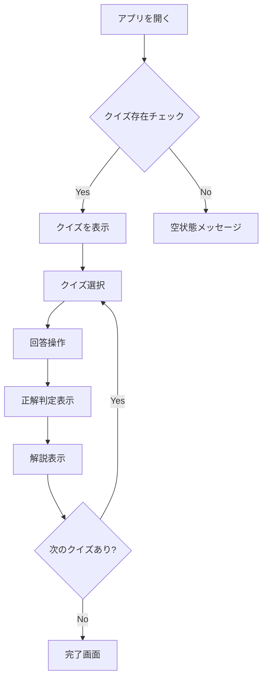

# UI設計

## 目的

- DDD設計完了後、UI/UX設計からコンポーネント実装まで一貫したプロセスでユーザーインターフェースを構築せよ
- Figma等の外部ツールに依存せず、GitHub上で完結するMarkdown+Mermaid+Storybookベースの設計手法を確立せよ
- API設計との整合性を保ちながら、エンジニア主導でUI/UX設計を実施せよ

## 遵守事項

- **統一設計手法**: Markdown+Mermaid+Storybook組み合わせによる設計ドキュメント作成を実施せよ
- **DDD整合性**: ドメインモデルとUIコンポーネントの対応関係を明確化せよ
- **実装指向設計**: Next.js + Tailwind CSSを前提とした実装可能な設計を行え
- **レスポンシブデザイン**: モバイルファーストの375px基準による設計を実施せよ
- **アクセシビリティ**: WCAG 2.1 AA準拠の設計要件を満たせ
- **自動化対応**: MCP/LLMによる設計・実装連携を考慮した構造化ドキュメント作成を行え

## アウトプット出力先

UI設計成果物は以下のディレクトリ構造で `docs/project/ui-design/` 配下に作成せよ。

### ディレクトリ構造

```text
docs/project/ui-design/
├── README.md                           # UI設計概要・進捗管理
├── sitemap.yaml                        # サイト構造・URL設計（YAML形式）
├── user-stories.md                     # ユーザーストーリー定義
├── user-flows/                         # ユーザーフロー図（Mermaid形式）
│   ├── quiz-answering-flow.md           # クイズ回答フロー
│   ├── quiz-creation-flow.md            # クイズ作成フロー
│   ├── quiz-approval-flow.md            # クイズ承認フロー
│   └── offline-sync-flow.md             # オフライン同期フロー
├── wireframes/                         # ワイヤーフレーム設計（Mermaid形式）
│   ├── home-page.md                    # ホームページ
│   ├── quiz-list-page.md               # クイズ一覧ページ
│   ├── quiz-answer-page.md             # クイズ回答ページ
│   ├── quiz-creation-page.md           # クイズ作成ページ
│   ├── answer-history-page.md          # 回答履歴ページ
│   └── admin-approval-page.md          # 管理者承認ページ
├── components/                         # コンポーネント設計
│   ├── component-inventory.md          # コンポーネント一覧
│   ├── design-system.md                # デザインシステム定義
│   └── storybook-setup.md              # Storybook構築手順
└── integration/                        # 統合設計
    ├── ddd-integration.md              # DDD設計との統合
    └── mcp-automation.md               # MCP/LLM自動化設定
```

### ファイル命名規則

- **概要ファイル**: `README.md`, `{機能名}-{概要}.md`
- **ページ設計**: `{ページ名}-page.md` (kebab-case)
- **フロー図**: `{機能名}-flow.md` (Mermaid形式をmd内に記載)
- **コンポーネント**: `{種別名}-{概要}.md`

## UI設計工程

### Phase 1: 要件・構造定義

#### 1.1 ユーザーストーリー定義

**参照資料**:

- DDD設計の[ユーザーフロー分析](docs/project/ddd-design/2.02_domain-understanding/user-flow-analysis.md)をUI視点で具体化
- [仕様書](docs/project/specifications/user-stories/user-story-quiz.md)の5W1H観点をUI設計視点で展開
- レスポンシブ対応6インチ未満画面での操作性を考慮

**出力先**: `docs/project/ui-design/user-stories.md`

**記載内容**:

```markdown
# UIユーザーストーリー

## 高優先度・MVP対象
- US-01: クイズ回答を直感的に実行できる
  - Tinder UI形式による回答操作
  - 正解・不正解の即座フィードバック
  - 解説表示による学習
  
## 中優先度・将来拡張
- US-02: クイズ作成を簡単に実行できる
  - 段階的入力による作成フォーム
  - リアルタイムプレビュー
  - 承認待ち状態の明確な表示
```

#### 1.2 サイト構造・URL設計

**参照資料**:

- レスポンシブ・PWA対応を前提とした構造設計
- RESTful URL体系との整合性
- PWA要件・オフライン操作を考慮したページ設計

**出力先**: `docs/project/ui-design/sitemap.yaml`

**出力形式**:

```yaml
site:
  title: "Your Quiz"
  description: "クイズアプリケーション"
  base_url: "/"
  
navigation:
  main:
    - name: "ホーム"
      url: "/"
      icon: "home"
    - name: "クイズ一覧"
      url: "/quiz"
      icon: "list"
    - name: "回答履歴"
      url: "/history"
      icon: "history"
      
pages:
  public:
    - path: "/"
      name: "ホームページ"
      component: "HomePage"
      description: "アプリケーション入口・クイズ開始"
    - path: "/quiz"
      name: "クイズ一覧"
      component: "QuizListPage"
      description: "利用可能クイズ一覧表示"
    - path: "/quiz/:id"
      name: "クイズ回答"
      component: "QuizAnswerPage"
      description: "個別クイズ回答画面"
```

### Phase 2: ユーザーフロー設計

#### 2.1 主要フローの可視化

**参照資料**:

- DDD設計の4つのドメインモデルを基にしたフロー設計
- 正常系・異常系を含むユーザー操作の可視化
- ドメインサービスのQuiz, Creator, AnswerHistory等との対応

**出力先**: `docs/project/ui-design/user-flows/*.md`

**Mermaidフロー例**:

各フローファイル内で以下の形式で記載：

```markdown
# クイズ回答フロー

## フロー概要
ユーザーがクイズに回答する一連の流れを示す。

## フロー図



### Phase 3: ワイヤーフレーム設計

#### 3.1 ページ毎ワイヤー設計

**参照資料**:

- レスポンシブページ設計375px基準によるワイヤー設計
- 情報階層・視覚的優先度の整理
- タッチインターフェース・最小タップ領域44pxの考慮

**出力先**: `docs/project/ui-design/wireframes/*.md`

**ワイヤーフレーム記述形式**:

各ワイヤーフレームファイル内で以下の形式で記載：

```markdown
## クイズ回答ページ (/quiz/:id)

### ワイヤーフレーム設計

```mermaid
graph TD
    subgraph "Mobile Layout (375px)"
        A[Header: 戻る + 進捗 3/10] --> B[Main Content Area]
        B --> C[Question Text Area]
        C --> D[Answer Buttons Area]
        D --> E[Footer Navigation]
    end
    
    subgraph "Header (60px)"
        A1[Back Button] --> A2[Progress Indicator]
    end
    
    subgraph "Main Content (Auto Height)"
        C1[Question Text<br/>最大500文字]
        C2[Image/Media<br/>Optional]
    end
    
    subgraph "Action Area (120px)"
        D1[○ 正解] --> D2[× 不正解] --> D3[？ わからない]
    end
    
    subgraph "Footer (60px)"
        E1[ホーム] --> E2[履歴] --> E3[設定]
    end
```text

### UI設計要素

- **質問文**: 最大500文字、読みやすいフォントサイズ
- **操作ボタン**: ページ下部固定、直感的なアイコン使用
- **進捗表示**: 現在位置/総数、視覚的進捗バー表示

```

### Phase 4: コンポーネント設計・Atomic Design

#### 4.1 コンポーネント分類・整理

**参照資料**:

- Atomic Designパターンによるコンポーネント一覧作成
- 再利用性・カスタマイズ性の考慮
- Next.js + Tailwind CSS実装を前提としたprops設計

**出力先**: `docs/project/ui-design/components/component-inventory.md`

**コンポーネント一覧例**:

```markdown
## Atoms（原子）
- Button (Primary, Secondary, Danger)
- Input (Text, Textarea)
- Icon (ArrowLeft, Check, X)
- ProgressBar

## Molecules（分子）
- QuizCard (質問 + 解説表示)
- ValidationMessage (エラーメッセージ表示)
- SwipeHint (スワイプ操作ヒント)

## Organisms（有機体）
- QuizAnswerArea (質問 + 操作ボタン)
- QuizCreationForm (新規投稿フォーム)
- AnswerHistoryList (回答履歴表示)

## Templates（テンプレート）
- MobilePageTemplate (Header + Main + Footer)
- ModalTemplate (オーバーレイ + コンテンツ)

## Pages（ページ）
- QuizAnswerPage
- QuizCreationPage
- AnswerHistoryPage
```

#### 4.2 デザインシステム定義

**参照資料**:

- Tailwind CSS基準による統一スタイル
- カラーパレット・タイポグラフィ・スペーシングルール
- アクセシビリティ配慮・色覚多様性

**出力先**: `docs/project/ui-design/components/design-system.md`

### Phase 5: Storybook統合・自動化

#### 5.1 Storybook構築設定

**参照資料**:

- UIコンポーネントカタログ化のためのStorybook導入
- Autodocs機能による仕様書自動生成
- 回帰テスト・Chromaticとの統合運用

**出力先**: `docs/project/ui-design/components/storybook-setup.md`

#### 5.2 MCP/LLM自動化連携

**参照資料**:

- 設計ドキュメント更新時の自動コード生成
- GitHub Actions機能による CI/CD統合運用
- コンポーネント仕様とStorybook実装の整合性確保

**出力先**: `docs/project/ui-design/integration/mcp-automation.md`

### Phase 6: DDD設計統合・整合性確保

#### 6.1 ドメイン機能対応

**参照資料**:

- ドメインサービスのUIコンポーネント対応関係
- ドメインモデルとフロントエンド状態管理の整合性
- ビジネスルールとUI制約の機能対応設計

**出力先**: `docs/project/ui-design/integration/ddd-integration.md`

## 完了判定基準

### 必須要件

- **設計完了性**: 全Phase出力先ファイルの作成完了
- **DDD整合性**: ドメインモデル・ビジネスルールとのUI機能100%整合
- **実装準備性**: Next.js + Tailwind CSSによる実装可能な設計完了
- **レスポンシブ対応**: 375px基準による詳細設計完了
- **アクセシビリティ**: WCAG 2.1 AA準拠の配慮事項明記

### 品質要件

- **Markdown lint準拠**: 全設計ドキュメントでmarkdownlint準拠
- **Mermaid正常表示**: 全フロー図・構造図で正常表示確認
- **整合性確保**: 設計ドキュメント間の参照整合性確保
- **命名規則準拠**: ファイル名・ディレクトリ構成ルール準拠

### 統合要件

- **specifications連携**: user-stories, requirements, success-scenariosとの参照整合性
- **architecture連携**: システム・通信パターンとの整合性確保
- **ddd-design連携**: 全4つのドメインモデルとのUI機能マッピング完了

## 完了後

### 必須確認事項

1. **出力確認**：全ファイル出力先ディレクトリの成果物確認
2. **ADR作成判定**: UI設計方針に関する重要な設計判断をADRによる記録実施
3. **次工程準備**：以下工程への移行準備確認
   - API設計：UIとのAPI連携設計
   - 実装工程：UI設計成果物を基にした実装着手
   - テスト工程：Storybook実装によるテスト運用

### 成果物確認・ユーザーレビュー

次の工程開始前に以下の出力先ファイル確認をレビュー依頼せよ：

**Phase 1出力先**:

- `docs/project/ui-design/README.md`
- `docs/project/ui-design/sitemap.yaml`
- `docs/project/ui-design/user-stories.md`

**Phase 2出力先**:

- `docs/project/ui-design/user-flows/quiz-answering-flow.md`
- `docs/project/ui-design/user-flows/quiz-creation-flow.md`
- `docs/project/ui-design/user-flows/quiz-approval-flow.md`
- `docs/project/ui-design/user-flows/offline-sync-flow.md`

**Phase 3出力先**:

- `docs/project/ui-design/wireframes/home-page.md`
- `docs/project/ui-design/wireframes/quiz-list-page.md`
- `docs/project/ui-design/wireframes/quiz-answer-page.md`
- `docs/project/ui-design/wireframes/quiz-creation-page.md`
- `docs/project/ui-design/wireframes/answer-history-page.md`

**Phase 4-6出力先**:

- `docs/project/ui-design/components/component-inventory.md`
- `docs/project/ui-design/components/design-system.md`
- `docs/project/ui-design/components/storybook-setup.md`
- `docs/project/ui-design/integration/ddd-integration.md`
- `docs/project/ui-design/integration/mcp-automation.md`
