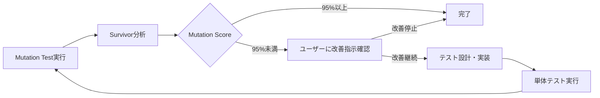

# Mutation Testing（変異テスト）

## 目的

- 単体テスト（09.01_unit-testing.md）で達成した95%カバレッジの**品質**を定量評価し、テストの有効性を検証する
- Survived mutant（生存ミューテーション）の分析により、テストのギャップを特定・補完する
- コードの信頼性を数値で測定し、継続的品質改善の基盤を確立する

## 前提条件

- **必須**: 09.01_unit-testing.mdによる単体テスト実装完了
- **必須**: テストカバレッジ95%以上達成済み
- **推奨**: TDDサイクル（Red-Green-Refactor）による実装完了

## 実行手順

### 1. Mutation Test実行

**実行ディレクトリ**: プロジェクトルート（`/Users/tanacchi/works/tanacchi/your-quiz/`）

```bash
# リポジトリルートから実行
pnpm mutation-test

# 実行時間: 通常1-2分（19 mutants）
# 出力先: api/reports/mutation/mutation-report.json
```

**設定詳細** (`api/stryker.conf.json`):

- **対象ファイル**: `src/shared/utils/validation.ts`（現在）
- **閾値**: high=95%, low=80%
- **タイムアウト**: 60秒
- **並行数**: 2プロセス

### 2. レポート解析実行

**実行ディレクトリ**: プロジェクトルート（`/Users/tanacchi/works/tanacchi/your-quiz/`）

```bash
# リポジトリルートから実行
pnpm mutation-report

# 出力先:
# - reports/mutation-analysis/survived.jsonl（機械可読・除外適用後）
# - reports/mutation-analysis/survived-[ファイル名].md（ファイル別詳細・除外適用後）
# - reports/mutation-analysis/excluded-mutants.jsonl（除外されたもの）
# - reports/mutation-analysis/excluded-mutants.md（除外理由付きレポート）
```

### 3. 結果の読み方

#### 3.1 基本メトリクス

```txt
Mutation Score = (Killed + Timeout) / (Total - Ignored - Equivalent)
```

- **Killed**: テストで検出されたミューテーション（✅良好）
- **Survived**: テストで検出されなかったミューテーション（❌要改善）
- **Timeout**: タイムアウトしたミューテーション（⚠️注意）
- **No Coverage**: カバレッジ対象外（❌要改善）

#### 3.2 Survivorレポートの活用

**JSONL形式** (`survived.jsonl`):

```json
{"file":"src/shared/utils/validation.ts","mutator":"ConditionalExpression","mutant_id":"3","range":{"start":{"line":19,"column":9},"end":{"line":19,"column":37}},"original_slice":"error instanceof SyntaxError","replacement":"false","unified_diff":"@@ -16,7 +16,7 @@\n   return ResultAsync.fromPromise(request.json(), (error) => {\n-    if (error instanceof SyntaxError) {\n+    if (false) {\n       return createJsonParseError(error);\n     }","instruction":"このサバイブ・ミューテーションを失敗させる最小テストを設計してください。","hint":"条件式が変更されています。"}
```

**Markdown形式**（レビュー用）:

- 各survivorの差分表示
- 変更箇所のハイライト
- 修正のヒント付き

### 4. Equivalent Mutant手動除外プロセス

#### 4.1 除外判定基準

**Equivalent Mutant**（等価ミューテーション）の特徴:

- コードの動作に影響しない変更
- 理論的にテストで検出不可能
- Mutation Scoreの精度向上のため除外が必要

**除外対象例**:

- ログメッセージ・エラーメッセージの文字列変更
- デバッグ用コメント・定数の変更
- 到達不可能なコードパス
- コンパイラ最適化による等価変換

#### 4.2 手動除外手順

1. **レポート確認**: `reports/mutation-analysis/survived-[ファイル名].md`を精査
2. **Equivalent mutant特定**: 上記基準に該当するものを特定
3. **除外設定追加**: `scripts/mutation-test/equivalent-mutants.json`に手動で追加

   ```json
   {
     "id": "5",
     "file": "src/shared/utils/validation.ts",
     "mutatorName": "StringLiteral",
     "original_slice": "\"Operation failed\"",
     "replacement": "\"\"",
     "location": {...},
     "reason": "エラーメッセージの内容変更は動作に影響しない",
     "category": "cosmetic-change",
     "added_by": "developer",
     "added_at": "2024-01-15T10:30:00Z"
   }
   ```

4. **レポート再生成**: `pnpm mutation-report`で除外適用後のレポート生成
5. **除外確認**: `excluded-mutants.md`で除外されたものを確認

#### 4.3 除外カテゴリ

| カテゴリ | 説明 | 除外例 |
|---------|------|-------|
| `cosmetic-change` | 表示内容のみの変更 | ログ・エラーメッセージ |
| `dead-code` | 到達不可能コード | 条件が常にfalseの分岐 |
| `defensive-programming` | 防御的プログラミング | null チェック冗長化 |
| `compiler-optimization` | コンパイラ最適化 | 等価な演算子変換 |

### 5. 品質基準・合格ライン

#### 5.1 推奨指標

| レベル | Mutation Score | 判定 | アクション |
|--------|---------------|------|-----------|
| **優秀** | 95%以上 | ✅ | リリース可能 |
| **良好** | 90-94% | ⚠️ | 重要survivorのみ修正 |
| **要改善** | 80-89% | ❌ | survivor分析・テスト追加必須 |
| **不合格** | 80%未満 | ❌ | 大幅なテスト見直し必要 |

#### 5.2 Critical Survivor（優先修正対象）

1. **条件分岐の抜け**: `ConditionalExpression`, `EqualityOperator`
2. **境界値処理**: `ArithmeticOperator`, `UpdateOperator`
3. **エラーハンドリング**: `BlockStatement`, `StringLiteral`
4. **ビジネスロジック**: ドメイン固有の計算・判定処理

## 改善フロー

### 6. Survivor分析→テスト追加サイクル



### 7. 95%未満時の対応プロセス

**Mutation Score 95%未満の場合**:

1. **ユーザーへの確認必須**
   - 現在のMutation Scoreを報告
   - Critical Survivorの数と種類を提示
   - 改善継続の要否をユーザーに確認

2. **改善継続の場合**
   - Survivorレポートを分析
   - 優先度の高いテストから実装
   - 再度Mutation Testを実行

3. **改善停止の場合**
   - 現状のスコアで作業完了
   - 理由と今後の改善方針を記録

### 8. 効率的な修正順序

1. **高影響**: ビジネスロジック・エラーハンドリング
2. **中影響**: 条件分岐・境界値処理
3. **低影響**: ログ出力・デフォルト値

### 9. テスト追加例

**Survivor**: `error instanceof SyntaxError` → `false`

```typescript
// 修正前（不十分）
it('should handle JSON parse error', async () => {
  const request = { json: () => Promise.reject(new Error('Invalid JSON')) };
  const result = await parseJsonSafe(request);
  expect(result.isErr()).toBe(true);
});

// 修正後（Survivorを殺すテスト）
it('should specifically handle SyntaxError', async () => {
  const syntaxError = new SyntaxError('Unexpected token');
  const request = { json: () => Promise.reject(syntaxError) };
  const result = await parseJsonSafe(request);

  expect(result.isErr()).toBe(true);
  expect(result.error.code).toBe('JSON_PARSE_ERROR');
  expect(result.error.cause).toBe(syntaxError);
});

it('should handle non-SyntaxError differently', async () => {
  const networkError = new Error('Network timeout');
  const request = { json: () => Promise.reject(networkError) };
  const result = await parseJsonSafe(request);

  expect(result.isErr()).toBe(true);
  expect(result.error.message).toContain('Unknown parsing error');
});
```

## 運用Tips・Best Practices

### 10. 効率的な分析手法

- **ファイル別レポート**: `survived-[ファイル名].md`で集中分析
- **変更差分の最小化**: 1行程度の小さな変更から開始
- **パターン認識**: 同じmutatorタイプは類似の修正方法

### 11. LLM活用による自動テスト生成

**プロンプト例**:

以下のunified diffを分析し、この変異を検出する最小限のテストケースを生成してください:

```diff
@@ -19,7 +19,7 @@
   return ResultAsync.fromPromise(request.json(), (error) => {
-    if (error instanceof SyntaxError) {
+    if (false) {
       return createJsonParseError(error);
     }
```

既存テスト: [関連するテストケースを1件添付]

### 12. チーム運用における注意点

- **定期実行**: PRマージ前の必須チェック項目として設定
- **閾値管理**: プロジェクト初期は90%、成熟後は95%を目標
- **除外設定**: 設定ファイル・型定義は対象外に設定
- **実行時間**: 大規模プロジェクトでは並行数調整で短縮

### 13. トラブルシューティング

#### よくある問題と対処法

##### Q. テスト実行が遅い

- `concurrency`を増加（CPU数まで）
- `timeoutMS`を調整
- 対象ファイルを段階的に拡張

##### Q. Equivalent Mutantが多い

- 設定で自動除外: `"ignorePatterns": ["**/types/**"]`
- TypeScript strict設定の活用

##### Q. False Positiveなサバイバー

- ログ出力・デバッグコードは除外対象
- ビジネスロジックに集中

##### Q. Equivalent Mutantの判定が困難

- `excluded-mutants.md`レポートで過去の除外事例を参考
- 迷った場合は一旦テスト実装を試み、実装困難なら除外検討
- category別の判定基準を活用

## スケール運用（将来拡張）

### 対象範囲拡張

```json
// stryker.conf.json
{
  "mutate": [
    "src/domains/**/*.ts",
    "src/shared/**/*.ts",
    "!src/**/*.d.ts",
    "!src/types/generated/**"
  ]
}
```

### CI/CD統合

```json
// package.json
{
  "scripts": {
    "mutation-test:ci": "stryker run --concurrency 4 --reporters progress,json,dashboard",
    "mutation-test:incremental": "stryker run --since HEAD~1"
  }
}
```

## 完了判定基準

### 必須要件

- **Mutation Score 95%以上**達成
- **Critical Survivorゼロ**（条件分岐・エラーハンドリング系）
- **実行時間3分以内**（CI/CD組み込み可能レベル）
- **レポート分析完了**（改善不要な理由が明確）

### 品質要件

- **テストケース品質向上**（Survivorベースの補完実装）
- **継続運用体制**（定期実行・閾値監視の仕組み）
- **チーム理解**（レポート読み方・改善手法の共有）

## 完了後のアクション

1. **次工程判断**:
   - **通常フロー**: Integration Testing（09.03）への移行
   - **品質向上**: より多くのファイルへMutation Testing適用拡大

2. **運用継続**:
   - CI/CDパイプラインへの組み込み検討
   - 定期的な閾値見直し・対象範囲拡張

3. **知見共有**:
   - テスト品質改善パターンの文書化
   - チーム内でのMutation Testing手法共有
