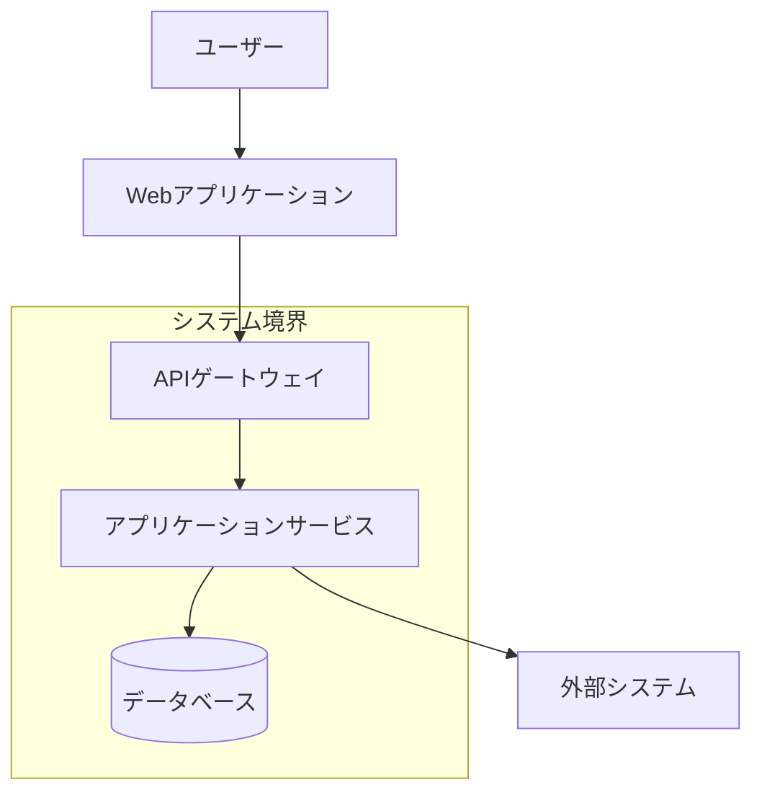
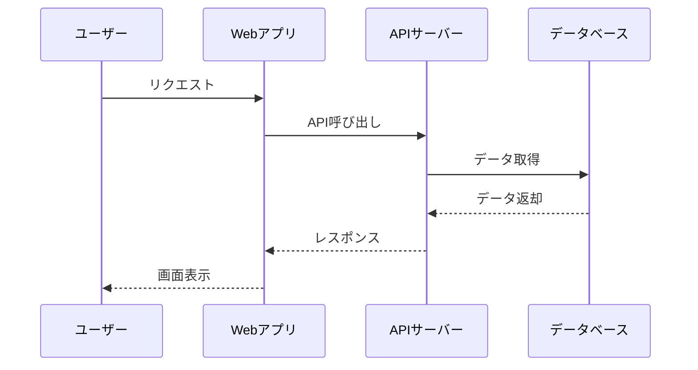

# 全体技術設計

## 目的

- 仕様整理で明確化された要件に基づき、システム全体のアーキテクチャ方針を決定し、後続のドメイン設計・API設計・DB設計工程に対する技術的制約と設計指針を提供するため、アーキテクチャパターンの選定根拠とトレードオフを明示した包括的な技術設計書を作成する

## 遵守事項

- アーキテクチャパターンの選定理由と技術的トレードオフを明確に記述する
- 抽象度を保ち、後続工程への制約と指針を提供する
- 図表を用いてアーキテクチャパターンを視覚的に表現する
- 代替案との比較検討を通じて選定の妥当性を示す

## 技術選定の必須成果物形式

### 基本比較検討表

**重要**: 個別技術（DB種別、フレームワーク等）を選定する前に、必ずアーキテクチャ全体での役割・位置づけを確認すること。

**全ての技術選定は以下の表形式で整理すること**

```markdown
| 選択肢 | メリット | デメリット | 適用場面 | コスト | 学習曲線 | チーム適合性 | 判定 |
|--------|----------|------------|----------|--------|----------|------------|------|
| 選択肢A | 利点1<br>利点2 | 欠点1<br>欠点2 | 場面1<br>場面2 | 高/中/低 | 急/緩 | 高/中/低 | ○/△/× |
| 選択肢B | 利点1<br>利点2 | 欠点1<br>欠点2 | 場面1<br>場面2 | 高/中/低 | 急/緩 | 高/中/低 | ○/△/× |
```

### DB選定表の例

```markdown
| データベース | メリット | デメリット | 適用場面 | 運用コスト | 学習曲線 | チーム適合性 | 判定 |
|-------------|----------|------------|----------|------------|----------|------------|------|
| MySQL | ・実績豊富<br>・運用ノウハウ蓄積<br>・ツール充実 | ・スケール制限<br>・JSON処理弱い<br>・レプリケーション複雑 | ・中規模まで<br>・リレーショナル中心<br>・OLTP | 低 | 緩 | 高 | ○ |
| PostgreSQL | ・高機能<br>・拡張性高い<br>・ACID厳密 | ・学習コスト高<br>・設定複雑<br>・メモリ消費大 | ・複雑なクエリ<br>・大規模データ<br>・地理空間 | 中 | 急 | 中 | △ |
| MongoDB | ・スキーマ柔軟<br>・水平スケール<br>・開発高速 | ・整合性制約弱い<br>・複雑なクエリ苦手<br>・運用ノウハウ不足 | ・ドキュメント指向<br>・プロトタイプ<br>・ログデータ | 中 | 中 | 低 | × |
```

### マイクロサービス vs モノリス比較表

```markdown
| アーキテクチャ | メリット | デメリット | 適用場面 | チーム規模 | 技術的複雑さ | 運用負荷 | 判定 |
|---------------|----------|------------|----------|------------|--------------|----------|------|
| モノリス | ・開発初期高速<br>・デプロイ単純<br>・トランザクション容易<br>・デバッグ容易 | ・大規模時保守困難<br>・技術スタック固定<br>・部分スケール不可<br>・チーム衝突 | ・小〜中規模<br>・単一チーム<br>・MVP段階<br>・シンプルドメイン | 1-10名 | 低 | 低 | ○ |
| マイクロサービス | ・独立デプロイ<br>・技術選択自由<br>・障害分離<br>・チーム独立性 | ・分散システム複雑性<br>・データ整合性課題<br>・運用コスト高<br>・ネットワーク遅延 | ・大規模<br>・複数チーム<br>・ドメイン境界明確<br>・高可用性要求 | 20名以上 | 高 | 高 | × |
| モジュラーモノリス | ・モノリスの単純さ<br>・モジュール分離<br>・段階的移行可能<br>・境界明確化 | ・境界維持要努力<br>・完全分離は困難<br>・将来分割時作業大 | ・中規模<br>・将来分割予定<br>・成長期 | 5-15名 | 中 | 中 | △ |
```

## アウトプット出力先

### 基本方針
アーキテクチャ設計文書は、プロジェクト全体の技術的基盤となるため、`docs/project/architecture/` ディレクトリに集約し、後続工程からの参照を容易にする。

### 出力先ディレクトリ構造

```
docs/project/architecture/
├── system-overview.md              # システム全体俯瞰・境界定義
├── user-management/                # ユーザー管理責務
│   ├── architecture.md            # ユーザー管理のアーキテクチャ
│   ├── data-design.md             # ユーザーデータ設計
│   ├── api-design.md              # ユーザーAPI設計
│   └── integration.md             # 外部認証連携等
├── content-management/             # コンテンツ管理責務
│   ├── architecture.md            # コンテンツ管理のアーキテクチャ
│   ├── data-design.md             # コンテンツデータ設計
│   ├── api-design.md              # コンテンツAPI設計
│   └── storage.md                 # ファイル保存・CDN等
├── shared-services/                # 共通サービス責務
│   ├── authentication.md          # 認証・認可
│   ├── logging-monitoring.md      # ログ・監視
│   └── notification.md           # 通知サービス
└── diagrams/
    ├── system-context.mmd         # システムコンテキスト図
    ├── user-management-flow.mmd   # ユーザー管理フロー図
    ├── content-management-flow.mmd # コンテンツ管理フロー図
    └── shared-services-flow.mmd   # 共通サービス連携図
```

### ファイル命名規則
- **全体俯瞰文書**: `system-overview.md`
- **責務別設計文書**: `[責務名]/[設計対象].md`
- **図表ファイル**: `diagrams/[責務名-対象].mmd`
- **ADR管理**: 詳細は `adr-management.md` を参照

### 各成果物の保存場所
- **システム全体文書**: `architecture/` 直下に配置
- **責務別設計文書**: `architecture/[責務名]/` 配下に配置
- **図表ファイル**: `architecture/diagrams/` 配下に配置
- **参照用素材**: 必要に応じて `architecture/references/` 配下に配置

## 全体技術設計の手順

### 1. システムアーキテクチャパターン選定

#### 1.1 アーキテクチャスタイル決定

##### モノリス vs マイクロサービス vs モジュラーモノリス

各アーキテクチャ決定について以下の構造で記述する：

```markdown
## [アーキテクチャ要素名]

### 選定結果
**採用**: [選定されたパターン/技術]

### 判断基準
- **チーム規模**: [開発チーム・運用チームの規模と技術力]
- **ビジネス要件**: [変更頻度、機能間の結合度、独立デプロイ必要性]
- **非機能要件**: [スケーラビリティ、可用性、パフォーマンス要求]
- **技術制約**: [既存システム、インフラ制約、技術スタック]
- **組織制約**: [予算、スケジュール、コンプライアンス要件]

### 比較検討
| 選択肢 | メリット | デメリット | 適用可能性 | 評価 |
|--------|----------|------------|------------|------|
| モノリス | 開発初期の生産性高、デプロイ単純 | スケール限界、技術スタック固定 | 小〜中規模 | ★★★ |
| マイクロサービス | 独立スケール、技術多様性 | 運用複雑、分散システム課題 | 大規模・複数チーム | ★★ |
| **モジュラーモノリス** | **モノリスの簡単さ+分離** | **後のマイクロ化要検討** | **中規模・成長期** | **★★★** |

### 選定理由
1. **主要理由**: [最も重要な選定根拠]
2. **副次理由**: [補強する根拠]
3. **将来性**: [成長・変化への対応性]

### トレードオフ
**得られるもの**:
- [選定により獲得する価値]
- [解決される課題]

**失うもの/リスク**:
- [選定により失う選択肢]
- [発生するリスクと対策]

### 後続工程への影響
- **DDD設計**: [ドメイン境界、コンテキスト分離への制約]
- **API設計**: [通信方式、インターフェース設計への制約]
- **DB設計**: [データストア選択、分散設計への制約]
- **技術選定**: [フレームワーク、ライブラリ選択への制約]
```

##### アプリケーションアーキテクチャパターン選定

- **レイヤードアーキテクチャ**: 従来の階層型設計
- **ヘキサゴナルアーキテクチャ**: ポート&アダプターパターン
- **クリーンアーキテクチャ**: 依存関係逆転による疎結合設計
- **オニオンアーキテクチャ**: ドメイン中心の同心円設計

#### 1.2 システムコンテキスト設計

##### 外部システム連携方針
```markdown
### 外部システム連携パターン

| 連携先 | 連携方式 | 理由 | データ形式 | エラーハンドリング |
|--------|----------|------|------------|-------------------|
| 認証システム | REST API | リアルタイム認証要求 | JSON | リトライ+フォールバック |
| 決済システム | REST API | トランザクション整合性 | JSON | 2フェーズコミット |
| 通知システム | Message Queue | 非同期・高可用性 | JSON | Dead Letter Queue |
```

##### システム境界定義
- **内部システム**: 自組織で開発・運用するシステム範囲
- **外部システム**: 連携が必要な他システム・サービス
- **境界インターフェース**: システム間の通信仕様

### 2. 通信・統合パターン設計

#### 2.1 同期通信 vs 非同期通信の選定

##### 通信パターン適用指針
```markdown
### 通信方式選定マトリクス

| ユースケース | 推奨方式 | 理由 | 実装パターン |
|-------------|----------|------|-------------|
| ユーザー認証 | 同期（REST） | リアルタイム応答必須 | Request-Response |
| データ検索・表示 | 同期（REST） | ユーザー待機可能 | Request-Response |
| バッチ処理 | 非同期（Queue） | 時間がかかる処理 | Fire-and-Forget |
| 通知配信 | 非同期（Pub/Sub） | 複数システム連携 | Event-Driven |
| データ同期 | 非同期（Event） | 結果整合性許容 | Event Sourcing |
```

#### 2.2 API Gateway・Service Mesh適用判断

##### API Gateway適用判断
- **単一エントリーポイント**: クライアントからの全API呼び出しを集約
- **横断的関心事**: 認証、ログ、レート制限、モニタリング
- **適用条件**: マイクロサービス、複数API、横断機能必要

##### Service Mesh適用判断
- **サービス間通信制御**: 内部サービス間の通信管理
- **適用条件**: マイクロサービス多数、複雑なサービス間通信
- **トレードオフ**: 運用複雑さ vs 通信制御の統一

### 3. データアーキテクチャ方針

#### 3.1 データストア戦略

##### データストア選定マトリクス
```markdown
### データストア選定指針

| データ特性 | 推奨ストア | 理由 | 適用例 |
|-----------|-----------|------|--------|
| 構造化・ACID必要 | RDBMS | トランザクション保証 | ユーザー情報、決済 |
| 大量・高速読み取り | NoSQL（Document） | 水平スケール、柔軟スキーマ | コンテンツ、ログ |
| 高速アクセス | Cache（Redis） | メモリベース高速化 | セッション、一時データ |
| 時系列データ | Time Series DB | 時系列最適化 | メトリクス、IoTデータ |
| 全文検索 | Search Engine | 高度な検索機能 | 商品検索、ドキュメント |
```

#### 3.2 データ一貫性戦略

##### ACID vs BASE選択指針
- **ACID（強一貫性）**: 金融・決済・在庫管理等、データ整合性が絶対必要
- **BASE（結果整合性）**: ソーシャル・コンテンツ等、多少の遅延許容可能
- **ハイブリッド**: ドメインごとに一貫性要件を使い分け

##### 分散トランザクション戦略
- **2フェーズコミット**: 強一貫性必要、パフォーマンス許容
- **Sagaパターン**: 長時間トランザクション、補償処理可能
- **Event Sourcing**: イベント駆動、監査証跡必要

#### 3.3 CQRS・Event Sourcing適用判断

##### CQRS（Command Query Responsibility Segregation）
```markdown
### CQRS適用判断基準

**適用推奨条件**:
- 読み取りクエリと更新処理のパフォーマンス要件が大きく異なる
- 複雑なレポート・分析クエリが必要
- 読み取り頻度が更新頻度より圧倒的に高い

**適用非推奨条件**:
- CRUD操作が主体で複雑性が低い
- チームの分散システム経験が少ない
- データ整合性の複雑さを管理できない
```

### 4. 非機能要件対応方針

#### 4.1 スケーラビリティ戦略

##### 水平・垂直スケーリング選定
```markdown
### スケーリング戦略マトリクス

| 要求特性 | 推奨戦略 | 理由 | 実装方式 |
|----------|----------|------|----------|
| CPU集約的 | 垂直スケール | 単一インスタンス性能向上 | スペックアップ |
| I/O集約的 | 水平スケール | 並列処理で負荷分散 | ロードバランサ |
| 状態なし処理 | 水平スケール | 簡単にインスタンス追加可能 | オートスケール |
| 状態あり処理 | 垂直スケール→分散 | 状態管理の複雑さ考慮 | シャーディング |
```

#### 4.2 可用性・耐障害性設計

##### 冗長化戦略
- **Active-Active**: 複数インスタンスが同時稼働、負荷分散
- **Active-Standby**: メインが稼働、障害時にスタンバイに切り替え
- **Multi-AZ**: 複数のアベイラビリティゾーンに分散配置

##### 障害対応方針
- **Circuit Breaker**: 外部システム障害時の連鎖障害防止
- **Bulkhead**: 障害影響範囲の局所化
- **Timeout**: 無限待機防止

#### 4.3 セキュリティアーキテクチャ方針

##### 多層防御戦略
```markdown
### セキュリティ層設計

| 層 | 対策内容 | 実装方式 |
|----|----------|----------|
| ネットワーク層 | 不正アクセス防止 | Firewall、VPN |
| アプリケーション層 | 認証・認可 | JWT、OAuth2.0 |
| データ層 | 暗号化 | 保存時暗号化、転送時TLS |
| 監視層 | 異常検知 | ログ監視、侵入検知 |
```

##### ゼロトラスト原則適用
- **最小権限の原則**: 必要最小限の権限のみ付与
- **継続的検証**: アクセスの都度認証・認可確認
- **境界信頼の排除**: 内部ネットワークも信頼しない前提

### 5. パフォーマンス設計方針

#### 5.1 レスポンス時間要件
```markdown
### パフォーマンス目標設定

| 操作種別 | 目標応答時間 | 測定条件 | 対策方針 |
|----------|-------------|----------|----------|
| 画面表示 | < 2秒 | 95%tile | CDN、キャッシュ |
| API呼び出し | < 500ms | 95%tile | インデックス、最適化 |
| バッチ処理 | < 30分 | 夜間実行 | 並列処理、分割 |
| 検索処理 | < 1秒 | 平均 | 検索エンジン、インデックス |
```

#### 5.2 キャッシュ戦略
- **Browser Cache**: 静的リソースのクライアントキャッシュ
- **CDN**: 地理的分散による高速配信
- **Application Cache**: アプリケーション層でのデータキャッシュ
- **Database Cache**: クエリ結果キャッシュ

### 6. 図表作成指針

#### 6.1 Mermaid記法によるアーキテクチャ図作成

##### システムコンテキスト図テンプレート


##### データフロー図テンプレート


#### 6.2 C4モデル準拠のアーキテクチャ表現

##### Level 1: System Context
- システムとユーザー、外部システムの関係
- システム境界の明確化

##### Level 2: Container
- システム内のアプリケーション・データストア構成
- 通信方式の表現

##### Level 3: Component
- 各コンテナ内のコンポーネント構成
- 責務分離の表現

### 7. アーキテクチャ決定記録（ADR）管理

アーキテクチャに関する重要な決定は、アーキテクチャ決定記録（ADR）として体系的に記録する。ADRの詳細な作成方法・管理方針については、`adr-management.md` を参照すること。

#### 7.1 ADR連携のポイント
- **全体技術設計での決定**: システムアーキテクチャパターン、通信方式、データアーキテクチャ方針等の重要決定をADRとして記録
- **トレードオフの明示**: 本工程で検討した代替案とその選定理由をADRで詳細化
- **後続工程への制約**: ADRで記録された決定が後続工程に与える制約を明確化

## 完了判定基準

- `architecture/` ディレクトリ配下に役割ベースの適切な構造でファイルが作成されていること
- システム全体俯瞰（system-overview.md）が作成されていること
- 責務別アーキテクチャ設計文書（user-management/, content-management/, shared-services/）が作成されていること
- 選定したアーキテクチャパターンがMermaid図表で図示されていること
- 技術的トレードオフと理由が箇条書きで明示されていること
- システムアーキテクチャスタイル（モノリス/マイクロサービス等）の選定が完了していること
- 通信パターン（同期/非同期）の選定指針が明確になっていること
- データアーキテクチャ方針（RDBMS/NoSQL/Cache等）が定義されていること
- 非機能要件（スケーラビリティ・可用性・セキュリティ）への対応方針が明示されていること
- アーキテクチャ決定記録（ADR）との連携方針が明確になっていること
- 各選定について代替案との比較検討が表形式で整理されていること
- 後続工程（DDD設計・API設計・DB設計・技術選定）への制約・指針が明確になっていること
- ファイル命名規則に従って適切にファイルが分割されていること
- 作成対象が実際のファイルとして出力されていること
- Markdownのlintルールに従っていない記述が少ないこと

## 完了後

- アウトプットを全てリストアップし、ユーザーからのレビューを受ける
