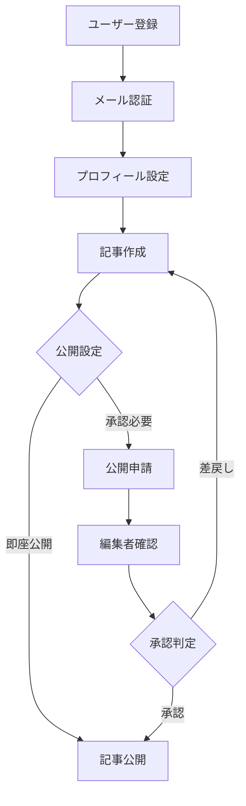
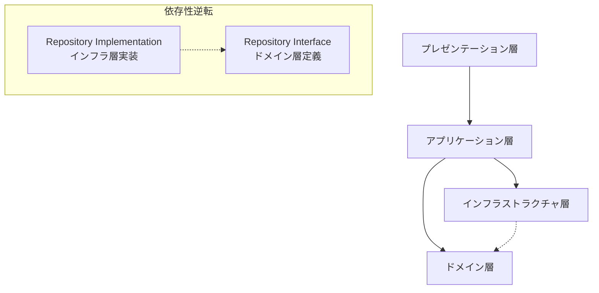

# DDD設計

## 目的

- 仕様整理と全体技術設計を基に、ビジネスロジックとドメイン知識を明確に分離・構造化し、保守性と拡張性の高いソフトウェア設計を実現するため、ドメイン駆動設計の戦術パターンを適用した具体的なドメインモデルとアーキテクチャ層を設計する

## 遵守事項

- **ドメインエキスパートとの密接な協働**：ビジネス専門家との対話を通じてユビキタス言語を確立する
- **戦略的設計から戦術的設計への段階的アプローチ**：境界づけられたコンテキスト→ドメインモデル→アーキテクチャ層の順で設計
- **ドメイン層の純粋性保持**：インフラストラクチャへの依存を排除し、ビジネスルールに集中
- **表形式による設計判断の記録**：エンティティ・値オブジェクト・サービスの分類根拠を明文化
- **実装可能性の検証**：後続のAPI設計・DB設計への制約と指針を明確化

## アウトプット出力先

### 基本方針

DDD設計成果物は、ドメイン知識の中核となるため、`domain-design/` ディレクトリに集約し、後続工程（API設計、DB設計、本実装）からの参照を容易にする。境界づけられたコンテキスト単位でディレクトリを分割し、ドメインの独立性を保つ。

### 出力先ディレクトリ構造

```text
domain-design/
├── strategic-design.md             # 戦略的設計：コンテキストマップ
├── ubiquitous-language.md          # ユビキタス言語辞書
├── user-management/                # ユーザー管理境界づけられたコンテキスト
│   ├── domain-model.md             # ドメインモデル設計
│   ├── entities.md                 # エンティティ設計
│   ├── value-objects.md            # 値オブジェクト設計
│   ├── domain-services.md          # ドメインサービス設計
│   ├── aggregates.md               # 集約設計
│   ├── repositories.md             # リポジトリインターフェース設計
│   └── domain-events.md            # ドメインイベント設計
├── content-management/             # コンテンツ管理境界づけられたコンテキスト
│   ├── domain-model.md             # ドメインモデル設計
│   ├── entities.md                 # エンティティ設計
│   ├── value-objects.md            # 値オブジェクト設計
│   ├── domain-services.md          # ドメインサービス設計
│   ├── aggregates.md               # 集約設計
│   ├── repositories.md             # リポジトリインターフェース設計
│   └── domain-events.md            # ドメインイベント設計
├── shared-kernel/                  # 共有カーネル
│   ├── common-types.md             # 共通型定義
│   ├── shared-events.md            # 共有イベント
│   └── shared-services.md          # 共有サービス
└── diagrams/
    ├── context-map.mmd             # コンテキストマップ
    ├── user-management-model.mmd   # ユーザー管理ドメインモデル図
    ├── content-management-model.mmd # コンテンツ管理ドメインモデル図
    └── aggregate-relationships.mmd # 集約間関係図
```

### ファイル命名規則

- **戦略的設計文書**: `strategic-design.md`, `ubiquitous-language.md`
- **境界づけられたコンテキスト**: `[コンテキスト名]/[設計対象].md`
- **図表ファイル**: `diagrams/[対象名].mmd`
- **共有要素**: `shared-kernel/[共有対象].md`

### 各成果物の保存場所

- **戦略的設計成果物**: `domain-design/` 直下に配置
- **コンテキスト別設計文書**: `domain-design/[コンテキスト名]/` 配下に配置
- **図表ファイル**: `domain-design/diagrams/` 配下に配置
- **共有要素**: `domain-design/shared-kernel/` 配下に配置

## DDD設計の手順

### 1. ドメイン理解とユビキタス言語確立

#### 1.1 状況のヒアリング（ドメインエキスパートとの対話）

**目的**: ドメインの概要、ビジネスルール、時系列処理を整理し、共通理解を構築

**手順**:

1. **ドメインの概要抽出**
   - ビジネスの背景と目的の確認
   - 主要なステークホルダーの特定
   - 現在の業務フローの理解

2. **ビジネスルールの炙り出し**
   - 「〇〇の状況になったときの対応」の整理
   - 処理のタイミングと時系列の把握
   - 例外的な状況の対応方法

3. **重要な概念・用語の抽出**
   - ドメインエキスパートが使用する専門用語
   - 業務で重要な概念や判断基準
   - システム化が必要な業務知識

**成果物**: `domain-understanding/business-rules.md`

**ビジネスルール整理表**:

| 状況・条件 | 対応・処理 | タイミング | 関係者 | ルール詳細 | 例外処理 |
|-----------|----------|-----------|--------|----------|----------|
| ユーザー新規登録時 | メール認証送信 | 即時 | ユーザー、システム | 重複メール禁止 | メール送信失敗時は手動確認 |
| 記事公開申請時 | 承認プロセス開始 | 申請から24時間以内 | 作者、編集者 | 公序良俗チェック必須 | 休日は翌営業日に延期 |
| 支払い期限到達時 | アカウント制限 | 毎日午前0時バッチ | システム、ユーザー | 7日間の猶予期間あり | システム障害時は手動対応 |

#### 1.2 ユビキタス言語の確立

**重要**: BDDテスト実装でも同じユビキタス言語辞書を使用し、プロジェクト全体で統一する

**手順**:

1. **ドメインエキスパートとの語彙整理**
2. **概念の定義と関係性の明確化**
3. **BDDシナリオでの用語統一**
4. **コード・文書・会話での統一使用の徹底**

**成果物**: `glossary/ubiquitous-language.md` （BDDと共通）

**ユビキタス言語辞書の例**:

| 用語 | 定義 | 使用例 | 英語表記 | 同義語・類義語 | 関連概念 | BDDシナリオでの表現 |
|------|------|--------|----------|---------------|----------|---------------------|
| **ユーザー** | システムを利用する人（認証済み）| 「ユーザーが記事を投稿する」 | User | 利用者、メンバー | Account, Profile | Given ユーザーがログイン済みである |
| **記事** | 公開可能なコンテンツの最小単位 | 「記事を下書き状態で保存」 | Article | 投稿、ポスト | Draft, Content | When ユーザーが記事を公開する |
| **公開** | 記事を読者が閲覧可能にする行為 | 「記事の公開申請を行う」 | Publish | リリース、配信 | Publication | Then 記事が公開状態になる |

### 2. ドメインオブジェクトの抽出・分類

#### 2.1 エンティティと値オブジェクトの抽出

**目的**: アクター、概念、データから、アイデンティティの有無に基づく分類を行う

**抽出対象**:

- **アクター**: ユーザー、管理者、外部システム等
- **概念**: 記事、カテゴリ、権限、状態等
- **データ**: メールアドレス、日付、金額、URL等
- **除外**: 〇〇バッチなどシステム自体の構成要素

**分類基準**:

| 分類 | 判定条件 | 例 | なぜこの区別が必要？ |
|------|----------|---|---------------------|
| **エンティティ** | IDで識別、状態変化あり | User, Article, Category | 独立したライフサイクル、データベースでテーブル化 |
| **値オブジェクト** | 値そのものが識別子、不変 | Email, Money, Date | データベースでフィールド化、型安全性の向上 |

**成果物**: `domain-objects/entity-value-classification.md`

**エンティティ・値オブジェクト分類表**:

| 概念 | 分類 | 判定理由 | 主要属性 | 識別方法 | データベース表現 |
|------|------|----------|----------|----------|------------------|
| **User** | エンティティ | 状態変化（アクティブ/非アクティブ）、ライフサイクル | userId, email, status, createdAt | UserId（UUID） | usersテーブル |
| **Article** | エンティティ | 状態変化（下書き/公開）、版管理 | articleId, title, content, status | ArticleId（UUID） | articlesテーブル |
| **Email** | 値オブジェクト | アドレス値のみ、不変 | value | 文字列値 | users.emailフィールド |
| **Money** | 値オブジェクト | 金額と通貨、不変 | amount, currency | 数値+通貨コード | amount, currencyフィールド |

### 3. ユーザー操作と業務フローの整理

#### 3.1 ユーザー操作フローの分析

**手順**:

1. **ユーザー操作の洗い出し**
   - 主要ユーザーストーリーの抽出
   - 操作の開始・終了条件の明確化
   - 正常系・異常系の両方を考慮

2. **運営側業務フローの整理**
   - バックオフィス業務の特定
   - 承認プロセスの詳細化
   - システム自動処理との連携

**成果物**: `business-flows/user-operations.md`

**ユーザー操作フロー例**:



### 4. 関連性と境界の整理

#### 4.1 エンティティ間の関連性分析

**関連性のパターン**:

| 関連性 | 説明 | 例 | 実装方針 |
|--------|------|---|----------|
| **1対1所有** | 一つのエンティティが必ず一つ所有 | User ←→ Profile | 外部キー、必須関連 |
| **1対多所有** | 一つのエンティティが複数所有 | User ←→ Articles | 外部キー、カスケード削除 |
| **多対多関連** | 複数同士の関連 | Article ←→ Tags | 中間テーブル |
| **参照関係** | 他の集約への参照のみ | Article → User（作者） | ID参照のみ、オブジェクト参照禁止 |

**成果物**: `relationships/entity-relationships.md`

### 5. ドメインサービスの抽出

#### 5.1 複数エンティティが関わるロジックの特定

**抽出基準**:

| 条件 | 説明 | 例 | なぜエンティティに含めない？ |
|------|------|---|---------------------------|
| **複数集約操作** | 複数の集約にまたがる処理 | ユーザー重複チェック | 単一エンティティの責務を超える |
| **複雑な計算** | ビジネスルールに基づく計算 | 記事推奨度算出 | エンティティに不要な責務を持ち込まない |
| **外部連携** | 外部システムとの調整 | 重複メール外部確認 | ドメイン純粋性を保持 |

**成果物**: `domain-services/service-extraction.md`

### 6. 境界づけられたコンテキストの定義

#### 6.1 コンテキスト境界の設定

**目的**: 各コンテキストの責務を明確にし、在庫管理のような複雑性を避ける

**境界設定基準**:

| 基準 | 説明 | 判定方法 |
|------|------|----------|
| **責務の独立性** | 独立したビジネス関心事 | チーム分割可能性 |
| **用語の一意性** | 同じ用語が異なる意味を持つ | ユビキタス言語の境界 |
| **変更の独立性** | 変更が他に影響しない | リリース独立性 |

**成果物**: `bounded-contexts/context-definition.md`

### 7. 集約と集約ルートの定義

#### 7.1 集約境界の設定

**集約設計の原則**:

| 原則 | 説明 | 実装指針 |
|------|------|----------|
| **整合性境界** | 集約内の不変条件を常に保証 | トランザクション境界と一致 |
| **集約ルート経由** | 集約への操作は全て集約ルートから | 外部からの直接アクセス禁止 |
| **ID参照原則** | 他集約はIDでのみ参照 | オブジェクト参照禁止 |
| **最小サイズ** | 必要最小限の要素のみ含める | パフォーマンス考慮 |

**成果物**: `aggregates/aggregate-design.md`

### 8. モデル設計（最終成果物）

#### 8.1 設計図の作成

**作成する図表**:

1. **ユースケース図**: アクターと機能の関係
2. **ドメインモデル図**: エンティティと値オブジェクトの関係
3. **集約図**: 集約境界と集約ルートの明示
4. **コンテキストマップ**: 境界づけられたコンテキストの関係
5. **状態遷移図**: 重要エンティティの状態変化

**成果物**: `model-design/` ディレクトリ配下

#### 8.2 TypeScript実装の設計指針

**実装時の必須ルール**:

| ルール | 説明 | 実装例 | 禁止パターン |
|--------|------|--------|-------------|
| **any型禁止** | 型安全性を確保 | `interface User { id: UserId; name: string; }` | `const user: any = ...` |
| **as型アサーション禁止** | 実行時エラーを防止 | `const email = Email.create(value)` | `const email = value as Email` |
| **Non-null assertion禁止** | null/undefined安全性確保 | `if (user) { user.getName() }` | `user!.getName()` |

**ドメインオブジェクトの実装パターン**:

```typescript
// 値オブジェクト実装例
export class Email {
  private constructor(private readonly value: string) {
    if (!this.isValid(value)) {
      throw new Error('Invalid email format');
    }
  }

  static create(value: string): Email {
    return new Email(value);
  }

  getValue(): string {
    return this.value;
  }

  private isValid(value: string): boolean {
    return /^[^\s@]+@[^\s@]+\.[^\s@]+$/.test(value);
  }
}

// エンティティ実装例
export class User {
  constructor(
    private readonly id: UserId,
    private email: Email,
    private status: UserStatus
  ) {}

  changeEmail(newEmail: Email): void {
    if (this.status === UserStatus.INACTIVE) {
      throw new Error('Inactive user cannot change email');
    }
    this.email = newEmail;
  }

  getId(): UserId {
    return this.id;
  }
}

// 集約ルート実装例
export class UserAggregate {
  constructor(
    private user: User,
    private profile: UserProfile
  ) {}

  updateProfile(profileData: ProfileUpdateData): void {
    if (!this.user.isActive()) {
      throw new Error('Cannot update profile for inactive user');
    }
    this.profile.update(profileData);
  }
}
```

### 手順実行時の注意点

#### 段階的実行の重要性

- **各手順は前の手順の成果物を基に実行**
- **ドメインエキスパートとの継続的な対話を維持**
- **BDDシナリオとの整合性を常に確認**（特にユビキタス言語の統一）
- **実装可能性を考慮した現実的な設計**

#### DDD設計とBDDテストの連携

**重要な統合ポイント**:

| 統合項目 | DDD設計での扱い | BDDテストでの扱い | 統一方針 |
|----------|----------------|------------------|----------|
| **ユビキタス言語** | `glossary/ubiquitous-language.md`で定義 | シナリオ記述で使用 | 同一ファイル、同一用語使用 |
| **ドメインルール** | 不変条件として実装 | Given/When/Thenで検証 | ルール名称の統一 |
| **境界づけられたコンテキスト** | 設計境界 | フィーチャーファイル分割 | コンテキスト単位でテスト分類 |

#### 各手順の完了判定

各手順は以下の条件を満たした時点で完了とする:

1. **必要な成果物がすべて作成されている**
2. **ドメインエキスパートの承認を得ている**
3. **BDDシナリオとの整合性が確認されている**
4. **次の手順で必要な入力情報が整っている**

この8段階の手順により、ビジネス要求から実装可能なDDD設計まで、段階的かつ体系的に進めることができる。

**エンティティ分類基準表**:

| 分類基準 | エンティティの条件 | 値オブジェクトの条件 | 判定ポイント |
|----------|-------------------|---------------------|-------------|
| **アイデンティティ** | 一意な識別子を持つ | 属性値の組み合わせで識別 | IDの存在・必要性 |
| **ライフサイクル** | 時間経過で状態変化 | 不変（イミュータブル） | 状態変化の有無 |
| **等価性** | ID比較 | 値比較（構造的等価性） | 比較対象の性質 |
| **共有性** | 参照共有可能 | 値共有（コピー） | 他オブジェクトからの参照方法 |

**ユーザー管理コンテキスト - エンティティ設計例**:

```markdown
| 概念 | 分類 | ID | 理由 | 主要属性 | 主要メソッド | 不変条件 |
|------|------|----|----|----------|-------------|----------|
| **User** | エンティティ | UserId | ライフサイクル持つ<br>状態変化あり | userId, email, profile, status | register(), updateProfile(), deactivate() | ・email一意性<br>・有効な状態のみ操作可能 |
| **Profile** | エンティティ | ProfileId | ユーザーと独立したライフサイクル | profileId, displayName, bio, avatar | updateDisplayName(), changeBio() | ・displayName必須<br>・bio文字数制限 |
| **Email** | 値オブジェクト | なし | アドレス文字列のみ<br>不変 | value | validate(), getDomain() | ・RFC 5322準拠<br>・ドメイン検証 |
| **UserId** | 値オブジェクト | なし | 識別子として使用<br>不変 | value | toString(), equals() | ・UUID形式<br>・null禁止 |
```

#### 2.3 値オブジェクト設計

**値オブジェクト設計原則**:

| 原則 | 説明 | 実装方法 | 例 |
|------|------|----------|---|
| **不変性** | 一度作成したら変更不可 | Immutableクラス、private setter | Email, Money |
| **値による等価性** | 構造的等価性での比較 | equals(), hashCode()実装 | Email("<a@b.com>").equals(Email("<a@b.com>")) |
| **自己検証** | 無効な値での作成を防ぐ | コンストラクタでバリデーション | Email("invalid") → 例外 |
| **振る舞いの表現** | 関連するロジックを内包 | メソッドでビジネスロジック提供 | Money.add(), Email.getDomain() |

**コンテンツ管理コンテキスト - 値オブジェクト設計例**:

```markdown
| 値オブジェクト | 責務 | 属性 | バリデーション | 主要メソッド | 使用箇所 |
|---------------|------|------|---------------|-------------|----------|
| **ArticleTitle** | 記事タイトル表現 | value: string | ・1-100文字<br>・HTML禁止<br>・先頭末尾空白除去 | toString(), length(), isEmpty() | Article.title |
| **ContentBody** | 記事本文表現 | value: string, format: MarkdownFormat | ・最大10万文字<br>・Markdown形式<br>・XSS対策 | toHtml(), extractImages(), getWordCount() | Article.body |
| **PublishDate** | 公開日時表現 | value: DateTime | ・未来日可能<br>・過去1年以内推奨 | isInFuture(), formatForDisplay() | Article.publishedAt |
| **CategorySlug** | カテゴリURLスラグ | value: string | ・半角英数とハイフンのみ<br>・小文字強制<br>・重複禁止 | toUrl(), normalize() | Category.slug |
```

#### 2.4 ドメインサービス設計

**ドメインサービス抽出基準**:

| 条件 | 説明 | 例 |
|------|------|---|
| **複数集約にまたがる処理** | 単一の集約では実現困難 | ユーザー重複チェック（複数Userに関わる） |
| **複雑なビジネスルール** | エンティティに属さない計算処理 | 記事推奨度計算（複数要因の組み合わせ） |
| **外部リソースへの問い合わせ** | ドメイン内での外部システム連携 | 重複メールアドレス外部確認 |
| **ステートレスな操作** | 状態を持たない純粋関数的処理 | パスワード強度計算 |

**ユーザー管理コンテキスト - ドメインサービス設計例**:

```markdown
| サービス名 | 責務 | 入力 | 出力 | 依存関係 | 実装方針 |
|-----------|------|------|------|----------|----------|
| **UserDuplicationCheckService** | ユーザー重複確認 | email: Email | boolean | UserRepository | メールアドレス一意性確認 |
| **PasswordStrengthService** | パスワード強度判定 | password: string | PasswordStrength | なし | 複雑性ルール適用 |
| **UserRoleAssignmentService** | ユーザーロール割り当て | userId: UserId, role: Role | void | UserRepository, RoleRepository | ビジネスルールに基づく権限付与 |
| **AccountActivationService** | アカウント有効化 | activationToken: Token | User | UserRepository, EmailService | トークン検証と状態変更 |
```

#### 2.5 集約設計

**集約設計原則**:

| 原則 | 説明 | 実装指針 |
|------|------|----------|
| **不変条件の境界** | 集約は不変条件を保護する境界 | トランザクション境界と一致させる |
| **最小単位の原則** | 必要最小限の要素のみ含める | パフォーマンスと整合性のバランス |
| **ルート経由アクセス** | 集約ルート以外は直接アクセス禁止 | リポジトリは集約ルートのみ提供 |
| **IDによる参照** | 他集約はIDでのみ参照 | オブジェクト参照を避ける |

**集約境界設定表**:

| 集約名 | 集約ルート | 含まれる要素 | 不変条件 | 他集約との関係 | 設計根拠 |
|--------|------------|-------------|----------|---------------|----------|
| **User集約** | User | User, Profile, UserPreferences | Profile必須存在、有効ユーザーのみProfile更新可能 | IDによる参照のみ | ユーザー情報の整合性保護 |
| **Article集約** | Article | Article, ArticleRevision, ArticleMetadata | 公開記事は削除不可、リビジョン履歴保持必須 | UserIdで作者参照 | 記事版数管理とライフサイクル保護 |
| **Category集約** | Category | Category, CategoryHierarchy | 親カテゴリ存在必須、循環参照禁止 | ArticleIdで記事参照 | カテゴリ階層整合性保護 |

#### 2.6 リポジトリインターフェース設計

**リポジトリ設計原則**:

| 原則 | 説明 | 実装方針 |
|------|------|----------|
| **集約単位での操作** | 集約ルートごとにリポジトリ定義 | 1集約1リポジトリの原則 |
| **ドメイン層定義** | インフラストラクチャに依存しない | インターフェースはドメイン層 |
| **ドメイン言語使用** | ドメインの語彙で操作を表現 | findActiveUsers(), findPublishedArticles() |
| **永続化抽象化** | データストア技術から独立 | RDBとNoSQLの切り替え可能 |

**ユーザー管理コンテキスト - リポジトリインターフェース例**:

```typescript
// domain-design/user-management/repositories.md の内容例

interface UserRepository {
  // 基本CRUD操作
  save(user: User): Promise<void>
  findById(userId: UserId): Promise<User | null>
  delete(userId: UserId): Promise<void>

  // ドメイン固有クエリ
  findByEmail(email: Email): Promise<User | null>
  findActiveUsers(): Promise<User[]>
  findByRole(role: Role): Promise<User[]>

  // 集約整合性サポート
  existsByEmail(email: Email): Promise<boolean>
  countActiveUsers(): Promise<number>
}

interface ArticleRepository {
  save(article: Article): Promise<void>
  findById(articleId: ArticleId): Promise<Article | null>

  // ドメイン固有クエリ
  findPublishedArticles(): Promise<Article[]>
  findDraftsByAuthor(authorId: UserId): Promise<Article[]>
  findByCategory(categoryId: CategoryId): Promise<Article[]>

  // 複雑な条件検索
  findBySearchCriteria(criteria: ArticleSearchCriteria): Promise<Article[]>
}
```

### 3. ドメインイベント設計

**ドメインイベント設計原則**:

| 原則 | 説明 | 実装方針 |
|------|------|----------|
| **過去分詞命名** | 発生した事実を表現 | UserRegistered, ArticlePublished |
| **不変オブジェクト** | 一度発生したら変更不可 | Immutableなイベントクラス |
| **境界越えの通知** | 他のコンテキストへの影響通知 | 非同期メッセージング |
| **監査ログ対応** | ドメインの重要な変更を記録 | イベントストア保存 |

**ドメインイベント設計表**:

| イベント名 | 発生契機 | ペイロード | 影響範囲 | 処理方式 | 用途 |
|-----------|----------|-----------|----------|----------|------|
| **UserRegistered** | ユーザー新規登録 | userId, email, registeredAt | 通知管理コンテキスト | 非同期 | ウェルカムメール送信 |
| **ArticlePublished** | 記事公開 | articleId, authorId, publishedAt | 通知管理、検索エンジン | 非同期 | 読者通知、インデックス更新 |
| **UserDeactivated** | ユーザー無効化 | userId, deactivatedAt, reason | 全コンテキスト | 同期 | アクセス即座無効化 |
| **CategoryCreated** | カテゴリ作成 | categoryId, name, parentId | コンテンツ管理 | 同期 | 階層構造更新 |

### 4. アーキテクチャ層設計

#### 4.1 DDD標準4層アーキテクチャ

```markdown
| 層 | 責務 | 含まれる要素 | 依存関係 | 制約事項 |
|---|------|-------------|----------|----------|
| **プレゼンテーション層** | ユーザーインターフェース、API制御 | Controller, View, DTO, Validator | アプリケーション層のみ | HTTPリクエスト/レスポンス変換 |
| **アプリケーション層** | ユースケース調整、トランザクション管理 | UseCase, ApplicationService, Command, Query | ドメイン層、インフラ層 | ドメインロジック記述禁止 |
| **ドメイン層** | ビジネスルール、ドメイン知識 | Entity, ValueObject, DomainService, Repository(IF) | なし（純粋） | 外部依存禁止 |
| **インフラストラクチャ層** | 永続化、外部システム連携 | RepositoryImpl, Database, ExternalAPI | ドメイン層（実装時） | ドメイン层インターフェース実装 |
```

#### 4.2 依存関係の方向制御

**依存性逆転の原則適用**:



## 完了判定基準

### 必須要件

- **境界づけられたコンテキスト明確化**: 責務境界と関係性が表形式で整理されている
- **ユビキタス言語確立**: 専門用語の定義と使用方法が統一されている
- **エンティティ・値オブジェクト分類**: 分類根拠が表形式で明文化されている
- **集約境界設定**: 不変条件に基づく集約設計が完了している
- **リポジトリインターフェース定義**: ドメイン層での抽象化が完了している
- **ドメインイベント設計**: 重要な業務イベントが定義されている
- **アーキテクチャ層構造**: 4層アーキテクチャでの役割分担が明確化されている

### 品質要件

- **実装可能性**: 後続のAPI設計・DB設計に具体的な制約と指針を提供
- **保守性**: ドメイン知識の変更がコードに反映しやすい構造
- **拡張性**: 新しい機能追加時の影響範囲が限定的
- **テスタビリティ**: 単体テストが容易な責務分離

### 文書品質要件

- **表形式の活用**: 設計判断の根拠が表形式で整理されている
- **図表による可視化**: UMLやMermaidでの構造表現が適切
- **トレードオフの明示**: 設計選択の理由と代替案比較が記載
- **実装サンプル**: TypeScriptでのインターフェース例が提供

## 完了後の必須アクション

1. **直ちに**ユーザーに「DDD設計成果物」のレビューを依頼する
2. **ADR作成判断**: 重要なドメインモデリング決定について、ADRでの記録をユーザーに提案する
3. **次工程の判断**をユーザーに委ねる：
   - 通常フロー：「API設計」または「DB設計」に進む
   - 戻りフロー：仕様見直しが必要な場合は「仕様整理」に戻る
   - 並行フロー：要件が明確な場合は「BDDテスト実装」を並行実施
4. ユーザーの明示的な承認を得てから指定された工程に進む
