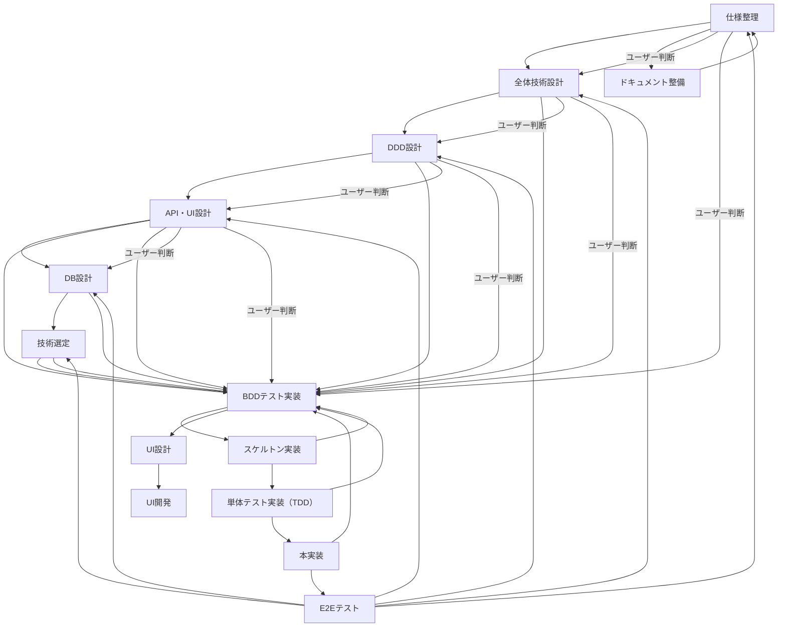

# 開発ワークフロー

## サマリ

## 実行原則

- **段階的承認必須**: 各工程完了後、必ずユーザーレビュー→承認→次工程移行
- **省略・独断禁止**: ワークフロー省略禁止、線形フローから外れる場合はユーザー承認必須
- **機能単位開発**: 小さな機能単位に分解して積み上げ式開発
- **工程完了時**: レビュー依頼→ADR作成判断→次工程判断→ユーザー承認のサイクル

## 工程間遷移ルール

### BDD遷移条件（ユーザー承認必須）

以下の条件に該当する場合、BDDテスト実装工程への遷移を推奨：

- **要件不明確時**: ユーザーストーリーやビジネスルールが曖昧で実例検証が必要
- **複雑なビジネスルール**: ドメインロジックが複雑で仕様検証が困難  
- **技術制約の影響**: 選定技術の制約により要件調整が必要
- **外部システム連携**: 外部API・サービス連携の動作確認が必要

### 遷移時の必須手順

1. **中断理由明確化**: 現工程の中断理由をユーザーに報告
2. **遷移効果説明**: BDD遷移の必要性と期待効果を説明
3. **承認取得**: ユーザーの明示的承認を得てから移行
4. **戻り先合意**: BDD完了後の戻り先工程をユーザーと合意

### ADR作成タイミング

重要な技術・設計決定時にユーザーに提案：
- アーキテクチャパターン選定
- 技術スタック選定（フレームワーク、DB等）
- 設計方針決定（API設計、データモデル等）
- 非機能要件対応方針

詳細手順: `./adr-management.md` 参照

## フロー詳細

### 1. 仕様整理

- **必須要件**：新機能を開始したら直ちにユーザーストーリーと成功／失敗パターンを整理せよ
- **参照必須の文書**：./specification.md
- **完了判定基準**：
  - ユーザーストーリーが4W1Hで記述されている
  - 成功／失敗パターンがRESTステータスと振る舞いで明示されている
- **完了後の必須アクション**：
  1. **直ちに**ユーザーに「仕様整理結果」のレビューを依頼する
  2. **ADR作成判断**：重要な要件決定や制約がある場合、ADRでの記録をユーザーに提案する
  3. **次工程の判断**をユーザーに委ねる：
     - 通常フロー：「全体技術設計」に進む
     - BDD遷移：要件不明確等の理由でBDDテスト実装に遷移
  4. ユーザーの明示的な承認を得てから指定された工程に進む

### 2. 全体技術設計

- **前提条件**：仕様整理のユーザー承認完了
- **必須要件**：同期API vs Pub/Sub、モノリス vs マイクロサービス、DB種別選定などを明確に定義せよ
- **参照必須の文書**：./architecture.md
- **完了判定基準**：
  - 選定したアーキテクチャパターンが図示されている
  - **技術的トレードオフと理由が箇条書きで示されている**
  - **全ての技術選定が表形式で比較検討されている**
  - **アーキテクチャ全体での位置づけが確認されている**
- **完了後の必須アクション**：
  1. **直ちに**ユーザーに「アーキテクチャ設計案」のレビューを依頼する
  2. **ADR作成判断**：アーキテクチャパターン選定等の重要決定について、ADRでの記録をユーザーに提案する
  3. **次工程の判断**をユーザーに委ねる：
     - 通常フロー：「DDD設計」に進む
     - BDD遷移：技術制約等の理由でBDDテスト実装に遷移
  4. ユーザーの明示的な承認を得てから指定された工程に進む

### 3. ドメイン設計（DDD）

- **前提条件**：全体技術設計のユーザー承認完了
- **必須要件**：BC、エンティティ／VO／ドメインサービス、ユースケースI/Fを設計せよ
- **参照必須の文書**：./ddd-design.md
- **完了判定基準**：
  - エンティティ・VOが型定義付きで示されている
  - ドメインサービスおよびリポジトリI/Fがインターフェースで定義されている
- **完了後の必須アクション**：
  1. **直ちに**ユーザーに「DDDモデル図とI/F設計」のレビューを依頼する
  2. **ADR作成判断**：ドメインモデル設計やコンテキスト分離等の重要決定について、ADRでの記録をユーザーに提案する
  3. **次工程の判断**をユーザーに委ねる：
     - 通常フロー：「API設計」に進む
     - BDD遷移：複雑なビジネスルール等の理由でBDDテスト実装に遷移
  4. ユーザーの明示的な承認を得てから指定された工程に進む

### 4. API設計

- **前提条件**：DDD設計のユーザー承認完了
- **必須要件**：ドメインモデルに基づく詳細なAPI仕様を作成し、OpenAPI形式で文書化せよ
- **参照必須の文書**：./api-design.md
- **完了判定基準**：
  - OpenAPI 3.0仕様書が作成されている
  - 全エンドポイントのリクエスト/レスポンス構造が定義されている
  - エラーハンドリングとHTTPステータスコードが明示されている
  - バリデーションルールが詳細に記述されている
- **完了後の必須アクション**：
  1. **直ちに**ユーザーに「API設計仕様書」のレビューを依頼する
  2. **ADR作成判断**：API設計方針やエラーハンドリング戦略等の重要決定について、ADRでの記録をユーザーに提案する
  3. **次工程の判断**をユーザーに委ねる：
     - 通常フロー：「DB設計」に進む
     - BDD遷移：API設計の複雑さ等の理由でBDDテスト実装に遷移
  4. ユーザーの明示的な承認を得てから指定された工程に進む

### 5. DB設計

- **前提条件**：API設計のユーザー承認完了
- **必須要件**：エンティティ／VOに基づくテーブルスキーマを設計せよ
- **参照必須の文書**：./db-design.md
- **完了判定基準**：
  - ER図が作成されている
  - マイグレーションファイルの雛形が生成されている
- **完了後の必須アクション**：
  1. **直ちに**ユーザーに「DB設計結果」のレビューを依頼する
  2. **ADR作成判断**：データモデル設計やスキーマ設計等の重要決定について、ADRでの記録をユーザーに提案する
  3. **次工程の判断**をユーザーに委ねる：
     - 通常フロー：「技術選定」に進む
     - BDD遷移：データ整合性の複雑さ等の理由でBDDテスト実装に遷移
  4. ユーザーの明示的な承認を得てから指定された工程に進む

### 6. 技術選定

- **前提条件**：DB設計のユーザー承認完了
- **必須要件**：neverthrowやORM、バリデーションライブラリなどを選定せよ
- **参照必須の文書**：./tech-selection.md
- **完了判定基準**：
  - **選定ライブラリとバージョン、理由が表形式で示されている**
  - **比較検討表でトレードオフが明示されている**
  - プロジェクト要件を満たすことが明確になっている
- **完了後の必須アクション**：
  1. **直ちに**ユーザーに「技術選定リスト」のレビューを依頼する
  2. **ADR作成判断**：フレームワーク、ライブラリ、データベース等の技術スタック選定について、ADRでの記録をユーザーに提案する
  3. **次工程の判断**をユーザーに委ねる：
     - 通常フロー：「BDDテスト実装」に進む
     - 戻りフロー：技術制約による要件調整で前工程に戻る
  4. ユーザーの明示的な承認を得てから指定された工程に進む

### 7. BDDテスト実装

- **前提条件**：技術選定のユーザー承認完了
- **必須要件**：E2Eおよびドメイン結合シナリオをGherkin形式で記述し、選定したBDDフレームワークで実装せよ
- **参照必須の文書**：./bdd-implementation.md
- **完了判定基準**：
  - 全シナリオがGherkin形式（Given-When-Then）で記述されている
  - Step Definitionsが実装され、テストがコンパイル・実行可能になっている
  - BDDテスト実行時に全シナリオがRedで失敗している
- **完了後の必須アクション**：
  1. **直ちに**ユーザーに「BDDテストコード」のレビューを依頼する
  2. **ADR作成判断**：BDDフレームワーク選定やテスト戦略等の重要決定について、ADRでの記録をユーザーに提案する
  3. **次工程の判断**をユーザーに委ねる：
     - 通常フロー：「スケルトン実装」に進む
     - 戻りフロー：BDD結果に基づく要件見直しで前工程に戻る
  4. ユーザーの明示的な承認を得てから指定された工程に進む

### 8. スケルトン実装

- **前提条件**：BDDテスト実装のユーザー承認完了
- **必須要件**：APIルートやメッセージハンドラの骨組みを実装し、BDDテストが依然としてRedであることを確認せよ
- **参照必須の文書**：./skeleton.md
- **完了判定基準**：
  - スケルトンコードがコンパイルし、BDDテストがすべてRedであること
- **完了後の必須アクション**：
  1. **直ちに**ユーザーに「スケルトン実装コード」のレビューを依頼する
  2. **ADR作成判断**：アーキテクチャパターン実装やコンポーネント構造等の重要決定について、ADRでの記録をユーザーに提案する
  3. **次工程の判断**をユーザーに委ねる：
     - 通常フロー：「単体テスト実装」に進む
     - BDD遷移：実装課題発見によるBDDテスト再実装
  4. ユーザーの明示的な承認を得てから指定された工程に進む

### 9. 単体テスト実装 (TDD)

- **前提条件**：スケルトン実装のユーザー承認完了
- **必須要件**：TDDで単体テストを実装しGreen化せよ
- **参照必須の文書**：./unit-testing.md
- **完了判定基準**：
  - 全てのユニットテストがGreenで通過している
  - カバレッジが95%以上達成している
- **完了後の必須アクション**：
  1. **直ちに**ユーザーに「単体テスト結果」のレビューを依頼する
  2. **ADR作成判断**：テストフレームワーク選定やモック戦略等の重要決定について、ADRでの記録をユーザーに提案する
  3. **次工程の判断**をユーザーに委ねる：
     - 通常フロー：「本実装」に進む
     - BDD遷移：テスト課題発見によるBDDテスト見直し
  4. ユーザーの明示的な承認を得てから指定された工程に進む

### 10. 本実装

- **前提条件**：単体テスト実装のユーザー承認完了
- **必須要件**：アプリケーションおよびAPIルートへ組み込み、本実装を完了せよ
- **参照必須の文書**：./implementation.md
- **完了判定基準**：
  - 全てのBDDテストがGreenで通過している
  - OpenAPIドキュメントが更新されている
- **完了後の必須アクション**：
  1. **直ちに**ユーザーに「本実装結果」のレビューを依頼する
  2. **ADR作成判断**：アーキテクチャパターン実装やパフォーマンス最適化等の重要決定について、ADRでの記録をユーザーに提案する
  3. **次工程の判断**をユーザーに委ねる：
     - 通常フロー：「E2Eテスト」に進む
     - BDD遷移：実装課題発見によるBDDテスト見直し
  4. ユーザーの明示的な承認を得てから指定された工程に進む

### 11. E2Eテスト要件策定 & 実行

- **前提条件**：本実装のユーザー承認完了
- **必須要件**：フロントからバックエンドまでのユーザーフローをカバーするE2Eシナリオを記述・実行せよ
- **参照必須の文書**：./e2e-testing.md
- **完了判定基準**：
  - 全てのE2EテストがGreenで成功している
- **完了後の必須アクション**：
  1. **直ちに**ユーザーに「E2Eテスト結果」のレビューを依頼する
  2. **ADR作成判断**：E2Eテストフレームワーク選定やテスト戦略等の重要決定について、ADRでの記録をユーザーに提案する
  3. **次工程の判断**をユーザーに委ねる：
     - 完了：開発完了
     - 戻りフロー：E2E結果に基づく要件見直しで前工程に戻る
  4. ユーザーの明示的な承認を得て作業を終了または継続する

上記ワークフローを一切省略せず実行すること。

----

## 新規タスク追加、工程のドキュメント時の対応

各工程のドキュメントが存在しなかったあるいは新規にワークフローの工程を増やす場合は ./docs.md の内容に従ってドキュメントを追加すること。
追加後はユーザのレビューを経て、本ドキュメントに工程を追加すること。
