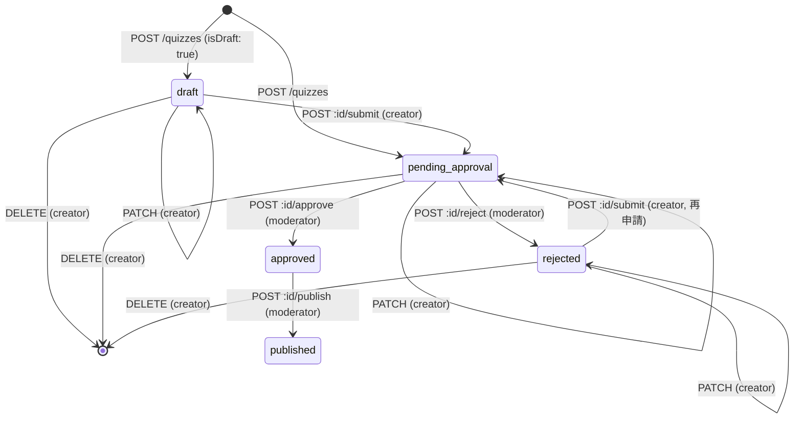

# ADR-0027: クイズ下書き・公開ステータスモデルと承認ワークフローの実装方針

## Status

Proposed

## Context

### Background

issue #46「api: quiz-management 書き込み系完成」は、`PATCH /quizzes/:id` / `DELETE /quizzes/:id` の 501 解消に加え、下書き保存（`isDraft: true`）・公開（`POST /quizzes/:id/publish`）・承認フロー（approve/reject）の実装を求めている。

しかし現状の `QuizStatus`（`api/spec/common/types.tsp`、`domain/entities/quiz-summary/quiz-summary-schema.ts`、`api/migrations/quiz-db/0001_initial.sql` の CHECK 制約）は `pending_approval | approved | rejected` の3値のみで、`draft` と `published` が存在しない。一方 `docs/project/api-design/api-catalog/01-quiz-management.md`（source of truth・変更禁止）は

```typescript
status: 'draft' | 'pending_approval' | 'approved' | 'rejected' | 'published';
```

および `POST /quizzes/:id/{approve,reject,publish}` を既に規定しており、実装と設計文書が矛盾した状態にある。この矛盾を解消しない限り issue #46 の完了条件（下書き保存・公開）を満たせない。

また `api/spec/operations/quiz-management.tsp` には `submitForApproval` / `approveQuiz` / `rejectQuiz` / `publishQuiz` の4操作が「初期リリース版では未実装」としてコメントアウトされたまま存在しており、有効化に伴い次の付随課題が生じる。

- 承認・却下・公開を実行できるユーザーを制限する仕組みが存在しない（管理者ロール・認可の概念が未実装）
- 所有者確認に使う識別子（`c.var.userFingerprint`）と D1 の `Quiz.creator_id`（`UserIdentity.id` への INTEGER FK）の間に、ADR-0026 で「後続PR」とされた `resolveUserIdentity` が未実装のまま挟まる
- `UpdateQuizRequest`（TypeSpec）は `question / answerType / solution / explanation / tags / creatorId` を含むが、D1 実装が更新できるのは `question / explanation / status / approved_at` の4カラムのみで、契約と実装が既に乖離している

### Drivers

- `docs/project/api-design/api-catalog/01-quiz-management.md`（source of truth）の5値ステータス宣言・動詞API規定
- ADR-0025（更新系エンドポイントのHTTPメソッド方針）: 「複数ステップの業務処理・状態遷移 → POST 動詞API」という判断基準
- ADR-0026（匿名ユーザー識別方式選定）: `UserIdentity` 解決を後続PRへ委譲した経緯
- `docs/project/ddd-design/2.09_bounded-context-definition/quiz-management-context.md`: `isPublishable(): status === Approved` という既存のドメインルール
- issue #46 のスコープ外宣言: 「管理者承認UIはスコープ外（DB直接操作で運用）」

## Decision

### Chosen Option

**QuizStatus を5値（`draft | pending_approval | approved | rejected | published`）に拡張し、状態遷移は正規フロー `draft → submit → pending_approval → {approve→approved, reject→rejected} → publish → published` の1本に統一する。**

状態遷移図:



issue本文の「`POST /quizzes/:id/publish` 実装（下書き→公開）」という表現は、`publish` 単体の遷移ではなく**フロー全体の呼称**と解釈する。`publish` 単体の遷移元は `approved` に限定し、`docs/project/ddd-design/.../quiz-management-context.md` の既存ルール `isPublishable(): status === Approved` を尊重する。

不変条件: `status ∈ {approved, published}` のとき `approvedAt` は必須。`canBeUpdated() = status ∈ {draft, pending_approval, rejected}`。`canBeDeleted() = status ∉ {approved, published}`。

**付随する3つの暫定方針**（本ADRで確定し、恒久対応は Neutral 節のフォローアップへ）:

1. **所有者確認**: `c.var.userFingerprint` を `Quiz.creatorId` としてそのまま保存・比較する。`UserIdentity` への解決（ADR-0026 の未完了 Action Item）は行わない。
2. **モデレーション権限**: 管理者ロールが存在しないため、`approve` / `reject` / `publish` は `NODE_ENV !== "production"` の場合のみ許可し、本番では `QuizAdminOnlyError`（403）を返す。issue の「初期はDB直接操作前提」を、本番ではAPI経路を閉じ運用者がDBを直接操作する形で実現する。
3. **`UpdateQuizRequest` の縮小**: `{ question?: string; explanation?: string }` の2フィールドに縮小する。D1実装が対応していない `solution` / `answerType` / `tags` / `creatorId` の更新はサポートしない。

### Alternatives Considered

| 選択肢 | メリット | デメリット | 評価 |
|--------|----------|------------|------|
| `QuizStatus` を3値のまま `is_draft` boolean を追加 | マイグレーションがカラム追加のみで軽量 | `published` を表現できず `publish` の遷移先が無い。ライフサイクルの真実が `status` と `is_draft` の2箇所に分裂する。api-catalog の5値宣言と恒久的に乖離する | ★ |
| `draft` のみ追加した4値（`published` は `approved` のまま） | マイグレーションが小さい | `publish` が「approved→approved」の無意味な操作になり、issue の「公開」が実現できない | ★ |
| **QuizStatus を5値に拡張し正規フローを1本化** | api-catalog（source of truth）と整合。既存の `isPublishable()` ルールを保持したまま `publish` に意味を持たせられる。遷移表を単一の `as const satisfies` オブジェクトに集約でき `test.each` で全遷移を網羅テストできる | SQLite は CHECK 制約を ALTER できずテーブル再作成マイグレーションが必要 | ★★★ |
| approve/reject/publish を無認可のまま公開する | 実装が単純 | 認証機構が無い状態で誰でもクイズを承認・公開できてしまい、本番運用上の危険が大きい | ★ |
| `ADMIN_TOKEN` シークレットによる認可 | 無認可よりは安全 | wrangler secrets 運用・env定義・ドキュメントが増え、issueスコープ外の設定サーフェスを持ち込む。将来のロール導入時に二重管理になる | ★★ |
| **`NODE_ENV !== "production"` によるモデレーションガード** | 判定が1関数に閉じ `test.each` で網羅テスト可能。本番の危険を塞ぎつつ開発・BDD環境では動作検証できる。将来ロール導入時にこの1関数を差し替えるだけで済む | 本番では暫定的にAPI経由の承認ができない（issueの意図通りDB直接操作前提） | ★★★ |
| `UpdateQuizRequest` を維持し未対応フィールドを暗黙に無視 | 契約を変更しない | 「送ったのに更新されない」という最悪のUXになる | ★ |
| **`UpdateQuizRequest` を実装可能な範囲に縮小** | 契約と実装が一致し、送ったフィールドは必ず反映される | `solution`/`tags` 等の更新機能は別issueに先送りになる | ★★★ |

## Consequences

### Positive

- `docs/project/api-design/api-catalog/01-quiz-management.md` と実装・TypeSpecが整合する
- クイズのライフサイクル全体（作成→下書き→申請→承認/却下→公開→削除）がAPIとして完結する
- 状態遷移規則が単一のデータ構造に集約され、`test.each` による網羅テストが書ける
- モデレーション権限の判定が1関数に閉じ、将来のロール導入時の変更コストが小さい

### Negative

- SQLite の CHECK 制約は ALTER できないため、`api/migrations/quiz-db/0002_*.sql` でテーブル再作成マイグレーションが必要になる
- `UpdateQuizRequest` の契約が縮小し、`solution` / `tags` / `answerType` の更新は当面できない（フォローアップissueへ）
- 本番環境では approve/reject/publish がAPI経由で実行できず、DB直接操作が前提のまま残る（issueの意図通りだが、恒久的な運用ではない）

### Neutral

- `c.var.userFingerprint` を `creatorId` として直接使う暫定措置は、`UserIdentity` 解決実装（ADR-0026 の未完了 Action Item）が入るまで継続する
- D1書き込み経路（`CreateQuizUseCase` が `Date.now().toString()` をINTEGER PKに、fingerprint文字列をINTEGER FKに入れている不整合）は本ADRのスコープ外。別issueで扱う
- 論理削除（`deleted_at` カラム追加）は本ADRのスコープ外。DELETEは物理削除のまま運用する
- `ApprovalRequest.decision` / `publishImmediately`、`ChangeQuizStatusCommand.reviewerNotes` は受け取るが実装では記録先カラムが無いため未使用。`decision` のみエンドポイントのverbと矛盾する値を送ると400で拒否する（送ったのに逆の結果になる事故を防ぐため）。`reviewerNotes` / `publishImmediately` は現状黙って無視される
- dev/staging環境では `isModerator` の判定が `NODE_ENV` のみに基づくため、**作成者が自分のクイズを承認・公開できる（自己承認を防いでいない）**。管理者ロールが無い現状の暫定措置であり、ロールベース認可導入時に解消する

### Risks and Mitigation

| リスク | 発生確率 | 影響度 | 対策 |
|--------|----------|--------|------|
| `NODE_ENV` の判定漏れにより本番でモデレーションAPIが開いてしまう | 低 | 高 | `moderation-policy.ts` に判定を1箇所へ集約し、unitテストで `test.each` により全NODE_ENV値を検証する |
| `is_draft` ではなく `status` 拡張を選んだことで、将来ステータスが増えた際にCHECK制約の再マイグレーションが繰り返し必要になる | 中 | 低 | 状態遷移規則を `quiz-status-transition.ts` に一元化しておき、追加時の変更箇所を最小化する |

## Implementation Notes

### Action Items

- [x] `api/spec/common/types.tsp`: `QuizStatus` enum に `draft` / `published` を追加
- [x] `api/spec/models/quiz.tsp`: `CreateQuizRequest.isDraft?: boolean`、`UpdateQuizRequest` を2フィールドに縮小、`ApprovalRequest.publishImmediately` のデフォルト値を削除
- [x] `api/spec/operations/quiz-management.tsp`: `submitForApproval` / `approveQuiz` / `rejectQuiz` / `publishQuiz` のコメントアウト解除、戻り型を `QuizResponse` に統一（承認ワークフローには `ValidationError` も追加）
- [x] `api/migrations/quiz-db/0002_quiz_status_add_draft_published.sql`: テーブル再作成によるCHECK制約拡張。D1ではPRAGMA foreign_keys/defer_foreign_keysがQuizTag/Attemptのような子行を持つ状態でのDROP TABLEを防げないため、子テーブルを一時退避して作り直す方式を採用（実機検証済み）
- [x] `domain/entities/quiz-summary/quiz-status-transition.ts`: 遷移表と純関数の実装
- [x] `infrastructure/repositories/MockQuizStore.ts`: BDDのリクエストを跨いだ永続化用の共有ストア（unitテストは従来どおり独立）
- [x] `application/use-cases/{UpdateQuiz,DeleteQuiz,ChangeQuizStatus}UseCase.ts`: ユースケース3本と共通エラーマッピング（`quiz-repository-error-mapping.ts`）
- [x] `presentation/policies/moderation-policy.ts`: `canModerate(env)` の実装（許可リスト方式でfail-closed）
- [x] `presentation/controllers/QuizWriteController.ts` / `quiz.routes.ts`: 書き込み系6メソッドと動詞ルート登録
- [x] `docs/project/ddd-design/2.09_bounded-context-definition/quiz-management-context.md`: `QuizStatusValue` を5値に更新（集約の疑似コード自体の全面更新は #78 へ）
- [ ] 将来: `UserIdentity` 解決の実装（ADR-0026 の後続PR）に伴い `creatorId` の暫定措置を解消する
- [ ] 将来: `UpdateQuizRequest` への `solution` / `tags` 対応を別issueで検討する（#74）
- [ ] 将来: モデレーション権限をロールベースの認可に置き換え、自己承認（作成者が自分のクイズを承認・公開できる）を防ぐ

### Timeline

- **決定日**: 2026-08-15
- **実装開始**: 2026-08-15
- **完了予定**: issue #46 のPRマージ時

## References

- issue #46
- ADR-0025（更新系エンドポイントのHTTPメソッド方針）
- ADR-0026（匿名ユーザー識別方式選定）
- `docs/project/api-design/api-catalog/01-quiz-management.md`
- `docs/project/ddd-design/2.09_bounded-context-definition/quiz-management-context.md`

---

**Created**: 2026-08-15
**Last Updated**: 2026-08-15
**Authors**: Claude (Sonnet 5, background session)
**Reviewers**: [@tanacchi](https://github.com/tanacchi)
