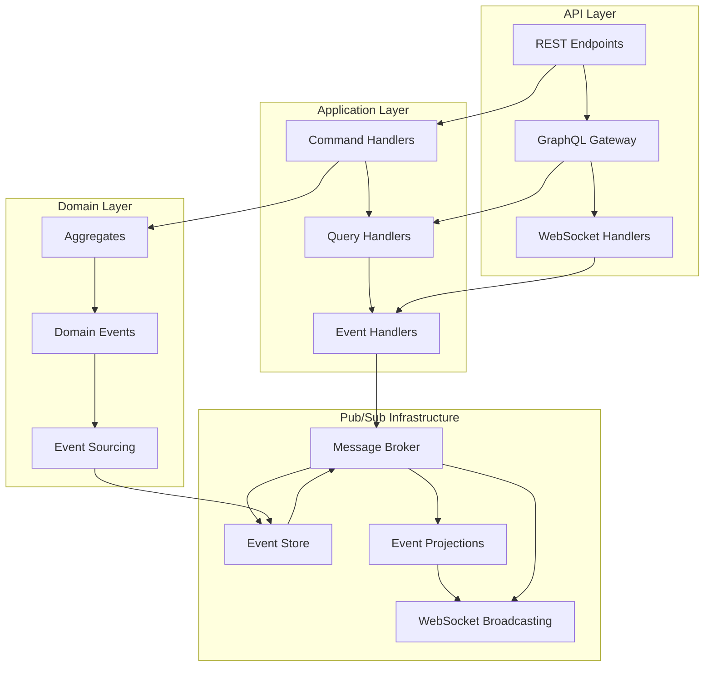

# Pub/Sub システム統合設計

## 目的

Your QuizアプリケーションにおけるPub/Subシステムの設計を定義し、4つの境界づけられたコンテキスト間の疎結合な非同期統合を実現する。

## なぜPub/Subが必要か

### 本プロジェクト固有の課題

#### 1. 匿名ユーザーの複雑な状態管理

- **デバイス間連携**: 同一ユーザーが複数デバイスで学習・投稿
- **一時的アイデンティティ**: JWTトークンによる軽量認証とデータ整合性
- **作成者権限の柔軟な管理**: デバイス変更時の権限引き継ぎ

#### 2. オフライン→オンライン同期の複雑性

- **競合解決**: 同一データの複数デバイス更新
- **バッチ同期**: 大量データの効率的な同期処理
- **状態不整合の解決**: オフライン中の状態変化への対応

#### 3. リアルタイム機能の要求

- **学習進捗のリアルタイム表示**: セッション中の即座フィードバック
- **承認通知**: クイズ投稿→承認→通知の非同期フロー
- **推奨システムの動的更新**: 学習履歴に基づく即座推奨更新

#### 4. 4つの境界づけられたコンテキスト間の疎結合統合

- **Quiz Management**: クイズ作成・承認管理
- **Quiz Learning**: 学習セッション・Deck管理
- **User Session**: 匿名認証・権限管理
- **Offline Sync**: 同期・競合解決

## 参照ドキュメント

- [ドメインイベントカタログ](../ddd-design/2.10_domain-events-catalog/domain-events-catalog.md) - イベント定義・分類
- [境界づけられたコンテキスト](../ddd-design/2.09_bounded-context-definition/README.md) - コンテキスト境界
- [API機能カタログ](api-catalog.md) - API エンドポイント仕様
- [API設計ガイドライン](../../instructions/shared/workflow/04.02_api-design.md) - 設計原則・命名規約

## システム設計概要

### アーキテクチャ概要

### 基本パターン

#### Command-Event-Query分離

- **Command**: 状態変更操作（同期処理）
- **Event**: ドメイン状態変化の記録（非同期処理）
- **Query**: 読み取り専用操作（プロジェクション活用）

## Publisher/Subscriber設計

### Publisher マッピング表

| Publisher（発行者） | 担当コンテキスト | 発行イベント | 発行条件 | 発行頻度 | 備考 |
|------------------|--------------|------------|----------|---------|------|
| QuizService | Quiz Management | QuizSubmitted | REST API: POST /api/quiz/v1/manage/quizzes | 低頻度（~10/日） | 作成者によるクイズ投稿 |
| QuizService | Quiz Management | QuizApproved | 管理者承認操作 | 低頻度（~5/日） | 手動承認プロセス |
| QuizService | Quiz Management | QuizPublished | 承認完了後の自動公開 | 低頻度（~5/日） | 検索インデックス更新トリガー |
| SessionService | Quiz Learning | SessionStarted | REST API: POST /api/quiz/v1/learning/sessions | 高頻度（~1000/日） | 学習開始時 |
| SessionService | Quiz Learning | AnswerSubmitted | REST API: POST /api/quiz/v1/learning/sessions/:id/answers | 高頻度（~10000/日） | 回答提出時 |
| SessionService | Quiz Learning | SessionCompleted | セッション終了条件達成 | 高頻度（~800/日） | 全問回答完了時 |
| SyncService | Offline Sync | DataCached | オフライン用データ保存 | 中頻度（~100/日） | ユーザーリクエスト時 |
| SyncService | Offline Sync | SynchronizationStarted | オンライン復帰検出 | 中頻度（~200/日） | ネットワーク復旧時 |
| SyncService | Offline Sync | SynchronizationCompleted | 同期処理完了 | 中頻度（~200/日） | バッチ処理完了時 |
| UserService | User Session | SessionCreated | REST API: POST /api/user/v1/sessions | 中頻度（~500/日） | 匿名セッション開始 |

### Subscriber マッピング表

| Subscriber（購読者） | 担当コンテキスト | 購読イベント | 処理内容 | SLA要件 | エラー処理 |
|-------------------|--------------|------------|----------|---------|----------|
| NotificationHandler | User Session | QuizApproved | WebSocket リアルタイム通知配信 | <100ms | 3回リトライ→DLQ |
| NotificationHandler | User Session | SessionCompleted | 完了通知・結果表示 | <200ms | ベストエフォート |
| StatisticsHandler | Analytics | AnswerSubmitted | 正答率・応答時間統計更新 | <500ms | バッチ再処理 |
| StatisticsHandler | Analytics | QuizPublished | クイズ統計カウンタ更新 | <1s | 非同期再試行 |
| SearchIndexHandler | Quiz Learning | QuizPublished | 検索インデックス更新 | <2s | 手動再インデックス |
| SearchIndexHandler | Quiz Learning | QuizApproved | 検索対象追加 | <2s | 手動再インデックス |
| CacheHandler | Offline Sync | QuizPublished | オフラインキャッシュ更新 | <1s | キャッシュ無効化 |
| CacheHandler | Offline Sync | SessionCompleted | セッション結果キャッシュ | <1s | 次回同期時更新 |
| RecommendationHandler | Analytics | AnswerSubmitted | 個人化推奨アルゴリズム更新 | <3s | 非同期バッチ処理 |
| RecommendationHandler | Analytics | SessionCompleted | 学習パターン分析更新 | <5s | 非同期バッチ処理 |
| AnalyticsHandler | Analytics | QuizSubmitted, AnswerSubmitted, SessionCompleted | クロス集計・ダッシュボード更新 | <10s | バッチ集計で補完 |

### システム境界・責任分界表

| 境界 | 内部処理責任 | 外部連携責任 | データ所有権 | 障害隔離レベル |
|-----|------------|------------|-----------|-------------|
| Quiz Management | クイズCRUD・承認フロー | 承認通知・公開イベント発行 | Quiz集約・QuizDraft集約 | 独立（他コンテキスト影響なし） |
| Quiz Learning | セッション管理・Deck生成 | 学習進捗・完了イベント発行 | QuizSession集約・Deck集約 | 独立（オフライン可能） |
| User Session | 匿名認証・権限管理 | 通知配信・セッション状態発行 | UserSession集約 | 部分依存（認証必須） |
| Offline Sync | キャッシュ管理・競合解決 | 同期状態・キャッシュイベント発行 | CacheManifest集約・SyncBatch集約 | 独立（他サービス停止時も動作） |

## メッセージ設計

### トピック（イベント種別）詳細表

| トピック名 | 発行者 | 購読者 | メッセージ保持期間 | 配信保証 | パーティション戦略 |
|----------|-------|-------|-----------------|----------|-----------------|
| quiz.submitted | QuizService | ApprovalService, NotificationService | 7日間 | At-least-once | creatorId |
| quiz.approved | QuizService | NotificationService, SearchIndexService, CacheService | 30日間 | At-least-once | quizId |
| quiz.published | QuizService | SearchIndexService, CacheService, AnalyticsService | 30日間 | At-least-once | quizId |
| session.started | SessionService | AnalyticsService, RecommendationService | 7日間 | At-most-once | userId |
| session.answer | SessionService | StatisticsService, AnalyticsService, RecommendationService | 30日間 | At-least-once | sessionId |
| session.completed | SessionService | NotificationService, AnalyticsService, CacheService | 30日間 | At-least-once | userId |
| sync.data-cached | SyncService | AnalyticsService | 3日間 | At-most-once | userId |
| sync.started | SyncService | NotificationService | 1日間 | At-most-once | userId |
| sync.completed | SyncService | StatisticsService, RecommendationService | 7日間 | At-least-once | userId |

### メッセージフォーマット仕様表

| イベント | フォーマット | 必須フィールド | オプションフィールド | バリデーション | スキーマバージョン |
|---------|------------|-------------|------------------|-------------|-----------------|
| QuizSubmittedEvent | JSON | eventId, eventType, aggregateId, aggregateVersion, occurredAt, quizId, creatorId, question, correctAnswer, tags | explanation, imageUrl, metadata | JSON Schema v1.0 | v1.0 |
| QuizApprovedEvent | JSON | eventId, eventType, aggregateId, aggregateVersion, occurredAt, quizId, approvedBy, approvedAt | rejectionReason, metadata | JSON Schema v1.0 | v1.0 |
| AnswerSubmittedEvent | JSON | eventId, eventType, aggregateId, aggregateVersion, occurredAt, sessionId, quizId, userAnswer, isCorrect, responseTimeMs | confidence, answerMethod, metadata | 型チェック・範囲チェック | v1.0 |
| SessionStartedEvent | JSON | eventId, eventType, aggregateId, aggregateVersion, occurredAt, sessionId, userId, deckId, startedAt | deviceFingerprint, settings, metadata | JSON Schema v1.0 | v1.0 |
| SessionCompletedEvent | JSON | eventId, eventType, aggregateId, aggregateVersion, occurredAt, sessionId, userId, completedAt, totalQuestions, correctAnswers | totalTimeMs, achievements, metadata | 整合性チェック | v1.0 |

### 配信ルール・フィルタリング表

| ルール名 | 適用イベント | フィルタ条件 | 配信先 | 優先度 | 例外処理 |
|---------|------------|------------|-------|-------|---------|
| CreatorNotification | QuizApproved, QuizRejected | event.creatorId === subscriber.userId | WebSocket(個別) | High | 3回リトライ→メール通知 |
| RealTimeStats | AnswerSubmitted | event.isCorrect === true | StatsDashboard | Medium | ベストエフォート |
| OfflineSync | QuizPublished, SessionCompleted | subscriber.isOfflineEnabled === true | CacheService | Low | 次回同期時に補完 |
| RecommendationUpdate | AnswerSubmitted, SessionCompleted | event.userId === subscriber.userId | RecommendationService | Medium | 非同期バッチで補完 |
| GlobalAnalytics | *.* | すべて | AnalyticsService | Low | バッチ処理で遅延許容 |

## 運用・監視要件

### パフォーマンス特性表

| 配信パターン | 期待レイテンシ | スループット目標 | 信頼性レベル | バックプレッシャー対応 |
|------------|-------------|---------------|-------------|-----------------|
| リアルタイム通知 | <100ms | 1,000 msg/s | At-most-once | ドロップ |
| 統計更新 | <1s | 10,000 msg/s | At-least-once | バックオフ |
| 検索インデックス更新 | <2s | 100 msg/s | At-least-once | キュー拡張 |
| 分析データ収集 | <10s | 50,000 msg/s | At-least-once | バッチ処理 |
| オフライン同期 | <5s | 1,000 msg/s | Exactly-once | 段階的処理 |

### 監視項目表

| 監視項目 | 正常範囲 | 警告閾値 | 危険閾値 | アラート通知先 | 対応アクション |
|---------|---------|---------|---------|-------------|-------------|
| メッセージ配信遅延 | <500ms | >1s | >5s | ops-team | キューサイズ確認・スケールアウト |
| 購読者エラー率 | <1% | >5% | >15% | dev-team | ログ調査・障害原因特定 |
| イベントストア書き込み遅延 | <100ms | >500ms | >2s | ops-team | ディスク容量・IO確認 |
| Dead Letter Queue蓄積 | 0件 | >10件 | >100件 | dev-team | エラーパターン分析 |
| トピック別メッセージ蓄積 | <1000件 | >10,000件 | >100,000件 | ops-team | コンシューマー増強 |
| WebSocket接続数 | <1000接続 | >5000接続 | >10000接続 | ops-team | 接続プール拡張 |

### 障害対応表

| 障害シナリオ | 検出方法 | 影響範囲 | 復旧手順 | 復旧時間目標 | 予防策 |
|-----------|---------|---------|---------|------------|-------|
| Message Broker停止 | ヘルスチェック失敗 | 全システム | 1. Backup Broker切替 2. データ整合性確認 | <5分 | クラスター構成・定期バックアップ |
| Event Store障害 | 書き込みエラー急増 | イベント記録停止 | 1. Read Replica昇格 2. Event Replay実行 | <15分 | レプリケーション・WAL保護 |
| 特定Subscriber異常 | エラー率急上昇 | 該当機能のみ | 1. 異常Subscriber隔離 2. DLQ再処理 | <3分 | Circuit Breaker・独立デプロイ |
| WebSocket接続断 | 接続数急減 | リアルタイム通知停止 | 1. WebSocketサーバー再起動 2. 接続再確立 | <2分 | 冗長化・Auto Healing |
| ネットワーク分断 | クロスAZ通信異常 | 部分的機能停止 | 1. 分散システム継続動作確認 2. 復旧後データ同期 | <30分 | Multi-AZ配置・結果整合性設計 |

## まとめ

このPub/Subシステム統合設計により、以下の品質特性が実現される：

### アーキテクチャ品質

1. **疎結合**: ドメインイベントによる境界づけられたコンテキスト間の連携
2. **拡張性**: 新機能追加時のイベントハンドラー追加による対応
3. **リアルタイム性**: WebSocket・GraphQL Subscriptionによる即座更新
4. **一貫性**: Event Sourcing・CQRSによるデータ整合性保証
5. **監査性**: 全ビジネス変更のイベントログ保存

### パフォーマンス特性

- **非同期処理**: 重い処理をイベントハンドラーで分離
- **バッチ最適化**: 同種イベントのまとめ処理
- **キャッシュ活用**: プロジェクションベースの高速読み取り
- **負荷分散**: イベント処理の並行実行

### 運用性

- **監視充実**: イベント処理メトリクス・アラート
- **障害対応**: イベントリプレイによる復旧機能
- **スケーラビリティ**: イベントバス・ストレージの水平拡張対応

## 関連ドキュメント

- [API設計概要](README.md) - 全体アーキテクチャ・方針
- [API機能カタログ](api-catalog.md) - 詳細なエンドポイント仕様
- [API設計原則](../../instructions/shared/workflow/04.02_api-design.md) - 設計ガイドライン・命名規約
- [ドメインイベントカタログ](../ddd-design/2.10_domain-events-catalog/domain-events-catalog.md) - イベント定義

---
**作成工程**: API設計  
**作成日**: 2025-08-01  
**更新日**: 2025-08-02
