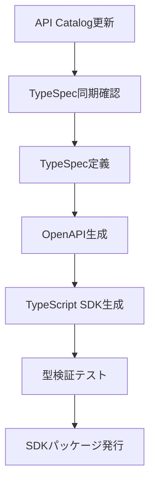

# TypeScript SDK Generation Strategy

## 概要

Your Quiz APIのTypeScript SDKを自動生成し、型安全で開発効率の高いクライアント開発を実現するための戦略を定義します。

## 技術スタック

### コード生成ツール

- **TypeSpec**: API仕様定義とOpenAPI生成
- **OpenAPI Generator**: TypeScript SDKの自動生成
- **tRPC**: 型安全なRPC通信（将来的な選択肢）

### 生成物

- **TypeScript型定義**: 完全な型安全性
- **APIクライアント**: 各エンドポイントのタイプセーフなメソッド
- **型ガード関数**: Discriminated Unionの型判別
- **バリデーション**: ランタイム型検証
- **ドキュメント**: JSDocコメント付きAPI

## Union型対応戦略

### Discriminated Union生成

```typescript
// 自動生成される型定義
export type Solution =
  | { type: "boolean"; value: boolean }
  | { type: "free_text"; correctAnswer: string; matchingStrategy: "exact" | "partial" | "regex"; caseSensitive: boolean }
  | { type: "single_choice"; correctChoiceId: string; choices: Choice[] }
  | { type: "multiple_choice"; correctChoiceIds: string[]; choices: Choice[]; minCorrectAnswers: number };

// 自動生成される型ガード関数
export function isBooleanSolution(solution: Solution): solution is Extract<Solution, { type: "boolean" }> {
  return solution.type === "boolean";
}

export function isFreeTextSolution(solution: Solution): solution is Extract<Solution, { type: "free_text" }> {
  return solution.type === "free_text";
}

export function isSingleChoiceSolution(solution: Solution): solution is Extract<Solution, { type: "single_choice" }> {
  return solution.type === "single_choice";
}

export function isMultipleChoiceSolution(solution: Solution): solution is Extract<Solution, { type: "multiple_choice" }> {
  return solution.type === "multiple_choice";
}
```

### クライアント利用パターン

```typescript
// SDK使用例
import { QuizManagementAPI, isBooleanSolution, isFreeTextSolution } from '@your-quiz/sdk';

const api = new QuizManagementAPI();

// 型安全なAPI呼び出し
const quiz = await api.getQuiz("quiz-123");

// 型ガードによる安全な分岐処理
if (isBooleanSolution(quiz.solution)) {
  // TypeScriptが quiz.solution.value の型を boolean として認識
  console.log("Boolean answer:", quiz.solution.value);
  // quiz.solution.correctAnswer はコンパイルエラー
} else if (isFreeTextSolution(quiz.solution)) {
  // TypeScriptが FreeTextSolution として認識
  console.log("Text answer:", quiz.solution.correctAnswer);
  console.log("Matching strategy:", quiz.solution.matchingStrategy);
  // quiz.solution.value はコンパイルエラー
}
```

## OpenAPI Discriminator対応

### TypeSpec定義

```typescript
// TypeSpec discriminator設定
@discriminator("type")
union Solution {
  BooleanSolution,
  FreeTextSolution,
  SingleChoiceSolution,
  MultipleChoiceSolution
}
```

### 生成されるOpenAPI

```yaml
Solution:
  discriminator:
    propertyName: type
    mapping:
      boolean: '#/components/schemas/BooleanSolution'
      free_text: '#/components/schemas/FreeTextSolution'
      single_choice: '#/components/schemas/SingleChoiceSolution'
      multiple_choice: '#/components/schemas/MultipleChoiceSolution'
  oneOf:
    - $ref: '#/components/schemas/BooleanSolution'
    - $ref: '#/components/schemas/FreeTextSolution'
    - $ref: '#/components/schemas/SingleChoiceSolution'
    - $ref: '#/components/schemas/MultipleChoiceSolution'
```

## Field Selection対応

### クエリパラメータ型生成

```typescript
// 自動生成される型定義
export interface GetQuizOptions {
  include?: ('solution' | 'statistics' | 'creator')[];
  fields?: string; // "id,question,solution.value"
}

// 条件付き型定義
export type GetQuizResponse<T extends GetQuizOptions> =
  T['include'] extends readonly string[]
    ? T['include'][number] extends 'solution'
      ? QuizResponse
      : QuizBasic
    : QuizBasic;

// 型安全なクライアントメソッド
class QuizManagementAPI {
  async getQuiz<T extends GetQuizOptions>(
    id: string,
    options?: T
  ): Promise<GetQuizResponse<T>> {
    // 実装
  }
}
```

### 利用例

```typescript
// Solution情報を含む取得（型安全）
const quizResponse = await api.getQuiz("quiz-123", {
  include: ['solution']
});
// quizResponse.solution が利用可能（型チェック済み）

// 基本情報のみ取得
const basicQuiz = await api.getQuiz("quiz-123");
// basicQuiz.solution はコンパイルエラー
```

## エラーハンドリング

### 型安全なエラー処理

```typescript
// エラー型定義
export type APIError =
  | { type: "validation"; code: string; message: string; details?: ValidationDetails }
  | { type: "not_found"; code: string; message: string }
  | { type: "forbidden"; code: string; message: string }
  | { type: "rate_limit"; code: string; message: string; retryAfter?: number }
  | { type: "internal"; code: string; message: string };

// Result型パターン
export type APIResult<T> =
  | { success: true; data: T }
  | { success: false; error: APIError };

// クライアントメソッド
class QuizManagementAPI {
  async getQuiz(id: string): Promise<APIResult<QuizResponse>> {
    try {
      const response = await this.httpClient.get(`/quizzes/${id}`);
      return { success: true, data: response.data };
    } catch (error) {
      return { success: false, error: this.parseError(error) };
    }
  }
}

// 利用例
const result = await api.getQuiz("quiz-123");
if (result.success) {
  // result.data が QuizResponse として型安全にアクセス可能
  console.log(result.data.solution);
} else {
  // result.error が APIError として型安全にアクセス可能
  if (result.error.type === "not_found") {
    console.log("Quiz not found");
  }
}
```

## 開発ワークフロー

### 自動生成パイプライン



### CI/CD統合

```yaml
# GitHub Actions例
name: SDK Generation
on:
  push:
    paths: ['api/spec/**/*.tsp']

jobs:
  generate-sdk:
    runs-on: ubuntu-latest
    steps:
      - uses: actions/checkout@v4
      - name: Setup Node.js
        uses: actions/setup-node@v4
        with:
          node-version: '20'

      - name: Install TypeSpec
        run: npm install -g @typespec/compiler

      - name: Generate OpenAPI
        run: tsp compile api/spec/main.tsp --emit @typespec/openapi3

      - name: Generate TypeScript SDK
        run: |
          npx @openapitools/openapi-generator-cli generate \
            -i ./tsp-output/@typespec/openapi3/openapi.yaml \
            -g typescript-fetch \
            -o ./packages/sdk \
            --additional-properties=typescriptThreePlus=true,supportsES6=true

      - name: Run SDK Tests
        run: npm run test:sdk

      - name: Publish SDK
        if: github.ref == 'refs/heads/main'
        run: npm publish packages/sdk
        env:
          NPM_TOKEN: ${{ secrets.NPM_TOKEN }}
```

## バージョニング戦略

### Semantic Versioning

- **Major**: Breaking changes（Union型の削除、フィールド削除）
- **Minor**: 新機能追加（新answerType、新フィールド）
- **Patch**: バグ修正、ドキュメント更新

### 下位互換性

```typescript
// 新answerType追加時の互換性確保
type Solution =
  | LegacySolution  // 既存の型
  | NewSolution;    // 新しい型

// 既存コードは引き続き動作
if (isBooleanSolution(solution)) {
  // 既存の分岐処理
}

// 新しい型の処理は個別に追加
if (isNewSolution(solution)) {
  // 新しい処理
}
```

## テスト戦略

### 型テスト

```typescript
// 型レベルテスト
type TestBooleanSolution = Expect<
  Equal<
    BooleanSolution,
    { type: "boolean"; value: boolean }
  >
>;

type TestUnionDiscrimination = Expect<
  Equal<
    Solution["type"],
    "boolean" | "free_text" | "single_choice" | "multiple_choice"
  >
>;
```

### ランタイムテスト

```typescript
// 型ガード関数テスト
describe('Solution Type Guards', () => {
  it('should correctly identify boolean solution', () => {
    const solution: Solution = { type: "boolean", value: true };

    expect(isBooleanSolution(solution)).toBe(true);
    expect(isFreeTextSolution(solution)).toBe(false);

    if (isBooleanSolution(solution)) {
      // TypeScript型チェック: solution.value が boolean
      expect(typeof solution.value).toBe('boolean');
    }
  });
});
```

## パフォーマンス最適化

### Tree Shaking対応

```typescript
// 個別インポート可能な構造
export { QuizManagementAPI } from './apis/quiz-management';
export { QuizLearningAPI } from './apis/quiz-learning';
export { UserSessionAPI } from './apis/user-session';

// 型ガード関数も個別エクスポート
export {
  isBooleanSolution,
  isFreeTextSolution,
  isSingleChoiceSolution,
  isMultipleChoiceSolution
} from './type-guards';
```

### Bundle Size最適化

- 使用しないAPIクライアントの除外
- 型ガード関数の最適化
- 開発時専用型の除外

## 実装スケジュール

### Phase 1: 基本SDK生成（1週間）

- [ ] TypeSpec → OpenAPI生成確認
- [ ] OpenAPI → TypeScript SDK生成
- [ ] Union型・Discriminator対応
- [ ] 基本的なAPIクライアント生成

### Phase 2: 高度な機能（1週間）

- [ ] Field Selection型対応
- [ ] エラーハンドリング強化
- [ ] 型ガード関数生成
- [ ] テストスイート作成

### Phase 3: CI/CD・パッケージング（3日）

- [ ] 自動生成パイプライン構築
- [ ] npm パッケージ発行
- [ ] ドキュメント生成
- [ ] 利用例・サンプルコード作成

## 参考資料

- [TypeSpec OpenAPI Emitter](https://typespec.io/docs/emitters/openapi3)
- [OpenAPI Generator TypeScript](https://openapi-generator.tech/docs/generators/typescript-fetch)
- [TypeScript Discriminated Unions](https://www.typescriptlang.org/docs/handbook/2/narrowing.html#discriminated-unions)
- [OpenAPI 3.1 Discriminator](https://spec.openapis.org/oas/v3.1.0#discriminator-object)

---

**作成日**: 2025-08-04
**更新日**: 2025-08-04
**作成者**: Claude Code Assistant
