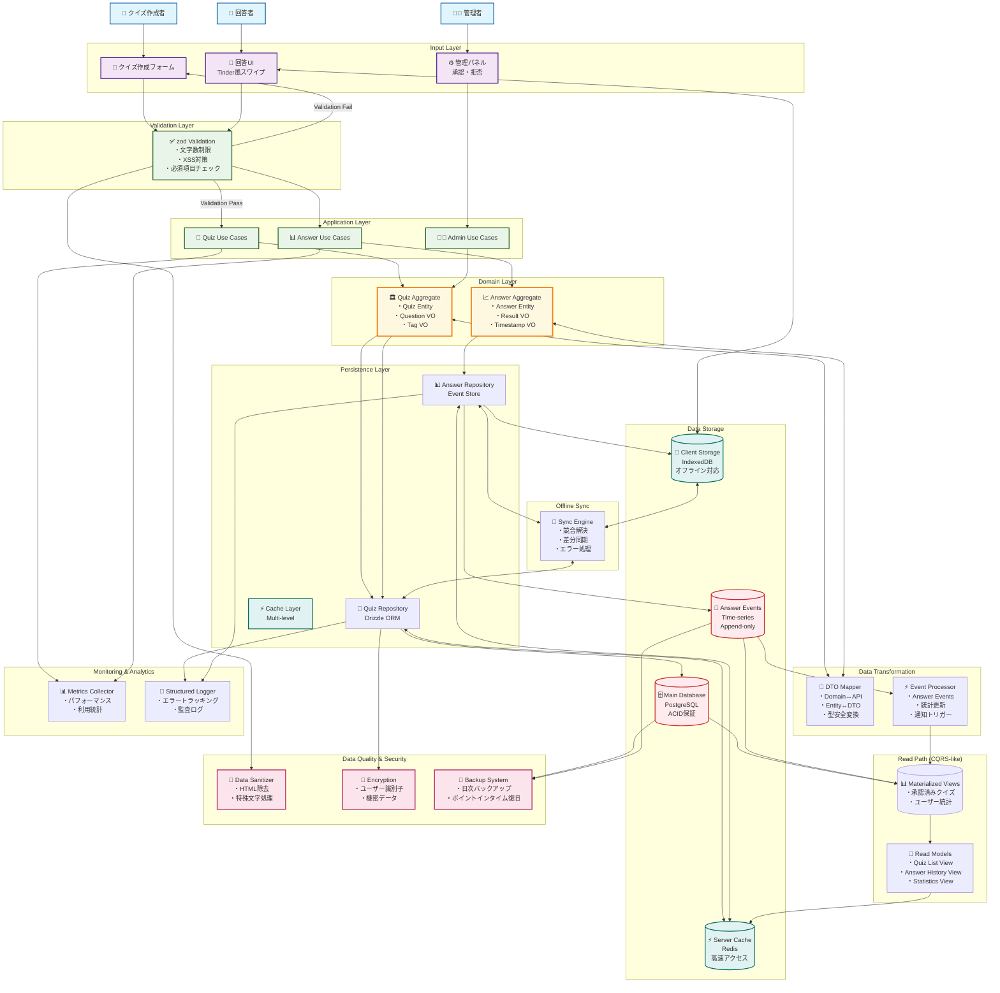

# データフロー図

## 概要

このドキュメントは、クイズアプリケーションのデータフローを視覚的に表現しています。

## アーキテクチャ構成

- **Input Layer**: ユーザーインターフェース層
- **Validation Layer**: データ検証層
- **Application Layer**: アプリケーションサービス層
- **Domain Layer**: ドメインロジック層
- **Persistence Layer**: データ永続化層
- **Data Storage**: 物理ストレージ層

## データフロー全体図

## データフローの説明

### 1. クイズ作成フロー

1. **クイズ作成者** → **クイズ作成フォーム** でクイズを入力
2. **Validation Layer** でデータ検証（文字数制限、XSS対策等）
3. 検証通過後、**Quiz Use Cases** でビジネスロジック処理
4. **Quiz Aggregate** でドメインルール適用
5. **Quiz Repository** 経由で **PostgreSQL** に永続化

### 2. 回答フロー

1. **回答者** → **回答UI（Tinder風）** で回答
2. **Validation Layer** でデータ検証
3. **Answer Use Cases** で回答処理
4. **Answer Aggregate** でドメインルール適用
5. **Answer Repository** 経由で **Event Store** に記録
6. 同時に **IndexedDB** にキャッシュ（オフライン対応）

### 3. 管理フロー

1. **管理者** → **管理パネル** でクイズ承認・拒否
2. **Admin Use Cases** で管理操作
3. **Quiz Aggregate** でステータス更新
4. **Quiz Repository** 経由でデータベース更新

### 4. 読み取りパス（CQRS-like）

- **Materialized Views** で最適化されたデータビューを提供
- **Read Models** で画面表示用データを整形
- **Server Cache** で高速アクセス

### 5. オフライン同期

- **Sync Engine** が **Client Cache** と サーバー間の同期を管理
- 競合解決、差分同期、エラー処理を実装

### 6. データ品質・セキュリティ

- **Data Sanitizer** でデータクリーニング
- **Encryption** で機密データ暗号化
- **Backup System** でデータ保護

### 7. 監視・分析

- **Metrics Collector** でパフォーマンス監視
- **Structured Logger** でエラートラッキングと監査ログ

## 技術選択の背景

- **PostgreSQL**: ACID保証が必要なメインデータ
- **Event Store**: 回答履歴の時系列データ
- **IndexedDB**: ブラウザでのオフライン対応
- **Redis**: 高速キャッシュ
- **zod**: 型安全なバリデーション
- **Drizzle ORM**: 型安全なデータベースアクセス
