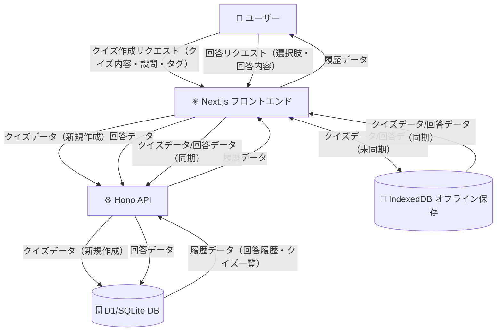

# データフロー図

## 概要

このドキュメントは、クイズアプリケーションの主要なデータの流れ（作成・回答・履歴取得）をシンプルに表現します。

## データフロー全体図

## データフローの説明

### クイズ作成・回答・履歴取得

1. ユーザーはNext.jsフロントでクイズ作成・回答を行う
2. オンライン時はHono API経由でD1/SQLite DBに保存・取得
3. オフライン時はIndexedDBに一時保存し、再接続時にAPI経由で同期
4. 履歴取得はDB→API→Next.js→ユーザーの流れ

## 備考

- 現状はサーバーキャッシュ、CQRS、Event Store、Materialized View、Sync Engine、Redis、DTO Mapper、Encryption、Backup、Metrics等は未採用
- 主要なデータの流れのみ記載
