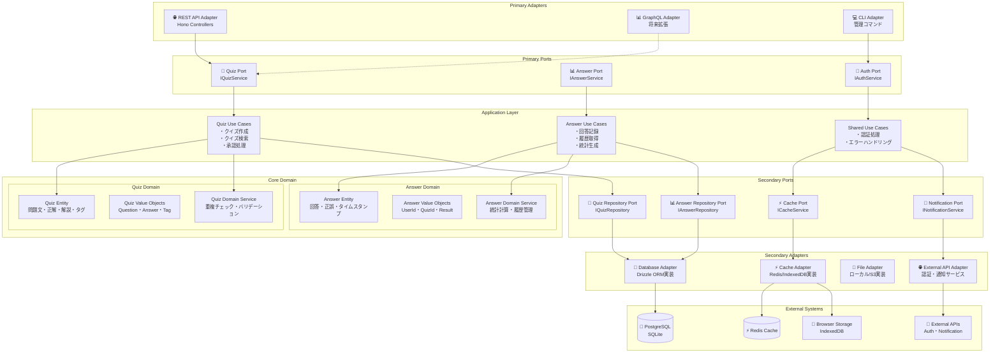

# ヘキサゴナルアーキテクチャ図

## 概要

このドキュメントは、クイズアプリケーションのヘキサゴナルアーキテクチャ構成を示します。

## Mermaid図

```mermaid
graph TB
    %% Core Domain (Center)
    subgraph "Core Domain"
        direction TB
        subgraph "Quiz Domain"
            QuizEntity[Quiz Entity<br/>問題文・正解・解説・タグ]
            QuizVO[Quiz Value Objects<br/>Question・Answer・Tag]
            QuizService[Quiz Domain Service<br/>重複チェック・バリデーション]
        end

        subgraph "Answer Domain"
            AnswerEntity[Answer Entity<br/>回答・正誤・タイムスタンプ]
            AnswerVO[Answer Value Objects<br/>UserId・QuizId・Result]
            AnswerService[Answer Domain Service<br/>統計計算・履歴管理]
        end
    end

    %% Application Layer (Use Cases)
    subgraph "Application Layer"
        direction TB
        QuizUC[Quiz Use Cases<br/>・クイズ作成<br/>・クイズ検索<br/>・承認処理]
        AnswerUC[Answer Use Cases<br/>・回答記録<br/>・履歴取得<br/>・統計生成]
        SharedUC[Shared Use Cases<br/>・認証処理<br/>・エラーハンドリング]
    end

    %% Primary Ports (入力ポート)
    subgraph "Primary Ports"
        direction TB
        QuizPort[🎯 Quiz Port<br/>IQuizService]
        AnswerPort[📊 Answer Port<br/>IAnswerService]
        AuthPort[🔐 Auth Port<br/>IAuthService]
    end

    %% Secondary Ports (出力ポート)
    subgraph "Secondary Ports"
        direction TB
        QuizRepoPort[💾 Quiz Repository Port<br/>IQuizRepository]
        AnswerRepoPort[📊 Answer Repository Port<br/>IAnswerRepository]
        CachePort[⚡ Cache Port<br/>ICacheService]
        NotificationPort[📧 Notification Port<br/>INotificationService]
    end

    %% Primary Adapters (Driving Adapters)
    subgraph "Primary Adapters"
        direction TB
        RESTAdapter[🌐 REST API Adapter<br/>Hono Controllers]
        GraphQLAdapter[📊 GraphQL Adapter<br/>将来拡張]
        CLIAdapter[💻 CLI Adapter<br/>管理コマンド]
    end

    %% Secondary Adapters (Driven Adapters)
    subgraph "Secondary Adapters"
        direction TB
        DBAdapter[📄 Database Adapter<br/>Drizzle ORM実装]
        CacheAdapter[⚡ Cache Adapter<br/>Redis/IndexedDB実装]
        FileAdapter[📁 File Adapter<br/>ローカル/S3実装]
        ExternalAdapter[🌐 External API Adapter<br/>認証・通知サービス]
    end

    %% External Systems
    subgraph "External Systems"
        direction TB
        Database[(📄 PostgreSQL<br/>SQLite)]
        Redis[(⚡ Redis Cache)]
        Browser[📱 Browser Storage<br/>IndexedDB]
        ExternalAPI[🔗 External APIs<br/>Auth・Notification]
    end

    %% Primary Flow (左から右)
    RESTAdapter --> QuizPort
    GraphQLAdapter -.-> QuizPort
    CLIAdapter --> AuthPort

    QuizPort --> QuizUC
    AnswerPort --> AnswerUC
    AuthPort --> SharedUC

    %% Use Cases to Domain
    QuizUC --> QuizEntity
    QuizUC --> QuizService
    AnswerUC --> AnswerEntity
    AnswerUC --> AnswerService

    %% Secondary Flow (右から左)
    QuizUC --> QuizRepoPort
    AnswerUC --> AnswerRepoPort
    SharedUC --> CachePort
    SharedUC --> NotificationPort

    QuizRepoPort --> DBAdapter
    AnswerRepoPort --> DBAdapter
    CachePort --> CacheAdapter
    NotificationPort --> ExternalAdapter

    %% Adapters to External Systems
    DBAdapter --> Database
    CacheAdapter --> Redis
    CacheAdapter --> Browser
    ExternalAdapter --> ExternalAPI
```
