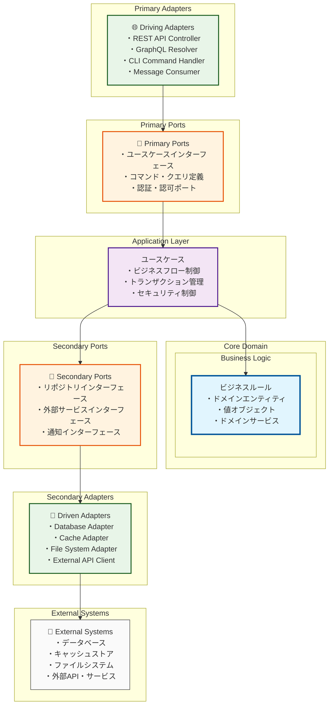

# ヘキサゴナルアーキテクチャ図（概念レベル）

## 概要

このドキュメントは、クイズアプリケーションのヘキサゴナルアーキテクチャパターンの概念構造を示します。

**注意**: 具体的なドメインエンティティ・値オブジェクト・ドメインサービスの詳細設計はDDD設計工程で実施します。

## Mermaid図



## アーキテクチャ原則

### 依存関係のルール

1. **内側の層は外側の層を知らない**
   - Core Domain は Application Layer を知らない
   - Application Layer は Adapters を知らない

2. **Ports & Adapters パターン**
   - Primary Ports: アプリケーションが外部に提供するインターフェース
   - Secondary Ports: アプリケーションが外部に要求するインターフェース

3. **依存関係逆転の原則**
   - Secondary Adapters が Secondary Ports に依存
   - 具象が抽象に依存

### レイヤー責務

| レイヤー | 責務 | 含まれるもの |
|---------|------|-------------|
| **Core Domain** | ビジネスルール | エンティティ、値オブジェクト、ドメインサービス |
| **Application Layer** | ユースケース制御 | ユースケース、アプリケーションサービス |
| **Primary Ports** | 入力インターフェース | コマンド・クエリ定義、認証ポート |
| **Secondary Ports** | 出力インターフェース | リポジトリ、外部サービスインターフェース |
| **Primary Adapters** | 入力変換 | REST Controller、CLI Handler |
| **Secondary Adapters** | 出力実装 | DB Adapter、Cache Adapter |

## 通信フロー

### 1. 入力フロー（Primary）

```text
External Request → Primary Adapter → Primary Port → Use Case → Domain
```

### 2. 出力フロー（Secondary）

```text
Domain → Use Case → Secondary Port → Secondary Adapter → External System
```

## 技術的な利点

### テスタビリティ

- ポートによる境界でモック・スタブが容易
- ドメインロジックの単体テストが純粋に実施可能

### 保守性

- 外部技術変更時の影響範囲が Adapters に限定
- ビジネスルールとインフラ関心事の分離

### 拡張性

- 新しい Primary Adapter 追加（例：GraphQL）が容易
- Secondary Adapter の実装変更（例：DB切り替え）が容易

## 次工程での詳細化

**DDD設計工程**では、以下を具体化します：

- Core Domain の具体的なエンティティ・値オブジェクト設計
- Application Layer の具体的なユースケース定義
- Primary/Secondary Ports の詳細インターフェース設計
- 各 Adapter の実装方針

---

**作成工程**: アーキテクチャ策定・技術選定  
**詳細化工程**: DDD設計  
**作成日**: 2025-07-27