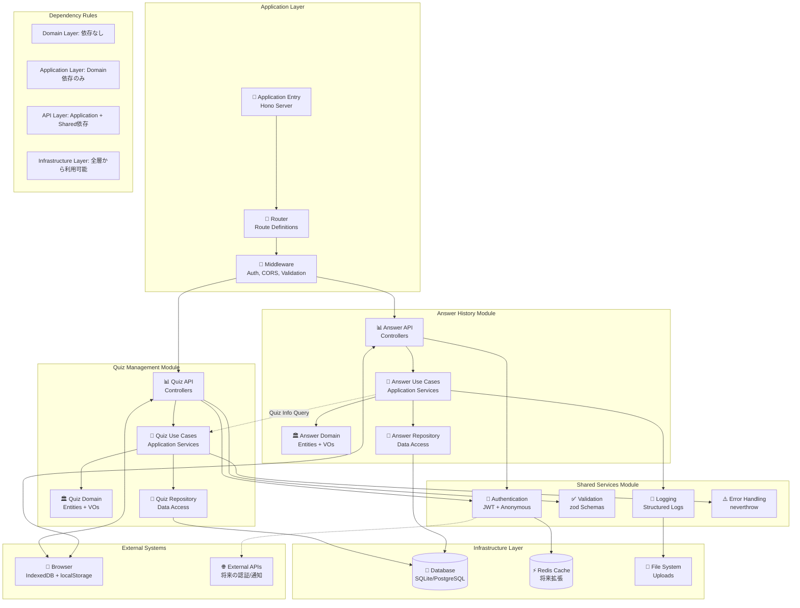

# モジュラーモノリス構造図

## 概要

このドキュメントは、クイズアプリケーションのモジュラーモノリス構造を示します。

## Mermaid図

```mermaid
graph TB
    %% Application Entry Point
    subgraph "Application Layer"
        App[🚀 Application Entry<br/>Hono Server]
        Router[📍 Router<br/>Route Definitions]
        Middleware[🔧 Middleware<br/>Auth, CORS, Validation]
    end

    %% Modules (Bounded Contexts)
    subgraph "Quiz Management Module"
        direction TB
        QM_API[📊 Quiz API<br/>Controllers]
        QM_UC[🎯 Quiz Use Cases<br/>Application Services]
        QM_Domain[🏛️ Quiz Domain<br/>Entities + VOs]
        QM_Repo[💾 Quiz Repository<br/>Data Access]
    end

    subgraph "Answer History Module"
        direction TB
        AH_API[📊 Answer API<br/>Controllers]
        AH_UC[🎯 Answer Use Cases<br/>Application Services]
        AH_Domain[🏛️ Answer Domain<br/>Entities + VOs]
        AH_Repo[💾 Answer Repository<br/>Data Access]
    end

    subgraph "Shared Services Module"
        direction TB
        SS_Auth[🔐 Authentication<br/>JWT + Anonymous]
        SS_Valid[✅ Validation<br/>zod Schemas]
        SS_Log[📝 Logging<br/>Structured Logs]
        SS_Error[⚠️ Error Handling<br/>neverthrow]
    end

    %% Infrastructure Layer
    subgraph "Infrastructure Layer"
        direction TB
        DB[(📄 Database<br/>SQLite/PostgreSQL)]
        Redis[(⚡ Redis Cache<br/>将来拡張)]
        FileSystem[📁 File System<br/>Uploads]
    end

    %% External Systems
    subgraph "External Systems"
        direction TB
        Browser[📱 Browser<br/>IndexedDB + localStorage]
        ExternalAPI[🌐 External APIs<br/>将来の認証/通知]
    end

    %% Application Flow
    App --> Router
    Router --> Middleware
    Middleware --> QM_API
    Middleware --> AH_API

    %% Module Internal Dependencies
    QM_API --> QM_UC
    QM_UC --> QM_Domain
    QM_UC --> QM_Repo

    AH_API --> AH_UC
    AH_UC --> AH_Domain
    AH_UC --> AH_Repo

    %% Cross-Module Dependencies (Limited)
    AH_UC -.->|Quiz Info Query| QM_UC

    %% Shared Services Usage
    QM_API --> SS_Auth
    QM_API --> SS_Valid
    QM_UC --> SS_Error
    AH_API --> SS_Auth
    AH_UC --> SS_Log

    %% Infrastructure Dependencies
    QM_Repo --> DB
    AH_Repo --> DB
    SS_Auth --> Redis
    SS_Log --> FileSystem

    %% External Communications
    QM_API <--> Browser
    AH_API <--> Browser
    SS_Auth -.-> ExternalAPI

    %% Module Boundary Rules
    subgraph "Dependency Rules"
        direction LR
        Rule1[Domain Layer: 依存なし]
        Rule2[Application Layer: Domain依存のみ]
        Rule3[API Layer: Application + Shared依存]
        Rule4[Infrastructure Layer: 全層から利用可能]
    end

    %% Styling
    classDef appClass fill:#e3f2fd,stroke:#1976d2,stroke-width:2px
    classDef moduleClass fill:#f3e5f5,stroke:#7b1fa2,stroke-width:2px
    classDef sharedClass fill:#e8f5e8,stroke:#388e3c,stroke-width:2px
    classDef infraClass fill:#fff3e0,stroke:#f57c00,stroke-width:2px
    classDef externalClass fill:#fce4ec,stroke:#c2185b,stroke-width:2px,stroke-dasharray: 5 5
```
