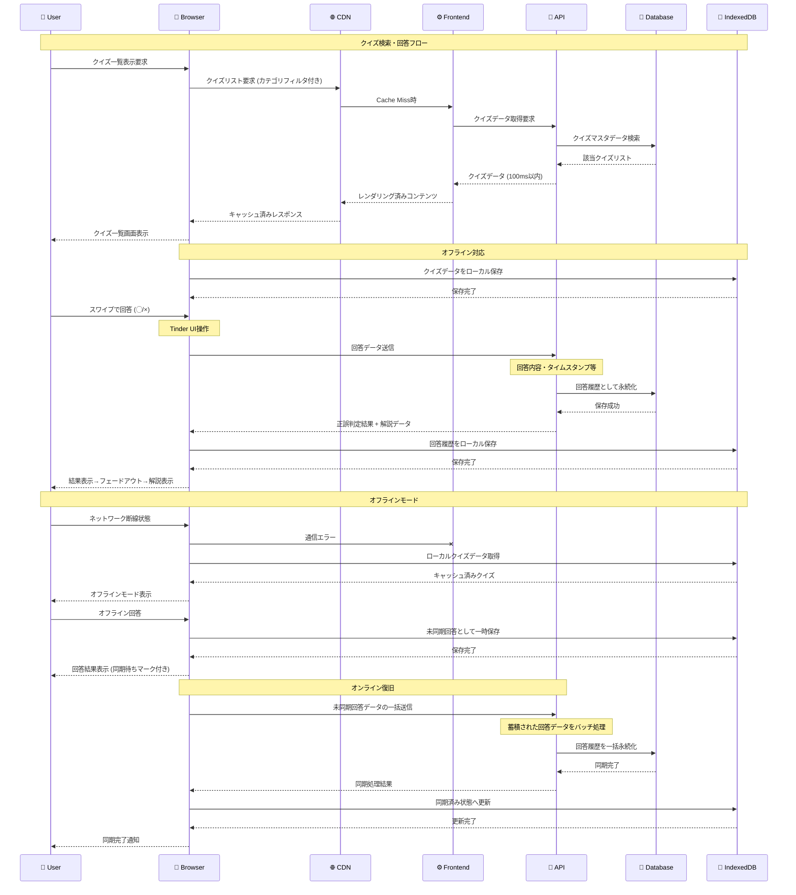

# クイズフロー図

## 概要

このドキュメントは、クイズ回答の一連の流れを示します。

## Mermaid図

```mermaid
sequenceDiagram
    participant U as 👤 User
    participant B as 📱 Browser
    participant C as 🌐 CDN
    participant F as ⚙️ Frontend
    participant A as 🚀 API
    participant D as 📄 Database
    participant I as 💾 IndexedDB

    Note over U,I: クイズ検索・回答フロー

    %% 1. クイズ一覧取得
    U->>B: クイズ一覧表示要求
    B->>C: クイズリスト要求 (カテゴリフィルタ付き)
    C->>F: Cache Miss時
    F->>A: クイズデータ取得要求
    A->>D: クイズマスタデータ検索
    D-->>A: 該当クイズリスト
    A-->>F: クイズデータ (100ms以内)
    F-->>C: レンダリング済みコンテンツ
    C-->>B: キャッシュ済みレスポンス
    B-->>U: クイズ一覧画面表示

    %% 2. オフライン対応 (事前ダウンロード)
    Note over B,I: オフライン対応
    B->>I: クイズデータをローカル保存
    I-->>B: 保存完了

    %% 3. クイズ回答
    U->>B: スワイプで回答 (◯/×)
    Note over B: Tinder UI操作
    B->>A: 回答データ送信
    Note over A: 回答内容・タイムスタンプ等
    A->>D: 回答履歴として永続化
    D-->>A: 保存成功
    A-->>B: 正誤判定結果 + 解説データ
    B->>I: 回答履歴をローカル保存
    I-->>B: 保存完了
    B-->>U: 結果表示→フェードアウト→解説表示

    %% 4. オフライン時の動作
    Note over U,I: オフラインモード
    U->>B: ネットワーク断線状態
    B-xF: 通信エラー
    B->>I: ローカルクイズデータ取得
    I-->>B: キャッシュ済みクイズ
    B-->>U: オフラインモード表示

    %% 5. 回答 (オフライン)
    U->>B: オフライン回答
    B->>I: 未同期回答として一時保存
    I-->>B: 保存完了
    B-->>U: 回答結果表示 (同期待ちマーク付き)

    %% 6. オンライン復旧時同期
    Note over B,A: オンライン復旧
    B->>A: 未同期回答データの一括送信
    Note over A: 蓄積された回答データをバッチ処理
    A->>D: 回答履歴を一括永続化
    D-->>A: 同期完了
    A-->>B: 同期処理結果
    B->>I: 同期済み状態へ更新
    I-->>B: 更新完了
    B-->>U: 同期完了通知
```
