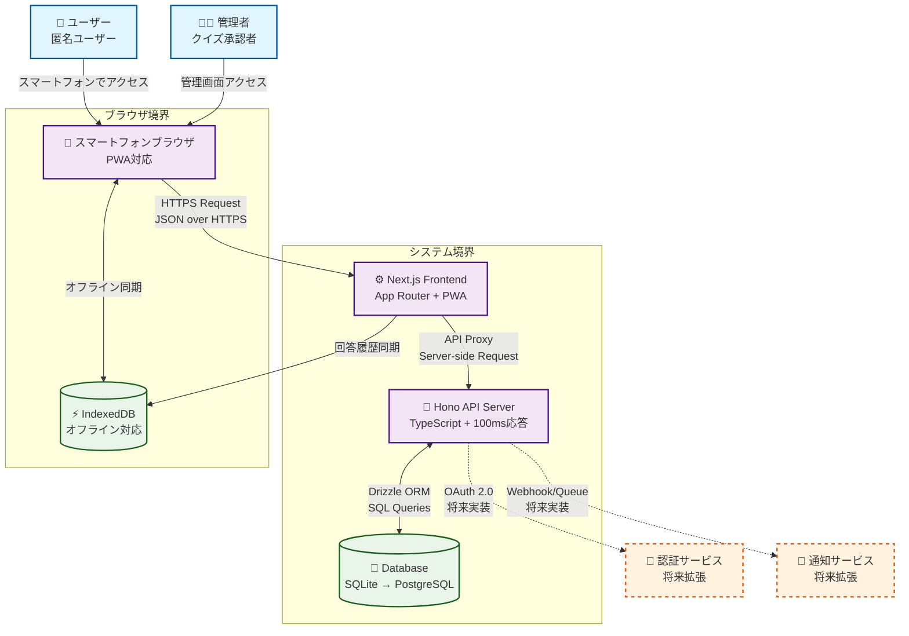

# システムコンテキスト図

## 概要

このドキュメントは、クイズアプリケーションのシステム全体のコンテキストを示します。

## Mermaid図

```mermaid
graph TB
    %% External Actors
    User[👤 ユーザー<br/>匿名ユーザー]
    Admin[👨‍💼 管理者<br/>クイズ承認者]

    %% Client Layer
    Browser[📱 スマートフォンブラウザ<br/>PWA対応]


    %% Application Layer
    Frontend[⚙️ Next.js Frontend<br/>App Router + PWA]
    API[🚀 Hono API Server<br/>TypeScript + 100ms応答]

    %% Data Layer
    DB[(📄 Database<br/>SQLite → PostgreSQL)]
    Cache[(⚡ IndexedDB<br/>オフライン対応)]

    %% External Services (Future)
    AuthService[🔐 認証サービス<br/>将来拡張]
    NotificationService[📧 通知サービス<br/>将来拡張]

    %% User Interactions
    User -->|スマートフォンでアクセス| Browser
    Admin -->|管理画面アクセス| Browser

    %% Client to Services
    Browser <-->|オフライン同期| Cache

    %% Browser to Frontend (Direct)
    Browser -->|HTTPS Request<br/>JSON over HTTPS| Frontend

    %% Frontend to API (Proxy)
    Frontend -->|API Proxy<br/>Server-side Request| API

    %% API to Data
    API <-->|Drizzle ORM<br/>SQL Queries| DB
    Frontend -->|回答履歴同期| Cache

    %% Future Integrations (Dotted Lines)
    API -.->|OAuth 2.0<br/>将来実装| AuthService
    API -.->|Webhook/Queue<br/>将来実装| NotificationService

    %% System Boundary
    subgraph "システム境界"
        direction TB
        Frontend
        API
        DB
    end

    subgraph "ブラウザ境界"
        direction TB
        Browser
        Cache
    end

    %% Styling
    classDef userClass fill:#e1f5fe,stroke:#01579b,stroke-width:2px
    classDef appClass fill:#f3e5f5,stroke:#4a148c,stroke-width:2px
    classDef dataClass fill:#e8f5e8,stroke:#1b5e20,stroke-width:2px
    classDef externalClass fill:#fff3e0,stroke:#e65100,stroke-width:2px,stroke-dasharray: 5 5

    class User,Admin userClass
    class Browser,Frontend,API appClass
    class DB,Cache dataClass
    class AuthService,NotificationService externalClass
```
