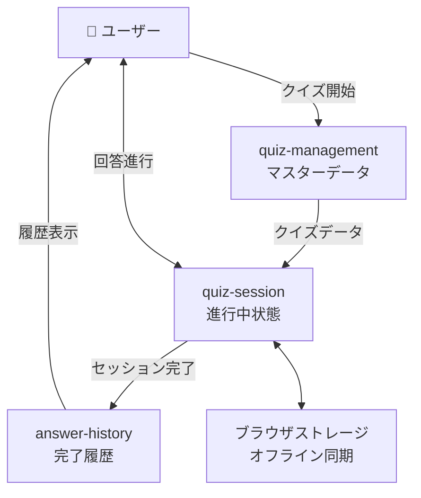

# システム全体俯瞰

## システムアーキテクチャパターン選定

### アプリケーションアーキテクチャ選定結果

**採用**: モジュラーモノリス

### アプリケーションアーキテクチャ選定理由

小規模チーム（1-2名）での開発効率と将来の拡張性のバランスを重視。単一デプロイによる運用シンプル化と、将来的なマイクロサービス分割オプションを確保。

**詳細な比較検討**: [ADR-0001: システムアーキテクチャパターン選定](docs/project/adr/0001-architecture-pattern.md)

## アプリケーションアーキテクチャパターン選定

### 選定結果

**採用**: ヘキサゴナルアーキテクチャ（ポート&アダプターパターン）

### 選定理由

ドメインロジック（クイズ・回答・履歴）の完全分離と高いテスタビリティを重視。TDD/BDD対応と外部依存の注入容易性により、オフライン対応・外部システム連携への拡張性を確保。

**詳細な比較検討**: [ADR-0002: アプリケーションアーキテクチャパターン選定](docs/project/adr/0002-application-architecture.md)

## システム境界・コンテキスト設計

### モジュール構成

- **quiz-management**: クイズ管理コンテキスト（作成・承認・マスターデータ）
- **quiz-session**: クイズセッション管理コンテキスト（進行中の状態・一時保存・オフライン同期）
- **answer-history**: 回答履歴コンテキスト（完了後の永続化データ・統計）
- **shared**: 共通コンテキスト（VO・インフラ・ミドルウェア）
- **app**: アプリケーションエントリーポイント

### 外部システム連携方針

| 連携先 | 連携方式 | 理由 | データ形式 | エラーハンドリング |
|--------|----------|------|------------|-------------------|
| ブラウザストレージ | Direct Access | オフライン対応・履歴保存 | JSON | バックアップ+同期 |
| 将来の認証システム | REST API | リアルタイム認証要求 | JSON | リトライ+フォールバック |
| 将来の通知システム | Message Queue | 非同期・高可用性 | JSON | Dead Letter Queue |

### システム境界定義

- **内部システム**: クイズ管理・クイズセッション・回答履歴・共通サービス
- **外部システム**: ブラウザストレージ、将来の認証・通知システム
- **境界インターフェース**: ドメインサービス・リポジトリインターフェース

### モジュール間データフロー

### 責務分離詳細

| モジュール | 主要責務 | データ例 | 永続化 |
|-----------|----------|----------|--------|
| **quiz-management** | クイズCRUD・承認管理 | クイズマスター・承認状態 | DB永続化 |
| **quiz-session** | セッション状態・進行管理 | 現在位置・一時回答・タイマー | 一時保存+同期 |
| **answer-history** | 完了履歴・統計管理 | 回答結果・スコア・統計 | DB永続化 |
