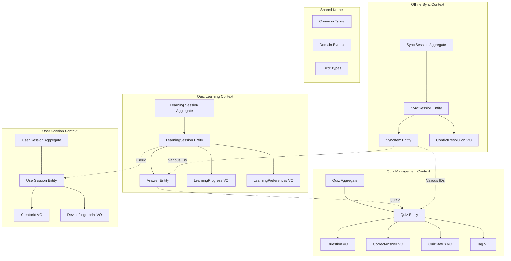
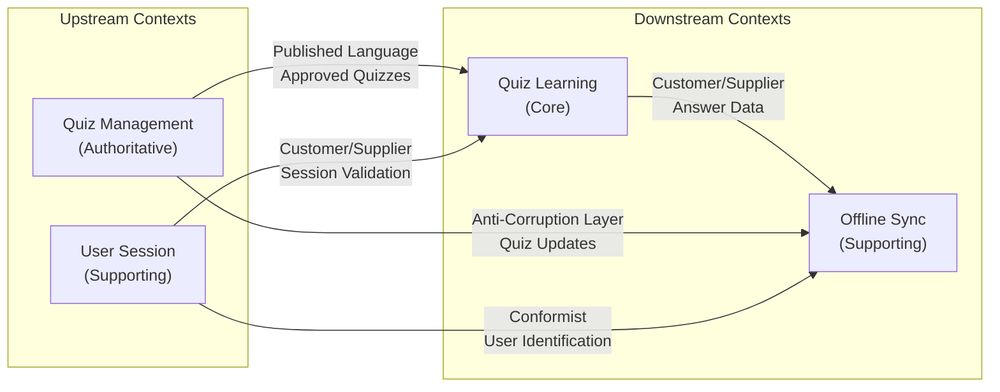

# ドメインモデル設計概要

## 設計サマリー

クイズアプリケーションのドメインモデルを、DDD戦術パターンを適用して設計しました。4つの境界づけられたコンテキストと4つの主要集約により、ビジネス要求を満たすドメインモデルを構築しています。

## ドメインモデル全体図



## コンテキストマップ詳細



## 主要集約設計

### 1. Quiz Aggregate（権威的）

#### 設計判断（Quiz Aggregate）

- **単一エンティティ集約**: クイズ内容の高い凝集性
- **強一貫性**: 承認フロー・品質管理の厳密性
- **ライフサイクル管理**: 投稿→承認→公開の明確な状態遷移

#### 主要な責務（Quiz Aggregate）

- クイズ内容の品質保証
- 承認フローの統制
- コンテンツ管理業務支援

### 2. Learning Session Aggregate（中核）

#### 設計判断（Learning Session Aggregate）

- **複合集約**: セッション+回答の一体管理
- **結果整合性**: 学習統計・進捗の非同期更新
- **パフォーマンス重視**: 高頻度アクセスへの最適化

#### 主要な責務（Learning Session Aggregate）

- 学習体験の提供
- 回答履歴の管理
- 学習進捗の計算

### 3. User Session Aggregate（支援的）

#### 設計判断（User Session Aggregate）

- **軽量集約**: 匿名ユーザー管理の最小化
- **プライバシー重視**: 個人情報の完全排除
- **技術的複雑性**: デバイス識別の専門性

#### 主要な責務（User Session Aggregate）

- 匿名ユーザー識別
- セッション管理
- 作成者権限制御

### 4. Sync Session Aggregate（技術的）

#### 設計判断（Sync Session Aggregate）

- **技術集約**: オフライン対応の専門性
- **複雑な状態管理**: 同期・競合解決の制御
- **横断的関心事**: 全データの同期対象

#### 主要な責務（Sync Session Aggregate）

- オフライン/オンライン同期
- データ競合解決
- 整合性保証

## 重要な設計決定とトレードオフ

### 1. 集約境界の設定

#### 決定: Quiz単体集約 vs Quiz+Answer複合集約

**選択**: Quiz単体集約
**理由**:

- 承認フローとユーザー利用は異なるライフサイクル
- Answer は高頻度更新、Quiz は低頻度更新
- 独立したスケーリング要求

**トレードオフ**:

- ✅ スケーラビリティ向上
- ✅ 責務の明確化
- ❌ 集約間整合性の複雑化

### 2. 匿名ユーザー管理

#### 決定: セッションベース vs ステートレス

**選択**: セッションベース（UserSession集約）
**理由**:

- 作成者識別の継続性
- オフライン対応の必要性
- 学習履歴の個人化

**トレードオフ**:

- ✅ 機能性の向上
- ✅ ユーザー体験の改善
- ❌ システム複雑性の増加

### 3. オフライン対応の分離

#### 決定: 統合型 vs 分離型アーキテクチャ

**選択**: 分離型（Offline Sync Context）
**理由**:

- 技術的複雑性の局所化
- 他機能への影響最小化
- 専門性の集約

**トレードオフ**:

- ✅ 保守性向上
- ✅ 技術的負債の局所化
- ❌ 統合複雑性の増加

## 実装指針

### TypeScript型設計

#### 共通型基盤

```typescript
// 識別子型（Brand型パターン）
type QuizId = Brand<string, 'QuizId'>;
type SessionId = Brand<string, 'SessionId'>;
type AnswerId = Brand<string, 'AnswerId'>;
type UserId = Brand<string, 'UserId'>;

// 結果型（neverthrow）
type Result<T, E> = Ok<T> | Err<E>;

// ドメインイベント基底
interface DomainEvent {
  readonly eventId: string;
  readonly occurredAt: Date;
  readonly aggregateId: string;
  readonly eventType: string;
}
```

#### 値オブジェクト設計パターン

```typescript
// 不変性保証パターン
class Question {
  private constructor(
    readonly text: string,
    readonly sanitizedText: string,
    readonly length: number
  ) {}

  static create(text: string): Result<Question, ValidationError> {
    // バリデーション + サニタイズ
    const sanitized = this.sanitize(text);
    return ok(new Question(text, sanitized, text.length));
  }

  equals(other: Question): boolean {
    return this.sanitizedText === other.sanitizedText;
  }
}
```

#### エンティティ設計パターン

```typescript
// 集約ルートパターン
abstract class AggregateRoot<T> {
  private domainEvents: DomainEvent[] = [];

  protected addDomainEvent(event: DomainEvent): void {
    this.domainEvents.push(event);
  }

  getDomainEvents(): DomainEvent[] {
    return [...this.domainEvents];
  }

  clearDomainEvents(): void {
    this.domainEvents = [];
  }
}

class QuizAggregate extends AggregateRoot<QuizId> {
  // 実装...
}
```

### アーキテクチャ層の実装

#### ディレクトリ構造

```text
src/
├── contexts/
│   ├── quiz-management/
│   │   ├── domain/
│   │   │   ├── entities/
│   │   │   ├── value-objects/
│   │   │   ├── aggregates/
│   │   │   ├── repositories/
│   │   │   └── services/
│   │   ├── application/
│   │   │   ├── commands/
│   │   │   ├── queries/
│   │   │   └── services/
│   │   └── infrastructure/
│   │       ├── repositories/
│   │       └── adapters/
│   ├── quiz-learning/
│   ├── user-session/
│   └── offline-sync/
├── shared-kernel/
│   ├── types/
│   ├── value-objects/
│   ├── domain-events/
│   └── utilities/
└── integration/
    ├── event-handlers/
    ├── anti-corruption-layers/
    └── published-languages/
```

#### 依存性注入パターン

```typescript
// インターフェース分離
interface QuizRepository {
  findById(id: QuizId): Promise<Quiz | null>;
  save(quiz: Quiz): Promise<void>;
}

interface DomainEventPublisher {
  publish(event: DomainEvent): Promise<void>;
  publishAll(events: DomainEvent[]): Promise<void>;
}

// アプリケーションサービス
class QuizManagementApplicationService {
  constructor(
    private quizRepository: QuizRepository,
    private eventPublisher: DomainEventPublisher,
    private duplicationService: QuizDuplicationCheckService
  ) {}
}
```

## パフォーマンス最適化戦略

### 1. 読み取り最適化

#### クエリ分離（CQRS的アプローチ）

```typescript
// コマンド側：集約を通した更新
class QuizManagementService {
  async createQuiz(command: CreateQuizCommand): Promise<Result<QuizId, Error>> {
    const quiz = QuizAggregate.create(command);
    await this.quizRepository.save(quiz.value);
    return ok(quiz.value.id);
  }
}

// クエリ側：読み取り専用ビュー
class QuizQueryService {
  async getApprovedQuizzes(filter: QuizFilter): Promise<QuizListView[]> {
    return this.quizReadModel.findApproved(filter);
  }
}
```

#### キャッシュ戦略

```typescript
class CachedQuizRepository implements QuizRepository {
  constructor(
    private baseRepository: QuizRepository,
    private cache: Cache
  ) {}

  async findById(id: QuizId): Promise<Quiz | null> {
    const cacheKey = `quiz:${id.value}`;
    const cached = await this.cache.get(cacheKey);

    if (cached) {
      return this.deserialize(cached);
    }

    const quiz = await this.baseRepository.findById(id);
    if (quiz) {
      await this.cache.set(cacheKey, this.serialize(quiz), TTL.ofMinutes(30));
    }

    return quiz;
  }
}
```

### 2. 書き込み最適化

#### バッチ処理

```typescript
class BatchAnswerProcessor {
  private answerBuffer: Answer[] = [];

  async addAnswer(answer: Answer): Promise<void> {
    this.answerBuffer.push(answer);

    if (this.answerBuffer.length >= BATCH_SIZE) {
      await this.flushBuffer();
    }
  }

  private async flushBuffer(): Promise<void> {
    await this.answerRepository.saveAll(this.answerBuffer);
    this.answerBuffer = [];
  }
}
```

#### 楽観的ロック

```typescript
class VersionedAggregate {
  constructor(
    readonly id: AggregateId,
    private version: number = 1
  ) {}

  incrementVersion(): void {
    this.version++;
  }

  getVersion(): number {
    return this.version;
  }
}

// リポジトリでの競合制御
async save(aggregate: VersionedAggregate): Promise<void> {
  const result = await this.db.update('aggregates')
    .set({ ...data, version: aggregate.getVersion() + 1 })
    .where('id', aggregate.id.value)
    .where('version', aggregate.getVersion());

  if (result.affectedRows === 0) {
    throw new ConcurrencyError('集約が他のユーザーによって更新されています');
  }
}
```

## テスト戦略

### 1. ドメインモデルテスト

#### 不変条件テスト

```typescript
describe('Quiz Aggregate', () => {
  it('should enforce question length constraint', () => {
    const longQuestion = 'a'.repeat(501);
    const result = QuizAggregate.create({
      questionText: longQuestion,
      correctAnswer: true,
      creatorId: CreatorId.generate()
    });

    expect(result.isErr()).toBe(true);
    expect(result.error.message).toContain('500文字以内');
  });

  it('should not allow approval without administrator', () => {
    const quiz = createValidQuiz();
    const result = quiz.approve(null);

    expect(result.isErr()).toBe(true);
  });
});
```

#### ビジネスルールテスト

```typescript
describe('Learning Session Business Rules', () => {
  it('should calculate correct rate accurately', () => {
    const session = createLearningSession();
    session.answerQuiz(quiz1, true, true);   // 正解
    session.answerQuiz(quiz2, false, true);  // 不正解

    const progress = session.getProgress();
    expect(progress.correctRate).toBe(0.5);
  });
});
```

### 2. 統合テスト

#### 集約間連携テスト

```typescript
describe('Quiz Approval Flow', () => {
  it('should make approved quiz available for learning', async () => {
    // Given: クイズが投稿されている
    const quiz = await createPendingQuiz();

    // When: 管理者が承認する
    await quizManagementService.approveQuiz({
      quizId: quiz.id,
      administratorId: admin.id
    });

    // Then: 学習コンテキストで利用可能になる
    const availableQuizzes = await learningService.getAvailableQuizzes();
    expect(availableQuizzes).toContainEqual(
      expect.objectContaining({ id: quiz.id })
    );
  });
});
```

## 監視・運用考慮事項

### 1. ドメインメトリクス

#### ビジネスメトリクス

```typescript
class DomainMetrics {
  // クイズ関連
  static quizSubmissionRate = new Counter('quiz_submissions_total');
  static quizApprovalRate = new Gauge('quiz_approval_rate');
  static quizRejectionReasons = new Counter('quiz_rejections_by_reason');

  // 学習関連
  static learningSessionDuration = new Histogram('learning_session_duration_seconds');
  static answerCorrectRate = new Gauge('answer_correct_rate');
  static userEngagement = new Gauge('daily_active_learners');

  // システム関連
  static aggregateLoadTime = new Histogram('aggregate_load_time_ms');
  static concurrencyConflicts = new Counter('concurrency_conflicts_total');
}
```

### 2. エラー処理戦略

#### ドメインエラー分類

```typescript
abstract class DomainError extends Error {
  abstract readonly errorCode: string;
  abstract readonly severity: ErrorSeverity;
}

class ValidationError extends DomainError {
  readonly errorCode = 'VALIDATION_ERROR';
  readonly severity = ErrorSeverity.Warning;
}

class BusinessRuleError extends DomainError {
  readonly errorCode = 'BUSINESS_RULE_VIOLATION';
  readonly severity = ErrorSeverity.Error;
}

class InvariantViolationError extends DomainError {
  readonly errorCode = 'INVARIANT_VIOLATION';
  readonly severity = ErrorSeverity.Critical;
}
```

## 今後の拡張ポイント

### 1. 機能拡張

- **多択問題対応**: Quiz集約の拡張
- **ユーザー認証**: User Management Contextの追加
- **統計・分析**: Analytics Contextの追加
- **通知機能**: Notification Contextの追加

### 2. 技術的拡張

- **イベント駆動強化**: Event Sourcing の部分適用
- **CQRS拡大**: 読み書き分離の拡大
- **マイクロサービス**: 境界づけられたコンテキストの物理分離
- **マルチテナント**: テナント別データ分離

### 3. 運用拡張

- **A/Bテスト**: 学習体験の最適化
- **リアルタイム分析**: 学習効果の即座測定
- **自動化運用**: 承認フローの自動化・AI支援

このドメインモデル設計により、クイズアプリケーションの複雑なビジネス要求を、保守性・拡張性・テスタビリティを確保しながら実現する基盤が整いました。
