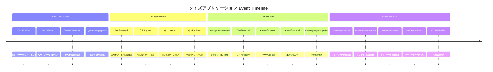
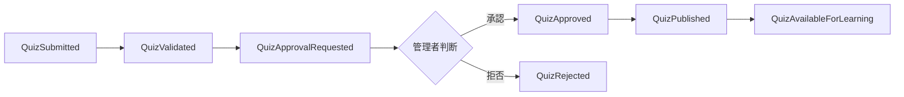
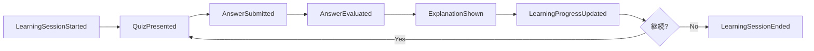
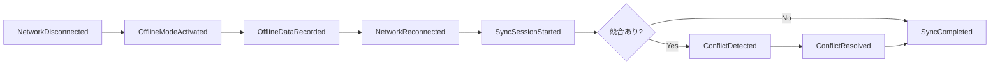

# Event Storming 結果

## 目的

[ユーザーフロー分析](docs/project/ddd-design/2.02.5_user-flow-analysis/user-flow-analysis.md)で特定されたドメインイベントを、Event Stormingワークショップを通じて体系的に整理し、境界づけられたコンテキストの発見と[ドメインイベントカタログ](docs/project/ddd-design/2.10_domain-events-catalog/domain-events-catalog.md)の基盤を構築する。

## 概要

クイズアプリケーションのドメインイベントを時系列で整理し、イベント間の因果関係・依存関係を可視化することで、適切な境界づけられたコンテキストの境界を発見します。本分析は`specifications/user-stories/user-story-quiz.md`のユーザー操作シナリオに基づいています。

## Event Storming セッション概要

### ワークショップ形式

- **参加者**: ドメインエキスパート、開発チーム、システムアーキテクト
- **手法**: オレンジ付箋（イベント）、ブルー付箋（コマンド）、イエロー付箋（アクター）
- **時間軸**: 左から右への時系列配置
- **発散・収束**: 自由発想→グルーピング→境界発見

### 発見された主要イベントクラスター

## イベント分類とコンテキスト境界

### 1. Quiz Management Context イベント

| イベント名 | 発生タイミング | トリガー | データ | ビジネス価値 |
|------------|----------------|----------|--------|-------------|
| **QuizSubmitted** | クイズ投稿時 | ユーザー投稿操作 | Quiz, CreatorId | コンテンツ蓄積開始 |
| **QuizValidated** | 投稿バリデーション後 | QuizSubmitted | ValidationResult | 品質保証 |
| **QuizApprovalRequested** | 承認待ち設定時 | QuizValidated | QuizId, ReviewerId | 承認フロー開始 |
| **QuizApproved** | 管理者承認時 | 承認操作 | QuizId, ApprovedBy, ApprovedAt | 学習コンテンツ公開 |
| **QuizRejected** | 管理者拒否時 | 拒否操作 | QuizId, RejectedBy, Reason | 品質統制実行 |
| **QuizPublished** | 承認後公開時 | QuizApproved | QuizId, PublishedAt | 学習者利用可能化 |

### 2. Quiz Learning Context イベント

| イベント名 | 発生タイミング | トリガー | データ | ビジネス価値 |
|------------|----------------|----------|--------|-------------|
| **LearningSessionStarted** | セッション開始時 | ユーザーアクセス | SessionId, UserId | 学習体験開始 |
| **QuizPresented** | クイズ表示時 | セッション内操作 | QuizId, SessionId | 学習機会提供 |
| **AnswerSubmitted** | 回答送信時 | スワイプ操作 | AnswerId, UserAnswer | 学習インタラクション |
| **AnswerEvaluated** | 正誤判定時 | AnswerSubmitted | AnswerId, IsCorrect | 学習フィードバック |
| **ExplanationShown** | 解説表示時 | AnswerEvaluated | QuizId, Explanation | 学習深化 |
| **LearningProgressUpdated** | 進捗更新時 | AnswerEvaluated | SessionId, Progress | 成長実感提供 |

### 3. User Session Context イベント

| イベント名 | 発生タイミング | トリガー | データ | ビジネス価値 |
|------------|----------------|----------|--------|-------------|
| **UserSessionStarted** | 初回アクセス時 | アプリ起動 | SessionId, DeviceFingerprint | 匿名ユーザー識別 |
| **CreatorIdGenerated** | 作成者登録時 | 初回クイズ投稿 | CreatorId, SessionId | 作成者権限付与 |
| **SessionActivated** | アクセス時 | ユーザー操作 | SessionId, LastAccessAt | セッション継続 |
| **SessionExpired** | 期限切れ時 | 30日経過 | SessionId, ExpiredAt | セッション自動清理 |

### 4. Offline Sync Context イベント

| イベント名 | 発生タイミング | トリガー | データ | ビジネス価値 |
|------------|----------------|----------|--------|-------------|
| **NetworkDisconnected** | 回線断線時 | ネットワーク状態変化 | SessionId, DisconnectedAt | オフライン対応開始 |
| **OfflineModeActivated** | オフライン切替時 | NetworkDisconnected | SessionId, OfflineState | 継続利用保証 |
| **OfflineDataRecorded** | オフライン操作時 | ユーザー操作 | LocalData, Timestamp | データ喪失防止 |
| **NetworkReconnected** | 回線復旧時 | ネットワーク状態変化 | SessionId, ReconnectedAt | 同期処理開始 |
| **SyncSessionStarted** | 同期開始時 | NetworkReconnected | SyncSessionId, DataItems | データ整合性回復 |
| **ConflictDetected** | 競合検出時 | データ比較 | ConflictId, LocalData, ServerData | 整合性問題識別 |
| **ConflictResolved** | 競合解決時 | 解決戦略適用 | ConflictId, Resolution | データ整合性確保 |
| **SyncCompleted** | 同期完了時 | 全データ同期終了 | SyncSessionId, SyncResult | 一貫状態復帰 |

## イベント間の因果関係分析

### 1. 主要イベントチェーン

#### Quiz Creation → Approval Chain

#### Learning Experience Chain

#### Offline Sync Chain

### 2. コンテキスト間イベント連携

| 上流コンテキスト | 下流コンテキスト | 連携イベント | 統合パターン |
|------------------|------------------|-------------|-------------|
| **Quiz Management** | **Quiz Learning** | QuizPublished | Published Language |
| **User Session** | **Quiz Learning** | UserSessionStarted | Customer/Supplier |
| **Quiz Learning** | **Offline Sync** | AnswerSubmitted | Customer/Supplier |
| **Quiz Management** | **Offline Sync** | QuizPublished | Anti-Corruption Layer |

## 境界づけられたコンテキストの境界発見

### 境界発見の基準

#### 1. イベント発生パターン

- **同一アクター**: 同じユーザー種別が発生させるイベント群
- **共通データ**: 同じデータを中心とするイベント群
- **業務フロー**: 一連の業務プロセスを構成するイベント群

#### 2. イベント変更頻度

- **高変更頻度**: 頻繁に仕様変更されるイベント群は分離
- **安定性**: 安定したイベント群は中核コンテキスト候補
- **技術的制約**: 技術的理由で変更されるイベント群は分離

### 発見された境界

#### Quiz Management Context

- **イベント特性**: 管理者中心、低頻度、高品質要求
- **境界理由**: 承認業務の独立性、品質統制の専門性
- **安定性**: 承認基準変更はあるが、承認フロー自体は安定

#### Quiz Learning Context  

- **イベント特性**: 学習者中心、高頻度、パフォーマンス重視
- **境界理由**: 学習体験の独立性、スケーラビリティ要求
- **変動性**: UI/UX改善による頻繁な変更が予想される

#### User Session Context

- **イベント特性**: システム管理、中頻度、セキュリティ重要
- **境界理由**: 匿名ユーザー管理の専門性、プライバシー要求
- **技術性**: デバイス識別技術の変化に影響される

#### Offline Sync Context

- **イベント特性**: 技術的、不定期、複雑性高
- **境界理由**: 同期技術の専門性、他機能からの独立性
- **技術進化**: PWA・オフライン技術の進化に影響される

## イベントソーシング適用候補

### 高適用価値イベント

| イベント | 適用理由 | 期待効果 | 実装コスト |
|----------|----------|----------|------------|
| **Quiz承認系** | 監査・履歴追跡重要 | ガバナンス強化 | 中 |
| **学習進捗系** | 分析・レコメンド基盤 | 学習体験向上 | 高 |
| **同期処理系** | デバッグ・障害解析 | 運用性向上 | 中 |

### 適用除外イベント

| イベント | 除外理由 | 代替手段 |
|----------|----------|----------|
| **セッション管理系** | 技術的イベント、ビジネス価値低 | 通常の状態管理 |
| **バリデーション系** | 瞬間的、履歴価値なし | 即座処理・ログ記録 |

## まとめ

Event Stormingにより、クイズアプリケーションドメインの**4つの明確な境界づけられたコンテキスト**が発見されました：

1. **Quiz Management Context**: 品質統制・承認業務に特化
2. **Quiz Learning Context**: 学習体験・パフォーマンスに特化  
3. **User Session Context**: 匿名ユーザー管理・プライバシーに特化
4. **Offline Sync Context**: 同期技術・データ整合性に特化

各コンテキストは明確なイベント境界を持ち、適切な統合パターンで連携することで、保守性・拡張性・専門性を確保します。

## 関連ドキュメント

- [ユーザーフロー分析](docs/project/ddd-design/2.02.5_user-flow-analysis/user-flow-analysis.md)
- [ドメインイベントカタログ](docs/project/ddd-design/2.10_domain-events-catalog/domain-events-catalog.md)
- [境界づけられたコンテキスト定義](docs/project/ddd-design/2.09_bounded-context-definition/README.md)
- [集約設計](docs/project/ddd-design/2.08_aggregate-design/README.md)

---
**作成工程**: DDD設計
**作成日**: 2025-01-30
**更新日**: 2025-01-30
