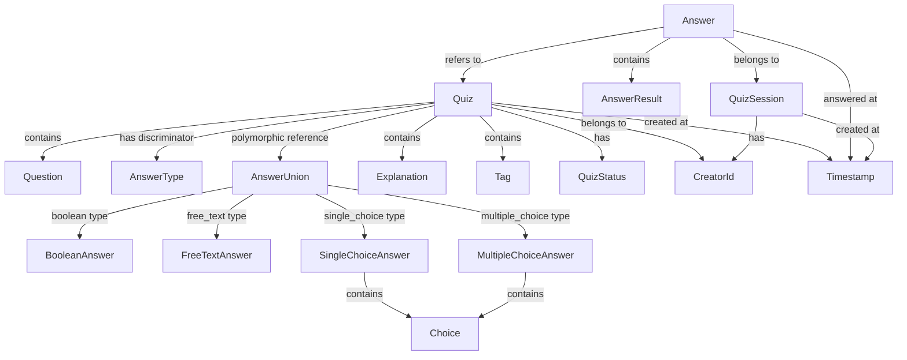

# ドメインオブジェクト分類

## 目的

[ユーザーストーリー](docs/project/specifications/user-stories/user-story-quiz.md)と[要件定義](docs/project/specifications/requirements/requirements-quiz.md)から抽出したドメイン概念を、DDD戦術パターンに基づいてエンティティと値オブジェクトに体系的に分類し、実装可能な設計指針を提供する。

## 概要

クイズアプリケーションのドメインにおける概念を、エンティティと値オブジェクトに分類し、その判定理由と主要属性を整理します。この分類は`specifications/requirements/requirements-quiz.md`の文字制約・データ整合性要件と完全に整合しています。

## エンティティと値オブジェクトの分類表

| 概念名 | 分類 | 判定理由 | 主要属性 | データベース表現 |
|--------|------|----------|----------|------------------|
| **Quiz（クイズ）** | エンティティ | ID（QuizId）で識別、状態変化あり（承認待ち→承認済み等） | id, question, answerType, answerId, explanation, tags, status, creatorId, createdAt, approvedAt | テーブル化（quizzes） |
| **Answer（回答）** | エンティティ | ID（AnswerId）で識別、回答時刻等の状態変化あり | id, quizId, userAnswer, isCorrect, answeredAt, sessionId | テーブル化（answers） |
| **QuizSession（クイズセッション）** | エンティティ | ID（SessionId）で識別、セッション状態の変化あり | id, startedAt, lastAccessAt, deviceFingerprint | テーブル化（sessions） |
| **Question（問題文）** | 値オブジェクト | 値そのものが識別子、不変（500文字制限含む） | text, length | Quiz内のフィールド |
| **BooleanAnswer（真偽回答）** | 値オブジェクト | ◯または×の2値、不変 | value（boolean） | boolean_answers テーブル |
| **FreeTextAnswer（自由記述回答）** | 値オブジェクト | 文字列マッチング設定、不変 | correctAnswer, matchingStrategy, caseSensitive | free_text_answers テーブル |
| **SingleChoiceAnswer（単一選択回答）** | 値オブジェクト | 正解選択肢ID、不変 | correctChoiceId | single_choice_answers テーブル |
| **MultipleChoiceAnswer（複数選択回答）** | 値オブジェクト | 正解選択肢ID群、不変 | correctChoiceIds, minCorrectAnswers | multiple_choice_answers テーブル |
| **Choice（選択肢）** | 値オブジェクト | 選択肢テキストと順序、不変 | id, text, order | choices テーブル |
| **AnswerType（回答タイプ）** | 値オブジェクト | 回答種別の値、不変 | value（enum: boolean, free_text, single_choice, multiple_choice） | Quiz内のフィールド |
| **Explanation（解説）** | 値オブジェクト | 値そのものが識別子、不変（1000文字制限含む） | text, length | Quiz内のフィールド |
| **Tag（タグ）** | 値オブジェクト | 値そのものが識別子、不変 | name, normalizedName | Quiz内のJSON配列 |
| **QuizStatus（クイズ状態）** | 値オブジェクト | 承認ステータスの値、不変 | value（enum: pending, approved, rejected） | Quiz内のフィールド |
| **CreatorId（作成者ID）** | 値オブジェクト | salt付きハッシュ値、不変 | hashedValue, salt | Quiz内のフィールド |
| **AnswerResult（回答結果）** | 値オブジェクト | 正誤判定結果、不変 | isCorrect, userAnswer, correctAnswer | Answer内のフィールド |
| **Timestamp（タイムスタンプ）** | 値オブジェクト | 日時の値、不変 | value（ISO8601） | 各テーブルのフィールド |

## 分類判定の詳細

### エンティティ選定理由

#### Quiz（クイズ）

- **IDによる識別**: QuizIdで一意識別が必要
- **状態変化**: 投稿→承認待ち→承認済み/拒否のライフサイクル
- **永続化**: サーバーデータベースでの永続的な管理が必要
- **業務的重要性**: ビジネスの中核となるドメインオブジェクト

#### Answer（回答）

- **IDによる識別**: AnswerIdで一意識別が必要
- **状態変化**: 回答時刻、同期状態（オフライン→オンライン）の変化
- **履歴管理**: ユーザーの回答履歴として永続化が必要
- **集計対象**: 統計・分析の基準となるデータ

#### QuizSession（クイズセッション）

- **IDによる識別**: SessionIdで一意識別が必要
- **状態変化**: 開始時刻、最終アクセス時刻の更新
- **匿名ユーザー管理**: ログイン不要での作成者識別に必要
- **オフライン対応**: 同期処理の基準となるセッション管理

### 値オブジェクト選定理由

#### Question（問題文）

- **値による識別**: テキスト内容そのものが識別子
- **不変性**: 作成後の変更なし（編集は新規作成扱い）
- **制約内包**: 500文字制限のバリデーション含む
- **単純さ**: 複雑な振る舞いを持たない

#### 回答タイプ別値オブジェクト（Polymorphic Answer Design）

##### BooleanAnswer（真偽回答）

- **値による識別**: ◯または×の2値のみ
- **不変性**: 作成後の変更なし
- **単純性**: boolean値での表現が適切
- **制約内包**: 2択のみの制約を型で表現

##### FreeTextAnswer（自由記述回答）

- **値による識別**: 正解文字列とマッチング戦略の組み合わせ
- **不変性**: 作成後の変更なし
- **柔軟性**: exact/contains/regex マッチング対応
- **制約内包**: 大文字小文字区別設定を含む

##### SingleChoiceAnswer（単一選択回答）

- **値による識別**: 正解選択肢IDで識別
- **不変性**: 作成後の変更なし
- **関連性**: Choice エンティティとの関連を保持
- **制約内包**: 1つの正解選択肢のみ許可

##### MultipleChoiceAnswer（複数選択回答）

- **値による識別**: 正解選択肢ID群と最小正解数の組み合わせ
- **不変性**: 作成後の変更なし
- **複雑性**: 複数正解と部分点対応
- **制約内包**: 最小正解数による柔軟な採点設定

##### Choice（選択肢）

- **値による識別**: 選択肢テキストと表示順序
- **不変性**: 作成後の変更なし
- **順序性**: 表示順序の保持
- **制約内包**: テキスト長制限と順序制約

#### Tag（タグ）

- **値による識別**: タグ名そのものが識別子
- **不変性**: タグ自体は変更されない（クイズとの関連付けは変更可能）
- **正規化**: 検索用の正規化名を含む
- **単純性**: 文字列処理中心の単純な構造

## ドメインオブジェクトの依存関係



## 実装指針

### TypeScript型設計

```typescript
// エンティティ（Polymorphic Design）
interface Quiz {
  readonly id: QuizId;
  readonly question: Question;
  readonly answerType: AnswerType;  // Discriminator
  readonly answerId: AnswerId;      // Foreign key to specific answer table
  readonly explanation?: Explanation;
  readonly tags: Tag[];
  status: QuizStatus;
  readonly creatorId: CreatorId;
  readonly createdAt: Timestamp;
  approvedAt?: Timestamp;
}

// 値オブジェクト
interface Question {
  readonly text: string;
  readonly length: number;
}

// Answer type discriminator
type AnswerType = 'boolean' | 'free_text' | 'single_choice' | 'multiple_choice';

// Polymorphic answer value objects
interface BooleanAnswer {
  readonly id: AnswerId;
  readonly value: boolean; // true = ◯, false = ×
}

interface FreeTextAnswer {
  readonly id: AnswerId;
  readonly correctAnswer: string;
  readonly matchingStrategy: 'exact' | 'contains' | 'regex';
  readonly caseSensitive: boolean;
}

interface SingleChoiceAnswer {
  readonly id: AnswerId;
  readonly correctChoiceId: ChoiceId;
}

interface MultipleChoiceAnswer {
  readonly id: AnswerId;
  readonly correctChoiceIds: ChoiceId[];
  readonly minCorrectAnswers: number;
}

interface Choice {
  readonly id: ChoiceId;
  readonly text: string;
  readonly order: number;
}

// Type-safe discriminated union
type QuizWithAnswer = 
  | QuizWithBooleanAnswer
  | QuizWithFreeTextAnswer  
  | QuizWithSingleChoiceAnswer
  | QuizWithMultipleChoiceAnswer;

interface QuizWithBooleanAnswer extends Quiz {
  answerType: 'boolean';
  answer: BooleanAnswer;
}

interface QuizWithFreeTextAnswer extends Quiz {
  answerType: 'free_text';
  answer: FreeTextAnswer;
}

interface QuizWithSingleChoiceAnswer extends Quiz {
  answerType: 'single_choice';
  answer: SingleChoiceAnswer;
  choices: Choice[];
}

interface QuizWithMultipleChoiceAnswer extends Quiz {
  answerType: 'multiple_choice';
  answer: MultipleChoiceAnswer;
  choices: Choice[];
}
```

### バリデーション責務

- **エンティティ**: 業務ルール・不変条件の保証
- **値オブジェクト**: 値の妥当性・制約条件の保証

### 永続化戦略

- **エンティティ**: 個別テーブルとして永続化
- **値オブジェクト**: 親エンティティのフィールドまたはJSON列として埋め込み

## 設計上の考慮事項

### 拡張性への配慮

1. **QuizType**: ポリモーフィック設計により、boolean/free_text/single_choice/multiple_choice 対応済み、将来的な新タイプ追加も容易
2. **UserEntity**: 将来的なログイン機能追加時はCreatorIdからUserへ移行
3. **Category**: タグ機能拡張時はTagからCategoryエンティティへ昇格可能

### パフォーマンスへの配慮

1. **Tag正規化**: 検索性能向上のため正規化名をあらかじめ計算
2. **Answer集約**: セッション単位での集約による効率的なクエリ
3. **Status indexing**: QuizStatusでの効率的な絞り込み

### セキュリティへの配慮

1. **CreatorId**: salt付きハッシュによる作成者の匿名化
2. **入力サニタイズ**: Question・Explanationでのサニタイズ処理
3. **制約強制**: 値オブジェクトでの型レベル制約実装

## まとめ

クイズアプリケーションドメインにおける31の概念を、エンティティ（3つ）と値オブジェクト（28つ）に体系的に分類しました。ポリモーフィック回答タイプ設計により、boolean/自由記述/単一選択/複数選択の4種類の問題形式に対応し、将来的な拡張性も確保しています。この分類により、**データの識別性・永続性・不変性**が適切に表現され、ビジネスルールの型レベル実装が可能になります。

特に、Quiz・Answer・QuizSessionの3つのエンティティが、それぞれ明確なライフサイクルと責務を持つことで、複雑なビジネスロジックの実装基盤が確立されました。

## 関連ドキュメント

- [要件定義](docs/project/specifications/requirements/requirements-quiz.md)
- [ユーザーストーリー](docs/project/specifications/user-stories/user-story-quiz.md)
- [エンティティ関係分析](docs/project/ddd-design/2.06_entity-relationship-analysis/entity-relationship-analysis.md)
- [集約設計](docs/project/ddd-design/2.08_aggregate-design/README.md)

---
**作成工程**: DDD設計
**作成日**: 2025-01-30
**更新日**: 2025-01-30
