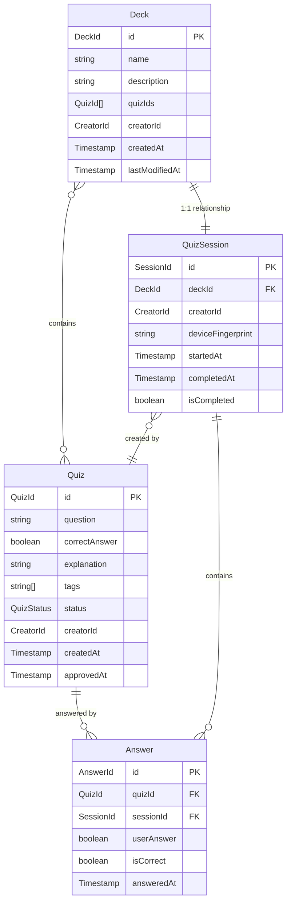

# エンティティ関連性分析

## 目的

[ドメインオブジェクト分類](docs/project/ddd-design/2.05_domain-object-extraction/domain-object-analysis.md)で特定したエンティティ間の関連性を体系的に分析し、集約境界設計・リポジトリ設計・DB設計への制約と指針を明確化する。

## 概要

クイズアプリケーションにおけるエンティティ間の関連性を分析し、所有関係・参照関係・集約境界を明確化します。この分析は`specifications/user-stories/user-story-quiz.md`のユーザー操作シナリオと`requirements-quiz.md`のデータ関係制約に基づいています。

## エンティティ関連性マップ



## 関連性パターン分析表

| エンティティA | エンティティB | 関連性 | 多重度 | 所有/参照 | 判定理由 | 制約事項 |
|---------------|---------------|--------|--------|-----------|----------|----------|
| **Quiz** | **Answer** | クイズ-回答 | 1:N | 参照関係 | Answerが外部キーでQuizを参照 | 承認済みクイズのみ回答可能 |
| **Deck** | **Quiz** | 問題集-クイズ | N:M | 参照関係 | Deckが複数QuizのIDを保持 | 承認済みクイズのみ問題集に追加可能 |
| **Deck** | **QuizSession** | 問題集-セッション | 1:1 | 所有関係 | 1つの問題集に対して1つのセッション | Deck削除時にQuizSessionも削除 |
| **QuizSession** | **Answer** | セッション-回答 | 1:N | 所有関係 | セッション内で複数回答を管理 | セッション削除時回答も削除 |
| **QuizSession** | **Quiz** | セッション-作成クイズ | 1:N | 参照関係 | 作成者識別による関連付け | CreatorIdによる間接参照 |

## 詳細関連性分析

### 1. Quiz ←→ Answer 関係

#### 関連性の特徴

- **種別**: 参照関係（1:N）
- **方向性**: Answer → Quiz（単方向参照）
- **カスケード**: なし（Quizが削除されてもAnswerは履歴として保持）

#### ビジネスルール

1. **回答可能性制約**: 承認済み（Approved）状態のQuizのみ回答可能
2. **回答重複許可**: 同一Quizに対する複数回答は許可
3. **履歴保持**: Quiz削除後もAnswer履歴は保持（匿名化）

#### 実装上の考慮事項

```typescript
interface Answer {
  readonly quizId: QuizId; // 外部キー参照
  // Quiz承認状態の事前チェックが必要
}

// 回答時のバリデーション
const validateAnswerCreation = (quiz: Quiz, answer: Answer): Result<void, Error> => {
  if (quiz.status !== QuizStatus.Approved) {
    return err(new Error('承認済みクイズのみ回答可能'));
  }
  return ok(undefined);
};
```

### 2. QuizSession ←→ Answer 関係

#### 関連性の特徴（QuizSession-Answer）

- **種別**: 所有関係（1:N）
- **方向性**: QuizSession ← Answer（双方向）
- **カスケード**: Session削除時にAnswerも削除

#### ビジネスルール（QuizSession-Answer）

1. **セッション包含**: すべてのAnswerは特定のQuizSessionに属する
2. **匿名性保証**: SessionIdによる匿名回答管理
3. **オフライン対応**: セッション単位でのオフライン同期

#### 実装上の考慮事項（QuizSession-Answer）

```typescript
interface QuizSession {
  readonly id: SessionId;
  answers: Answer[]; // 所有関係

  addAnswer(answer: Answer): Result<void, Error> {
    // 整合性チェック
    this.answers.push(answer);
    return ok(undefined);
  }
}
```

### 3. Deck ←→ Quiz 関係

#### 関連性の特徴（Deck-Quiz）

- **種別**: 参照関係（N:M）
- **方向性**: Deck → Quiz（QuizId配列による参照）
- **カスケード**: なし（Quiz削除時は問題集から除外）

#### ビジネスルール（Deck-Quiz）

1. **問題選択**: 検索結果やユーザー選択による動的なクイズ組み合わせ
2. **承認状態制約**: 承認済み（Approved）状態のQuizのみ問題集に追加可能
3. **重複許可**: 同一Quiz を複数の問題集に含めることが可能
4. **順序保持**: 問題集内でのクイズ出題順序を保持

#### 実装上の考慮事項（Deck-Quiz）

```typescript
interface Deck {
  readonly quizIds: QuizId[]; // 順序付きクイズ参照

  addQuiz(quiz: Quiz): Result<void, Error> {
    if (quiz.status !== QuizStatus.Approved) {
      return err(new Error('承認済みクイズのみ問題集に追加可能'));
    }
    this.quizIds.push(quiz.id);
    return ok(undefined);
  }

  removeQuiz(quizId: QuizId): void {
    this.quizIds = this.quizIds.filter(id => !id.equals(quizId));
  }
}
```

### 4. Deck ←→ QuizSession 関係

#### 関連性の特徴（Deck-QuizSession）

- **種別**: 所有関係（1:1）
- **方向性**: Deck ← QuizSession（双方向）
- **カスケード**: Deck削除時にQuizSessionも削除

#### ビジネスルール（Deck-QuizSession）

1. **1対1制約**: 1つの問題集（Deck）に対して必ず1つのセッション（QuizSession）
2. **ライフサイクル連動**: 問題集作成時にセッションも自動作成
3. **進捗管理**: セッションを通じて問題集の解答進捗を管理
4. **完了判定**: 問題集内のすべてのクイズに回答した時点でセッション完了

#### 実装上の考慮事項（Deck-QuizSession）

```typescript
interface Deck {
  readonly id: DeckId;
  private _session?: QuizSession;

  createSession(creatorId: CreatorId): QuizSession {
    if (this._session) {
      throw new Error('セッションは既に存在します');
    }
    
    this._session = QuizSession.create({
      deckId: this.id,
      creatorId,
      quizCount: this.quizIds.length
    });
    
    return this._session;
  }

  get session(): QuizSession | undefined {
    return this._session;
  }
}
```

### 5. QuizSession ←→ Quiz 関係

#### 関連性の特徴（QuizSession-Quiz）

- **種別**: 参照関係（1:N）
- **方向性**: QuizSession → Quiz（CreatorId経由）
- **カスケード**: なし（間接参照のため）

#### ビジネスルール（QuizSession-Quiz）

1. **作成者識別**: CreatorIdによる間接的な所有関係
2. **匿名性保証**: 直接的なユーザー情報は保存しない
3. **作成権限**: セッション作成者のみが自分のクイズを確認可能

#### 実装上の考慮事項（QuizSession-Quiz）

```typescript
interface QuizSession {
  readonly creatorId: CreatorId;
  readonly deckId: DeckId;

  // 作成者のクイズを取得（リポジトリ経由）
  getCreatedQuizzes(quizRepository: QuizRepository): Promise<Quiz[]> {
    return quizRepository.findByCreatorId(this.creatorId);
  }

  // 問題集のクイズを取得（Deck経由）
  async getDeckQuizzes(
    deckRepository: DeckRepository,
    quizRepository: QuizRepository
  ): Promise<Quiz[]> {
    const deck = await deckRepository.findById(this.deckId);
    if (!deck) return [];
    
    return quizRepository.findByIds(deck.quizIds);
  }
}
```

## 集約境界の候補

### 候補1: Quiz単体集約

#### 集約構成（Quiz単体集約）

- **集約ルート**: Quiz
- **集約メンバー**: なし（Quizのみ）
- **境界**: Quiz単体

#### メリット（Quiz単体集約）

- シンプルな境界設定
- 承認フローの独立性
- スケーラビリティ

#### デメリット（Quiz単体集約）

- Answer管理の複雑化
- 整合性保証の困難

### 候補2: QuizSession集約

#### 集約構成（QuizSession集約）

- **集約ルート**: QuizSession
- **集約メンバー**: Answer（複数）
- **境界**: セッション単位

#### メリット（QuizSession集約）

- 匿名ユーザー管理の統一
- オフライン同期の一元化
- 回答履歴の一貫性保証

#### デメリット（QuizSession集約）

- 集約サイズの肥大化懸念
- Quiz参照の複雑化

### 候補3: Deck集約

#### 集約構成（Deck集約）

- **集約ルート**: Deck
- **集約メンバー**: QuizSession（1対1）
- **境界**: 問題集単位

#### メリット（Deck集約）

- 問題集とセッションのライフサイクル統一
- 検索結果から学習までの一貫した管理
- 進捗管理の単純化

#### デメリット（Deck集約）

- Quiz参照の複雑化（N:M関係）
- 集約跨ぎの処理増加

### 推奨: 拡張ハイブリッド境界設定

#### Quiz集約

- **集約ルート**: Quiz
- **責務**: クイズライフサイクル管理
- **不変条件**: 承認状態・内容整合性

#### Deck集約

- **集約ルート**: Deck
- **集約メンバー**: QuizSession（1:1関係）
- **責務**: 問題集とセッション管理
- **不変条件**: Deck-QuizSession整合性、進捗状況管理

#### 独立Answer管理

- **エンティティ**: Answer（集約外）
- **責務**: 回答履歴の永続化
- **管理方法**: ドメインサービス経由でのアクセス

## 整合性保証戦略

### 1. 集約内整合性（強一貫性）

#### Quiz集約内

- ステータス遷移の妥当性
- 問題文・解説の制約チェック
- 作成者権限の検証

#### Deck集約内

- Deck-QuizSession 1:1関係の保証
- 問題集内クイズ順序の保持
- セッション進捗状況の整合性
- 完了判定の正確性

### 2. 集約間整合性（結果整合性）

#### Quiz-Answer間

- 承認済みクイズのみ回答可能（参照時チェック）
- Quiz削除時のAnswer孤児化許可（履歴保持）
- 統計情報の非同期更新

#### Deck-Quiz間

- 承認済みクイズのみ問題集に追加可能
- Quiz削除時の問題集からの自動除外
- 問題集の動的更新（結果整合性）

#### Session-Quiz間

- 作成者権限の間接的確認
- CreatorId一致性の検証
- 作成クイズ表示の権限制御

### 3. 実装パターン

#### リポジトリパターン

```typescript
interface QuizRepository {
  findById(id: QuizId): Promise<Quiz | null>;
  findByIds(ids: QuizId[]): Promise<Quiz[]>;
  findByCreatorId(creatorId: CreatorId): Promise<Quiz[]>;
  findApprovedQuizzes(): Promise<Quiz[]>;
  save(quiz: Quiz): Promise<void>;
}

interface DeckRepository {
  findById(id: DeckId): Promise<Deck | null>;
  findByCreatorId(creatorId: CreatorId): Promise<Deck[]>;
  save(deck: Deck): Promise<void>;
  delete(id: DeckId): Promise<void>;
}

interface SessionRepository {
  findById(id: SessionId): Promise<QuizSession | null>;
  findByDeckId(deckId: DeckId): Promise<QuizSession | null>;
  findByCreatorId(creatorId: CreatorId): Promise<QuizSession[]>;
  save(session: QuizSession): Promise<void>;
}

interface AnswerRepository {
  findBySessionId(sessionId: SessionId): Promise<Answer[]>;
  save(answer: Answer): Promise<void>;
  saveAll(answers: Answer[]): Promise<void>;
}
```

#### ドメインサービス

```typescript
class DeckManagementService {
  constructor(
    private deckRepo: DeckRepository,
    private quizRepo: QuizRepository,
    private sessionRepo: SessionRepository
  ) {}

  async createDeckFromSearchResults(
    searchResults: Quiz[],
    creatorId: CreatorId,
    name: string,
    description: string
  ): Promise<Result<Deck, Error>> {
    // 承認済みクイズのみフィルタリング
    const approvedQuizzes = searchResults.filter(quiz => 
      quiz.status === QuizStatus.Approved
    );

    if (approvedQuizzes.length === 0) {
      return err(new Error('問題集に追加できるクイズがありません'));
    }

    const deck = Deck.create({
      name,
      description,
      quizIds: approvedQuizzes.map(quiz => quiz.id),
      creatorId
    });

    // 1:1関係でセッションを作成
    const session = deck.createSession(creatorId);

    await Promise.all([
      this.deckRepo.save(deck),
      this.sessionRepo.save(session)
    ]);

    return ok(deck);
  }
}

class QuizAnswerService {
  constructor(
    private quizRepo: QuizRepository,
    private sessionRepo: SessionRepository,
    private answerRepo: AnswerRepository
  ) {}

  async recordAnswer(
    sessionId: SessionId,
    quizId: QuizId,
    userAnswer: boolean
  ): Promise<Result<void, Error>> {
    const [quiz, session] = await Promise.all([
      this.quizRepo.findById(quizId),
      this.sessionRepo.findById(sessionId)
    ]);

    if (!quiz || quiz.status !== QuizStatus.Approved) {
      return err(new Error('回答できないクイズです'));
    }

    if (!session) {
      return err(new Error('無効なセッションです'));
    }

    const answer = Answer.create({
      quizId,
      sessionId,
      userAnswer,
      isCorrect: userAnswer === quiz.correctAnswer.value
    });

    // Answerは独立管理
    await this.answerRepo.save(answer);

    // セッション進捗更新
    session.recordAnswer(answer);
    await this.sessionRepo.save(session);

    return ok(undefined);
  }
}
```

## パフォーマンス考慮事項

### 1. クエリ最適化

#### 効率的なクエリパターン

- Quiz取得: Status + CreatedAt でのインデックス
- Deck取得: CreatorId + CreatedAt でのインデックス
- Answer取得: SessionId + AnsweredAt でのインデックス
- Session取得: DeckId（1:1関係）+ CreatorId でのインデックス

#### 避けるべきパターン

- N+1クエリ（Deck-Quiz結合、Quiz-Answer結合）
- 全量取得（ページネーション必須）
- 複雑JOIN（集約境界を越えた結合）
- Deck内のQuiz配列に対する非効率な検索

### 2. キャッシュ戦略

#### キャッシュ対象

- 承認済みクイズ一覧（高頻度アクセス）
- タグ一覧（フィルタリング用）
- 問題集情報（ユーザー作成）
- セッション情報（ユーザー識別用）
- Deck内クイズの事前読み込み

#### キャッシュ無効化

- Quiz承認時の一覧キャッシュ無効化
- Deck作成・更新時の関連キャッシュ無効化
- セッション更新時の権限キャッシュ無効化
- Quiz削除時のDeck参照キャッシュ無効化

### 3. データ分割

#### シャーディング候補

- CreatorIdによるDeck・セッション分割
- 日付によるAnswer履歴分割
- StatusによるQuiz分割
- DeckIdによるSession分離

#### パーティション戦略

- 時系列分割（月次パーティション）
- 機能分割（読み書き分離）
- 問題集サイズによる分割

## まとめ

クイズアプリケーションにおけるエンティティ間関係を5つの主要パターン（Quiz↔Answer、Deck↔Quiz、Deck↔QuizSession、QuizSession↔Answer、QuizSession↔Quiz）として整理し、それぞれの関係性・多重度・整合性制約を明確化しました。

**拡張ハイブリッド境界設定**（Quiz集約 + Deck集約 + 独立Answer管理）により、承認フロー・問題集管理・ユーザー活動を適切に分離しながら、Deck-QuizSession 1:1関係の強固な整合性保証を実現します。この設計により、検索結果から問題集作成、学習セッション実行までの一貫したユーザー体験と、スケーラビリティ・保守性を両立した実装が可能になります。

## 関連ドキュメント

- [ドメインオブジェクト分類](docs/project/ddd-design/2.05_domain-object-extraction/domain-object-analysis.md)
- [集約設計](docs/project/ddd-design/2.08_aggregate-design/README.md)
- [境界づけられたコンテキスト定義](docs/project/ddd-design/2.09_bounded-context-definition/README.md)
- [ドメインサービス抽出](docs/project/ddd-design/2.07_domain-service-extraction/domain-service-analysis.md)

---
**作成工程**: DDD設計
**作成日**: 2025-01-30
**更新日**: 2025-01-30
