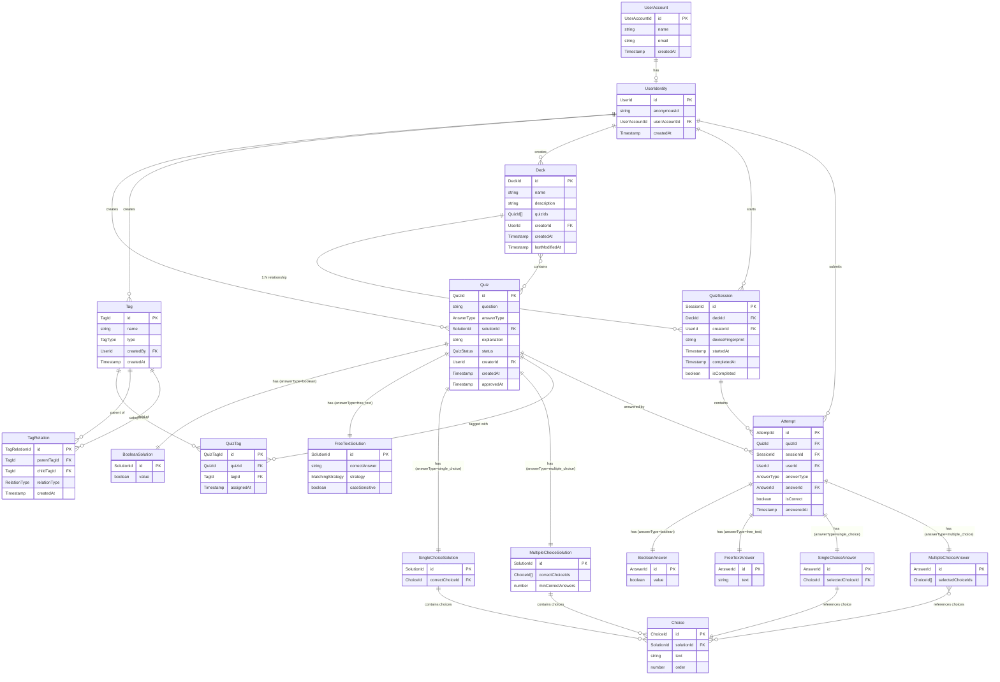

# エンティティ関連性分析

## 目的

[ドメインオブジェクト分類](docs/project/ddd-design/2.05_domain-object-extraction/domain-object-analysis.md)で特定したエンティティ間の関連性を体系的に分析し、集約境界設計・リポジトリ設計・DB設計への制約と指針を明確化する。

## 概要

クイズアプリケーションにおけるエンティティ間の関連性を分析し、所有関係・参照関係・集約境界を明確化します。この分析は`specifications/user-stories/user-story-quiz.md`のユーザー操作シナリオと`requirements-quiz.md`のデータ関係制約に基づいています。

## エンティティ関連性マップ



## 関連性パターン分析表

| エンティティA | エンティティB | 関連性 | 多重度 | 所有/参照 | 判定理由 | 制約事項 |
|---------------|---------------|--------|--------|-----------|----------|----------|
| **UserAccount** | **UserIdentity** | アカウント-永続識別子 | 1:1 | 参照関係 | UserIdentityが外部キーでUserAccountを参照 | UserAccount削除時もUserIdentity保持 |
| **UserIdentity** | **Quiz** | ユーザー-作成クイズ | 1:N | 参照関係 | QuizがUserIdentity.UserIdを参照 | 匿名ユーザーによるクイズ作成 |
| **UserIdentity** | **Tag** | ユーザー-作成タグ | 1:N | 参照関係 | TagがUserIdentity.UserIdを参照 | ユーザー登録タグのみ |
| **UserIdentity** | **Deck** | ユーザー-作成問題集 | 1:N | 参照関係 | DeckがUserIdentity.UserIdを参照 | 匿名ユーザーによる問題集作成 |
| **UserIdentity** | **QuizSession** | ユーザー-学習セッション | 1:N | 参照関係 | QuizSessionがUserIdentity.UserIdを参照 | セッション作成者識別 |
| **UserIdentity** | **Attempt** | ユーザー-回答試行 | 1:N | 参照関係 | AttemptがUserIdentity.UserIdを参照 | 回答者識別 |
| **Quiz** | **Attempt** | クイズ-回答試行 | 1:N | 参照関係 | Attemptが外部キーでQuizを参照 | 承認済みクイズのみ回答可能 |
| **Quiz** | **BooleanSolution** | クイズ-真偽正解 | 1:1 | 所有関係 | Quizがpolymorphic参照でBooleanSolutionを所有 | answerType='boolean'時のみ関連 |
| **Quiz** | **FreeTextSolution** | クイズ-自由記述正解 | 1:1 | 所有関係 | Quizがpolymorphic参照でFreeTextSolutionを所有 | answerType='free_text'時のみ関連 |
| **Quiz** | **SingleChoiceSolution** | クイズ-単一選択正解 | 1:1 | 所有関係 | Quizがpolymorphic参照でSingleChoiceSolutionを所有 | answerType='single_choice'時のみ関連 |
| **Quiz** | **MultipleChoiceSolution** | クイズ-複数選択正解 | 1:1 | 所有関係 | Quizがpolymorphic参照でMultipleChoiceSolutionを所有 | answerType='multiple_choice'時のみ関連 |
| **SingleChoiceSolution** | **Choice** | 単一選択-選択肢 | 1:N | 所有関係 | SingleChoiceSolutionが複数Choiceを所有 | 選択肢作成時に自動関連付け |
| **MultipleChoiceSolution** | **Choice** | 複数選択-選択肢 | 1:N | 所有関係 | MultipleChoiceSolutionが複数Choiceを所有 | 選択肢作成時に自動関連付け |
| **Quiz** | **Tag** | クイズ-タグ | N:M | 参照関係 | QuizTag中間テーブルによる関連 | タグによる分類・検索 |
| **Tag** | **Tag** | タグ-タグ階層 | N:M | 参照関係 | TagRelation中間テーブルによる関連 | 階層構造（食べ物/ラーメン等） |
| **Deck** | **Quiz** | 問題集-クイズ | N:M | 参照関係 | Deckが複数QuizのIDを保持 | 承認済みクイズのみ問題集に追加可能 |
| **Deck** | **QuizSession** | 問題集-セッション | 1:N | 参照関係 | 複数セッションで同じ問題集を解答可能 | 同一問題集の繰り返し学習対応 |
| **Attempt** | **BooleanAnswer** | 回答試行-真偽回答 | 1:1 | 所有関係 | Attemptがpolymorphic参照でBooleanAnswerを所有 | answerType='boolean'時のみ関連 |
| **Attempt** | **FreeTextAnswer** | 回答試行-自由記述回答 | 1:1 | 所有関係 | Attemptがpolymorphic参照でFreeTextAnswerを所有 | answerType='free_text'時のみ関連 |
| **Attempt** | **SingleChoiceAnswer** | 回答試行-単一選択回答 | 1:1 | 所有関係 | Attemptがpolymorphic参照でSingleChoiceAnswerを所有 | answerType='single_choice'時のみ関連 |
| **Attempt** | **MultipleChoiceAnswer** | 回答試行-複数選択回答 | 1:1 | 所有関係 | Attemptがpolymorphic参照でMultipleChoiceAnswerを所有 | answerType='multiple_choice'時のみ関連 |
| **SingleChoiceAnswer** | **Choice** | 単一選択回答-選択肢 | 1:1 | 参照関係 | SingleChoiceAnswerが選択された1つのChoiceを参照 | 正解選択肢との整合性確認 |
| **MultipleChoiceAnswer** | **Choice** | 複数選択回答-選択肢 | 1:N | 参照関係 | MultipleChoiceAnswerが選択された複数Choiceを参照 | 正解選択肢との整合性確認 |
| **QuizSession** | **Attempt** | セッション-回答試行 | 1:N | 所有関係 | セッション内で複数回答を管理 | セッション削除時回答も削除 |

## 詳細関連性分析

### 1. Quiz ←→ SolutionTypes 関係（Polymorphic Design）

#### 関連性の特徴（Quiz-SolutionTypes）

- **パターン**: Discriminator + Solution テーブル分離型ポリモーフィズム
- **種別**: 所有関係（1:1、answerType別）
- **方向性**: Quiz → Specific Solution Type（単方向所有）
- **識別子**: answerType（discriminator）+ solutionId（外部キー）

#### ポリモーフィック設計の利点

1. **拡張性**: 新しい回答タイプ追加時、既存コードへの影響最小化
2. **型安全性**: TypeScript discriminated unionによるコンパイル時型チェック
3. **パフォーマンス**: 回答タイプ別の最適化されたテーブル設計
4. **保守性**: 各回答タイプの独立したバリデーション・ビジネスロジック

#### 回答タイプ別制約

| 回答タイプ | 制約事項 | バリデーション | 使用ケース |
|-----------|----------|---------------|------------|
| **boolean** | true/false のみ | 2値チェック | ◯×問題、正誤判定 |
| **free_text** | 文字列マッチング | 正解パターン登録必須 | 記述問題、計算問題 |
| **single_choice** | 選択肢2-6個、正解1個 | 選択肢数・正解数チェック | 4択問題、語彙問題 |
| **multiple_choice** | 選択肢2-10個、正解1個以上 | 最小正解数チェック | 複数正解問題、分類問題 |

### 2. User 関係（分離型匿名ユーザー管理）

#### 関連性の特徴（UserAccount-UserIdentity分離設計）

- **UserAccount**: 削除可能な詳細情報（name, email等）
- **UserIdentity**: 永続的な匿名識別子（Quiz/Deck等が参照）
- **種別**: UserAccount ←→ UserIdentity (1:1), UserIdentity → エンティティ（1:N）
- **方向性**: UserIdentity → エンティティ（単方向参照）

#### ビジネスルール（分離型User管理）

1. **データ保持**: UserAccount削除時もUserIdentity経由でQuiz/Deck等のコンテンツ保持
2. **匿名性保証**: UserIdentity.anonymousIdによる匿名ユーザー識別
3. **作成権限**: UserIdentity.UserIdによるコンテンツ所有権管理
4. **アカウント連携**: UserIdentity.userAccountIdでアカウント情報と紐付け（nullable）

#### QuizSession、Attempt のUserID重複に関する考察

**設計妥当性分析**：

- **QuizSession.userId**: セッション開始者を識別（学習履歴管理）
- **Attempt.userId**: 各回答の実行者を識別（回答統計管理）
- **重複の必要性**: セッション共有シナリオで異なるユーザーが回答する可能性
- **整合性制約**: 通常はQuizSession.userId = Attempt.userId だが、将来の拡張性を考慮
- **UserIdentity参照**: 両方ともUserIdentity.UserIdを参照し、UserAccount削除時も履歴保持

### 3. Attempt ←→ AnswerTypes 関係（Polymorphic Answer Design）

#### 関連性の特徴（Attempt-AnswerTypes）

- **パターン**: Discriminator + Answer テーブル分離型ポリモーフィズム
- **種別**: 所有関係（1:1、answerType別）
- **方向性**: Attempt → Specific Answer Type（単方向所有）
- **識別子**: answerType（discriminator）+ answerId（外部キー）

#### ポリモーフィック回答設計の利点

1. **型安全性**: Solution と Answer の型対応保証（BooleanSolution ↔ BooleanAnswer）
2. **拡張性**: 新しい回答タイプ追加時、既存コードへの影響最小化
3. **データ整合性**: 回答タイプ別の最適化されたバリデーション
4. **保守性**: 各回答タイプの独立したビジネスロジック

#### 回答タイプ別制約

| 回答タイプ | Answer構造 | バリデーション | Solution対応 |
|-----------|-----------|---------------|-------------|
| **boolean** | BooleanAnswer { value: boolean } | true/false チェック | BooleanSolution |
| **free_text** | FreeTextAnswer { text: string } | 文字列長・形式チェック | FreeTextSolution |
| **single_choice** | SingleChoiceAnswer { selectedChoiceId } | 選択肢存在チェック | SingleChoiceSolution |
| **multiple_choice** | MultipleChoiceAnswer { selectedChoiceIds[] } | 選択肢存在・重複チェック | MultipleChoiceSolution |

#### 整合性制約

1. **型対応**: Quiz.answerType = Attempt.answerType の一致制約
2. **Choice参照**: Single/MultipleChoiceAnswerの選択肢は対応するSolutionのChoiceから選択
3. **正解判定**: Answer と Solution の値比較によるisCorrect算出

### 4. Quiz ←→ Attempt 関係（回答履歴）

#### 関連性の特徴（Quiz-Attempt）

- **種別**: 参照関係（1:N）
- **方向性**: Attempt → Quiz（単方向参照）
- **カスケード**: なし（Quizが削除されてもAttemptは履歴として保持）

#### ビジネスルール

1. **回答可能性制約**: 承認済み（Approved）状態のQuizのみ回答可能
2. **回答重複許可**: 同一Quizに対する複数回答は許可
3. **履歴保持**: Quiz削除後もAttempt履歴は保持（匿名化）

#### セッション内解答確認機能

**実装方針**：

- AttemptテーブルからsessionId, quizIdで解答済み状況を確認
- QuizSessionに対する進捗管理をAttempt履歴から動的に算出
- 解答済みフラグ: `EXISTS(SELECT 1 FROM Attempt WHERE sessionId = ? AND quizId = ?)`

### 5. Tag管理システム（階層構造・分類）

#### Tag-Tag関係（TagRelation中間テーブル）

- **パターン**: N:M自己参照 + 関係性タイプ
- **中間テーブル**: TagRelation
- **関係性タイプ**: 階層（parent-child）、分類（category-item）、関連（related）

#### Tag分類

| TagType | 説明 | 作成者 | 例 |
|---------|------|--------|---|
| **official** | 公式タグ | システム管理者 | JavaScript, プログラミング, 基礎 |
| **user** | ユーザー登録タグ | 一般ユーザー | 自作問題, 復習用, 難問 |

#### TagRelation設計

```typescript
RelationType: 'hierarchy' | 'category' | 'synonym' | 'related'

階層例: 食べ物/ラーメン/豚骨ラーメン
- 食べ物(parent) -[hierarchy]-> ラーメン(child)
- ラーメン(parent) -[hierarchy]-> 豚骨ラーメン(child)
```

#### Quiz-Tag関係（QuizTag中間テーブル）

- **多対多関係**: Quiz : Tag = N:M
- **中間テーブル**: QuizTag
- **タグ付け履歴**: assignedAt で管理

### 6. Deck ←→ QuizSession 関係（1:N設計）

#### 関連性の特徴（Deck-QuizSession）

- **種別**: 参照関係（1:N）
- **方向性**: QuizSession → Deck（単方向参照）
- **カスケード**: Deck削除時にQuizSessionは orphan 状態

#### ビジネスルール（Deck-QuizSession）

1. **繰り返し学習**: 同一Deckで複数回学習セッション実行可能
2. **セッション独立性**: 各セッションは独立した進捗・結果を持つ
3. **学習履歴**: 同じ問題集での学習改善を追跡可能

### 7. QuizSession ←→ Attempt 関係

#### 関連性の特徴（QuizSession-Attempt）

- **種別**: 所有関係（1:N）
- **方向性**: QuizSession ← Attempt（双方向）
- **カスケード**: Session削除時にAttemptも削除

#### ビジネスルール（QuizSession-Attempt）

1. **セッション包含**: すべてのAttemptは特定のQuizSessionに属する
2. **匿名性保証**: SessionIdによる匿名回答管理
3. **オフライン対応**: セッション単位でのオフライン同期

#### セッション内解答確認機能

- AttemptテーブルからsessionId, quizIdで解答済み状況を確認
- QuizSessionに対する進捗管理をAttempt履歴から動的に算出
- 解答済みフラグ: `EXISTS(SELECT 1 FROM Attempt WHERE sessionId = ? AND quizId = ?)`

### 8. Deck ←→ Quiz 関係

#### 関連性の特徴（Deck-Quiz）

- **種別**: 参照関係（N:M）
- **方向性**: Deck → Quiz（QuizId配列による参照）
- **カスケード**: なし（Quiz削除時は問題集から除外）

#### ビジネスルール（Deck-Quiz）

1. **問題選択**: 検索結果やユーザー選択による動的なクイズ組み合わせ
2. **承認状態制約**: 承認済み（Approved）状態のQuizのみ問題集に追加可能
3. **重複許可**: 同一Quiz を複数の問題集に含めることが可能
4. **順序保持**: 問題集内でのクイズ出題順序を保持

#### 実装上の考慮事項（Deck-Quiz）

- 承認済みクイズのみ問題集に追加可能
- 順序付きクイズ参照による出題順序管理
- Quiz削除時の問題集からの自動除外処理

## 集約境界の候補

### 候補1: Quiz単体集約

#### 集約構成（Quiz単体集約）

- **集約ルート**: Quiz
- **集約メンバー**: なし（Quizのみ）
- **境界**: Quiz単体

#### メリット（Quiz単体集約）

- シンプルな境界設定
- 承認フローの独立性
- スケーラビリティ

#### デメリット（Quiz単体集約）

- Answer管理の複雑化
- 整合性保証の困難

### 候補2: QuizSession集約

#### 集約構成（QuizSession集約）

- **集約ルート**: QuizSession
- **集約メンバー**: Answer（複数）
- **境界**: セッション単位

#### メリット（QuizSession集約）

- 匿名ユーザー管理の統一
- オフライン同期の一元化
- 回答履歴の一貫性保証

#### デメリット（QuizSession集約）

- 集約サイズの肥大化懸念
- Quiz参照の複雑化

### 候補3: Deck集約

#### 集約構成（Deck集約）

- **集約ルート**: Deck
- **集約メンバー**: QuizSession（1対1）
- **境界**: 問題集単位

#### メリット（Deck集約）

- 問題集とセッションのライフサイクル統一
- 検索結果から学習までの一貫した管理
- 進捗管理の単純化

#### デメリット（Deck集約）

- Quiz参照の複雑化（N:M関係）
- 集約跨ぎの処理増加

### 推奨: 拡張ハイブリッド境界設定

#### Quiz集約

- **集約ルート**: Quiz
- **責務**: クイズライフサイクル管理
- **不変条件**: 承認状態・内容整合性

#### Deck集約

- **集約ルート**: Deck
- **集約メンバー**: QuizSession（1:1関係）
- **責務**: 問題集とセッション管理
- **不変条件**: Deck-QuizSession整合性、進捗状況管理

#### 独立Answer管理

- **エンティティ**: Answer（集約外）
- **責務**: 回答履歴の永続化
- **管理方法**: ドメインサービス経由でのアクセス

## 整合性保証戦略

### 1. 集約内整合性（強一貫性）

#### Quiz集約内

- ステータス遷移の妥当性
- 問題文・解説の制約チェック
- 作成者権限の検証

#### Deck集約内

- Deck-QuizSession 1:1関係の保証
- 問題集内クイズ順序の保持
- セッション進捗状況の整合性
- 完了判定の正確性

### 2. 集約間整合性（結果整合性）

#### Quiz-Answer間

- 承認済みクイズのみ回答可能（参照時チェック）
- Quiz削除時のAnswer孤児化許可（履歴保持）
- 統計情報の非同期更新

#### Deck-Quiz間

- 承認済みクイズのみ問題集に追加可能
- Quiz削除時の問題集からの自動除外
- 問題集の動的更新（結果整合性）

#### Session-Quiz間

- 作成者権限の間接的確認
- CreatorId一致性の検証
- 作成クイズ表示の権限制御

### 3. 実装パターン

#### リポジトリパターン

```typescript
interface QuizRepository {
  findById(id: QuizId): Promise<Quiz | null>;
  findByIds(ids: QuizId[]): Promise<Quiz[]>;
  findByCreatorId(creatorId: CreatorId): Promise<Quiz[]>;
  findApprovedQuizzes(): Promise<Quiz[]>;
  save(quiz: Quiz): Promise<void>;
}

interface DeckRepository {
  findById(id: DeckId): Promise<Deck | null>;
  findByCreatorId(creatorId: CreatorId): Promise<Deck[]>;
  save(deck: Deck): Promise<void>;
  delete(id: DeckId): Promise<void>;
}

interface SessionRepository {
  findById(id: SessionId): Promise<QuizSession | null>;
  findByDeckId(deckId: DeckId): Promise<QuizSession | null>;
  findByCreatorId(creatorId: CreatorId): Promise<QuizSession[]>;
  save(session: QuizSession): Promise<void>;
}

interface AnswerRepository {
  findBySessionId(sessionId: SessionId): Promise<Answer[]>;
  save(answer: Answer): Promise<void>;
  saveAll(answers: Answer[]): Promise<void>;
}
```

#### ドメインサービス

```typescript
class DeckManagementService {
  constructor(
    private deckRepo: DeckRepository,
    private quizRepo: QuizRepository,
    private sessionRepo: SessionRepository
  ) {}

  async createDeckFromSearchResults(
    searchResults: Quiz[],
    creatorId: CreatorId,
    name: string,
    description: string
  ): Promise<Result<Deck, Error>> {
    // 承認済みクイズのみフィルタリング
    const approvedQuizzes = searchResults.filter(quiz => 
      quiz.status === QuizStatus.Approved
    );

    if (approvedQuizzes.length === 0) {
      return err(new Error('問題集に追加できるクイズがありません'));
    }

    const deck = Deck.create({
      name,
      description,
      quizIds: approvedQuizzes.map(quiz => quiz.id),
      creatorId
    });

    // 1:1関係でセッションを作成
    const session = deck.createSession(creatorId);

    await Promise.all([
      this.deckRepo.save(deck),
      this.sessionRepo.save(session)
    ]);

    return ok(deck);
  }
}

class QuizAnswerService {
  constructor(
    private quizRepo: QuizRepository,
    private sessionRepo: SessionRepository,
    private answerRepo: AnswerRepository
  ) {}

  async recordAnswer(
    sessionId: SessionId,
    quizId: QuizId,
    userAnswer: boolean
  ): Promise<Result<void, Error>> {
    const [quiz, session] = await Promise.all([
      this.quizRepo.findById(quizId),
      this.sessionRepo.findById(sessionId)
    ]);

    if (!quiz || quiz.status !== QuizStatus.Approved) {
      return err(new Error('回答できないクイズです'));
    }

    if (!session) {
      return err(new Error('無効なセッションです'));
    }

    const answer = Answer.create({
      quizId,
      sessionId,
      userAnswer,
      isCorrect: userAnswer === quiz.correctAnswer.value
    });

    // Answerは独立管理
    await this.answerRepo.save(answer);

    // セッション進捗更新
    session.recordAnswer(answer);
    await this.sessionRepo.save(session);

    return ok(undefined);
  }
}
```

## パフォーマンス考慮事項

### 1. クエリ最適化

#### 効率的なクエリパターン

- Quiz取得: Status + CreatedAt でのインデックス
- Deck取得: CreatorId + CreatedAt でのインデックス
- Answer取得: SessionId + AnsweredAt でのインデックス
- Session取得: DeckId（1:1関係）+ CreatorId でのインデックス

#### 避けるべきパターン

- N+1クエリ（Deck-Quiz結合、Quiz-Answer結合）
- 全量取得（ページネーション必須）
- 複雑JOIN（集約境界を越えた結合）
- Deck内のQuiz配列に対する非効率な検索

### 2. キャッシュ戦略

#### キャッシュ対象

- 承認済みクイズ一覧（高頻度アクセス）
- タグ一覧（フィルタリング用）
- 問題集情報（ユーザー作成）
- セッション情報（ユーザー識別用）
- Deck内クイズの事前読み込み

#### キャッシュ無効化

- Quiz承認時の一覧キャッシュ無効化
- Deck作成・更新時の関連キャッシュ無効化
- セッション更新時の権限キャッシュ無効化
- Quiz削除時のDeck参照キャッシュ無効化

### 3. データ分割

#### シャーディング候補

- CreatorIdによるDeck・セッション分割
- 日付によるAnswer履歴分割
- StatusによるQuiz分割
- DeckIdによるSession分離

#### パーティション戦略

- 時系列分割（月次パーティション）
- 機能分割（読み書き分離）
- 問題集サイズによる分割

## まとめ

クイズアプリケーションにおけるエンティティ間関係を5つの主要パターン（Quiz↔Answer、Deck↔Quiz、Deck↔QuizSession、QuizSession↔Answer、QuizSession↔Quiz）として整理し、それぞれの関係性・多重度・整合性制約を明確化しました。

**拡張ハイブリッド境界設定**（Quiz集約 + Deck集約 + 独立Answer管理）により、承認フロー・問題集管理・ユーザー活動を適切に分離しながら、Deck-QuizSession 1:1関係の強固な整合性保証を実現します。この設計により、検索結果から問題集作成、学習セッション実行までの一貫したユーザー体験と、スケーラビリティ・保守性を両立した実装が可能になります。

## 関連ドキュメント

- [ドメインオブジェクト分類](docs/project/ddd-design/2.05_domain-object-extraction/domain-object-analysis.md)
- [集約設計](docs/project/ddd-design/2.08_aggregate-design/README.md)
- [境界づけられたコンテキスト定義](docs/project/ddd-design/2.09_bounded-context-definition/README.md)
- [ドメインサービス抽出](docs/project/ddd-design/2.07_domain-service-extraction/domain-service-analysis.md)

---
**作成工程**: DDD設計
**作成日**: 2025-01-30
**更新日**: 2025-01-30
