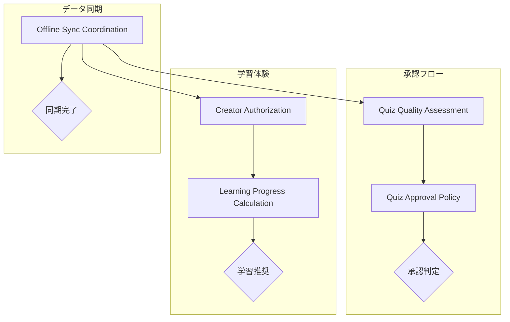

# ドメインサービス分析

## 目的

[集約設計](docs/project/ddd-design/2.08_aggregate-design/README.md)と[エンティティ関係分析](docs/project/ddd-design/2.06_entity-relationship-analysis/entity-relationship-analysis.md)で特定された複数集約操作・複雑計算・外部連携を必要とするドメインロジックを、ドメインサービスとして体系的に抽出・設計する。

## 概要

クイズアプリケーションにおいて、単一集約内では表現できない複雑なビジネスルール・計算・判定ロジックを特定し、適切なドメインサービスとして抽出します。本分析は`specifications/requirements/requirements-quiz.md`のビジネスルール要件に基づいています。

## ドメインサービス抽出基準

### 抽出条件

| 抽出基準 | 判定条件 | 例 |
|----------|----------|-----|
| **複数集約操作** | 複数の集約ルートへの同時アクセス・操作 | Quiz + Answer集約の統合処理 |
| **複雑な計算** | 単一エンティティを超える計算ロジック | 学習進捗の複合計算 |
| **外部連携** | 外部システム・サービスとの連携 | 重複チェック・コンテンツ検証 |
| **ポリシー実装** | 複雑なビジネスポリシー・ルールの実装 | 承認基準・品質判定 |
| **協調処理** | 複数ドメインオブジェクトの協調動作 | 同期処理・競合解決 |

### 除外条件

| 除外基準 | 理由 | 代替手段 |
|----------|------|----------|
| **単一集約内処理** | 集約ルートで十分表現可能 | エンティティメソッド |
| **技術的処理** | ドメイン知識でない | インフラストラクチャサービス |
| **アプリケーション調整** | ドメインロジックでない | アプリケーションサービス |

## 抽出されたドメインサービス一覧

### 1. Quiz Quality Assessment Service（クイズ品質評価サービス）

#### 責務

- クイズ内容の品質評価
- 承認基準適合性判定
- 重複・類似度チェック

#### 抽出理由

- **複数集約参照**: 承認済みQuiz集約群との比較が必要
- **複雑な判定**: 内容品質・重複度・適切性の複合評価
- **外部連携**: コンテンツフィルタリング・自然言語処理との連携

#### 設計パターン

- **入力**: Quiz集約、品質評価基準
- **出力**: 品質評価結果、重複チェック結果、承認推奨
- **副作用**: 品質評価ログの記録

#### 依存関係

- Quiz Repository（既存クイズとの比較）
- Content Filter Service（不適切コンテンツ検出）
- Natural Language Processor（内容理解・類似度計算）

### 2. Learning Progress Calculation Service（学習進捗計算サービス）

#### 責務

- 学習進捗の複合計算
- 学習効果測定
- 個人化された学習指標提供

#### 抽出理由

- **複数集約操作**: Quiz + Answer + LearningSession集約の統合計算
- **複雑な計算**: 正答率・学習効率・進捗度の複合算出
- **時系列分析**: 回答履歴の時系列パターン分析

#### 設計パターン

- **入力**: セッションID、計算対象期間、分析軸
- **出力**: 学習進捗指標、カテゴリ別成績、推奨学習パス
- **副作用**: 学習分析ログの記録

#### 計算アルゴリズム

- **総合進捗率**: (正解数 / 総回答数) × 難易度重み × 時間効率
- **カテゴリ別習熟度**: タグごとの正答率 + 回答頻度 + 継続性
- **学習効率**: 回答時間の改善度 + 正答率の向上度

#### 依存関係

- Answer Repository（回答履歴データ）
- Quiz Repository（クイズメタデータ・難易度）
- Learning Session Repository（セッション情報）

### 3. Creator Authorization Service（作成者権限サービス）

#### 責務

- 作成者権限の検証
- CreatorIdによる所有権確認
- 匿名性を保持した権限管理

#### 抽出理由

- **複数集約操作**: UserSession + Quiz集約の権限チェック
- **セキュリティポリシー**: 匿名性とセキュリティの両立
- **複雑な判定**: salt付きハッシュによる所有権確認

#### 設計パターン

- **入力**: セッションID、対象QuizID、要求権限レベル
- **出力**: 権限可否、アクセスレベル、セキュリティコンテキスト
- **副作用**: アクセス試行ログの記録

#### 権限レベル定義

- **READ**: 自作クイズの閲覧権限
- **EDIT**: 承認待ちクイズの編集権限（削除のみ）
- **STATUS_CHECK**: 承認状況の確認権限

#### 依存関係

- User Session Repository（セッション・作成者情報）
- Quiz Repository（クイズ所有権情報）
- Cryptographic Service（ハッシュ計算・検証）

### 4. Offline Sync Coordination Service（オフライン同期調整サービス）

#### 責務

- オフライン・オンライン間のデータ同期
- 競合解決戦略の実行
- データ整合性保証

#### 抽出理由

- **複数集約操作**: 全コンテキストのデータ同期
- **複雑な協調処理**: 競合解決・整合性制御
- **技術的複雑性**: Last-Write-Wins戦略の実装

#### 設計パターン

- **入力**: 同期セッションID、オフラインデータ、同期戦略
- **出力**: 同期結果、競合解決結果、整合性状態
- **副作用**: 同期ログ・競合解決履歴の記録

#### 同期戦略

- **Last-Write-Wins**: タイムスタンプベースの単純上書き
- **Manual Resolution**: 競合時の手動解決（将来拡張）
- **Conflict Avoidance**: 競合を回避する事前制御

#### 依存関係

- Sync Session Repository（同期セッション管理）
- All Domain Repositories（全ドメインデータアクセス）
- Conflict Resolution Strategy（競合解決戦略）

### 5. Quiz Approval Policy Service（クイズ承認ポリシーサービス）

#### 責務

- 承認基準・ポリシーの実装
- 承認判定の自動化支援
- 品質基準の一貫適用

#### 抽出理由

- **複雑なポリシー**: 多様な承認基準の統合判定
- **外部連携**: 自動化ツール・AI支援システム
- **ビジネスルール集約**: 承認に関わる全ビジネスルールの統合

#### 設計パターン

- **入力**: Quiz集約、品質評価結果、承認コンテキスト
- **出力**: 承認適格性、優先度、自動承認可否、拒否理由
- **副作用**: 承認判定ログの記録

#### 承認基準マトリクス

| 基準項目 | 自動承認可 | 要人的審査 | 自動拒否 |
|----------|------------|------------|----------|
| **内容品質スコア** | 90点以上 | 70-89点 | 70点未満 |
| **重複度** | 10%未満 | 10-30% | 30%超 |
| **不適切フラグ** | なし | 軽微 | 重大 |
| **作成者信頼度** | 高 | 中 | 低・初回 |

#### 依存関係

- Quiz Quality Assessment Service（品質評価結果）
- Content Moderation Service（コンテンツ審査）
- Policy Configuration（承認ポリシー設定）

## ドメインサービス間の関係

### サービス協調パターン

### サービス呼び出し関係

| 呼び出し元 | 呼び出し先 | 呼び出し理由 | 頻度 |
|------------|------------|-------------|------|
| **Quiz Approval Policy** | **Quiz Quality Assessment** | 承認判定時の品質評価 | 中 |
| **Learning Progress Calculation** | **Creator Authorization** | 個人化進捗での権限確認 | 低 |
| **Offline Sync Coordination** | **Creator Authorization** | 同期時の権限検証 | 低 |

## 設計原則と制約

### 設計原則

1. **単一責任**: 各サービスは明確に定義された単一の責務を持つ
2. **ステートレス**: サービス自体は状態を持たず、引数と戻り値で完結
3. **べき等性**: 同じ入力に対して同じ結果を返す
4. **分離性**: 他サービスとの疎結合を保つ

### 技術制約

1. **言語非依存**: 特定言語の実装詳細に依存しない設計
2. **プラットフォーム中立**: 実行環境に依存しない抽象化
3. **外部サービス抽象化**: 具体的なAPIでなくインターフェースで定義
4. **テスタビリティ**: 単体テスト・統合テストが容易な構造

### パフォーマンス考慮

| サービス | 重い処理 | 最適化戦略 | 期待効果 |
|----------|----------|------------|----------|
| **Quiz Quality Assessment** | 自然言語処理・類似度計算 | 非同期処理・結果キャッシュ | レスポンス時間短縮 |
| **Learning Progress Calculation** | 大量履歴データの集計 | 増分計算・バッチ処理 | CPU負荷軽減 |
| **Offline Sync Coordination** | 全データの整合性チェック | 差分同期・並列処理 | 同期時間短縮 |

## まとめ

クイズアプリケーションドメインにおいて、**5つの主要ドメインサービス**を抽出しました：

1. **Quiz Quality Assessment Service**: 品質評価・重複チェック
2. **Learning Progress Calculation Service**: 学習進捗・効果計算  
3. **Creator Authorization Service**: 匿名作成者権限管理
4. **Offline Sync Coordination Service**: データ同期・競合解決
5. **Quiz Approval Policy Service**: 承認基準・ポリシー実装

各サービスは言語・プラットフォームに依存しない抽象的な設計となっており、複雑なビジネスルールを適切に抽象化することで、保守性・テスタビリティ・移植性を確保します。

## 関連ドキュメント

- [集約設計](docs/project/ddd-design/2.08_aggregate-design/README.md)
- [エンティティ関係分析](docs/project/ddd-design/2.06_entity-relationship-analysis/entity-relationship-analysis.md)
- [ドメインモデル概要](docs/project/ddd-design/2.00_domain-model-overview.md)
- [境界づけられたコンテキスト定義](docs/project/ddd-design/2.09_bounded-context-definition/README.md)

---
**作成工程**: DDD設計
**作成日**: 2025-01-30
**更新日**: 2025-01-30
