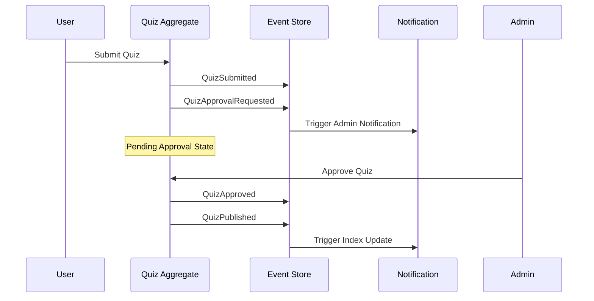
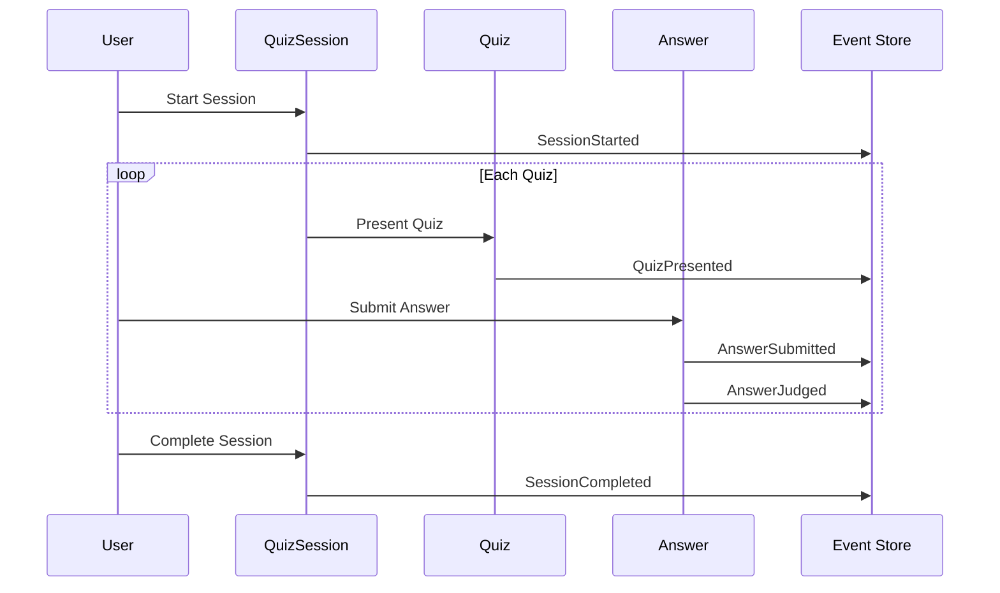

# ドメインイベントカタログ

## 目的

クイズアプリケーションで発生する重要なドメインイベントを体系的に整理し、Event Sourcing・CQRS実装の基盤とする。

## 概要

このドキュメントは、クイズドメインで発生する全てのドメインイベントを分類・定義し、イベント駆動アーキテクチャの実装指針を提供する。

## ドメインイベント分類

### 1. クイズ管理イベント（Quiz Management）

| イベント名 | 発生条件 | 集約 | ペイロード | 後続処理 |
|------------|----------|------|------------|----------|
| **QuizSubmitted** | 作成者がクイズを投稿 | Quiz | quizId, question, correctAnswer, explanation, tags, creatorId | 承認待ち状態に変更 |
| **QuizApprovalRequested** | システムが承認要求を生成 | Quiz | quizId, requestedAt | 管理者通知送信 |
| **QuizApproved** | 管理者がクイズを承認 | Quiz | quizId, approvedBy, approvedAt | 公開状態に変更 |
| **QuizRejected** | 管理者がクイズを拒否 | Quiz | quizId, rejectedBy, rejectedAt, reason | 拒否状態に変更 |
| **QuizPublished** | 承認済みクイズが公開 | Quiz | quizId, publishedAt | インデックス更新 |

### 2. 学習セッションイベント（Learning Session）

| イベント名 | 発生条件 | 集約 | ペイロード | 後続処理 |
|------------|----------|------|------------|----------|
| **SessionStarted** | ユーザーが学習開始 | QuizSession | sessionId, startedAt, deviceFingerprint | セッション追跡開始 |
| **QuizPresented** | クイズが表示 | QuizSession | sessionId, quizId, presentedAt | 回答待ち状態 |
| **AnswerSubmitted** | ユーザーが回答 | Answer | answerId, sessionId, quizId, userAnswer, submittedAt | 正誤判定実行 |
| **AnswerJudged** | 正誤判定完了 | Answer | answerId, isCorrect, judgedAt | 結果表示・統計更新 |
| **SessionCompleted** | セッション終了 | QuizSession | sessionId, completedAt, totalAnswers, correctAnswers | 履歴保存 |

### 3. オフライン同期イベント（Offline Sync）

| イベント名 | 発生条件 | 集約 | ペイロード | 後続処理 |
|------------|----------|------|------------|----------|
| **DataCached** | オフライン用データ保存 | OfflineCache | cachedAt, quizIds, dataSize | キャッシュ管理 |
| **OfflineModeActivated** | ネットワーク切断検出 | QuizSession | sessionId, activatedAt | オフラインUI切替 |
| **OfflineAnswerRecorded** | オフライン状態で回答 | Answer | answerId, sessionId, quizId, userAnswer, recordedAt | ローカル保存 |
| **SynchronizationStarted** | オンライン復旧・同期開始 | QuizSession | sessionId, startedAt | バッチ同期処理 |
| **SynchronizationCompleted** | 同期処理完了 | QuizSession | sessionId, completedAt, syncedAnswers | オンラインUI復帰 |

### 4. 統計・分析イベント（Analytics）

| イベント名 | 発生条件 | 集約 | ペイロード | 後続処理 |
|------------|----------|------|------------|----------|
| **QuizStatisticsUpdated** | 回答データ集計 | QuizStatistics | quizId, totalAnswers, correctRate, updatedAt | ランキング更新 |
| **TagPopularityCalculated** | タグ使用頻度算出 | TagStatistics | tagName, usageCount, calculatedAt | 推奨タグ更新 |
| **UserEngagementMeasured** | ユーザー利用状況測定 | UserEngagement | sessionId, engagementScore, measuredAt | 利用改善提案 |

## イベントフロー設計

### 基本フロー: クイズ投稿〜承認

### 学習セッションフロー

## イベント設計指針

### イベント構造設計

**基本イベント構造**:

- **イベントID**: 一意識別子
- **集約ID**: 発生元集約の識別子
- **イベントタイプ**: イベント種別の文字列表現
- **発生日時**: イベント発生タイムスタンプ
- **バージョン**: 集約バージョン管理
- **ペイロード**: イベント固有のデータ

### イベント処理パターン

**イベントハンドラー設計**:

- **単一責務原則**: 1ハンドラー = 1イベントタイプ
- **非同期処理**: イベント処理は非同期実行
- **冪等性保証**: 同一イベントの重複処理対策
- **エラーハンドリング**: 失敗時の再試行・デッドレターキュー戦略

### イベントストア設計

**永続化戦略**:

- **Append-Only**: イベントの追記専用設計
- **ストリーム基本**: 集約単位でのイベントストリーム
- **バージョン管理**: オプティミスティック同期制御
- **スナップショット戦略**: 集約再構築の高速化

## CQRS統合設計

### コマンド・クエリ分離方針

**コマンドサイド（集約中心）**:

- **ビジネスロジック**: ドメイン不変条件の維持
- **イベント発行**: 状態変化のイベントへの変換
- **トランザクション境界**: 集約単位の一貫性保証

**クエリサイド（プロジェクション中心）**:

- **読み取りモデル**: クエリ最適化されたデータ構造
- **イベント連動**: イベントハンドラーによる更新
- **結果整合性**: 最終的一貫性モデル

**実装詳細**: 具体的なコード・インターフェース定義は[実装工程](docs/instructions/shared/workflow/10.01_implementation.md)で扱う

## 品質・パフォーマンス要件

### イベント処理性能

**スケーラビリティ要件**:

- **スループット**: 1時間1000クイズ作成イベント処理
- **レイテンシ**: イベント処理遅延100ms以内
- **バッチ処理**: 統計更新・分析イベントの非同期処理

### 信頼性設計

**一貫性保証**:

- **冪等性**: 同一イベントの安全な重複処理
- **順序保証**: 集約内イベントの因果関係維持
- **一貫性モデル**: 最終的一貫性でのデータ反映

**障害対応**:

- **補償アクション**: 失敗イベントのロールバック戦略
- **デッドレターキュー**: 処理不可イベントの適切な管理
- **モニタリング**: イベント処理遅延・失敗の監視体制

## まとめ

このドメインイベントカタログにより、以下のアーキテクチャ品質が実現される：

- **疎結合**: 集約間の直接依存をイベント連携で代替
- **監査性**: 全ビジネス状態変化のイベントログ保存
- **拡張性**: 新機能追加時のイベントハンドラー追加で対応
- **分析基盤**: イベントストリームからのビジネス洞察抽出基盤

**設計上の制約**:

- **イベントスキーマ進化**: 後方互換性を維持したイベント構造変更
- **パフォーマンスコスト**: イベントストア・プロジェクション管理オーバーヘッド
- **結果整合性**: 読み取りモデルの結果整合性を許容する設計

## 関連ドキュメント

- [集約設計](docs/project/ddd-design/2.08_aggregate-design/README.md)
- [境界づけられたコンテキスト](docs/project/ddd-design/2.09_bounded-context-definition/README.md)
- [ユビキタス言語辞書](docs/project/ddd-design/2.03_ubiquitous-language/ubiquitous-language-dictionary.md)

---
**作成工程**: DDD設計
**作成日**: 2025-01-30
**更新日**: 2025-01-30
