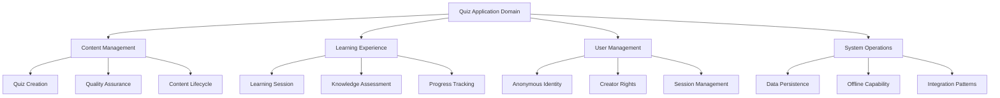
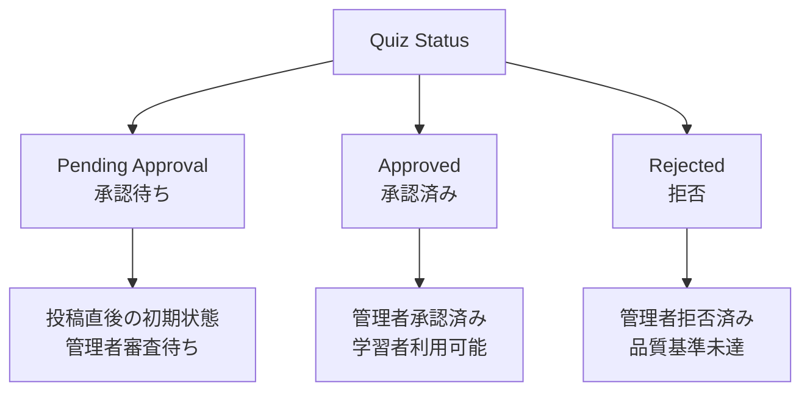
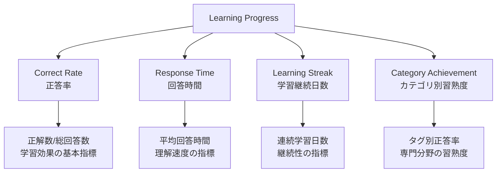
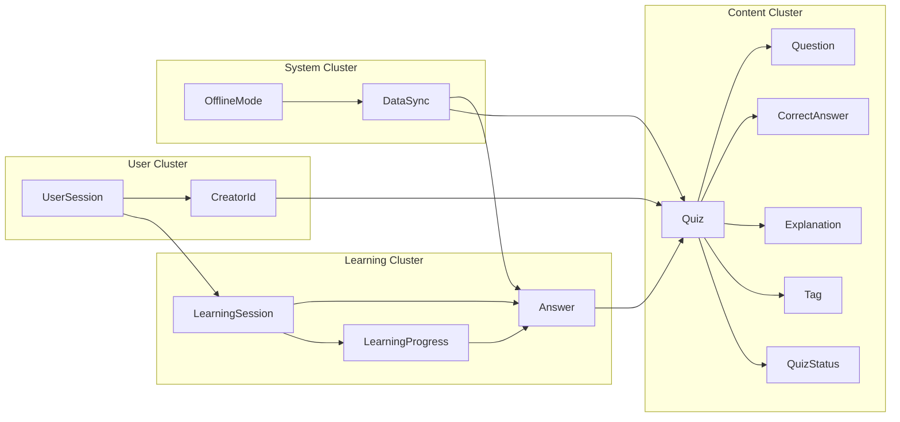

# ドメインオントロジー

## 目的

[ユビキタス言語辞書](docs/project/ddd-design/2.03_ubiquitous-language/ubiquitous-language-dictionary.md)と[ドメイン知識ベース](docs/project/ddd-design/2.01_domain-understanding/domain-knowledge-base.md)を基盤として、クイズアプリケーションドメインの概念体系を階層構造・意味関係で整理し、知識の一貫性と共有可能性を確保する。

## 概要

クイズアプリケーションドメインにおける全概念を体系的に整理し、概念間の階層関係・意味関係・制約関係を明確化することで、ドメインエキスパート・開発者・ステークホルダー間の共通理解を深化させます。本オントロジーは`specifications/requirements/requirements-quiz.md`の概念定義と完全に整合しています。

## 概念階層構造

### 第1階層：ドメインルート概念

### 第2階層：主要ドメイン概念

#### Content Management（コンテンツ管理）概念群

| 概念 | 上位概念 | 定義 | 根拠文書 |
|------|----------|------|----------|
| **Quiz（クイズ）** | Content Management | ◯×問題形式の学習コンテンツ | requirements-quiz.md:10 |
| **Question（問題文）** | Quiz | クイズの問いかけ部分（500文字以内） | requirements-quiz.md:11 |
| **Correct Answer（正解）** | Quiz | ◯または×の2択正解 | requirements-quiz.md:12 |
| **Explanation（解説）** | Quiz | 正解理由の説明（1000文字以内、任意） | requirements-quiz.md:13 |
| **Tag（タグ）** | Quiz | クイズの分類・検索用ラベル | requirements-quiz.md:14 |
| **Quiz Status（クイズ状態）** | Quiz | 承認フロー上の状態（承認待ち・承認済み・拒否） | requirements-quiz.md:20 |

#### Learning Experience（学習体験）概念群

| 概念 | 上位概念 | 定義 | 根拠文書 |
|------|----------|------|----------|
| **Learning Session（学習セッション）** | Learning Experience | 連続的な学習活動の単位 | user-story-quiz.md:5 |
| **Answer（回答）** | Learning Session | ユーザーの◯×選択と正誤結果 | user-story-quiz.md:8 |
| **Answer History（回答履歴）** | Learning Session | 過去の回答記録集合 | user-story-quiz.md:15 |
| **Learning Progress（学習進捗）** | Learning Experience | 学習成果の定量的指標 | user-story-quiz.md:16 |
| **Swipe Gesture（スワイプ操作）** | Learning Session | 右◯・左×の直感的回答方法 | user-story-quiz.md:8 |

#### User Management（ユーザー管理）概念群

| 概念 | 上位概念 | 定義 | 根拠文書 |
|------|----------|------|----------|
| **Anonymous User（匿名ユーザー）** | User Management | ログイン不要でアプリ利用するユーザー | user-story-quiz.md:3 |
| **Creator Id（作成者ID）** | Anonymous User | salt付きハッシュによる匿名作成者識別 | requirements-quiz.md:30 |
| **Device Fingerprint（デバイス識別）** | Anonymous User | デバイス特徴による一意識別 | requirements-quiz.md:31 |
| **User Session（ユーザーセッション）** | Anonymous User | 30日間の匿名ユーザー継続性管理 | requirements-quiz.md:31 |

#### System Operations（システム運用）概念群

| 概念 | 上位概念 | 定義 | 根拠文書 |
|------|----------|------|----------|
| **Offline Mode（オフラインモード）** | System Operations | ネットワーク断線時の継続利用機能 | user-story-quiz.md:20 |
| **Data Synchronization（データ同期）** | System Operations | オフライン・オンライン間の整合性確保 | user-story-quiz.md:22 |
| **Approval Workflow（承認ワークフロー）** | System Operations | 管理者によるクイズ品質統制プロセス | requirements-quiz.md:21 |

### 第3階層：特殊化概念

#### Quiz Status の特殊化

#### Learning Progress の特殊化

## 意味関係マッピング

### 所有関係（has-a / contains）

| 所有者 | 被所有者 | 関係性 | 多重度 | 制約 |
|--------|----------|--------|--------|------|
| **Quiz** | **Question** | 必須構成要素 | 1:1 | 問題文は必須・不変 |
| **Quiz** | **Correct Answer** | 必須構成要素 | 1:1 | 正解は必須・不変 |
| **Quiz** | **Explanation** | 任意構成要素 | 1:0..1 | 解説は任意・不変 |
| **Quiz** | **Tag** | 分類要素 | 1:0..10 | タグは10個まで・可変 |
| **Learning Session** | **Answer** | 回答集合 | 1:0..N | 回答は可変・追加のみ |
| **User Session** | **Creator Id** | 作成者識別 | 1:0..1 | 初回投稿時に生成 |

### 依存関係（depends-on / uses）

| 依存元 | 依存先 | 依存理由 | 依存強度 |
|--------|--------|----------|----------|
| **Answer** | **Quiz** | 回答対象クイズの参照 | 強依存 |
| **Learning Progress** | **Answer** | 進捗計算の基礎データ | 強依存 |
| **Quiz Approval** | **Quiz Status** | 承認状態の管理 | 強依存 |
| **Data Synchronization** | **Offline Mode** | 同期処理の前提条件 | 中依存 |

### 継承関係（is-a / specializes）

| 上位概念 | 下位概念 | 特殊化要素 |
|----------|----------|------------|
| **ドメインイベント** | **Quiz Submitted** | クイズ投稿時のイベント |
| **ドメインイベント** | **Quiz Approved** | クイズ承認時のイベント |
| **ドメインイベント** | **Answer Submitted** | 回答送信時のイベント |
| **値オブジェクト** | **Question** | 問題文の値表現 |
| **値オブジェクト** | **Tag** | タグの値表現 |
| **エンティティ** | **Quiz** | 識別子を持つクイズ |
| **エンティティ** | **Answer** | 識別子を持つ回答 |

## 概念制約ルール

### 存在制約

| 概念 | 存在条件 | 例外条件 |
|------|----------|----------|
| **Quiz** | Question + Correct Answer 必須 | 例外なし |
| **Answer** | 承認済みQuizのみ回答可能 | オフライン時は一時的に緩和 |
| **Creator Id** | 初回Quiz投稿時に自動生成 | 既存セッションは継承 |
| **Learning Progress** | 1回以上のAnswer存在時 | 初回アクセス時は空値 |

### 状態遷移制約

| 概念 | 遷移ルール | 不可逆性 |
|------|------------|----------|
| **Quiz Status** | Pending → (Approved \| Rejected) のみ | Approved・Rejected から変更不可 |
| **Answer** | 送信後の内容変更不可 | 完全不可逆 |
| **User Session** | アクティブ → 期限切れ の一方向 | 期限切れ後は復帰不可 |

### 数量制約

| 概念 | 数量制限 | 根拠 |
|------|----------|------|
| **Question** | 500文字以内 | requirements-quiz.md:11 |
| **Explanation** | 1000文字以内 | requirements-quiz.md:13 |
| **Tag** | 10個まで | requirements-quiz.md:14 |
| **User Session** | 30日間有効 | requirements-quiz.md:31 |

## 知識グラフ構造

### 中核概念クラスター

### 概念間相互作用

| 概念A | 関係性 | 概念B | 相互作用の性質 |
|-------|--------|-------|----------------|
| **Quiz** | 評価される | **Quiz Quality Assessment** | 品質判定プロセス |
| **Answer** | 集約される | **Learning Progress Calculation** | 進捗計算プロセス |
| **User Session** | 認証する | **Creator Authorization** | 権限確認プロセス |
| **Offline Data** | 同期される | **Online Data** | 整合性確保プロセス |

## オントロジー検証

### 完全性検証

- [ ] **概念網羅性**: specifications配下の全概念がオントロジーに含まれる
- [ ] **関係完全性**: 重要な概念間関係が全て定義されている
- [ ] **制約完全性**: ビジネスルール上の制約が適切に表現されている

### 一貫性検証

- [ ] **定義一貫性**: 同一概念の定義がユビキタス言語辞書と一致
- [ ] **関係一貫性**: 概念間関係に論理的矛盾がない
- [ ] **制約一貫性**: 制約ルール間に競合がない

### 実用性検証

- [ ] **理解容易性**: ドメインエキスパートが理解・検証可能
- [ ] **実装可能性**: 技術実装における制約・指針を提供
- [ ] **拡張性**: 将来の機能追加に対応可能な構造

## まとめ

クイズアプリケーションドメインのオントロジーは、**4つの主要概念クラスター**（Content・Learning・User・System）を中心とした階層構造を持ちます。各概念は明確な定義・関係・制約を持ち、ドメインの複雑性を構造化された知識として表現します。

このオントロジーにより、ドメインエキスパート・開発者・ステークホルダー間の共通理解が促進され、一貫性のあるドメインモデル設計が可能になります。

## 関連ドキュメント

- [ユビキタス言語辞書](docs/project/ddd-design/2.03_ubiquitous-language/ubiquitous-language-dictionary.md)
- [ドメイン知識ベース](docs/project/ddd-design/2.01_domain-understanding/domain-knowledge-base.md)
- [ドメインモデル概要](docs/project/ddd-design/2.00_domain-model-overview.md)
- [要件定義](docs/project/specifications/requirements/requirements-quiz.md)

---
**作成工程**: DDD設計
**作成日**: 2025-01-30
**更新日**: 2025-01-30
