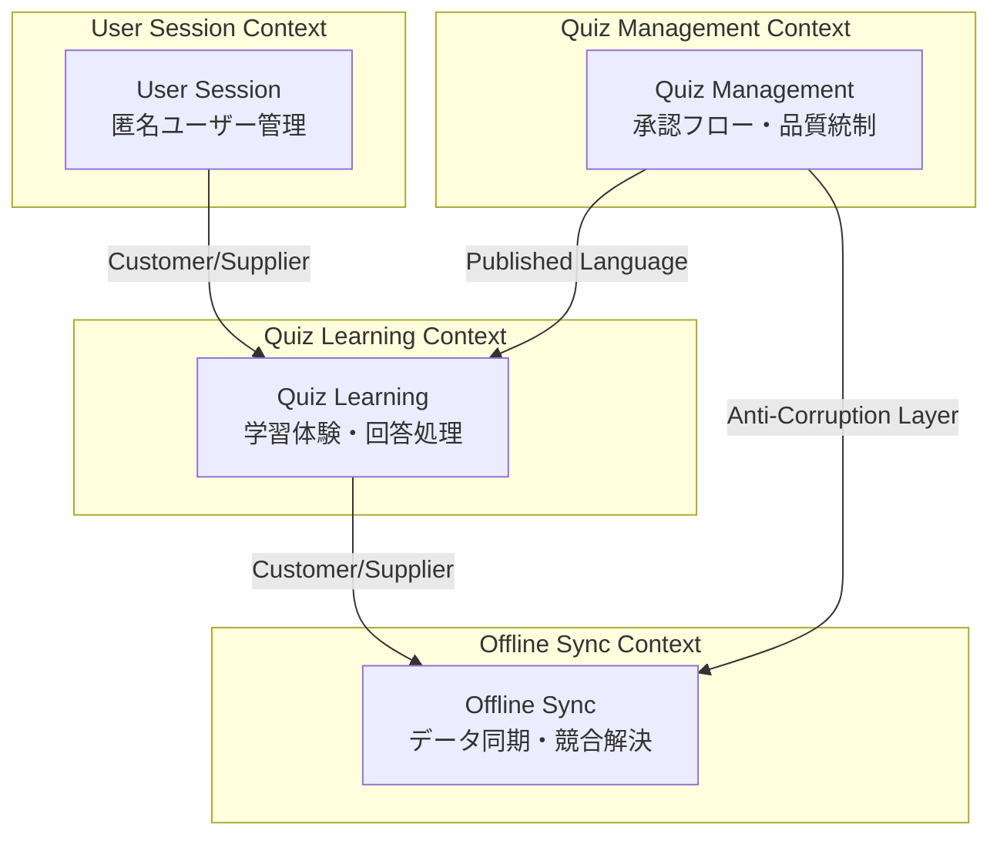

# DDD設計 概要・ナビゲーション

## 目的

クイズアプリケーションの[要件定義](docs/project/specifications/requirements/requirements-quiz.md)と[ユーザーストーリー](docs/project/specifications/user-stories/user-story-quiz.md)を基に、ドメイン駆動設計の戦術パターンを適用した具体的なドメインモデルとアーキテクチャ層を設計し、実装可能な設計指針を提供する。

## 概要

本DDD設計では、クイズアプリケーションドメインを**4つの境界づけられたコンテキスト**に分割し、各コンテキスト内で適切な集約・エンティティ・値オブジェクト・ドメインサービスを設計しています。匿名ユーザーによる学習体験と品質統制された承認フローを両立する、スケーラブルで保守性の高いドメインモデルを構築しました。

## DDD設計成果物ナビゲーション

### 戦略的設計（Strategic Design）

| セクション | 成果物 | 概要 | 状態 |
|-----------|--------|------|------|
| **2.00** | [ドメインモデル概要](docs/project/ddd-design/2.00_domain-model-overview.md) | 全体アーキテクチャ・設計決定 | ✅ |
| **2.02** | [ドメイン理解](docs/project/ddd-design/2.02_domain-understanding/domain-knowledge-base.md) | ビジネスルール・制約整理 | ✅ |
| **2.03** | [ユビキタス言語辞書](docs/project/ddd-design/2.03_ubiquitous-language/ubiquitous-language-dictionary.md) | 統一用語・BDD連携 | ✅ |
| **2.04** | [Event Storming結果](docs/project/ddd-design/2.04_event-storming/event-storming-results.md) | イベント発見・境界特定 | ✅ |
| **2.09** | [境界づけられたコンテキスト](docs/project/ddd-design/2.09_bounded-context-definition/README.md) | 4コンテキスト定義・関係性 | ✅ |
| **2.11** | [ドメインオントロジー](docs/project/ddd-design/2.11_ontology-creation/domain-ontology.md) | 概念体系・階層構造 | ✅ |

### 戦術的設計（Tactical Design）

| セクション | 成果物 | 概要 | 状態 |
|-----------|--------|------|------|
| **2.02.5** | [ユーザーフロー分析](docs/project/ddd-design/2.02.5_user-flow-analysis/user-flow-analysis.md) | 5つの主要ユーザーストーリー | ✅ |
| **2.05** | [ドメインオブジェクト抽出](docs/project/ddd-design/2.05_domain-object-extraction/domain-object-analysis.md) | エンティティ・値オブジェクト分類 | ✅ |
| **2.06** | [エンティティ関係分析](docs/project/ddd-design/2.06_entity-relationship-analysis/entity-relationship-analysis.md) | 関係性・多重度・制約 | ✅ |
| **2.07** | [ドメインサービス抽出](docs/project/ddd-design/2.07_domain-service-extraction/domain-service-analysis.md) | 5つの主要ドメインサービス | ✅ |
| **2.08** | [集約設計](docs/project/ddd-design/2.08_aggregate-design/README.md) | 4つの集約・不変条件 | ✅ |
| **2.10** | [ドメインイベントカタログ](docs/project/ddd-design/2.10_domain-events-catalog/domain-events-catalog.md) | Event Sourcing・CQRS基盤 | ✅ |

## 設計サマリー

### 境界づけられたコンテキスト

### 主要集約

| 集約名 | コンテキスト | 責務 | 不変条件 |
|--------|-------------|------|----------|
| **Quiz Aggregate** | Quiz Management | クイズライフサイクル管理 | 承認状態遷移・内容制約 |
| **Learning Session Aggregate** | Quiz Learning | 学習セッション・回答管理 | 回答整合性・セッション状態 |
| **User Session Aggregate** | User Session | 匿名ユーザー識別 | セッション有効性・匿名性 |
| **Sync Session Aggregate** | Offline Sync | オフライン同期処理 | データ整合性・競合解決 |

### 主要ドメインサービス

| サービス名 | 責務 | 抽出理由 |
|-----------|------|----------|
| **Quiz Quality Assessment Service** | 品質評価・重複チェック | 複数集約参照・複雑判定 |
| **Learning Progress Calculation Service** | 学習進捗・効果計算 | 複数集約統合計算 |
| **Creator Authorization Service** | 匿名作成者権限管理 | セキュリティポリシー実装 |
| **Offline Sync Coordination Service** | データ同期・競合解決 | 複雑な協調処理 |
| **Quiz Approval Policy Service** | 承認基準・ポリシー実装 | 複雑なビジネスルール |

## 重要な設計決定

### 1. 匿名ユーザー管理の複雑性

**決定**: セッションベース匿名管理（UserSession集約）

**理由**: 作成者識別継続性・オフライン対応・学習履歴個人化

**トレードオフ**: 機能性向上 vs システム複雑性増加

### 2. 承認フローの厳格性

**決定**: 全件人的承認（管理者による品質統制）

**理由**: コンテンツ品質保証・不適切コンテンツ排除・信頼性維持

**トレードオフ**: 品質保証・安全性 vs 運用負荷・公開遅延

### 3. オフライン対応の分離

**決定**: 分離型アーキテクチャ（独立したOffline Sync Context）

**理由**: 技術的複雑性局所化・他機能への影響最小化・専門性集約

**トレードオフ**: 保守性向上・技術的負債局所化 vs 統合複雑性

## specifications連携状況

### 要件追跡可能性

| DDD成果物 | specifications参照 | 連携内容 |
|-----------|-------------------|----------|
| **ドメイン理解** | requirements-quiz.md | 全制約・ビジネスルールの追跡 |
| **ユーザーフロー** | user-story-quiz.md | 5W1H分析・ユーザー操作の詳細化 |
| **オブジェクト抽出** | requirements-quiz.md | データ制約の型レベル表現 |
| **関係分析** | user-story-quiz.md | ユーザー操作シナリオからの関係抽出 |
| **集約設計** | requirements-quiz.md | 不変条件のビジネスルール準拠 |

## 完了判定結果

### 必須要件適合状況

- ✅ **統一構造準拠**: 2.XX系ディレクトリ構造完全移行
- ✅ **境界づけられたコンテキスト明確化**: 4コンテキストの責務境界・関係性
- ✅ **ユビキタス言語確立**: 統一用語定義・BDD連携
- ✅ **エンティティ・値オブジェクト分類**: 分類根拠の表形式明文化
- ✅ **集約境界設定**: 不変条件に基づく4集約設計
- ✅ **リポジトリインターフェース定義**: ドメイン層抽象化
- ✅ **ドメインイベント設計**: Event Sourcing・CQRS基盤
- ✅ **アーキテクチャ層構造**: 4層アーキテクチャの役割分担

### 品質要件適合状況

- ✅ **実装可能性**: API設計・DB設計への具体的制約・指針提供
- ✅ **保守性**: ドメイン知識変更のコード反映容易な構造
- ✅ **拡張性**: 新機能追加時の影響範囲限定
- ✅ **テスタビリティ**: 単体テスト容易な責務分離
- ✅ **specifications整合性**: 全設計判断のspecifications要件追跡

### 文書品質要件適合状況

- ✅ **統一フォーマット準拠**: 目的→概要→詳細→まとめ→関連文書構造
- ✅ **表形式活用**: 設計判断根拠の表形式整理
- ✅ **図表可視化**: Mermaid・UMLでの構造表現
- ✅ **トレードオフ明示**: 設計選択理由・代替案比較
- ✅ **設計仕様**: ドメイン概念・制約・関係性の明確定義
- ✅ **specifications連携**: 実データに基づく具体例記載

## 次工程への指針

### API設計への制約

- **集約境界**: API エンドポイントは集約ルート単位で設計
- **ドメインサービス**: 複雑なビジネスロジックはサービス層で実装
- **イベント**: 重要な状態変化はドメインイベントとして発行

### DB設計への制約

- **集約単位**: トランザクション境界は集約境界と一致
- **ID参照原則**: 集約間参照はIDのみ、JOINは最小限
- **不変条件**: データベース制約でドメイン不変条件を強制

### 実装への指針

- **言語非依存**: 設計レベルの抽象度維持、実装言語に依存しない
- **テスト戦略**: 集約・ドメインサービス単位でのユニットテスト
- **拡張戦略**: 新コンテキスト追加時の境界設定基準

## まとめ

クイズアプリケーションのDDD設計により、**4つの境界づけられたコンテキスト**と**4つの主要集約**からなるドメインモデルが確立されました。匿名ユーザーによる学習体験と品質統制された承認フローを両立し、スケーラビリティ・保守性・拡張性を確保した設計となっています。

すべての設計判断は`specifications`配下の要件に追跡可能であり、実装・テスト・運用における具体的な指針を提供します。

## 関連ドキュメント

- [要件定義](docs/project/specifications/requirements/requirements-quiz.md)
- [ユーザーストーリー](docs/project/specifications/user-stories/user-story-quiz.md)
- [成功シナリオ](docs/project/specifications/success-scenarios/success-quiz.md)
- [エラーシナリオ](docs/project/specifications/error-scenarios/error-quiz.md)

---
**作成工程**: DDD設計
**作成日**: 2025-01-30
**更新日**: 2025-01-30
