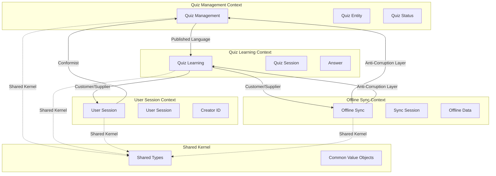

# 境界づけられたコンテキスト

## 概要

クイズアプリケーションにおける境界づけられたコンテキストの定義と、各コンテキスト間の関係性を整理します。

## コンテキスト分割の基準

### 分割原則

1. **責務の独立性**: 異なるビジネス目的・機能的要求
2. **用語の一意性**: 同一用語が異なる意味を持つ境界
3. **変更の独立性**: 独立して変更・デプロイ可能な単位
4. **チーム境界**: 開発・運用チームの責任範囲
5. **データ所有権**: データの生成・管理責任の境界

### 技術的制約

- **モジュラーモノリス**: 単一アプリケーション内でのモジュール分割
- **TypeScript**: 名前空間による論理的分離
- **共有カーネル**: 共通型定義・ユーティリティの共有

## 境界づけられたコンテキスト一覧

### 1. Quiz Management Context（クイズ管理コンテキスト）

#### 責務（Quiz Management）

- クイズの作成・編集・削除
- 承認フロー管理
- コンテンツ品質管理

#### 主要エンティティ（Quiz Management）

- Quiz（集約ルート）
- QuizStatus（値オブジェクト）
- CreatorId（値オブジェクト）

#### ユビキタス言語（Quiz Management）

- クイズ作成（Quiz Creation）
- 承認待ち（Pending Approval）
- 承認済み（Approved）
- 承認拒否（Rejected）
- 管理者承認（Administrator Approval）

#### 境界設定理由（Quiz Management）

- **独立性**: コンテンツ管理とユーザー利用は異なる責務
- **用語の特異性**: 「承認」概念はこのコンテキスト固有
- **変更独立性**: 承認フロー変更は他機能に影響しない

### 2. Quiz Learning Context（クイズ学習コンテキスト）

#### 責務（Quiz Learning）

- クイズ回答機能
- 学習体験提供
- 正誤判定処理

#### 主要エンティティ（Quiz Learning）

- QuizSession（集約ルート）
- Answer（エンティティ）
- LearningProgress（値オブジェクト）

#### ユビキタス言語（Quiz Learning）

- クイズ回答（Quiz Answering）
- スワイプ操作（Swipe Gesture）
- 正誤判定（Correct Judgment）
- 学習セッション（Learning Session）
- 回答履歴（Answer History）

#### 境界設定理由（Quiz Learning）

- **独立性**: 学習機能とコンテンツ管理は異なる目的
- **用語の特異性**: 「学習」「回答」概念はこのコンテキスト固有
- **パフォーマンス**: 読み取り中心の高頻度アクセス

### 3. User Session Context（ユーザーセッションコンテキスト）

#### 責務（User Session）

- 匿名ユーザー識別
- セッション管理
- 作成者権限制御

#### 主要エンティティ（User Session）

- UserSession（集約ルート）
- DeviceFingerprint（値オブジェクト）
- SessionState（値オブジェクト）

#### ユビキタス言語（User Session）

- 匿名ユーザー（Anonymous User）
- セッション開始（Session Start）
- 作成者識別（Creator Identification）
- デバイス識別（Device Identification）

#### 境界設定理由（User Session）

- **独立性**: ユーザー管理は他機能から独立
- **セキュリティ**: 匿名性とプライバシー保護の専門領域
- **技術的複雑性**: デバイス識別・セッション管理の特殊性

### 4. Offline Sync Context（オフライン同期コンテキスト）

#### 責務（Offline Sync）

- オフライン機能提供
- データ同期処理
- 競合解決

#### 主要エンティティ（Offline Sync）

- SyncSession（集約ルート）
- OfflineData（エンティティ）
- ConflictResolution（ドメインサービス）

#### ユビキタス言語（Offline Sync）

- オフラインモード（Offline Mode）
- データ同期（Data Synchronization）
- 競合解決（Conflict Resolution）
- ローカルストレージ（Local Storage）

#### 境界設定理由（Offline Sync）

- **技術的複雑性**: オフライン対応は高度な技術的専門性が必要
- **独立性**: 同期機能は他機能から分離可能
- **変更頻度**: 同期戦略の変更は他への影響が限定的

## コンテキストマップ



## コンテキスト間関係

### 1. Quiz Management → Quiz Learning（Published Language）

#### 関係性（Quiz Management → Quiz Learning）

- **パターン**: Published Language
- **方向**: Quiz Management（上流） → Quiz Learning（下流）
- **統合方法**: 承認済みQuizの公開API

#### 統合仕様（Quiz Management → Quiz Learning）

```typescript
// Published Language: Quiz Management からの公開インターフェース
interface PublishedQuizInfo {
  readonly id: QuizId;
  readonly question: string;
  readonly correctAnswer: boolean;
  readonly explanation?: string;
  readonly tags: string[];
  readonly publishedAt: Date;
}

// Quiz Learning Context での利用
interface QuizLearningService {
  getAvailableQuizzes(): Promise<PublishedQuizInfo[]>;
  getQuizById(id: QuizId): Promise<PublishedQuizInfo | null>;
}
```

### 2. Quiz Learning → User Session（Customer/Supplier）

#### 関係性（Quiz Learning → User Session）

- **パターン**: Customer/Supplier
- **方向**: Quiz Learning（顧客） → User Session（供給者）
- **統合方法**: セッション情報の取得・更新

#### 統合仕様（Quiz Learning → User Session）

```typescript
// User Session Context からの供給
interface SessionSupplier {
  getCurrentSession(): Promise<UserSession>;
  updateSessionActivity(sessionId: SessionId): Promise<void>;
  validateCreatorAccess(sessionId: SessionId, quizId: QuizId): Promise<boolean>;
}
```

### 3. Offline Sync → 他コンテキスト（Anti-Corruption Layer）

#### 関係性（Offline Sync → 他コンテキスト）

- **パターン**: Anti-Corruption Layer
- **方向**: Offline Sync（下流） → 各コンテキスト（上流）
- **統合方法**: 変換レイヤーによる適応

#### 統合仕様（Offline Sync → 他コンテキスト）

```typescript
// Anti-Corruption Layer
class QuizSyncAdapter {
  constructor(
    private quizManagement: QuizManagementService,
    private quizLearning: QuizLearningService
  ) {}

  async syncQuizData(offlineData: OfflineQuizData[]): Promise<SyncResult> {
    // 外部コンテキストのモデルを内部モデルに変換
    const syncResults = await Promise.all(
      offlineData.map(data => this.convertAndSync(data))
    );

    return this.aggregateResults(syncResults);
  }

  private convertAndSync(data: OfflineQuizData): Promise<SyncResult> {
    // 変換ロジック: 外部モデル → 内部モデル
    const internalFormat = this.convertToInternalFormat(data);
    return this.syncToUpstream(internalFormat);
  }
}
```

## 共有カーネル

### 共有型定義

#### 基本識別子

```typescript
// 全コンテキストで共有する識別子型
export type QuizId = Brand<string, 'QuizId'>;
export type SessionId = Brand<string, 'SessionId'>;
export type AnswerId = Brand<string, 'AnswerId'>;
export type CreatorId = Brand<string, 'CreatorId'>;
```

#### 共通値オブジェクト

```typescript
// 日時関連
export interface Timestamp {
  readonly value: Date;
  readonly iso8601: string;
}

// エラーハンドリング
export interface DomainError {
  readonly code: string;
  readonly message: string;
  readonly details?: unknown;
}
```

#### 共通ユーティリティ

```typescript
// バリデーション
export interface ValidationRule<T> {
  validate(value: T): Result<T, DomainError>;
}

// ドメインイベント
export interface DomainEvent {
  readonly eventId: string;
  readonly occurredAt: Timestamp;
  readonly aggregateId: string;
  readonly eventType: string;
}
```

## 実装上の組織化

### ディレクトリ構造

```text
src/
├── contexts/
│   ├── quiz-management/
│   │   ├── domain/
│   │   ├── application/
│   │   └── infrastructure/
│   ├── quiz-learning/
│   │   ├── domain/
│   │   ├── application/
│   │   └── infrastructure/
│   ├── user-session/
│   │   ├── domain/
│   │   ├── application/
│   │   └── infrastructure/
│   └── offline-sync/
│       ├── domain/
│       ├── application/
│       └── infrastructure/
├── shared-kernel/
│   ├── types/
│   ├── value-objects/
│   ├── domain-events/
│   └── utilities/
└── integration/
    ├── adapters/
    ├── anti-corruption-layers/
    └── published-languages/
```

### 依存関係ルール

1. **コンテキスト間の直接依存禁止**: 必ず統合レイヤー経由
2. **共有カーネルの最小化**: 真に共通する概念のみ
3. **上流コンテキストの安定性**: 下流への破壊的変更の最小化
4. **境界の明確化**: 名前空間・モジュールによる物理的分離

## 境界の妥当性検証

### 検証基準

1. **単一責任**: 各コンテキストが単一の明確な責任を持つ
2. **高凝集**: コンテキスト内の要素が密接に関連
3. **疎結合**: コンテキスト間の依存が最小限
4. **安定性**: 境界を越えた変更の頻度が低い

### 将来の見直し基準

1. **コンテキスト肥大化**: 単一コンテキストが複雑になった場合
2. **頻繁な境界越え**: コンテキスト間の通信が過度に多い場合
3. **用語の重複**: 異なるコンテキストで同一用語が異なる意味を持つ場合
4. **チーム分割**: 開発チーム構成変更時の境界見直し
