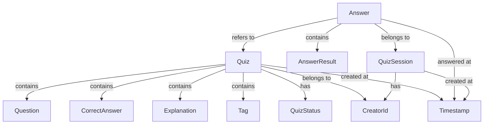

# ドメインオブジェクト分類

## 概要

クイズアプリケーションのドメインにおける概念を、エンティティと値オブジェクトに分類し、その判定理由と主要属性を整理します。

## エンティティと値オブジェクトの分類表

| 概念名 | 分類 | 判定理由 | 主要属性 | データベース表現 |
|--------|------|----------|----------|------------------|
| **Quiz（クイズ）** | エンティティ | ID（QuizId）で識別、状態変化あり（承認待ち→承認済み等） | id, question, correctAnswer, explanation, tags, status, creatorId, createdAt, approvedAt | テーブル化（quizzes） |
| **Answer（回答）** | エンティティ | ID（AnswerId）で識別、回答時刻等の状態変化あり | id, quizId, userAnswer, isCorrect, answeredAt, sessionId | テーブル化（answers） |
| **QuizSession（クイズセッション）** | エンティティ | ID（SessionId）で識別、セッション状態の変化あり | id, startedAt, lastAccessAt, deviceFingerprint | テーブル化（sessions） |
| **Question（問題文）** | 値オブジェクト | 値そのものが識別子、不変（500文字制限含む） | text, length | Quiz内のフィールド |
| **CorrectAnswer（正解）** | 値オブジェクト | ◯または×の2値、不変 | value（boolean） | Quiz内のフィールド |
| **Explanation（解説）** | 値オブジェクト | 値そのものが識別子、不変（1000文字制限含む） | text, length | Quiz内のフィールド |
| **Tag（タグ）** | 値オブジェクト | 値そのものが識別子、不変 | name, normalizedName | Quiz内のJSON配列 |
| **QuizStatus（クイズ状態）** | 値オブジェクト | 承認ステータスの値、不変 | value（enum: pending, approved, rejected） | Quiz内のフィールド |
| **CreatorId（作成者ID）** | 値オブジェクト | salt付きハッシュ値、不変 | hashedValue, salt | Quiz内のフィールド |
| **AnswerResult（回答結果）** | 値オブジェクト | 正誤判定結果、不変 | isCorrect, userAnswer, correctAnswer | Answer内のフィールド |
| **Timestamp（タイムスタンプ）** | 値オブジェクト | 日時の値、不変 | value（ISO8601） | 各テーブルのフィールド |

## 分類判定の詳細

### エンティティ選定理由

#### Quiz（クイズ）
- **IDによる識別**: QuizIdで一意識別が必要
- **状態変化**: 投稿→承認待ち→承認済み/拒否のライフサイクル
- **永続化**: サーバーデータベースでの永続的な管理が必要
- **業務的重要性**: ビジネスの中核となるドメインオブジェクト

#### Answer（回答）
- **IDによる識別**: AnswerIdで一意識別が必要
- **状態変化**: 回答時刻、同期状態（オフライン→オンライン）の変化
- **履歴管理**: ユーザーの回答履歴として永続化が必要
- **集計対象**: 統計・分析の基準となるデータ

#### QuizSession（クイズセッション）
- **IDによる識別**: SessionIdで一意識別が必要
- **状態変化**: 開始時刻、最終アクセス時刻の更新
- **匿名ユーザー管理**: ログイン不要での作成者識別に必要
- **オフライン対応**: 同期処理の基準となるセッション管理

### 値オブジェクト選定理由

#### Question（問題文）
- **値による識別**: テキスト内容そのものが識別子
- **不変性**: 作成後の変更なし（編集は新規作成扱い）
- **制約内包**: 500文字制限のバリデーション含む
- **単純さ**: 複雑な振る舞いを持たない

#### CorrectAnswer（正解）
- **値による識別**: ◯または×の2値のみ
- **不変性**: 作成後の変更なし
- **単純性**: boolean値での表現が適切
- **制約内包**: 2択のみの制約を型で表現

#### Tag（タグ）
- **値による識別**: タグ名そのものが識別子
- **不変性**: タグ自体は変更されない（クイズとの関連付けは変更可能）
- **正規化**: 検索用の正規化名を含む
- **単純性**: 文字列処理中心の単純な構造

## ドメインオブジェクトの依存関係



## 実装指針

### TypeScript型設計

```typescript
// エンティティ
interface Quiz {
  readonly id: QuizId;
  readonly question: Question;
  readonly correctAnswer: CorrectAnswer;
  readonly explanation?: Explanation;
  readonly tags: Tag[];
  status: QuizStatus;
  readonly creatorId: CreatorId;
  readonly createdAt: Timestamp;
  approvedAt?: Timestamp;
}

// 値オブジェクト
interface Question {
  readonly text: string;
  readonly length: number;
}

interface CorrectAnswer {
  readonly value: boolean; // true = ◯, false = ×
}
```

### バリデーション責務

- **エンティティ**: 業務ルール・不変条件の保証
- **値オブジェクト**: 値の妥当性・制約条件の保証

### 永続化戦略

- **エンティティ**: 個別テーブルとして永続化
- **値オブジェクト**: 親エンティティのフィールドまたはJSON列として埋め込み

## 設計上の考慮事項

### 拡張性への配慮

1. **QuizType**: 将来的な多択問題対応時はCorrectAnswerを拡張
2. **UserEntity**: 将来的なログイン機能追加時はCreatorIdからUserへ移行
3. **Category**: タグ機能拡張時はTagからCategoryエンティティへ昇格可能

### パフォーマンスへの配慮

1. **Tag正規化**: 検索性能向上のため正規化名をあらかじめ計算
2. **Answer集約**: セッション単位での集約による効率的なクエリ
3. **Status indexing**: QuizStatusでの効率的な絞り込み

### セキュリティへの配慮

1. **CreatorId**: salt付きハッシュによる作成者の匿名化
2. **入力サニタイズ**: Question・Explanationでのサニタイズ処理
3. **制約強制**: 値オブジェクトでの型レベル制約実装