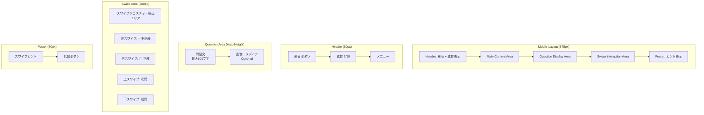
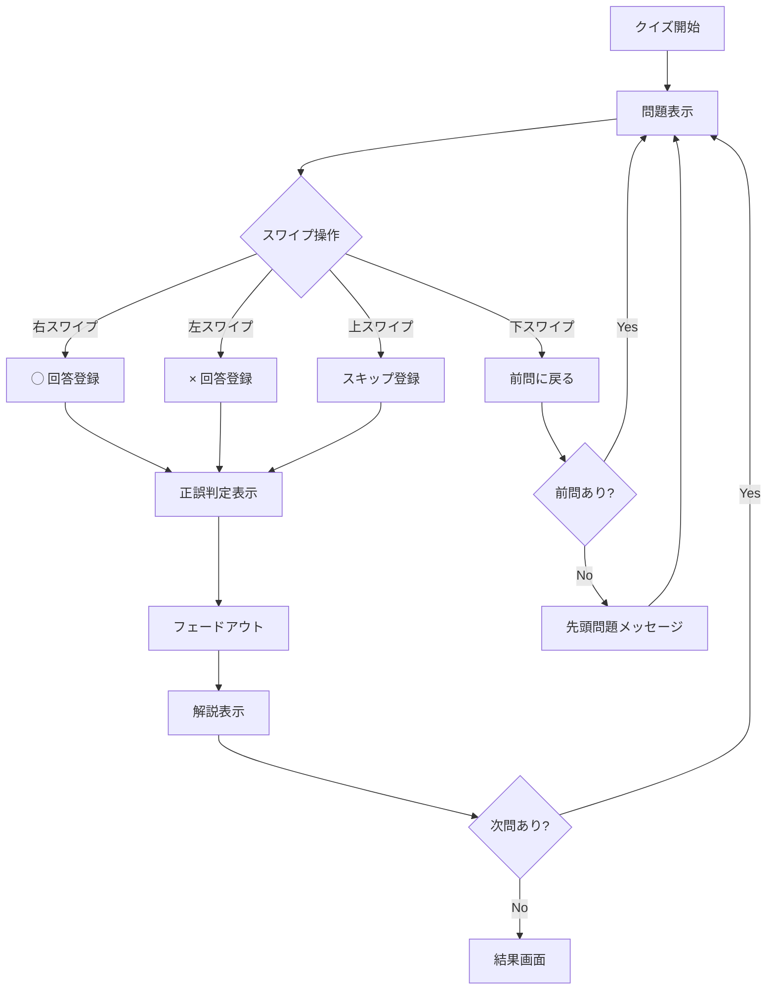

# US-01: クイズ回答UI要件

## 概要

**アクター**: 匿名ユーザー  
**目的**: 承認済みクイズに回答して学習する  
**優先度**: 高（MVP対象）  

## UI要件

### 操作体験
- **画面遷移**: ホーム → クイズ一覧 → 回答画面 → 結果画面
- **操作方法**: Tinder UI形式
  - 右スワイプ = ◯（正解と思う）
  - 左スワイプ = ×（不正解と思う）
  - 上スワイプ = 次問（スキップ）
  - 下スワイプ = 前問（戻る）
- **フィードバック**: 正解・不正解の即座「バン」と表示 → フェードアウト → 解説表示
- **進捗表示**: 現在問題数/総問題数、視覚的プログレスバー

### 画面構成

#### 回答画面レイアウト

### UI制約

#### レスポンシブ制約
- **画面サイズ**: 375px基準、スマートフォン専用
- **タッチ領域**: スワイプエリア最小200px × 200px
- **フォントサイズ**: 問題文16px以上、解説14px以上
- **余白**: 上下左右最小16px

#### パフォーマンス制約
- **問題遷移**: ≤ 100ms
- **スワイプ検出**: ≤ 50ms
- **アニメーション**: 300ms以内の自然な遷移
- **画像読み込み**: 遅延読み込み・プレースホルダー表示

#### アクセシビリティ制約
- **代替操作**: スワイプ操作の代替ボタン提供
- **フォーカス管理**: キーボードナビゲーション対応
- **色覚配慮**: 正解・不正解の色以外の視覚的区別
- **読み上げ**: スクリーンリーダー対応のARIAラベル

## 操作フロー

### 正常フロー

### 異常フロー
- **ネットワークエラー**: オフラインモード切り替え提案
- **データ不整合**: エラーメッセージ表示と安全な状態への復帰
- **不正回答**: バリデーションエラーとして処理
- **操作ミス**: 取り消し機能・確認ダイアログ

## UI状態管理

### 画面状態
1. **読み込み中**: ローディングスピナー表示
2. **問題表示**: 通常の回答待ち状態
3. **回答中**: スワイプジェスチャー検出中
4. **判定表示**: 正誤結果の視覚的フィードバック
5. **解説表示**: 解説文と次問ボタン表示
6. **完了**: 全問題完了時の結果画面遷移

### データ状態
- **クイズデータ**: サーバーから取得・ローカルキャッシュ
- **回答履歴**: IndexedDBにリアルタイム保存
- **進捗状態**: セッションストレージで管理
- **オフラインデータ**: Service Workerによるキャッシュ

## ビジュアルデザイン要件

### カラーパレット
- **正解**: #10B981（Green-500）
- **不正解**: #EF4444（Red-500）
- **スキップ**: #6B7280（Gray-500）
- **背景**: #FFFFFF（White）
- **テキスト**: #111827（Gray-900）

### アニメーション
- **スワイプ**: カードスライド・フェード効果
- **正誤表示**: バウンス・スケール効果
- **遷移**: スムーズなページ遷移
- **フィードバック**: 触覚フィードバック（対応デバイス）

### タイポグラフィ
- **問題文**: 16px, font-weight: 500, line-height: 1.5
- **解説**: 14px, font-weight: 400, line-height: 1.6
- **進捗**: 12px, font-weight: 600
- **ボタン**: 14px, font-weight: 500

## 技術要件

### フレームワーク
- **Next.js**: SSR・PWA対応
- **Tailwind CSS**: レスポンシブ・ユーティリティファースト
- **Framer Motion**: スワイプアニメーション
- **React Hook Form**: フォーム状態管理

### パフォーマンス最適化
- **画像最適化**: Next.js Image・WebP対応
- **コード分割**: 動的インポート・遅延読み込み
- **キャッシュ戦略**: SWR・React Query活用
- **バンドル最適化**: Tree Shaking・圧縮

## テスト要件

### E2Eテスト
- **スワイプ操作**: 4方向スワイプの動作確認
- **画面遷移**: 全フロー通しての動作確認
- **エラーハンドリング**: 異常系の動作確認
- **パフォーマンス**: 遷移時間・メモリ使用量測定

### ユニットテスト
- **状態管理**: Redux/Zustand状態遷移テスト
- **ユーティリティ**: スワイプジェスチャー検出ロジック
- **API連携**: モック・スタブを使用したテスト

## 関連画面

- **[ホーム画面](../3.01_wireframes/home-page.md)**: クイズ選択・開始
- **[結果画面](../3.01_wireframes/quiz-result-page.md)**: 完了後の統計・次アクション
- **[履歴画面](us-04_answer-history.md)**: 回答履歴確認

## 関連ドキュメント

- [ユーザーフロー分析: US-01](docs/project/ddd-design/2.02.5_user-flow-analysis/user-flow-analysis.md#us-01-クイズ回答匿名ユーザー)
- [要件定義](docs/project/specifications/requirements/requirements-quiz.md#ユーザー体験要件)
- [サイトマップ](docs/project/ui-design/1.01_sitemap.yaml)

---
**作成工程**: UI設計  
**作成日**: 2025-01-31  
**更新日**: 2025-01-31