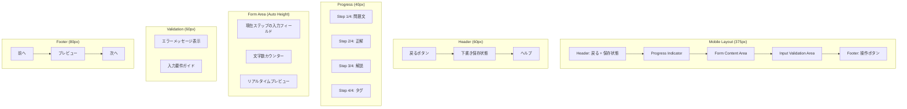
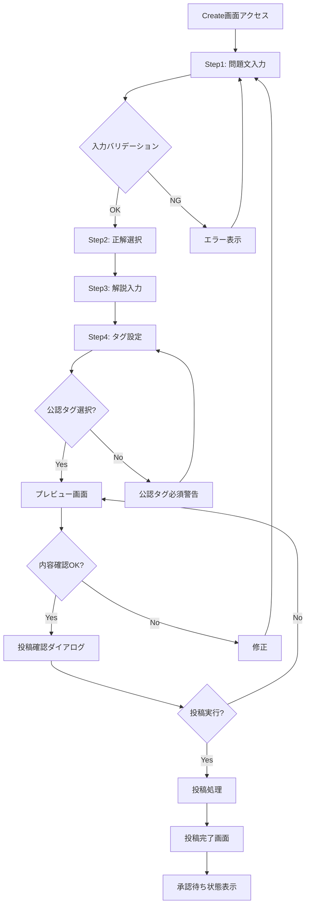
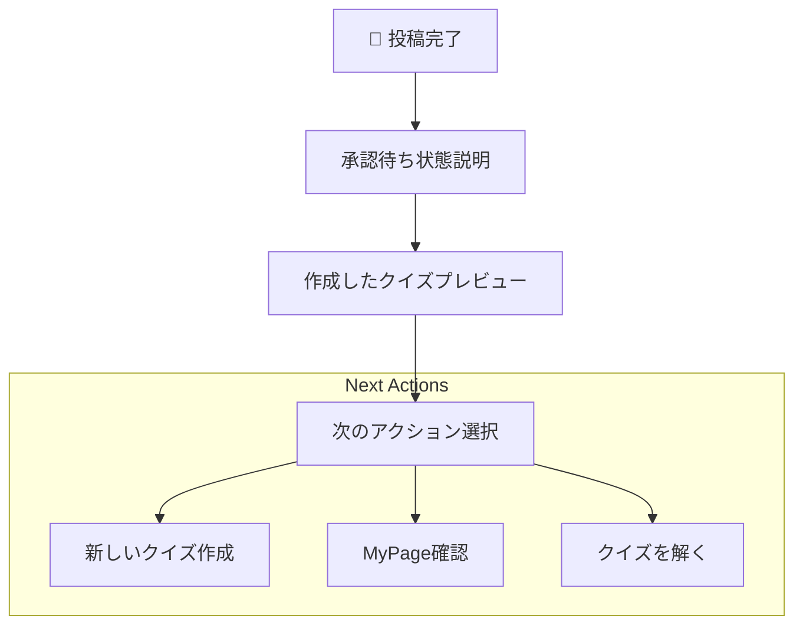

# US-02: クイズ作成UI要件

## 概要

**アクター**: 匿名ユーザー  
**目的**: 新しいクイズを投稿する  
**優先度**: 中（将来拡張）  

## UI要件

### 操作体験

- **画面遷移**: Createタブ → 入力フォーム → プレビュー → 投稿完了
- **入力方式**: 段階的入力による作成フォーム
  1. 問題文入力（必須、500文字以内）
  2. 正解選択（◯または×）
  3. 解説入力（任意、1000文字以内）
  4. タグ設定（公認タグ≥1必須 + 任意タグ複数）
- **プレビュー**: Play画面ライクなリアルタイムプレビュー
- **投稿処理**: 承認待ち状態の明確な表示

### 画面構成

#### 作成フォーム画面



### UI制約

#### 入力制約

- **問題文**: 必須、500文字以内、リアルタイム文字数表示
- **正解**: ◯または×のラジオボタン選択
- **解説**: 任意、1000文字以内、リアルタイム文字数表示
- **タグ**: 公認タグ1つ以上必須、ユーザタグ任意複数

#### バリデーション制約

- **リアルタイム**: 入力中の即座バリデーション
- **サニタイズ**: HTMLタグ自動除去・エスケープ
- **重複チェック**: 類似問題の警告表示
- **必須項目**: 未入力時の進行防止

#### パフォーマンス制約

- **自動保存**: 30秒間隔の下書き自動保存
- **プレビュー更新**: 500ms遅延でのリアルタイムプレビュー
- **画像アップロード**: 対応時の最適化・リサイズ処理

## 操作フロー

### 正常フロー



### 異常フロー

- **ネットワークエラー**: 下書き保存と再送信機能
- **バリデーションエラー**: 具体的なエラーメッセージ表示
- **文字数超過**: リアルタイム警告・入力制限
- **タイムアウト**: セッション延長・データ復旧

## フォーム設計

### Step 1: 問題文入力

```markdown
## 問題文を入力してください *必須

[Textarea: 500文字以内]
例：地球は太陽系の第3惑星である。

文字数: 0/500

## 入力のコツ
- 明確で理解しやすい文章で記述
- ◯×で判断できる内容にする
- 専門用語は適切に説明を含める
```

### Step 2: 正解選択

```markdown
## 正解を選択してください *必須

○ 正解（True）
× 不正解（False）

## 選択のガイド
- 明確に判断できる内容か確認
- 議論の余地がない事実か検討
```

### Step 3: 解説入力

```markdown
## 解説を入力してください（任意）

[Textarea: 1000文字以内]
正解の理由や関連情報を記述...

文字数: 0/1000

## 解説のコツ
- なぜその答えが正解かを説明
- 関連する知識・背景情報を提供
- 学習に役立つ補足情報を含める
```

### Step 4: タグ設定

```markdown
## タグを設定してください

### 公認タグ *1つ以上必須
□ 一般常識  □ 歴史  □ 科学  □ 地理
□ スポーツ  □ 芸能  □ 文学  □ 数学

### ユーザタグ（任意）
[Input] 例：TOEIC、大学受験、雑学
区切り文字：スペース、カンマ
```

## プレビュー機能

### プレビュー画面

- **UI形式**: クイズ回答画面と同様のレイアウト
- **操作**: スワイプ操作のシミュレーション
- **表示内容**: 入力した問題文・解説・タグの確認
- **編集機能**: 各項目の直接編集リンク

### リアルタイムプレビュー

- **更新タイミング**: 入力から500ms後
- **表示位置**: フォーム右側（横幅に余裕がある場合）
- **折りたたみ**: モバイルでは折りたたみ可能
- **同期**: 入力内容とプレビューの即座同期

## 投稿完了・承認待ち

### 投稿完了画面



### 承認状態管理

- **状態表示**: 承認待ち・承認済み・拒否の視覚的区別
- **通知**: ブラウザ通知（許可時）での状態変更通知
- **履歴**: MyPageでの投稿履歴・統計確認
- **編集**: 承認前のクイズの編集・削除機能

## UI状態管理

### フォーム状態

1. **初期状態**: 空フォーム表示
2. **入力中**: バリデーション・文字数カウント
3. **エラー状態**: バリデーションエラーの表示
4. **下書き保存**: 自動保存成功・失敗の表示
5. **投稿中**: ローディング・プログレス表示
6. **完了状態**: 投稿成功・承認待ち状態

### データ管理

- **下書きデータ**: LocalStorageでの一時保存
- **作成者識別**: salt付きハッシュでの匿名識別
- **投稿履歴**: IndexedDBでの投稿状況管理
- **同期**: オンライン復旧時の下書き同期

## ビジュアルデザイン要件

### フォームデザイン

- **入力フィールド**: 明確なフォーカス状態
- **エラー表示**: 赤色・アイコンでの視覚的強調
- **成功表示**: 緑色・チェックマークでの確認
- **プログレス**: 視覚的な進捗インジケーター

### レスポンシブ対応

- **モバイル**: 縦型レイアウト・大きなタッチ領域
- **プレビュー**: モバイルでは折りたたみ・タブ切り替え
- **キーボード**: ソフトキーボード表示時のレイアウト調整

## 関連画面

- **[プレビュー画面](../3.01_wireframes/quiz-preview-page.md)**: 作成クイズのプレビュー
- **[投稿完了画面](../3.01_wireframes/quiz-submission-success-page.md)**: 投稿完了・承認待ち
- **[MyPage投稿管理](us-04_answer-history.md)**: 投稿したクイズの管理

## 関連ドキュメント

- [ユーザーフロー分析: US-02](docs/project/ddd-design/2.02.5_user-flow-analysis/user-flow-analysis.md#us-02-クイズ作成匿名ユーザー)
- [要件定義](docs/project/specifications/requirements/requirements-quiz.md#セキュリティ要件)
- [サイトマップ](docs/project/ui-design/1.01_sitemap.yaml)

---
**作成工程**: UI設計  
**作成日**: 2025-01-31  
**更新日**: 2025-01-31
