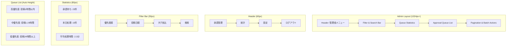
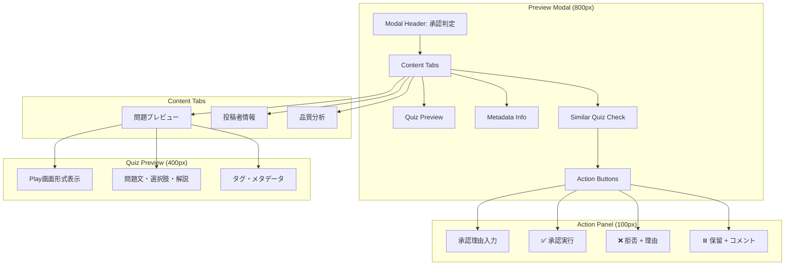
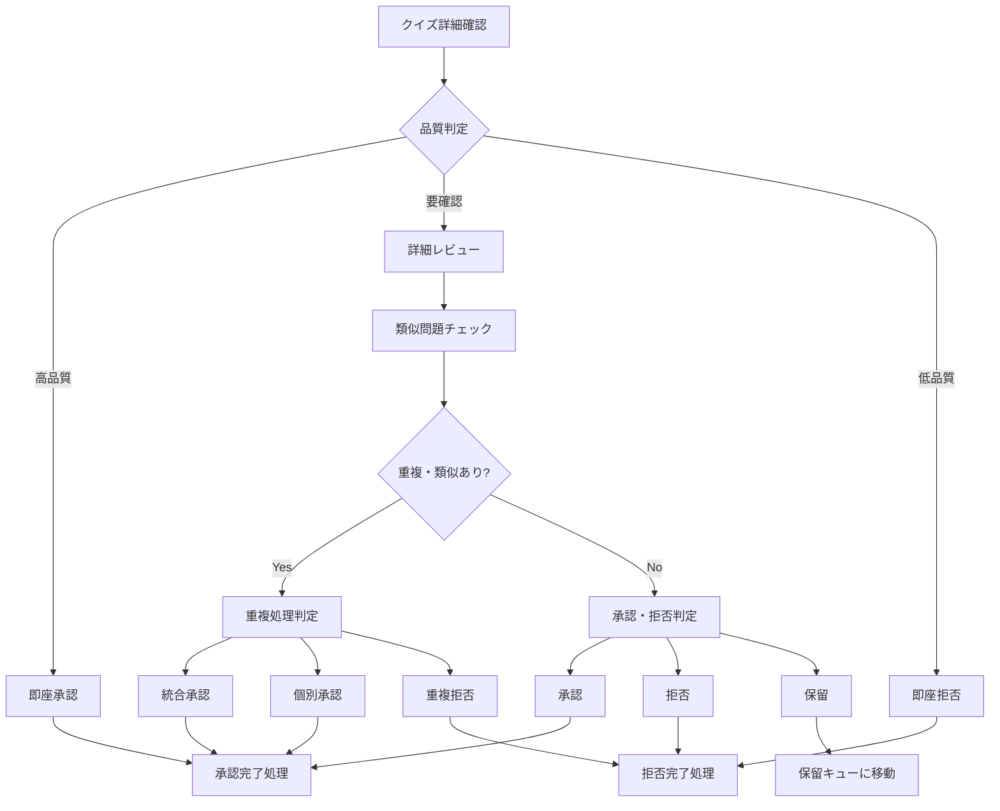
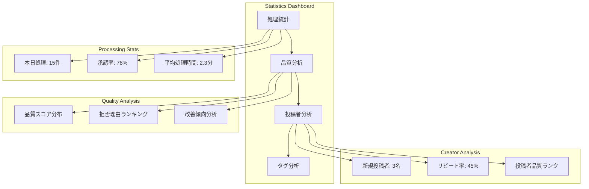

# US-03: クイズ承認UI要件

## 概要

**アクター**: 管理者  
**目的**: 投稿されたクイズを審査・承認する  
**優先度**: 低（管理者機能・将来実装）  

## UI要件

### 操作体験

- **画面遷移**: 管理者ログイン → 承認キュー → 詳細確認 → 承認判定
- **表示方式**: 承認待ちクイズの優先度付き一覧表示
- **内容確認**: 問題文・解説・タグの詳細表示とPlay形式プレビュー
- **判定操作**: 承認・拒否・保留の3択操作
- **一括操作**: 複数クイズの一括承認・拒否機能

### 画面構成

#### 承認キュー画面



### UI制約

#### 表示制約

- **デスクトップ**: 1024px以上での管理画面最適化
- **一覧表示**: ページネーション・仮想スクロール対応
- **プレビュー**: モーダル・サイドパネルでの詳細表示
- **バッチ操作**: チェックボックス・全選択機能

#### 権限制約

- **認証**: 管理者権限での厳格な認証
- **セッション**: 自動ログアウト・セッション管理
- **操作ログ**: 全承認・拒否操作の記録
- **監査**: 承認判定理由の必須記録

## 承認キュー設計

### キューアイテム表示

```markdown
┌─────────────────────────────────────────────────────┐
│ 🔴 高優先度 2025/01/31 09:23 (投稿1時間23分前)     │
│ 📝 地球は太陽系の第3惑星である。                     │
│ 🏷️ 一般常識, 科学                                  │
│ 👤 作成者ID: abc123*** (投稿2件目)                  │
│ ⚠️  類似問題: なし | 品質スコア: 85/100              │
│                                                     │
│ [👁️ プレビュー] [✅ 承認] [❌ 拒否] [⏸️ 保留]    │
└─────────────────────────────────────────────────────┘
```

### 優先度判定基準

1. **高優先度**: 投稿1時間以内・初回投稿者・高品質スコア
2. **中優先度**: 投稿1-24時間・リピート投稿者・標準品質
3. **低優先度**: 投稿24時間以上・品質要改善・類似問題多数

## 詳細確認・プレビュー

### プレビューモーダル



### 品質チェック項目

- **文法チェック**: 日本語文法・誤字脱字の検出
- **事実確認**: 一般的事実との整合性チェック
- **類似判定**: 既存問題との重複・類似度計算
- **品質スコア**: 文章品質・教育的価値の自動評価

## 承認判定機能

### 承認フロー



### 判定理由テンプレート

```markdown
## 承認理由
✅ 承認
- 事実確認完了・教育的価値あり
- 文章品質良好・理解しやすい表現
- 類似問題なし・独自性あり

❌ 拒否理由
- 事実誤認・不正確な情報
- 不適切なコンテンツ・表現
- 既存問題との重複
- 文章品質不十分

⏸️ 保留理由
- 追加調査が必要
- 専門家による確認待ち
- 類似問題との調整検討
```

## 一括操作機能

### バッチ操作UI

```markdown
┌─────────────────────────────────────────────────────┐
│ ☑️ 選択中: 5件                                      │
│                                                     │
│ 一括操作:                                           │
│ [✅ 一括承認] [❌ 一括拒否] [⏸️ 一括保留]          │
│ [🏷️ タグ一括変更] [👁️ 一括プレビュー]             │
│                                                     │
│ ⚠️ 注意: 一括操作は取り消しできません                │
└─────────────────────────────────────────────────────┘
```

### 一括処理フロー

- **選択**: チェックボックス・全選択・条件選択
- **確認**: 選択内容の確認・処理内容プレビュー
- **実行**: バックグラウンド処理・プログレス表示
- **完了**: 処理結果サマリー・エラー項目表示

## 統計・分析機能

### 承認統計ダッシュボード



### 分析指標

- **処理効率**: 時間当たり処理件数・承認率推移
- **品質動向**: 品質スコア推移・改善状況
- **投稿パターン**: 曜日・時間別投稿数分析
- **コンテンツ傾向**: タグ別人気度・需要分析

## 設定・管理機能

### 承認設定

```markdown
## 承認ポリシー設定
- 品質スコア閾値: 70点以上で自動承認候補
- 類似度閾値: 85%以上で重複判定
- 承認期限: 投稿から48時間以内
- 一括操作制限: 同時50件まで

## 通知設定
- 新規投稿通知: メール・Slack連携
- 緊急案件通知: 不適切コンテンツ検出時
- 処理期限通知: 承認期限24時間前
```

### 管理者権限

- **スーパー管理者**: 全権限・設定変更・管理者管理
- **承認管理者**: 承認・拒否・統計閲覧
- **閲覧管理者**: 統計・ログ閲覧のみ

## エラーハンドリング・ログ

### 操作ログ記録

```javascript
interface ApprovalLog {
  id: string;
  quizId: string;
  adminId: string;
  action: 'approve' | 'reject' | 'pending';
  reason: string;
  timestamp: Date;
  processingTime: number;
  qualityScore: number;
}
```

### エラー処理

- **権限エラー**: セッション期限・権限不足の適切な処理
- **データエラー**: 破損データ・整合性エラーの回復
- **システムエラー**: 高負荷・障害時の縮退運転

## 技術要件

### 管理者認証

- **多要素認証**: パスワード + SMS/メール認証
- **セッション管理**: JWT・自動延長・強制ログアウト
- **IP制限**: 許可IPアドレスからのアクセスのみ

### パフォーマンス

- **大量データ**: 1000件以上の承認キュー対応
- **バッチ処理**: 非同期処理・バックグラウンド実行
- **レスポンス**: 承認判定≤500ms・一覧表示≤1s

## 関連画面

- **[管理者ログイン](../3.01_wireframes/admin-login-page.md)**: 管理者認証画面
- **[統計ダッシュボード](../3.01_wireframes/admin-dashboard-page.md)**: 承認統計・分析
- **[設定管理](../3.01_wireframes/admin-settings-page.md)**: 承認ポリシー設定

## 関連ドキュメント

- [ユーザーフロー分析: US-03](docs/project/ddd-design/2.02.5_user-flow-analysis/user-flow-analysis.md#us-03-クイズ承認管理者)
- [要件定義](docs/project/specifications/requirements/requirements-quiz.md#セキュリティ要件)
- [サイトマップ](docs/project/ui-design/1.01_sitemap.yaml)

---
**作成工程**: UI設計  
**作成日**: 2025-01-31  
**更新日**: 2025-01-31
