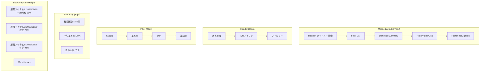
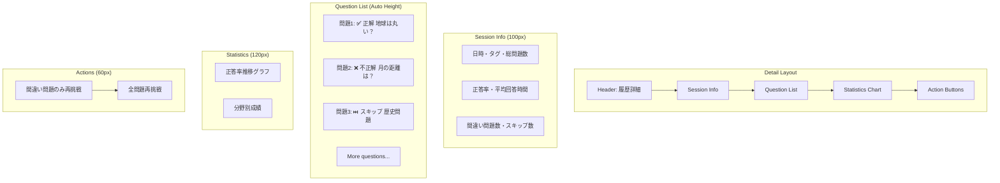
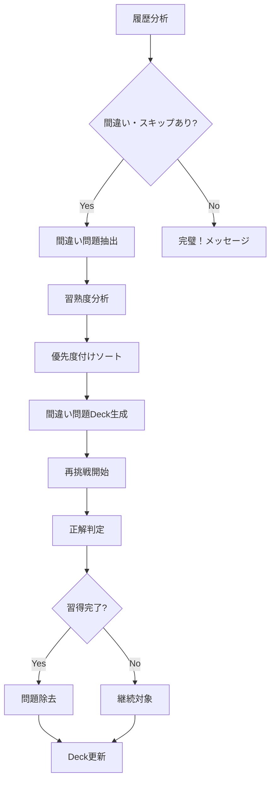
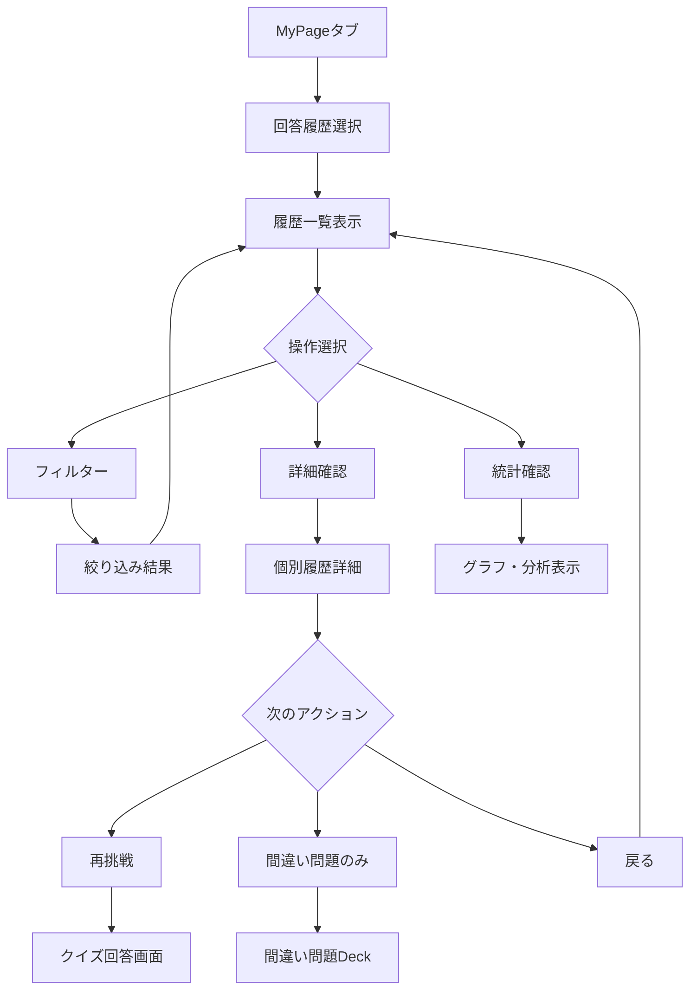

# US-04: 回答履歴UI要件

## 概要

**アクター**: 匿名ユーザー  
**目的**: 過去の回答を確認・復習する  
**優先度**: 高（MVP対象）  

## UI要件

### 操作体験

- **画面遷移**: MyPageタブ → 回答履歴 → 詳細確認 → 再解答
- **表示方式**: 日付・Deck・正答率の一覧リスト表示
- **詳細確認**: 個別回答の正誤・解説・再解答機能
- **絞り込み**: 日付・タグ・正答率による検索・フィルター
- **統計表示**: 正答率推移・習熟度の可視化

### 画面構成

#### 履歴一覧画面



### UI制約

#### 表示制約

- **一覧表示**: 無限スクロール・仮想スクロール対応
- **画像**: サムネイル・遅延読み込み
- **日付表示**: 相対日付（今日、昨日、1週間前）
- **統計**: リアルタイム計算・キャッシュ活用

#### パフォーマンス制約

- **初期表示**: ≤ 500ms（最初の20件）
- **フィルター**: ≤ 300ms（絞り込み結果）
- **詳細表示**: ≤ 200ms（個別履歴詳細）
- **統計計算**: ≤ 100ms（サマリー表示）

#### データ制約

- **保存期間**: 2年間（requirements-quiz.mdに従う）
- **匿名化**: 2年後の自動匿名化処理
- **容量制限**: IndexedDB 50MB上限
- **同期**: オフライン→オンライン時の同期

## 履歴一覧設計

### 履歴アイテム表示

```markdown
┌─────────────────────────────────────┐
│ 📅 2025/01/30 14:32                │
│ 🏷️ 一般常識・雑学 (23問)            │
│ 📊 85% (19/23問正解)              │
│ ⏱️ 平均回答時間: 8.2秒              │
│                           [再挑戦] │
└─────────────────────────────────────┘
```

### フィルター・検索機能

- **期間絞り込み**: 今日・今週・今月・全期間
- **正答率絞り込み**: 90%以上・70-89%・50-69%・50%未満
- **タグ絞り込み**: 公認タグ・ユーザタグでの絞り込み
- **並び順**: 日付新しい順・古い順・正答率高い順・低い順

## 詳細確認画面

### 詳細画面構成



### 問題詳細表示

- **正解問題**: ✅アイコン・緑色背景・回答時間表示
- **不正解問題**: ❌アイコン・赤色背景・正解と解説表示
- **スキップ問題**: ⏭️アイコン・グレー背景・正解と解説表示
- **タップ拡張**: 問題文・解説の詳細表示

## 間違い問題集機能

### 自動生成Deck



### 習熟度追跡

- **習得状態**: 未習得・学習中・習得済み・完全習得
- **習得条件**: 連続3回正解で習得済み
- **リセット条件**: 1回不正解で学習中に戻る
- **除去条件**: 習得済み状態で1週間経過

## 統計・分析機能

### 統計表示項目

1. **基本統計**
   - 総回答問題数
   - 平均正答率
   - 連続回答日数
   - 最高連続正解数

2. **推移グラフ**
   - 日別正答率推移（7日・30日・全期間）
   - 分野別成績レーダーチャート
   - 回答時間推移グラフ

3. **分野別分析**
   - タグ別正答率ランキング
   - 得意分野・苦手分野の識別
   - 学習進捗の可視化

### グラフ描画

```markdown
Chart.js使用例：
- Line Chart: 正答率推移
- Radar Chart: 分野別成績
- Bar Chart: タグ別回答数
- Doughnut Chart: 正解・不正解・スキップ割合
```

## 操作フロー

### 履歴確認フロー



## データ管理

### IndexedDB設計

```javascript
// 履歴データ構造
interface AnswerHistory {
  id: string;              // セッションID
  date: Date;              // 回答日時
  tags: string[];          // タグ配列
  questions: Question[];   // 問題配列
  totalCount: number;      // 総問題数
  correctCount: number;    // 正解数
  averageTime: number;     // 平均回答時間
  completed: boolean;      // 完了フラグ
}

interface Question {
  id: string;              // 問題ID
  question: string;        // 問題文
  userAnswer: boolean | null; // ユーザー回答
  correctAnswer: boolean;  // 正解
  isCorrect: boolean;      // 正誤判定
  responseTime: number;    // 回答時間
  skipped: boolean;        // スキップフラグ
}
```

### データ操作

- **追加**: 新規回答セッション完了時
- **更新**: 再挑戦・追加学習時
- **削除**: 2年経過・容量上限時
- **同期**: オンライン復旧時のサーバー同期

## パフォーマンス最適化

### 仮想スクロール

- **表示**: 可視領域+バッファーのみレンダリング
- **スクロール**: スムーズスクロール・慣性対応
- **メモリ**: 未使用要素のガベージコレクション

### データキャッシュ

- **統計**: 計算結果のキャッシュ・差分更新
- **画像**: サムネイル生成・キャッシュ保存
- **フィルター**: 検索結果のメモ化

## 関連画面

- **[MyPageホーム](../3.01_wireframes/mypage-home-page.md)**: マイページ入口
- **[間違い問題集](../3.01_wireframes/wrong-quiz-collection-page.md)**: 自動生成Deck
- **[統計画面](../3.01_wireframes/achievements-page.md)**: 詳細統計・実績

## 関連ドキュメント

- [ユーザーフロー分析: US-04](docs/project/ddd-design/2.02.5_user-flow-analysis/user-flow-analysis.md#us-04-回答履歴確認匿名ユーザー)
- [要件定義](docs/project/specifications/requirements/requirements-quiz.md#データ保存要件)
- [サイトマップ](docs/project/ui-design/1.01_sitemap.yaml)

---
**作成工程**: UI設計  
**作成日**: 2025-01-31  
**更新日**: 2025-01-31
