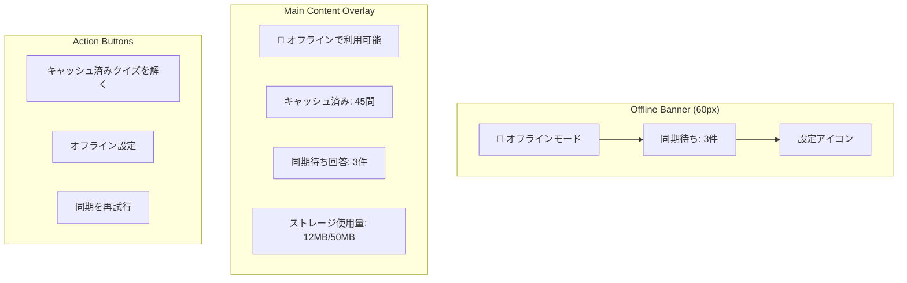
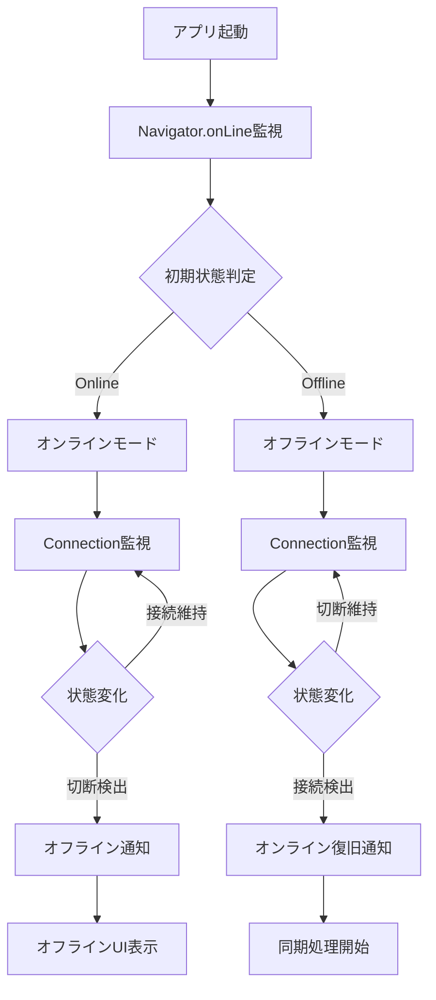
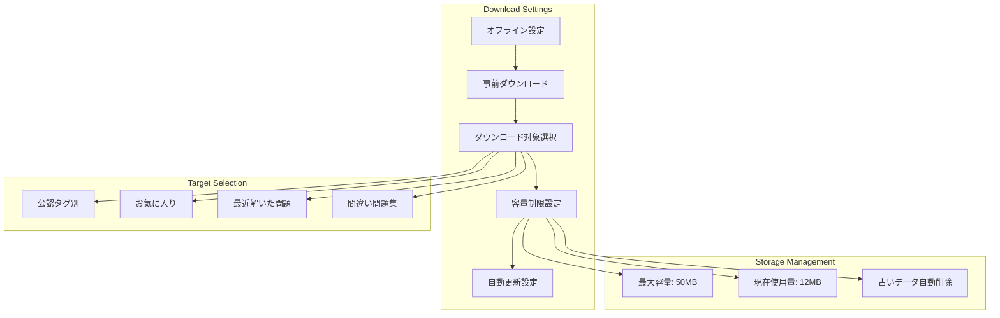
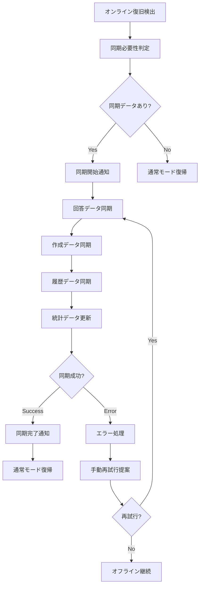
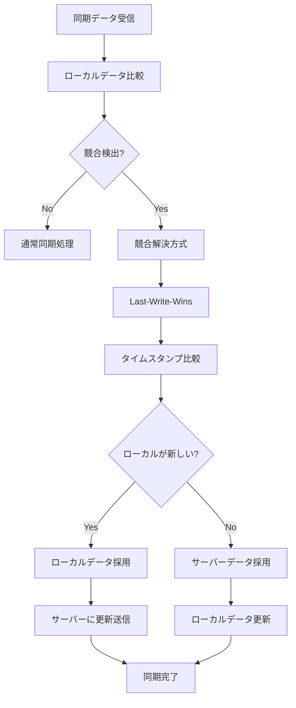
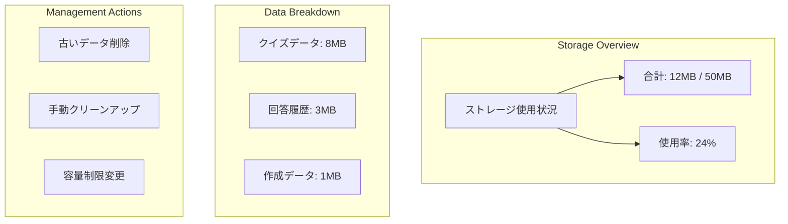

# US-05: オフライン利用UI要件

## 概要

**アクター**: 匿名ユーザー
**目的**: ネットワーク不安定時でもクイズを利用する
**優先度**: 中（将来拡張）

## UI要件

### 操作体験

- **状態検出**: ネットワーク断線の自動検出・500ms以内
- **モード切り替え**: オフラインモード切り替えの提案・確認
- **オフライン機能**: 事前ダウンロード済みクイズでの回答継続
- **同期管理**: オンライン復旧時の自動同期・プログレス表示
- **データ管理**: ローカルデータの容量表示・管理機能

### 画面構成

#### オフライン状態通知



### UI制約

#### 状態表示制約

- **検出速度**: ネットワーク状態変化から500ms以内の表示更新
- **視覚的区別**: オンライン・オフライン状態の明確な色分け
- **同期進捗**: リアルタイムプログレス表示・エラー状態表示
- **容量表示**: ローカルストレージ使用量の視覚的表示

#### 機能制約

- **事前ダウンロード**: 最大100問まで・圧縮効率考慮
- **同期競合**: Last-Write-Winsによる単純化処理
- **データ保持**: 最大50MB・自動クリーンアップ
- **エラー処理**: 同期失敗時の手動再試行機能

## オフライン検出・通知

### ネットワーク状態検出



### 状態通知デザイン

- **オンライン**: 緑色・WiFiアイコン・「接続中」
- **オフライン**: オレンジ色・オフラインアイコン・「オフライン」
- **同期中**: 青色・回転アイコン・「同期中」
- **エラー**: 赤色・エラーアイコン・「同期失敗」

## 事前ダウンロード機能

### ダウンロード設定画面



### ダウンロード進捗表示

```markdown
┌─────────────────────────────────────┐
│ 📥 クイズをダウンロード中...         │
│ ████████████░░░░ 75% (38/50問)     │
│                                     │
│ 一般常識: ✅完了 (15問)              │
│ 歴史: 🔄ダウンロード中 (8/12問)      │
│ 科学: ⏳待機中 (25問)               │
│                                     │
│ 推定完了時間: 30秒                   │
│ データサイズ: 2.3MB                 │
│                           [キャンセル] │
└─────────────────────────────────────┘
```

## オフライン回答機能

### オフライン回答画面

- **UI表示**: 通常のクイズ回答画面と同様
- **データソース**: IndexedDBから読み込み
- **回答保存**: ローカルストレージに一時保存
- **同期マーク**: 同期待ちマークの表示

### 制限機能の表示

```markdown
⚠️ オフライン機能制限
• 新しいクイズの作成: 利用不可
• リアルタイム統計: 同期後に更新
• 新規クイズ検索: 利用不可
• 承認状況確認: 同期後に更新
```

## 同期処理機能

### 自動同期フロー



### 同期進捗表示

```markdown
┌─────────────────────────────────────┐
│ 🔄 データを同期中...                │
│ ████████████████ 100%              │
│                                     │
│ ✅ 回答データ: 3件 同期完了          │
│ ✅ 作成データ: 1件 同期完了          │
│ 🔄 履歴データ: 同期中...            │
│ ⏳ 統計データ: 待機中               │
│                                     │
│ 残り時間: 約15秒                    │
│                           [一時停止] │
└─────────────────────────────────────┘
```

## データ競合解決

### 競合検出・解決



### 競合通知UI

```markdown
⚠️ データ競合を検出
オフライン中に変更されたデータと
サーバーのデータが異なります。

最新の変更を優先します：
• 回答履歴: ローカル版を採用
• 作成クイズ: サーバー版を採用

[OK] [詳細を確認]
```

## ストレージ管理

### 容量管理画面



### 自動クリーンアップ

- **実行タイミング**: 80%使用率到達時
- **削除対象**: 30日以上前の回答履歴・キャッシュ
- **保護対象**: 未同期データ・お気に入り
- **通知**: クリーンアップ実行前の確認

## エラーハンドリング

### 同期エラー種別

1. **ネットワークエラー**: 接続不安定・タイムアウト
2. **認証エラー**: セッション期限切れ・権限不足
3. **データエラー**: 破損・不整合データ
4. **容量エラー**: サーバー・ローカル容量不足

### エラー表示・対処

```markdown
❌ 同期に失敗しました

原因: ネットワーク接続が不安定です
影響: 3件の回答が未同期状態です

対処方法:
• 安定したWiFi環境で再試行
• モバイルデータ使用を許可
• 後で自動的に再試行

[今すぐ再試行] [後で再試行] [詳細]
```

## パフォーマンス最適化

### データ圧縮

- **クイズデータ**: JSON圧縮・画像最適化
- **履歴データ**: 差分同期・バッチ処理
- **キャッシュ**: LRU方式・自動削除

### バックグラウンド処理

- **同期処理**: Service Workerでのバックグラウンド同期
- **ダウンロード**: 段階的・中断可能なダウンロード
- **クリーンアップ**: アイドル時間での自動実行

## 関連画面

- **[オフライン設定](../3.01_wireframes/offline-settings-page.md)**: オフライン機能設定
- **[同期状況](../3.01_wireframes/sync-status-page.md)**: 同期進捗・履歴確認
- **[ストレージ管理](../3.01_wireframes/storage-management-page.md)**: 容量管理・クリーンアップ

## 関連ドキュメント

- [ユーザーフロー分析: US-05](docs/project/ddd-design/2.02_user-flow-analysis/user-flow-analysis.md#us-05-オフライン利用匿名ユーザー)
- [要件定義](docs/project/specifications/requirements/requirements-quiz.md#可用性要件)
- [サイトマップ](docs/project/ui-design/1.01_sitemap.yaml)

---
**作成工程**: UI設計
**作成日**: 2025-01-31
**更新日**: 2025-01-31
