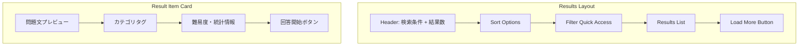
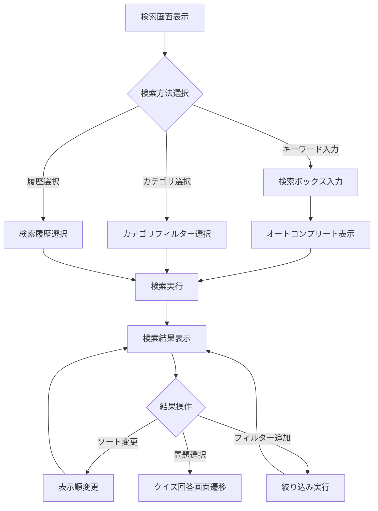

# US-06: クイズ検索UI要件

## 概要

**アクター**: 匿名ユーザー  
**目的**: 自分の興味・レベルに合ったクイズを効率的に発見する  
**優先度**: 中（機能拡張対象）  

## UI要件

### 操作体験

- **画面遷移**: ホーム → 検索画面 → 検索結果 → クイズ回答
- **検索方式**:
  - キーワード検索（問題文・解説内容）
  - カテゴリフィルター（分野別絞り込み）
  - 難易度フィルター（初級・中級・上級）
  - 複合検索（キーワード + フィルター組み合わせ）
- **結果表示**: 関連度順・新着順・人気順のソート機能
- **プレビュー**: 検索結果での問題文一部表示・統計情報

### 画面構成

#### 検索画面レイアウト

```mermaid
graph TD
    subgraph "Mobile Layout (375px)"
        A[Header: 戻る + 検索タイトル] --> B[Search Input Area]
        B --> C[Filter Options Area]
        C --> D[Quick Category Buttons]
        D --> E[Recent Search History]
        E --> F[Popular Keywords]
    end
    
    subgraph "Search Input (60px)"
        B1[検索ボックス] --> B2[音声入力ボタン] --> B3[検索実行ボタン]
    end
    
    subgraph "Filter Area (Auto Height)"
        C1[カテゴリフィルター] --> C2[難易度フィルター] --> C3[期間フィルター]
    end
    
    subgraph "Results Area (Scroll)"
        G[検索結果リスト] --> H[ページネーション]
    end
```

#### 検索結果画面レイアウト

### UI制約

#### レスポンシブ制約

- **画面サイズ**: 375px基準、スマートフォン専用
- **検索ボックス**: 最小高さ48px、十分なタップ領域確保
- **フィルターボタン**: 44px × 最小幅、視認性確保
- **結果カード**: カード間16px間隔、読みやすい情報密度

#### パフォーマンス制約

- **検索応答時間**: ≤ 500ms（95%tile）
- **オートコンプリート**: ≤ 200ms（入力3文字以降）
- **フィルター適用**: ≤ 300ms（リアルタイム絞り込み）
- **無限スクロール**: 次ページ読み込み ≤ 1秒

#### アクセシビリティ制約

- **検索ボックス**: aria-label、placeholder適切な設定
- **フィルター**: 選択状態の明確な視覚的表示
- **結果読み上げ**: スクリーンリーダー対応のaria-live
- **キーボード操作**: Tab順序・Enter/Space操作対応

## 操作フロー

### 正常フロー

### 異常フロー

- **検索結果0件**: 代替キーワード提案・関連カテゴリ表示
- **ネットワークエラー**: オフライン検索（ローカルキャッシュ）への切り替え
- **検索処理遅延**: ローディング表示・キャンセル機能提供
- **不正文字入力**: 入力値サニタイズ・エラーメッセージ表示

## UI状態管理

### 画面状態

1. **初期表示**: 検索ボックス・カテゴリ・履歴表示
2. **入力中**: オートコンプリート・リアルタイム候補表示
3. **検索中**: ローディングスピナー・進捗表示
4. **結果表示**: 検索結果リスト・ページネーション
5. **フィルター中**: 絞り込み条件適用・結果更新
6. **エラー状態**: エラーメッセージ・代替アクション提示

### データ状態

- **検索履歴**: LocalStorageに最新10件保存
- **検索結果**: セッションキャッシュで高速表示
- **フィルター条件**: URLパラメータで状態保持・共有可能
- **オフライン対応**: Service Workerによる部分検索機能

## ビジュアルデザイン要件

### カラーパレット

- **検索ボックス**: #F3F4F6（Gray-100）背景
- **アクティブ状態**: #3B82F6（Blue-500）
- **フィルター選択**: #10B981（Green-500）
- **結果カード**: #FFFFFF（White）背景
- **エラー状態**: #EF4444（Red-500）

### アニメーション

- **検索実行**: 検索ボックス→結果への滑らかな遷移
- **フィルター適用**: フェード・スライド効果
- **結果表示**: カード出現のstagger animation
- **無限スクロール**: 読み込み中の滑らかなローディング

### タイポグラフィ

- **検索ボックス**: 16px, font-weight: 400
- **フィルターラベル**: 14px, font-weight: 500
- **結果タイトル**: 16px, font-weight: 600, line-height: 1.4
- **結果詳細**: 12px, font-weight: 400, line-height: 1.5

## 技術要件

### フレームワーク

- **Next.js**: SSR・API Routes活用
- **React Query**: 検索結果キャッシュ・無効化管理
- **React Hook Form**: 検索フォーム状態管理
- **Fuse.js**: クライアントサイド曖昧検索

### 検索エンジン設計

- **Elasticsearch**: 全文検索・ファセット検索
- **インデックス設計**: 問題文・解説・カテゴリ・タグの最適化
- **検索クエリ**: bool query・match・filter組み合わせ
- **パフォーマンス**: インデックス分割・レプリケーション

### キャッシュ戦略

- **ブラウザキャッシュ**: 人気検索キーワード・カテゴリ情報
- **CDNキャッシュ**: 静的検索結果・オートコンプリート辞書
- **アプリケーションキャッシュ**: Redis活用の高頻度クエリ
- **無効化戦略**: 新規クイズ追加時の段階的更新

## テスト要件

### E2Eテスト

- **検索フロー**: キーワード→結果→クイズ回答の完全フロー
- **フィルター機能**: 複数条件組み合わせの動作確認
- **パフォーマンス**: 大量データでの応答時間測定
- **オフライン**: ネットワーク断線時の動作確認

### ユニットテスト

- **検索ロジック**: クエリ生成・結果パース・エラーハンドリング
- **フィルター**: 条件組み合わせ・状態管理
- **キャッシュ**: 有効期限・無効化・容量制限

## パフォーマンス最適化

### 検索最適化

- **インデックス最適化**: 検索頻度に応じたフィールド重み付け
- **クエリ最適化**: 不要なフィールド除外・結果件数制限
- **並列検索**: カテゴリ・関連度の並列クエリ実行
- **プリフェッチ**: 人気キーワードの事前検索結果準備

### UI最適化

- **仮想スクロール**: 大量結果の効率的レンダリング
- **画像遅延読み込み**: 結果カード画像のLazy loading
- **デバウンス**: 入力中の過度なAPI呼び出し防止
- **キャンセル**: 新規検索時の前回リクエスト中断

## 関連画面

- **[ホーム画面](../3.01_wireframes/home-page.md)**: 検索機能への入り口
- **[クイズ一覧画面](../3.01_wireframes/quiz-list-page.md)**: 検索結果との統合表示
- **[クイズ回答画面](us-01_quiz-answering.md)**: 検索から回答への遷移

## 関連ドキュメント

- [要件定義](docs/project/specifications/requirements/requirements-quiz.md#検索機能要件)
- [サイトマップ](docs/project/ui-design/1.01_sitemap.yaml)
- [DDD設計](docs/project/ddd-design/README.md)

---
**作成工程**: UI設計  
**作成日**: 2025-01-31  
**更新日**: 2025-01-31
