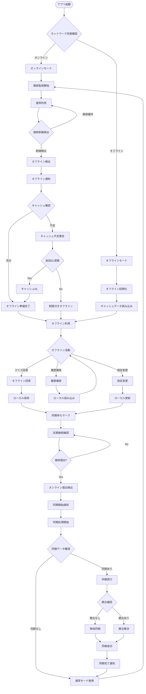
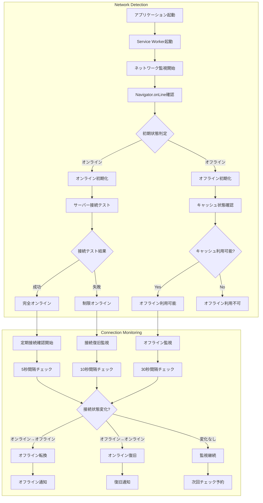
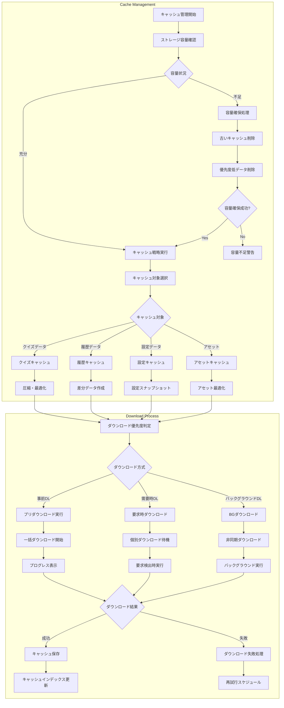
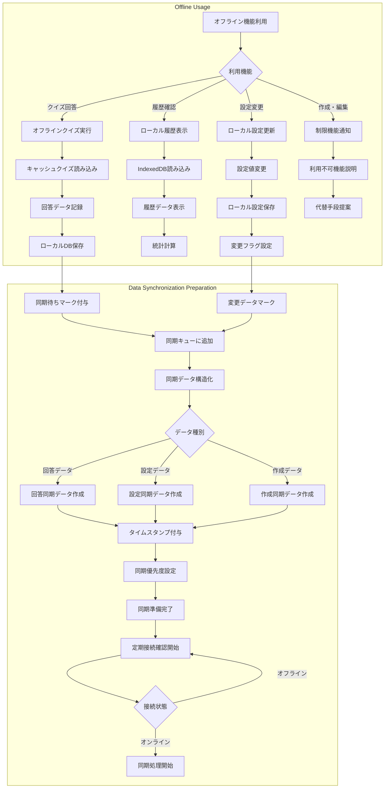
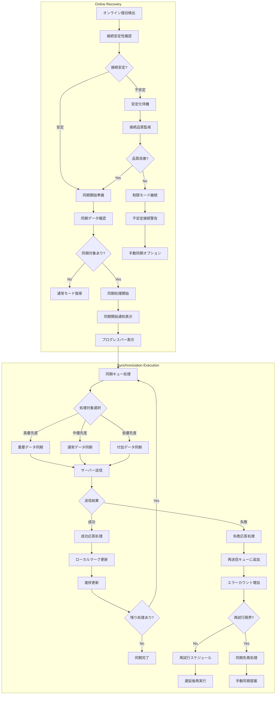
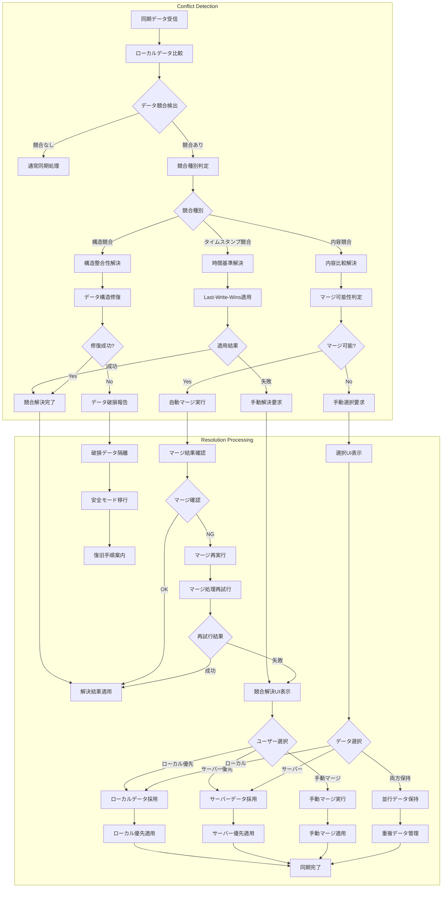
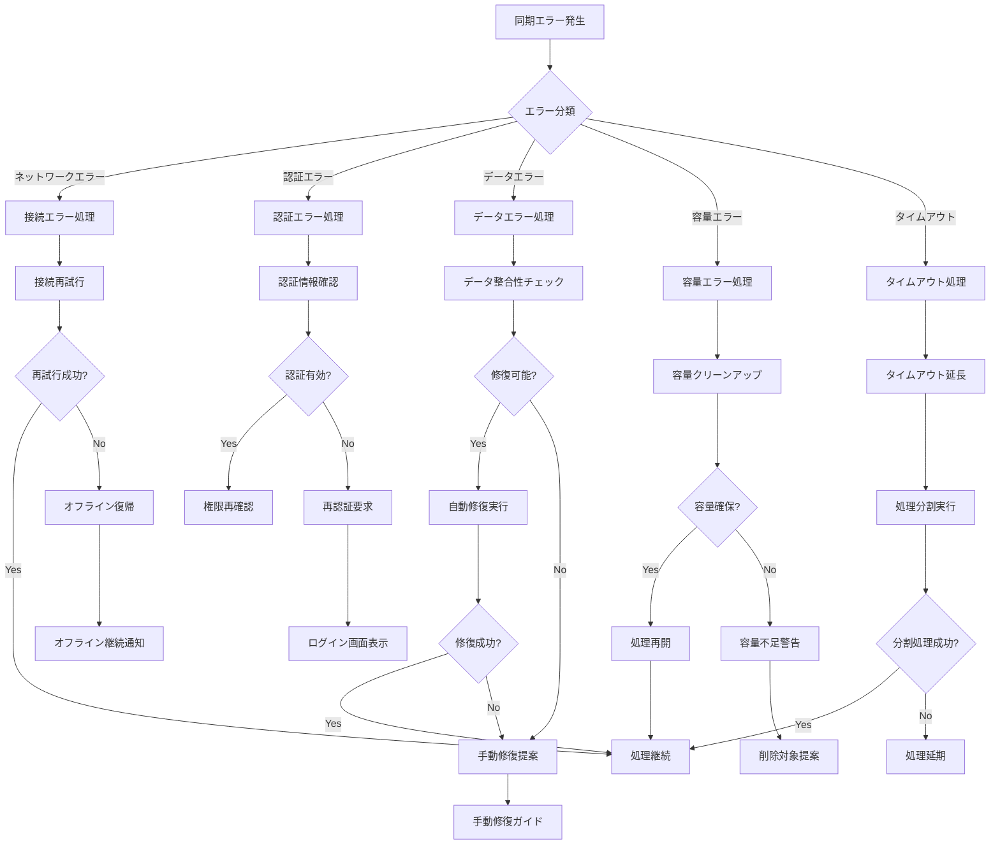

# オフライン同期フロー

## 概要

ネットワーク不安定時でもクイズアプリを継続利用できるオフライン機能と、オンライン復旧時の自動同期処理を示します。PWA + Service Worker + IndexedDBによるシームレスなオフライン体験を提供します。

## 参照ドキュメント

- [US-05: オフライン利用UI要件](../1.02_user-stories/us-05_offline-sync.md)
- [ユーザーフロー分析: US-05](docs/project/ddd-design/2.02.5_user-flow-analysis/user-flow-analysis.md#us-05-オフライン利用匿名ユーザー)

## メインフロー図



## 詳細フロー

### 1. オフライン検出・初期化フェーズ



### 2. キャッシュ管理・ダウンロードフェーズ



### 3. オフライン利用・データ管理フェーズ



### 4. オンライン復旧・同期実行フェーズ



### 5. 競合解決・データ整合性フェーズ



## エラーハンドリング

### 同期エラー処理



## 状態管理

### オフライン同期状態

```javascript
interface OfflineSyncState {
  // 接続状態
  networkStatus: 'online' | 'offline' | 'unstable';
  lastOnlineTime: Date | null;
  connectionQuality: 'excellent' | 'good' | 'poor';
  
  // キャッシュ状態
  cacheStatus: {
    totalSize: number;
    usedSize: number;
    quizCount: number;
    lastUpdate: Date;
  };
  
  // 同期状態
  syncStatus: {
    pendingItems: number;
    lastSyncTime: Date | null;
    isSync: boolean;
    syncProgress: number;
    errors: SyncError[];
  };
  
  // オフライン活動
  offlineActivity: {
    answeredQuizzes: number;
    changedSettings: number;
    pendingUploads: number;
  };
}
```

### 同期データ構造

```javascript
interface SyncData {
  id: string;
  type: 'answer' | 'settings' | 'creation';
  data: any;
  timestamp: Date;
  priority: 'high' | 'medium' | 'low';
  retryCount: number;
  status: 'pending' | 'syncing' | 'completed' | 'failed';
}
```

## パフォーマンス要件

### 同期パフォーマンス

- **オフライン検出**: ≤ 500ms
- **オンライン復旧検出**: ≤ 1000ms
- **同期開始**: ≤ 2000ms
- **データ同期**: ≤ 100ms/項目
- **競合解決**: ≤ 5000ms

### ストレージ効率

- **キャッシュ圧縮率**: 最低50%圧縮
- **データ重複**: 重複データの自動削除
- **容量監視**: 80%到達時の自動クリーンアップ
- **ガベージコレクション**: 未使用データの定期削除

## データ整合性保証

### 整合性チェック

- **タイムスタンプ**: すべてのデータにUTC時刻付与
- **チェックサム**: データ完全性検証用ハッシュ
- **バージョン管理**: データ構造バージョン管理
- **競合検出**: Last-Write-Winsによる単純化

### バックアップ戦略

- **自動バックアップ**: 重要データの自動保存
- **復旧ポイント**: 同期前状態の保持
- **ロールバック**: 同期失敗時の状態復元
- **データ検証**: 整合性チェック後の適用

## 関連ドキュメント

- [クイズ回答フロー](quiz-answering-flow.md)
- [オフライン設定画面](../3.01_wireframes/offline-settings-page.md)
- [同期状況画面](../3.01_wireframes/sync-status-page.md)

---
**作成工程**: UI設計  
**作成日**: 2025-01-31  
**更新日**: 2025-01-31