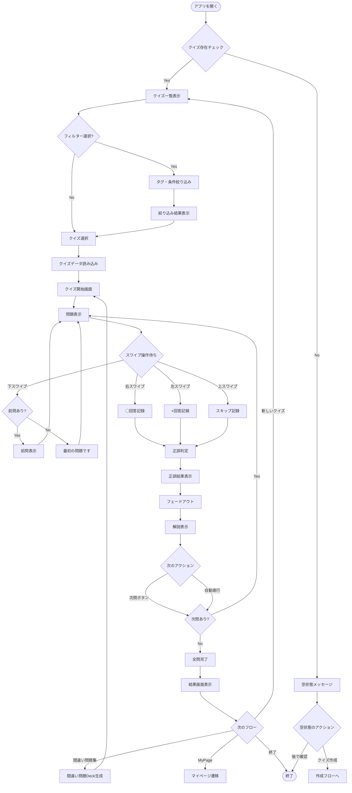
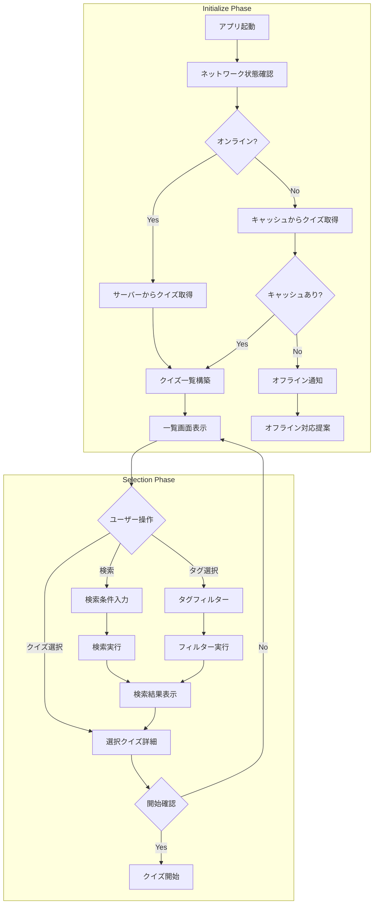
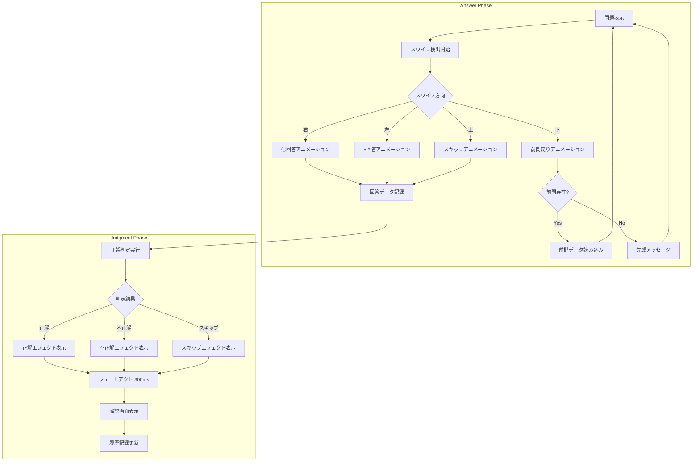
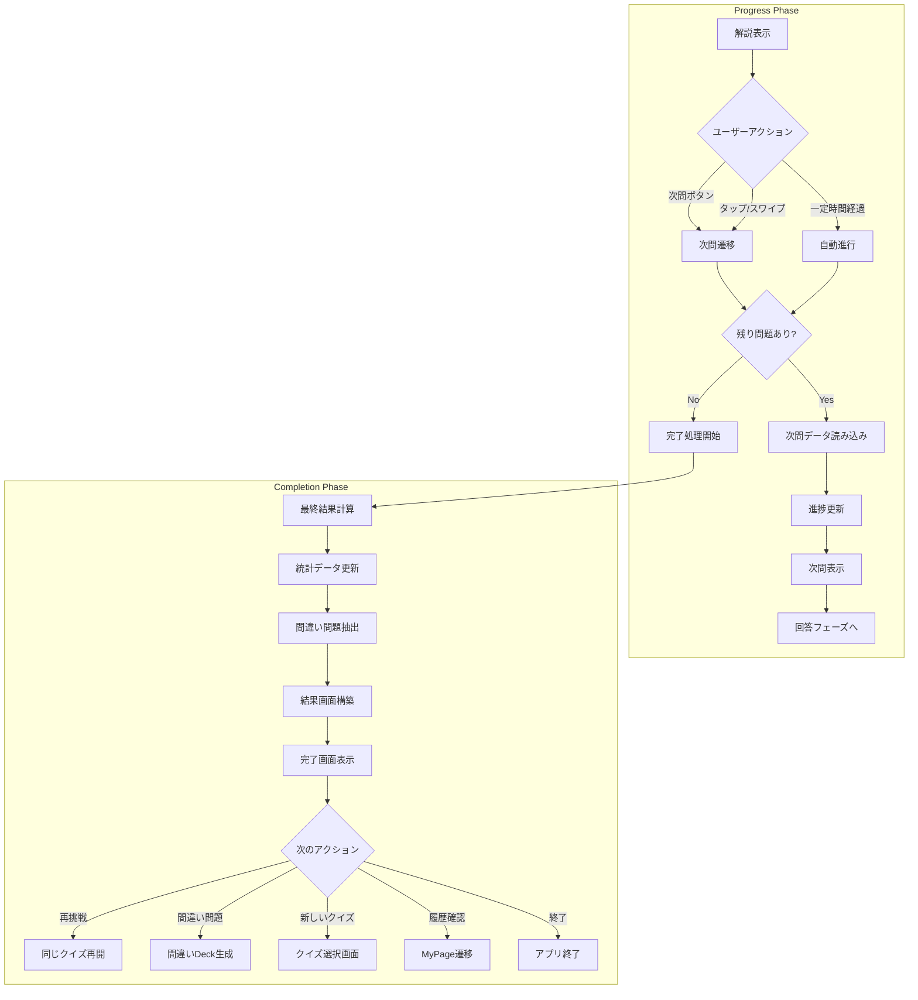
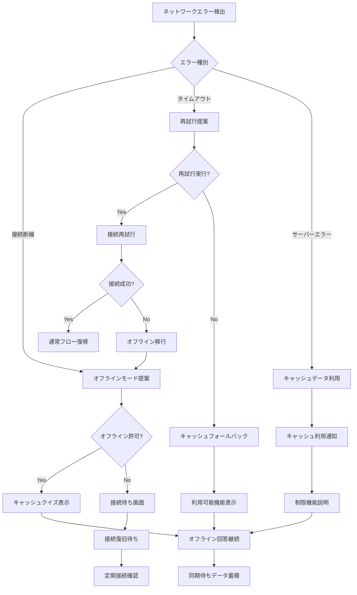
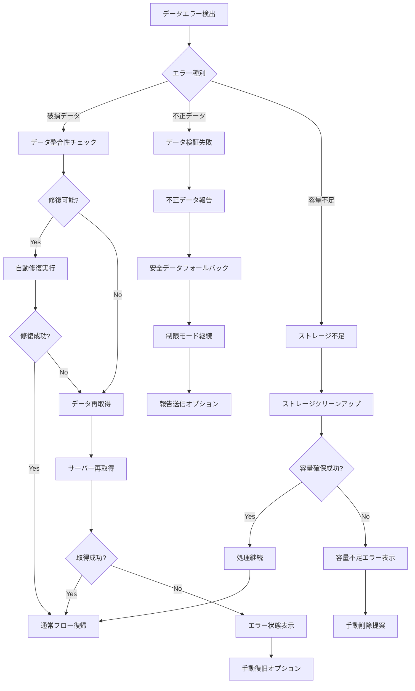
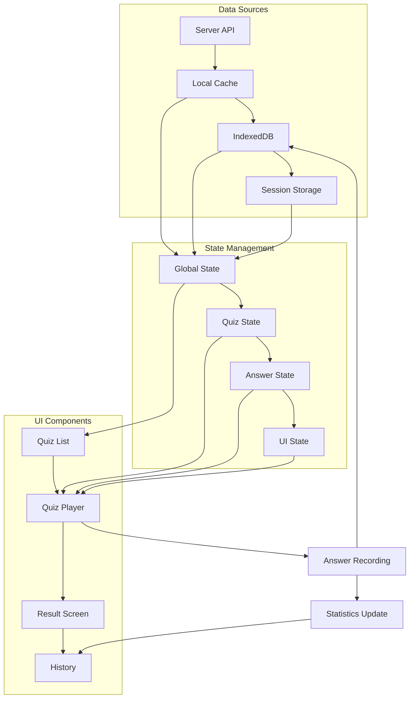

# クイズ回答フロー

## 概要

ユーザーがクイズに回答する一連の流れを示します。Tinder UI形式のスワイプ操作による直感的な回答体験を提供し、正解・不正解の即座フィードバックと解説表示による学習効果を最大化します。

## 参照ドキュメント

- [US-01: クイズ回答UI要件](../1.02_user-stories/us-01_quiz-answering.md)
- [ユーザーフロー分析: US-01](docs/project/ddd-design/2.02.5_user-flow-analysis/user-flow-analysis.md#us-01-クイズ回答匿名ユーザー)

## メインフロー図



## 詳細フロー

### 1. 初期化・クイズ選択フェーズ



### 2. 回答・判定フェーズ



### 3. 進行・完了フェーズ



## エラーハンドリングフロー

### ネットワークエラー



### データエラー



## 状態管理

### アプリケーション状態

```javascript
interface QuizAnswerState {
  // クイズデータ
  currentQuiz: Quiz | null;
  currentQuestion: Question | null;
  questionIndex: number;
  totalQuestions: number;
  
  // 回答状態
  answers: Answer[];
  currentAnswer: Answer | null;
  isAnswering: boolean;
  
  // UI状態
  showExplanation: boolean;
  showResult: boolean;
  animationState: 'idle' | 'swipe' | 'result' | 'explanation';
  
  // 進捗状態
  correctCount: number;
  wrongCount: number;
  skipCount: number;
  startTime: Date;
  
  // エラー状態
  networkStatus: 'online' | 'offline' | 'error';
  error: Error | null;
}
```

### データフロー



## パフォーマンス要件

### タイミング制約

- **問題表示**: ≤ 100ms（キャッシュ時）
- **スワイプ検出**: ≤ 50ms
- **判定表示**: ≤ 200ms
- **画面遷移**: ≤ 300ms

### メモリ管理

- **問題キャッシュ**: 最大50問分
- **履歴保存**: セッション単位での管理
- **画像プリロード**: 次問の画像先読み
- **メモリクリーンアップ**: 画面遷移時の不要データ削除

## 関連ドキュメント

- [クイズ作成フロー](quiz-creation-flow.md)
- [オフライン同期フロー](offline-sync-flow.md)
- [クイズ回答ワイヤーフレーム](../3.01_wireframes/quiz-answer-page.md)

---
**作成工程**: UI設計  
**作成日**: 2025-01-31  
**更新日**: 2025-01-31