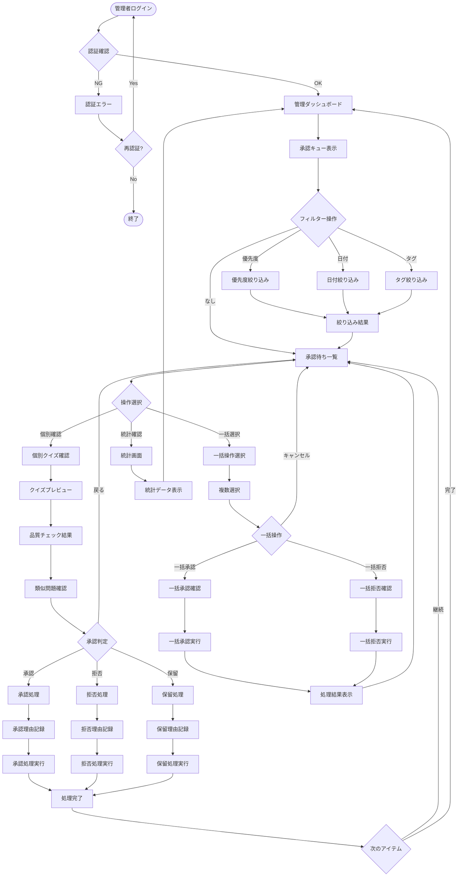
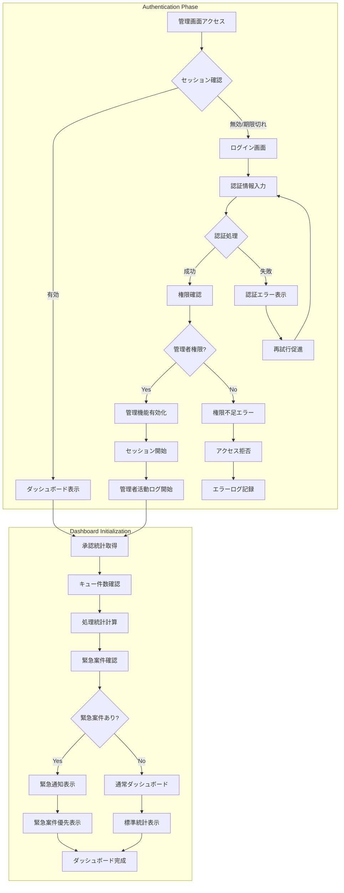
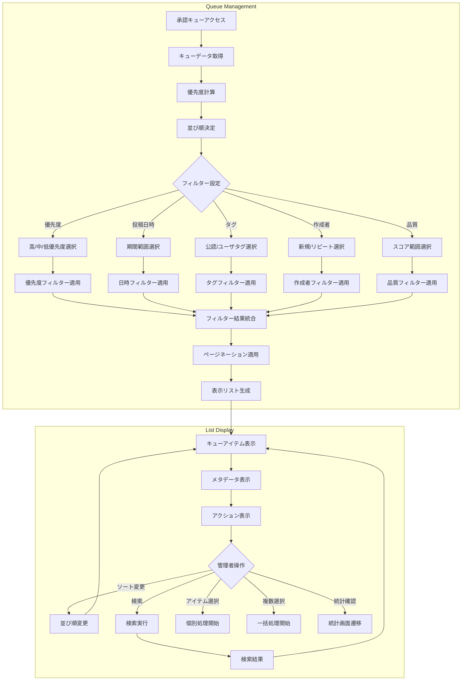
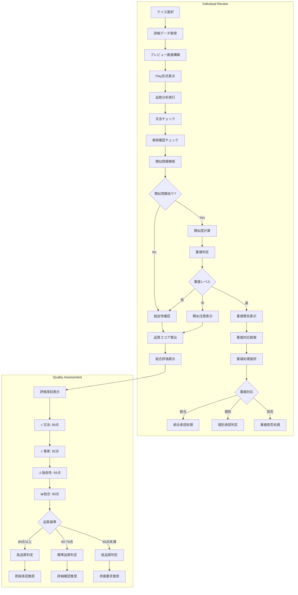
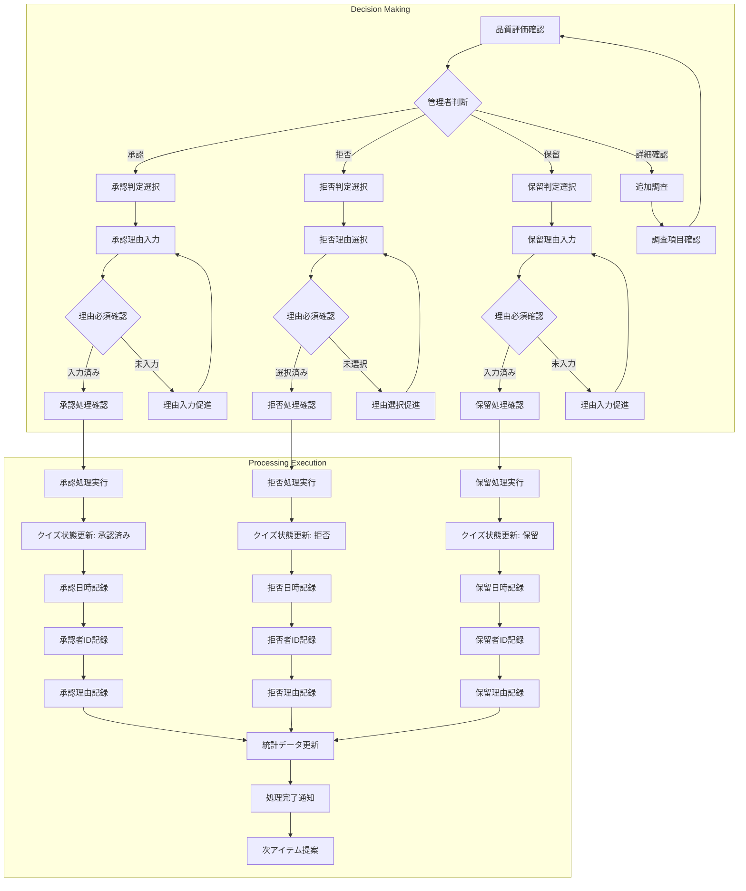
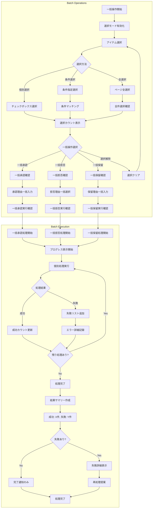
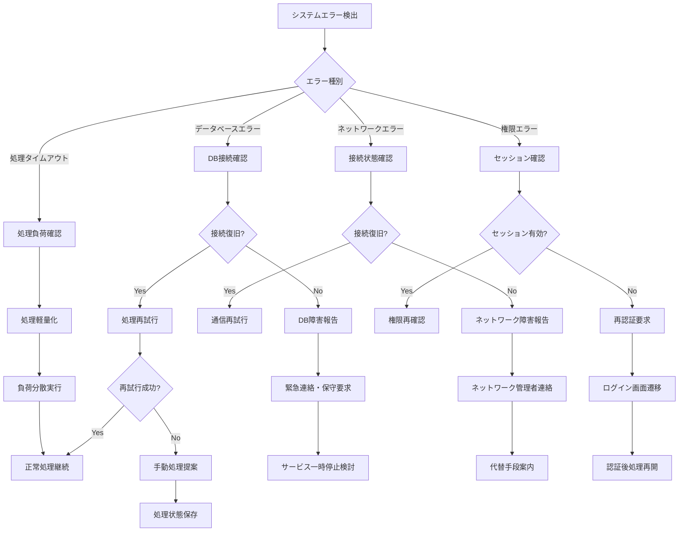

# クイズ承認フロー

## 概要

管理者が投稿されたクイズを審査・承認する一連の流れを示します。効率的な承認キューと詳細な品質チェック、一括操作による管理効率の向上を実現します。

## 参照ドキュメント

- [US-03: クイズ承認UI要件](../1.02_user-stories/us-03_quiz-approval.md)
- [ユーザーフロー分析: US-03](docs/project/ddd-design/2.02.5_user-flow-analysis/user-flow-analysis.md#us-03-クイズ承認管理者)

## メインフロー図



## 詳細フロー

### 1. 認証・初期化フェーズ



### 2. キュー管理・フィルタリングフェーズ



### 3. 個別審査・品質チェックフェーズ



### 4. 承認判定・処理実行フェーズ



### 5. 一括操作・効率化フェーズ



## エラーハンドリング

### システムエラー処理



## 状態管理

### 承認管理状態

```javascript
interface ApprovalManagementState {
  // キュー管理
  queue: {
    items: PendingQuiz[];
    filters: ApprovalFilters;
    pagination: PaginationState;
    sortOrder: SortOption;
  };
  
  // 選択管理
  selection: {
    selectedIds: string[];
    selectAll: boolean;
    batchOperation: 'approve' | 'reject' | 'pending' | null;
  };
  
  // 処理状態
  processing: {
    currentItem: PendingQuiz | null;
    batchProgress: BatchProgress | null;
    isSubmitting: boolean;
  };
  
  // 統計情報
  statistics: {
    totalPending: number;
    todayProcessed: number;
    approvalRate: number;
    avgProcessingTime: number;
  };
}
```

### 品質評価データ

```javascript
interface QualityAssessment {
  grammarScore: number;      // 文法スコア (0-100)
  factualScore: number;      // 事実確認スコア (0-100)
  originalityScore: number;  // 独自性スコア (0-100)
  overallScore: number;      // 総合スコア (0-100)
  
  similarQuizzes: SimilarQuiz[];
  recommendations: string[];
  warnings: string[];
}
```

## パフォーマンス要件

### レスポンス時間

- **キュー表示**: ≤ 1000ms
- **個別プレビュー**: ≤ 500ms
- **品質分析**: ≤ 2000ms
- **承認処理**: ≤ 1000ms
- **一括処理**: ≤ 100ms/件

### スケーラビリティ

- **同時管理者**: 最大10名
- **キュー容量**: 最大1000件表示対応
- **一括処理**: 最大50件同時処理
- **統計計算**: リアルタイム更新対応

## セキュリティ要件

### アクセス制御

- **多要素認証**: パスワード + SMS/メール認証
- **セッション管理**: 2時間自動タイムアウト
- **IP制限**: 許可IPからのアクセスのみ
- **操作ログ**: 全承認・拒否操作の詳細記録

### データ保護

- **暗号化通信**: TLS 1.3以上での通信
- **データ暗号化**: データベース格納時の暗号化
- **バックアップ**: 承認ログの定期バックアップ
- **監査証跡**: 操作履歴の改ざん防止

## 関連ドキュメント

- [クイズ作成フロー](quiz-creation-flow.md)
- [管理者ダッシュボード](../3.01_wireframes/admin-dashboard-page.md)
- [承認キュー画面](../3.01_wireframes/admin-approval-queue-page.md)

---
**作成工程**: UI設計  
**作成日**: 2025-01-31  
**更新日**: 2025-01-31