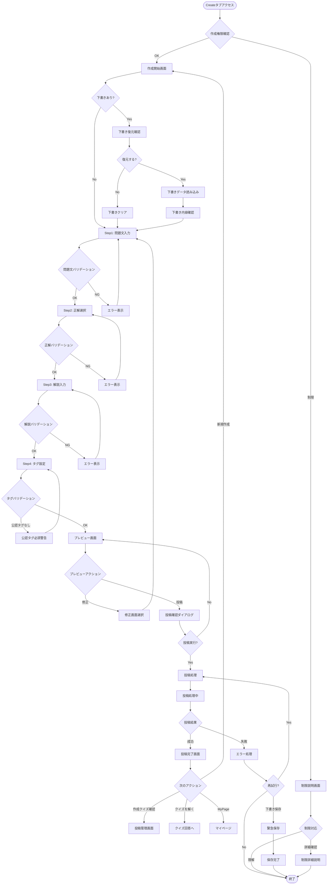
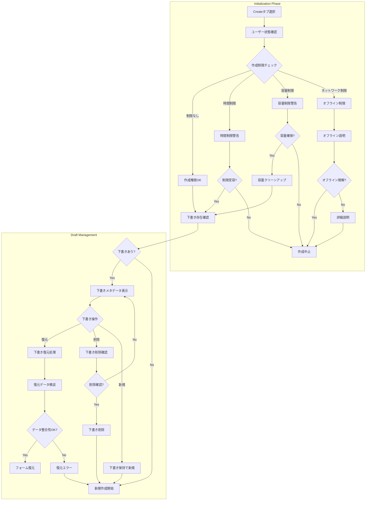
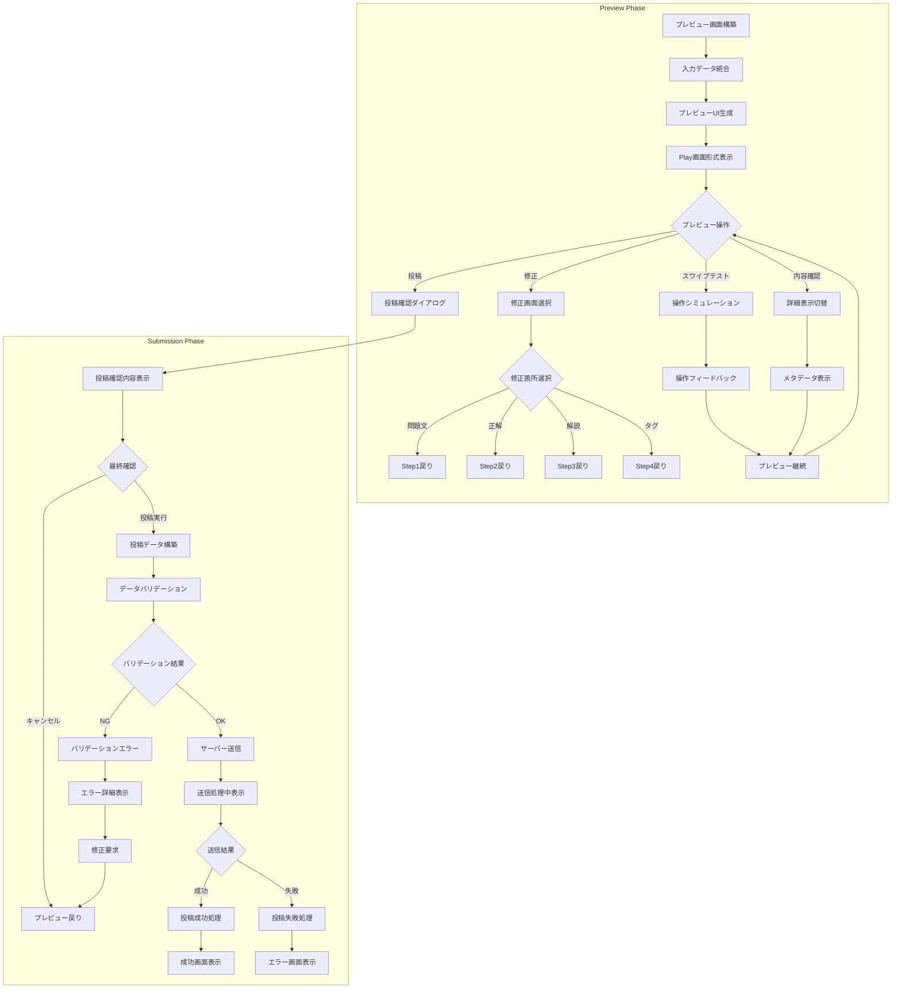
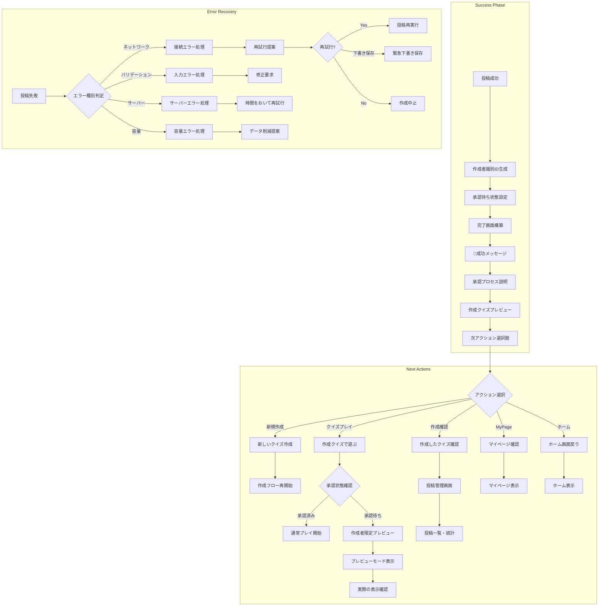
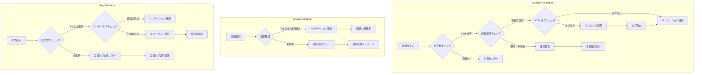
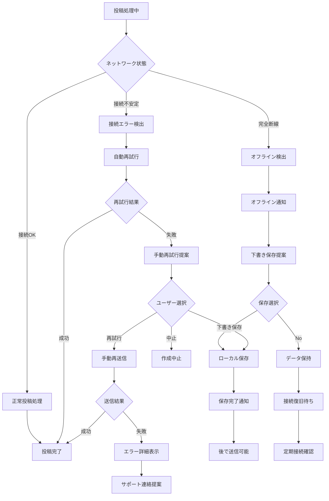

# クイズ作成フロー

## 概要

匿名ユーザーがクイズを作成・投稿する一連の流れを示します。段階的入力フォームによる使いやすい作成体験と、リアルタイムプレビューによる品質確保を提供し、承認待ち状態の明確な管理を実現します。

## 参照ドキュメント

- [US-02: クイズ作成UI要件](../1.02_user-stories/us-02_quiz-creation.md)
- [ユーザーフロー分析: US-02](docs/project/ddd-design/2.02.5_user-flow-analysis/user-flow-analysis.md#us-02-クイズ作成匿名ユーザー)

## メインフロー図



## 詳細フロー

### 1. 初期化・権限確認フェーズ



### 2. 段階的入力フェーズ

```mermaid
flowchart TD
    subgraph "Step 1: Question Input"
        A[問題文入力画面] --> B[入力フィールドフォーカス]
        B --> C[リアルタイム文字数カウント]
        C --> D{入力中バリデーション}
        
        D -->|文字数OK| E[入力継続]
        D -->|文字数超過| F[警告表示]
        D -->|必須未入力| G[必須警告]
        
        E --> H[自動保存タイマー]
        F --> I[入力制限]
        G --> J[進行防止]
        
        H --> K{30秒経過?}
        K -->|Yes| L[下書き自動保存]
        K -->|No| H
        
        I --> M[制限解除待ち] --> E
        J --> N[入力促進メッセージ]
        
        L --> O{保存成功?}
        O -->|Yes| P[保存完了通知]
        O -->|No| Q[保存失敗警告]
        
        N --> E
        P --> R[次ステップボタン有効化]
        Q --> S[手動保存提案]
    end
    
    subgraph "Step 2: Answer Selection"
        T[正解選択画面] --> U[ラジオボタン表示]
        U --> V{選択操作}
        
        V -->|◯選択| W[◯回答設定]
        V -->|×選択| X[×回答設定]
        
        W --> Y[選択状態視覚化]
        X --> Y
        
        Y --> Z[プレビュー更新]
        Z --> AA[次ステップ有効化]
    end
    
    subgraph "Step 3: Explanation Input"
        BB[解説入力画面] --> CC[任意入力説明]
        CC --> DD{入力有無}
        
        DD -->|入力あり| EE[文字数カウント表示]
        DD -->|スキップ| FF[スキップ確認]
        
        EE --> GG{文字数チェック}
        GG -->|制限内| HH[入力継続]
        GG -->|超過| II[文字数警告]
        
        FF --> JJ{スキップ確認?}
        JJ -->|Yes| KK[解説なしで継続]
        JJ -->|No| CC
        
        HH --> LL[リアルタイムプレビュー]
        II --> MM[入力調整促進]
        KK --> NN[次ステップ移行]
        
        LL --> OO[品質ヒント表示]
        MM --> HH
        OO --> PP[入力完了判定]
    end
```



### 3. プレビュー・投稿フェーズ



### 4. 完了・次アクションフェーズ



## バリデーションルール

### 入力バリデーション



### データ整合性チェック

```javascript
interface ValidationRules {
  question: {
    required: true;
    minLength: 1;
    maxLength: 500;
    allowHTML: false;
    sanitize: true;
  };
  
  correctAnswer: {
    required: true;
    type: 'boolean';
    values: [true, false]; // ◯=true, ×=false
  };
  
  explanation: {
    required: false;
    maxLength: 1000;
    allowHTML: false;
    sanitize: true;
  };
  
  tags: {
    officialTags: {
      required: true;
      minCount: 1;
      validTags: ['一般常識', '歴史', '科学', /*...*/];
    };
    userTags: {
      required: false;
      maxCount: 5;
      pattern: /^[a-zA-Z0-9ひらがなカタカナ漢字\s]+$/;
    };
  };
}
```

## エラーハンドリング

### ネットワークエラー処理



## 状態管理

### 作成フォーム状態

```javascript
interface QuizCreationState {
  // フォームデータ
  formData: {
    question: string;
    correctAnswer: boolean | null;
    explanation: string;
    officialTags: string[];
    userTags: string[];
  };
  
  // UI状態
  currentStep: 1 | 2 | 3 | 4 | 'preview';
  isValid: boolean;
  errors: Record<string, string[]>;
  
  // プロセス状態
  isDraftSaved: boolean;
  isSubmitting: boolean;
  lastSaved: Date | null;
  
  // プレビュー状態
  previewMode: 'form' | 'play';
  previewData: Quiz | null;
}
```

## パフォーマンス要件

### レスポンス時間

- **ステップ遷移**: ≤ 200ms
- **バリデーション**: ≤ 100ms  
- **プレビュー更新**: ≤ 500ms
- **自動保存**: ≤ 1000ms
- **投稿処理**: ≤ 3000ms

### データ管理

- **下書き保存**: 30秒間隔の自動保存
- **バリデーション**: リアルタイム検証
- **プレビュー**: 入力変更から500ms後更新
- **データ同期**: オンライン復旧時の自動送信

## 関連ドキュメント

- [クイズ承認フロー](quiz-approval-flow.md)
- [クイズ作成ワイヤーフレーム](../3.01_wireframes/quiz-creation-page.md)
- [投稿完了画面](../3.01_wireframes/quiz-submission-success-page.md)

---
**作成工程**: UI設計  
**作成日**: 2025-01-31  
**更新日**: 2025-01-31