# 回答履歴ページワイヤーフレーム

## 概要

ユーザーの過去の回答履歴を確認・復習できるMyPageタブの中心機能画面のワイヤーフレーム設計です。統計表示、履歴一覧、間違い問題集機能、詳細分析を提供し、効果的な学習復習体験を実現します。

## 参照ドキュメント

- [US-04: 回答履歴UI要件](../1.02_user-stories/us-04_answer-history.md)
- [サイトマップ: 回答履歴画面](../1.01_sitemap.yaml)
- [MyPage関連フロー](../2.01_user-flows/quiz-answering-flow.md)

## ワイヤーフレーム設計

### メイン履歴一覧画面

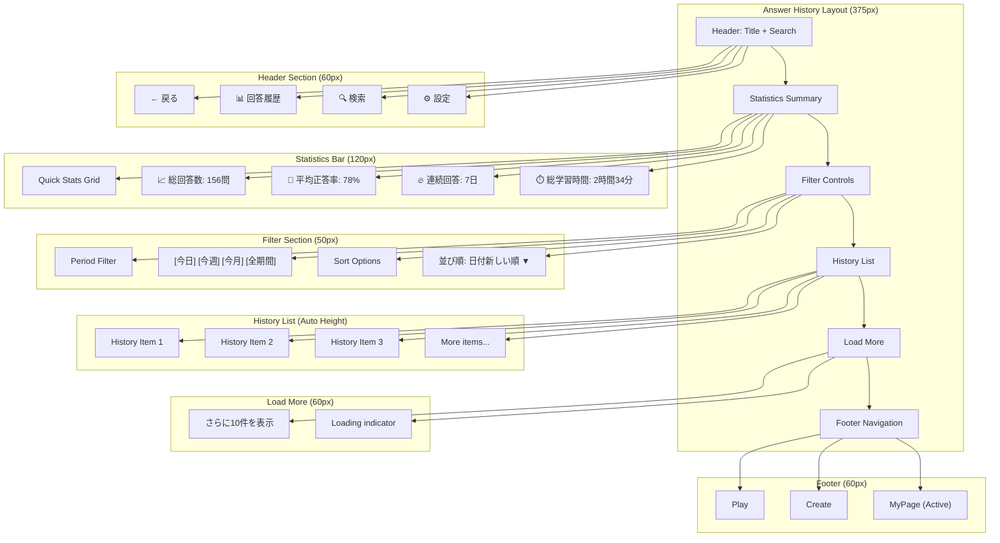

### 履歴アイテム詳細デザイン

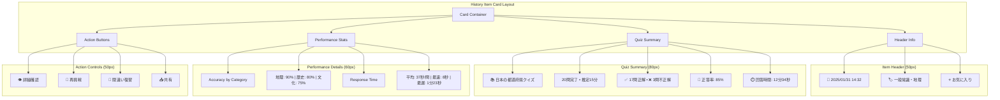

### 詳細確認画面

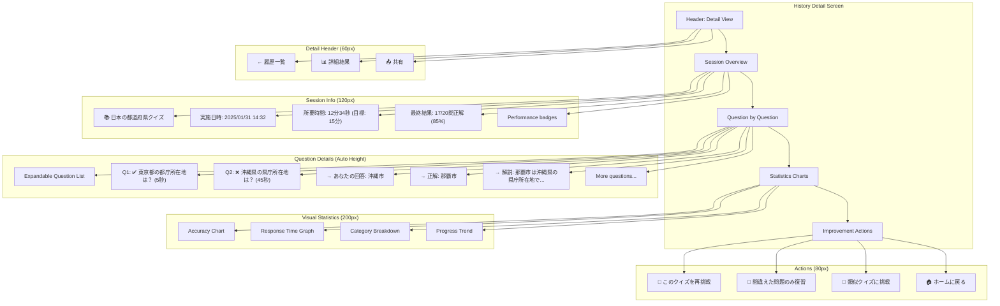

### 間違い問題集画面

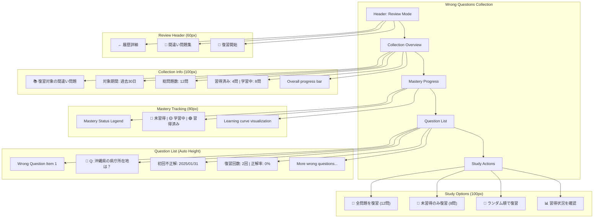

### 統計分析画面

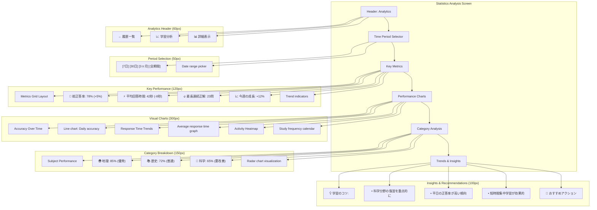

## 状態別表示

### 履歴なし（初回利用）

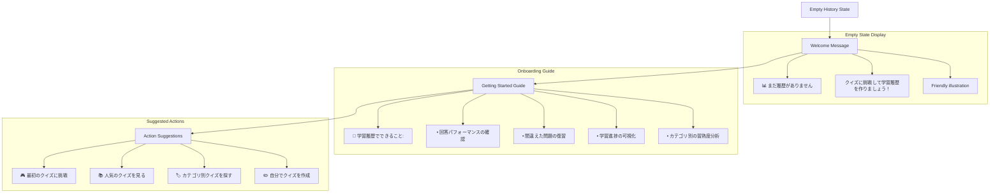

### データ読み込み中

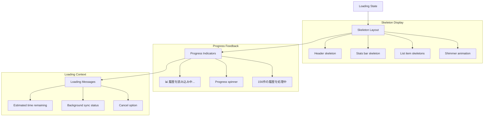

### エラー状態

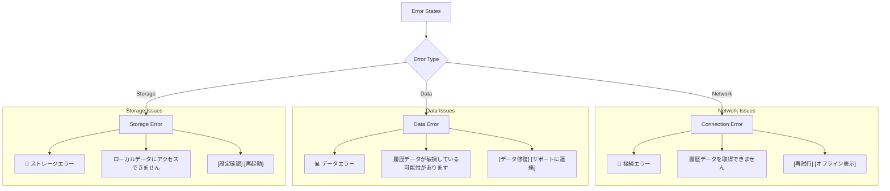

## インタラクション設計

### リスト操作

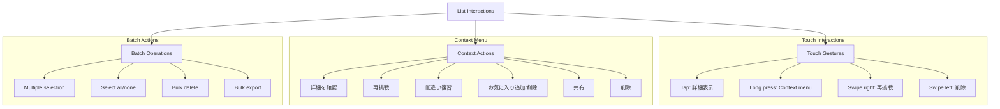

### フィルタリング・検索

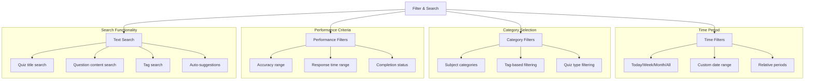

## データ表示

### 履歴データ構造

```javascript
interface AnswerHistoryItem {
  id: string;
  quizId: string;
  title: string;
  category: string;
  tags: string[];
  
  // Session info
  startTime: Date;
  endTime: Date;
  duration: number; // seconds
  
  // Performance
  totalQuestions: number;
  correctAnswers: number;
  incorrectAnswers: number;
  skippedAnswers: number;
  accuracyRate: number;
  
  // Detailed answers
  answers: AnswerDetail[];
  
  // Analysis
  averageResponseTime: number;
  categoryBreakdown: CategoryStats[];
  improvementAreas: string[];
}

interface AnswerDetail {
  questionId: string;
  question: string;
  userAnswer: boolean | null;
  correctAnswer: boolean;
  isCorrect: boolean;
  responseTime: number;
  explanation?: string;
}

interface CategoryStats {
  category: string;
  correct: number;
  total: number;
  accuracy: number;
}
```

### 統計計算

```javascript
interface LearningStatistics {
  // Overall stats
  totalSessions: number;
  totalQuestions: number;
  totalTime: number;
  overallAccuracy: number;
  
  // Trends
  accuracyTrend: TrendData[];
  responseTimeTrend: TrendData[];
  activityPattern: ActivityData[];
  
  // Performance by category
  categoryPerformance: CategoryPerformance[];
  
  // Achievements
  streaks: StreakData;
  personalBests: PersonalBestData;
  
  // Learning insights
  strengths: string[];
  improvementAreas: string[];
  recommendations: string[];
}
```

## レスポンシブ対応

### モバイル最適化

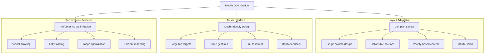

## パフォーマンス要件

### データ処理

- **初期読み込み**: ≤ 1000ms
- **フィルター適用**: ≤ 300ms
- **詳細表示**: ≤ 500ms
- **統計計算**: ≤ 800ms
- **検索実行**: ≤ 400ms

### メモリ効率

- **仮想スクロール**: 50アイテム表示制限
- **画像最適化**: 遅延読み込み・WebP形式
- **データキャッシュ**: 効率的なキャッシュ戦略
- **メモリリーク防止**: 適切なクリーンアップ

## アクセシビリティ

### スクリーンリーダー対応

```javascript
const ariaLabels = {
  historyList: `${totalItems}件の回答履歴`,
  historyItem: `${date}、${title}、正答率${accuracy}%、${duration}`,
  statisticsChart: "学習統計グラフ",
  filterButton: "履歴をフィルター",
  sortButton: "並び順を変更",
  detailButton: "詳細を確認",
  retryButton: "再挑戦",
  wrongQuestions: `間違えた問題${count}件を復習`,
};
```

### キーボードナビゲーション

- **Tab移動**: 論理的なフォーカス順序
- **Enter/Space**: アクション実行
- **Arrow keys**: リスト内ナビゲーション
- **Escape**: モーダル・メニューを閉じる

## 関連ドキュメント

- [ホームページ](home-page.md)
- [クイズ回答ページ](quiz-answer-page.md)
- [US-04: 回答履歴UI要件](../1.02_user-stories/us-04_answer-history.md)

---
**作成工程**: UI設計  
**作成日**: 2025-01-31  
**更新日**: 2025-01-31
