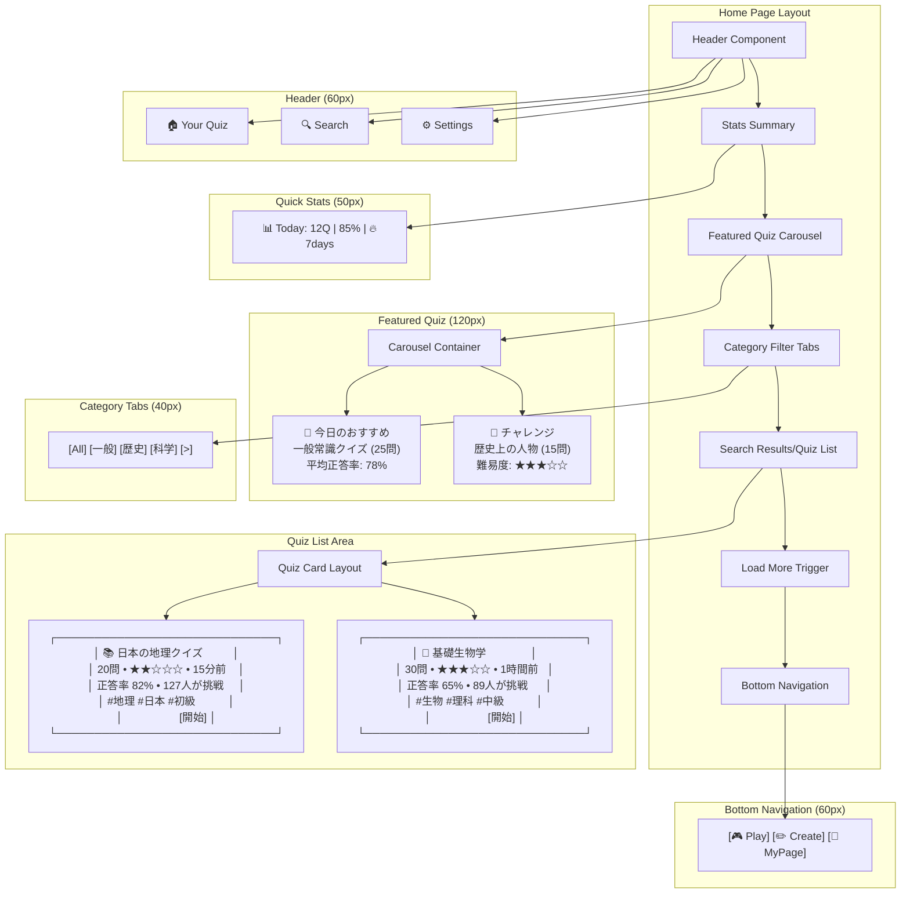
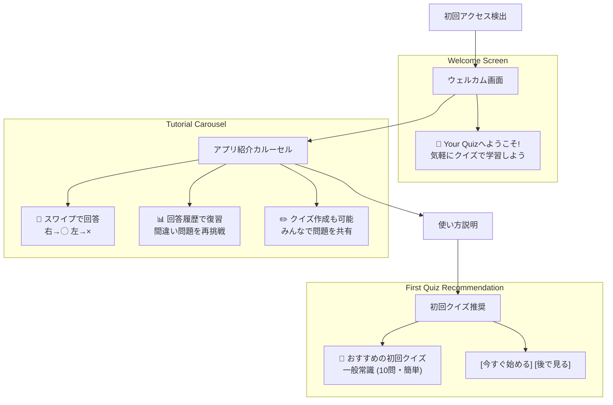
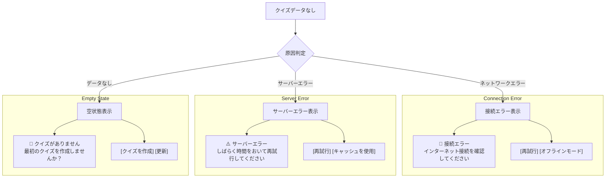
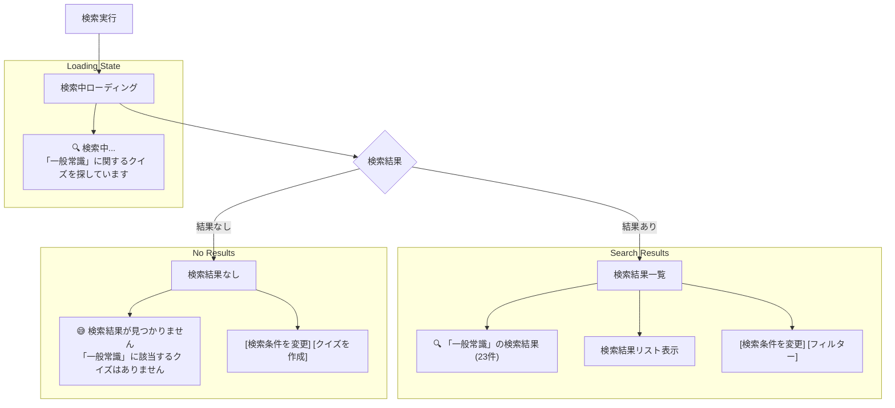
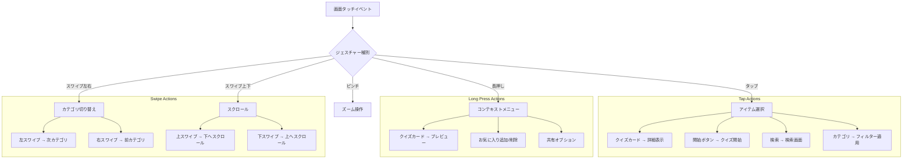
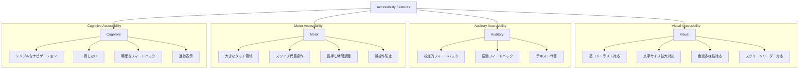

# ホームページ（Playタブ）ワイヤーフレーム

## 概要

クイズアプリのメイン画面となるPlayタブのワイヤーフレーム設計です。クイズ一覧・検索・Deck選択機能を提供し、ユーザーが直感的にクイズを見つけて開始できるUI設計を実現します。

## 参照ドキュメント

- [サイトマップ: ホーム画面](../1.01_sitemap.yaml)
- [US-01: クイズ回答UI要件](../1.02_user-stories/us-01_quiz-answering.md)
- [クイズ回答フロー](../2.01_user-flows/quiz-answering-flow.md)

## ワイヤーフレーム設計（375px基準）

### メインレイアウト

```mermaid
graph TD
    subgraph "Mobile Layout (375px × 812px)"
        A[Header: タイトル + 検索] --> B[Quick Stats Bar]
        B --> C[Featured Quiz Section]
        C --> D[Category Tabs]
        D --> E[Quiz List Area]
        E --> F[Footer Navigation]
    end
    
    subgraph "Header Section (60px)"
        A --> A1[Your Quiz Logo]
        A --> A2[検索アイコン]
        A --> A3[設定アイコン]
    end
    
    subgraph "Stats Bar (50px)"
        B --> B1[今日の回答: 12問]
        B --> B2[正答率: 85%]
        B --> B3[連続日数: 7日]
    end
    
    subgraph "Featured Section (120px)"
        C --> C1[今日のおすすめクイズ]
        C --> C2[カード形式表示]
        C --> C3[スワイプで複数表示]
    end
    
    subgraph "Category Navigation (40px)"
        D --> D1[すべて]
        D --> D2[一般常識]
        D --> D3[歴史]
        D --> D4[科学]
        D --> D5[More...]
    end
    
    subgraph "Quiz List (Auto Height)"
        E --> E1[クイズカード1: タイトル + 問題数 + 難易度]
        E --> E2[クイズカード2: 内容プレビュー + 統計]
        E --> E3[クイズカード3: 作成者 + 日時]
        E --> E4[More Items... (無限スクロール)]
    end
    
    subgraph "Footer Navigation (60px)"
        F --> F1[Play (アクティブ)]
        F --> F2[Create]
        F --> F3[MyPage]
    end
```

### 詳細ワイヤーフレーム（コンポーネント配置）



## 状態別表示

### 初回アクセス時（オンボーディング）



### クイズ未取得時（空状態）



### 検索結果表示



## インタラクション設計

### タッチジェスチャー



### アニメーション設計

```mermaid
graph TD
    A[画面遷移] --> B{アニメーション種別}
    B -->|ページ遷移| C[スライド遷移]
    B -->|カード操作| D[カードアニメーション]
    B -->|ローディング| E[ローディングアニメーション]
    B -->|フィードバック| F[フィードバックアニメーション]
    
    subgraph "Slide Transitions (300ms)"
        C --> C1[右から左: 次ページ]
        C --> C2[左から右: 前ページ]
        C --> C3[下から上: モーダル]
        C --> C4[上から下: 閉じる]
    end
    
    subgraph "Card Animations"
        D --> D1[ホバー: scale(1.02)]
        D --> D2[タップ: scale(0.98)]
        D --> D3[選択: 影の拡大]
        D --> D4[読み込み: スケルトン]
    end
    
    subgraph "Loading Animations"
        E --> E1[スピナー: 回転アニメーション]
        E --> E2[プログレスバー: 幅変更]
        E --> E3[スケルトン: グラデーション移動]
    end
    
    subgraph "Feedback Animations"
        F --> F1[成功: ✅ 緑色フェード]
        F --> F2[エラー: ❌ 赤色シェイク]
        F --> F3[警告: ⚠️ 黄色点滅]
    end
```

## レスポンシブ対応

### ブレークポイント設計

```mermaid
graph TD
    A[Device Detection] --> B{画面サイズ}
    B -->|〜374px| C[Extra Small Mobile]
    B -->|375px〜414px| D[Standard Mobile]
    B -->|415px〜768px| E[Large Mobile/Small Tablet]
    B -->|769px〜| F[Tablet+ (未対応)]
    
    subgraph "XS Mobile (〜374px)"
        C --> C1[1カラムレイアウト]
        C --> C2[フォントサイズ縮小]
        C --> C3[余白縮小]
        C --> C4[ボタンサイズ維持]
    end
    
    subgraph "Standard Mobile (375px)"
        D --> D1[標準1カラム]
        D --> D2[基準フォントサイズ]
        D --> D3[標準余白]
        D --> D4[44px最小タッチ領域]
    end
    
    subgraph "Large Mobile (415px+)"
        E --> E1[ゆとりあるレイアウト]
        E --> E2[カード幅拡大]
        E --> E3[余白拡大]
        E --> E4[より大きなタッチ領域]
    end
    
    subgraph "Tablet+ Notice"
        F --> F1[対応予定なし表示]
        F --> F2[モバイル版利用案内]
    end
```

## アクセシビリティ対応

### アクセシビリティ要件



### ARIAラベル設計

```javascript
// アクセシビリティ対応のARIAラベル例
const ariaLabels = {
  searchButton: "クイズを検索",
  categoryTabs: "カテゴリーを選択",
  quizCard: "クイズ: {title}, {questionCount}問, 難易度{difficulty}",
  startButton: "クイズを開始",
  navigationTabs: "ページナビゲーション",
  loadMore: "さらにクイズを読み込む"
};
```

## データ表示

### クイズカード情報

```mermaid
graph TD
    A[Quiz Card Data] --> B[Basic Info]
    A --> C[Statistics]
    A --> D[Metadata]
    A --> E[Actions]
    
    subgraph "Basic Information"
        B --> B1[タイトル (最大50文字)]
        B --> B2[問題数]
        B --> B3[推定所要時間]
        B --> B4[難易度 (★1-5)]
    end
    
    subgraph "Statistics"
        C --> C1[正答率 (%)]
        C --> C2[挑戦者数]
        C --> C3[作成日時]
        C --> C4[最終更新日]
    end
    
    subgraph "Metadata"
        D --> D1[カテゴリタグ]
        D --> D2[作成者情報]
        D --> D3[承認状態]
        D --> D4[人気度スコア]
    end
    
    subgraph "Action Buttons"
        E --> E1[開始ボタン]
        E --> E2[プレビューボタン]
        E --> E3[お気に入りトグル]
        E --> E4[共有ボタン]
    end
```

## パフォーマンス要件

### ローディング最適化

- **初期表示**: ≤ 1000ms
- **スクロール応答**: ≤ 16ms (60fps)
- **検索応答**: ≤ 500ms
- **カテゴリ切り替え**: ≤ 200ms
- **画像読み込み**: 遅延読み込み・WebP対応

### メモリ管理

- **仮想スクロール**: 表示領域+バッファーのみレンダリング
- **画像最適化**: 適切なサイズでの配信
- **キャッシュ管理**: LRU方式での効率的キャッシュ
- **メモリリーク防止**: コンポーネント破棄時のクリーンアップ

## 関連ドキュメント

- [クイズ一覧ページ](quiz-list-page.md)
- [クイズ回答ページ](quiz-answer-page.md)
- [クイズ回答フロー](../2.01_user-flows/quiz-answering-flow.md)

---
**作成工程**: UI設計  
**作成日**: 2025-01-31  
**更新日**: 2025-01-31