# クイズ回答ページワイヤーフレーム

## 概要

Tinder UI形式によるスワイプ操作でクイズに回答する画面のワイヤーフレーム設計です。直感的なジェスチャー操作、即座のフィードバック表示、解説画面への自然な遷移を提供し、学習効果を最大化するUI設計を実現します。

## 参照ドキュメント

- [US-01: クイズ回答UI要件](../1.02_user-stories/us-01_quiz-answering.md)
- [クイズ回答フロー](../2.01_user-flows/quiz-answering-flow.md)
- [サイトマップ: クイズ回答画面](../1.01_sitemap.yaml)

## ワイヤーフレーム設計

### メインレイアウト（回答待ち状態）

```mermaid
graph TD
    subgraph "Quiz Answer Layout (375px × 812px)"
        A[Header: Progress + Exit] --> B[Question Display Area]
        B --> C[Swipe Interaction Zone]
        C --> D[Answer Hint Area]
        D --> E[Navigation Controls]
    end
    
    subgraph "Header Section (60px)"
        A --> A1[← 終了]
        A --> A2[3 / 10]
        A --> A3[Progress Bar 30%]
        A --> A4[⏸️ 一時停止]
    end
    
    subgraph "Question Area (200px)"
        B --> B1[Question Card Container]
        B1 --> B2["🌍 地球は太陽系の第3惑星である。"]
        B1 --> B3[Question Image (Optional)]
        B1 --> B4[Difficulty: ★★☆☆☆]
    end
    
    subgraph "Swipe Zone (350px)"
        C --> C1[Main Interaction Area]
        C --> C2[Swipe Gesture Detection]
        C --> C3[Visual Feedback Layer]
    end
    
    subgraph "Hint Area (60px)"
        D --> D1[← × 不正解]
        D --> D2[↑ 次の問題]
        D --> D3[○ 正解 →]
        D --> D4[↓ 前の問題]
    end
    
    subgraph "Controls (60px)"
        E --> E1[代替ボタン表示]
        E --> E2[アクセシビリティ対応]
    end
```

### スワイプ操作中の視覚フィードバック

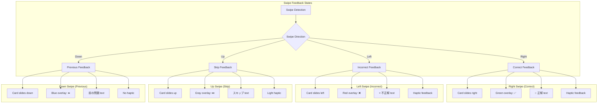

### 判定結果表示画面

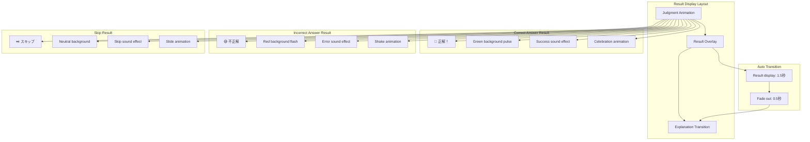

### 解説表示画面

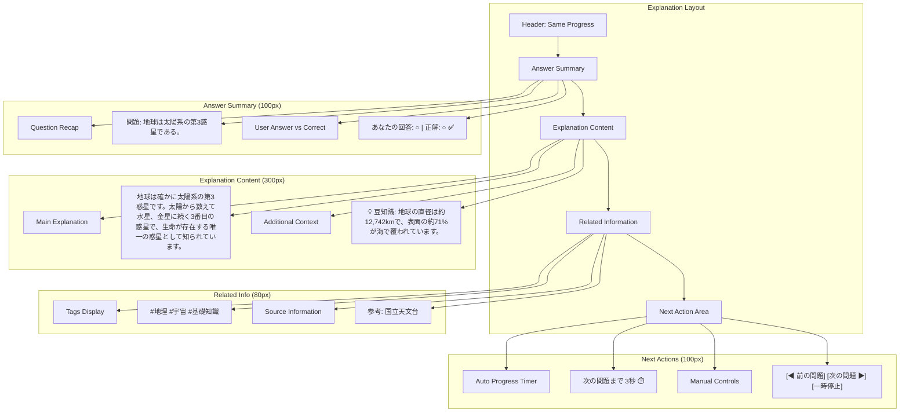

### 代替操作UI（アクセシビリティ）

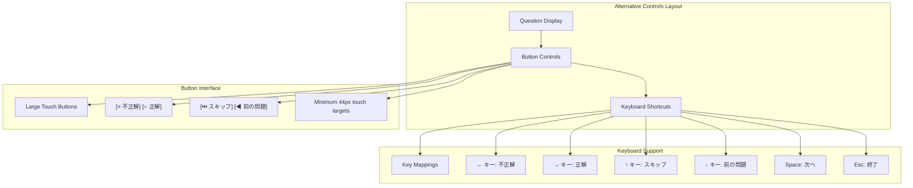

## 状態別表示

### ローディング状態

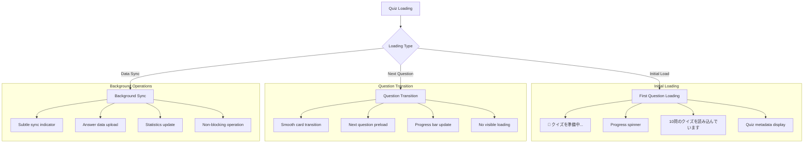

### エラー状態

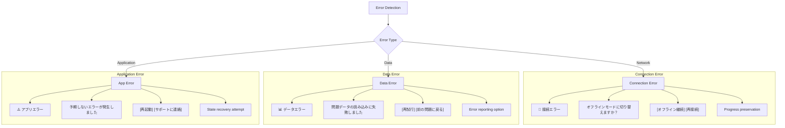

### 完了状態

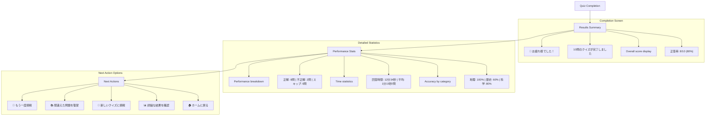

## インタラクション設計

### スワイプジェスチャー詳細

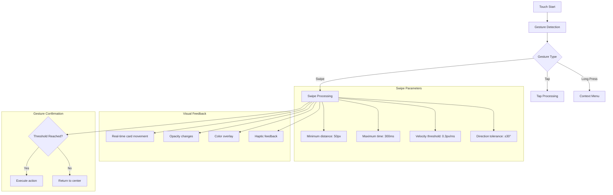

### アニメーション設計

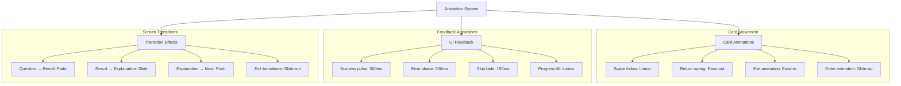

## レスポンシブ対応

### 画面サイズ適応

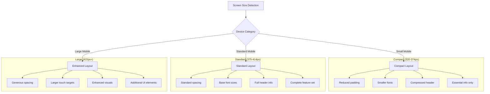

### タッチ最適化

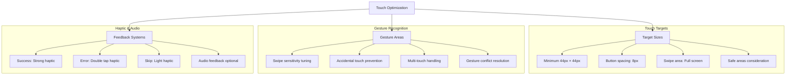

## データ表示

### クイズデータ構造

```javascript
interface QuizQuestion {
  id: string;
  question: string;
  correctAnswer: boolean;
  explanation: string;
  tags: string[];
  difficulty: 1 | 2 | 3 | 4 | 5;
  media?: {
    type: 'image' | 'audio' | 'video';
    url: string;
    altText?: string;
  };
  metadata: {
    createdAt: Date;
    source?: string;
    category: string;
  };
}

interface QuizSession {
  id: string;
  quizId: string;
  questions: QuizQuestion[];
  currentIndex: number;
  answers: Answer[];
  startTime: Date;
  endTime?: Date;
  status: 'active' | 'completed' | 'paused';
}

interface Answer {
  questionId: string;
  userAnswer: boolean | null; // null for skip
  isCorrect: boolean;
  responseTime: number; // milliseconds
  timestamp: Date;
}
```

### 統計データ

```javascript
interface QuizStatistics {
  totalQuestions: number;
  currentQuestion: number;
  correctAnswers: number;
  incorrectAnswers: number;
  skippedAnswers: number;
  averageResponseTime: number;
  totalTime: number;
  accuracyRate: number;
  categoryBreakdown: {
    [category: string]: {
      correct: number;
      total: number;
      accuracy: number;
    };
  };
}
```

## パフォーマンス要件

### アニメーション性能

- **60fps維持**: すべてのアニメーションで60fps達成
- **レスポンス時間**: タッチから反応まで50ms以内
- **メモリ使用**: アニメーション用メモリ管理
- **バッテリー効率**: 効率的なアニメーション実装

### データ処理

- **プリロード**: 次問の事前読み込み
- **キャッシュ**: 回答データの即座保存
- **同期**: バックグラウンドでのデータ同期
- **圧縮**: 効率的なデータ形式

## アクセシビリティ

### スクリーンリーダー対応

```javascript
const ariaLabels = {
  questionCard: `問題 ${currentIndex + 1} / ${totalQuestions}: ${question}`,
  swipeHint: "右にスワイプで正解、左で不正解、上でスキップ",
  progressBar: `進捗 ${Math.round(progress)}%完了`,
  correctAnswer: "正解です",
  incorrectAnswer: "不正解です",
  explanation: `解説: ${explanation}`,
  nextQuestion: "次の問題に進む"
};
```

### 代替操作

- **ボタン操作**: スワイプの代替ボタン提供
- **キーボード**: フルキーボードナビゲーション
- **音声**: 問題・解説の読み上げ対応
- **高コントラスト**: 視覚的配慮モード

## 関連ドキュメント

- [クイズ一覧ページ](quiz-list-page.md)
- [回答履歴ページ](answer-history-page.md)
- [クイズ回答フロー](../2.01_user-flows/quiz-answering-flow.md)

---
**作成工程**: UI設計  
**作成日**: 2025-01-31  
**更新日**: 2025-01-31