# クイズ作成ページワイヤーフレーム

## 概要

段階的入力フォームによるクイズ作成画面のワイヤーフレーム設計です。ユーザーフレンドリーな4ステップ入力、リアルタイムバリデーション、プレビュー機能を提供し、高品質なクイズ作成体験を実現します。

## 参照ドキュメント

- [US-02: クイズ作成UI要件](../1.02_user-stories/us-02_quiz-creation.md)
- [クイズ作成フロー](../2.01_user-flows/quiz-creation-flow.md)
- [サイトマップ: クイズ作成画面](../1.01_sitemap.yaml)

## ワイヤーフレーム設計

### Step 1: 問題文入力画面

```mermaid
graph TD
    subgraph "Quiz Creation Step 1 (375px)"
        A[Header: Progress + Exit] --> B[Step Indicator]
        B --> C[Input Instructions]
        C --> D[Question Input Area]
        D --> E[Character Counter]
        E --> F[Input Guidelines]
        F --> G[Navigation Buttons]
    end
    
    subgraph "Header Section (60px)"
        A --> A1[× キャンセル]
        A --> A2[クイズ作成]
        A --> A3[下書き保存]
    end
    
    subgraph "Progress (50px)"
        B --> B1[● ○ ○ ○]
        B --> B2[Step 1/4: 問題文]
        B --> B3[25% Complete]
    end
    
    subgraph "Instructions (60px)"
        C --> C1["📝 クイズの問題文を入力してください"]
        C --> C2["◯×で答えられる明確な問題を作成しましょう"]
    end
    
    subgraph "Input Area (200px)"
        D --> D1[Large Text Area]
        D --> D2["地球は太陽系で最も大きな惑星である。"]
        D --> D3[Focus state styling]
        D --> D4[Auto-resize functionality]
    end
    
    subgraph "Counter & Validation (40px)"
        E --> E1[文字数: 23/500]
        E --> E2[✅ 入力OK]
        E --> E3[リアルタイム検証]
    end
    
    subgraph "Guidelines (120px)"
        F --> F1["💡 良い問題の例:"]
        F --> F2["• 事実に基づいた内容"]
        F --> F3["• 明確で理解しやすい文章"]
        F --> F4["• ◯×で判断できる内容"]
        F --> F5["❌ 避けるべき例:"]
        F --> F6["• 曖昧な表現や主観的な内容"]
    end
    
    subgraph "Navigation (80px)"
        G --> G1[← 戻る (無効)]
        G --> G2[プレビュー]
        G --> G3[次へ →]
    end
```

### Step 2: 正解選択画面

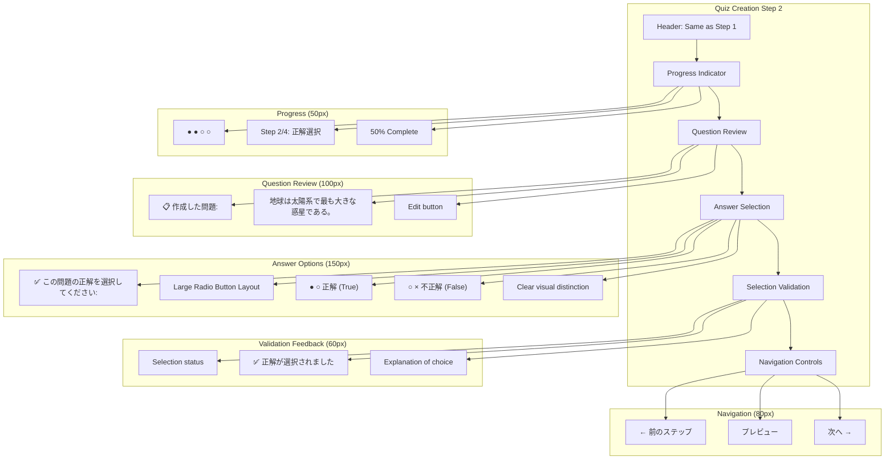

### Step 3: 解説入力画面

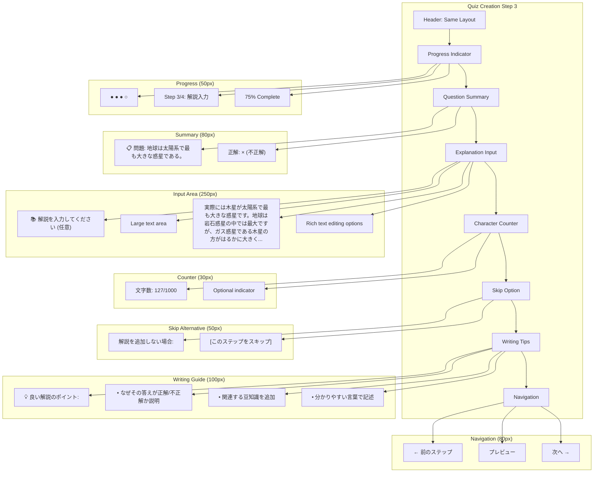

### Step 4: タグ設定画面

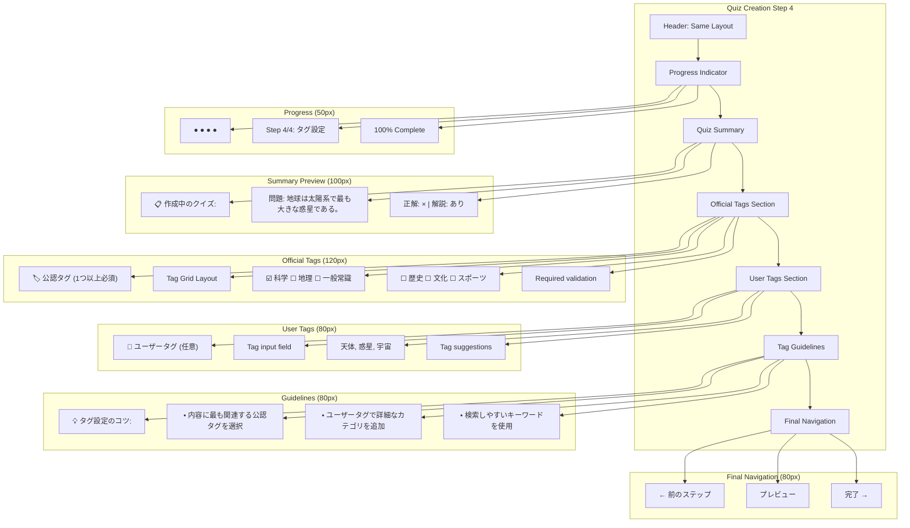

### プレビュー画面

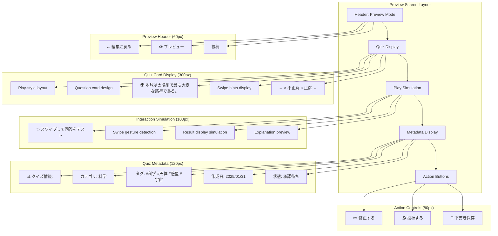

### 投稿確認モーダル

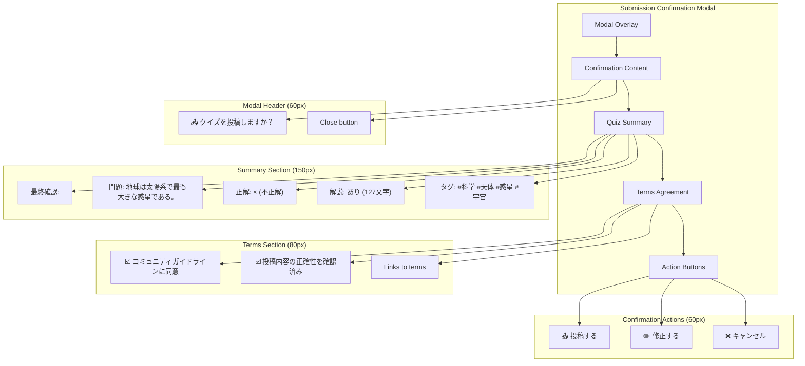

### 投稿完了画面

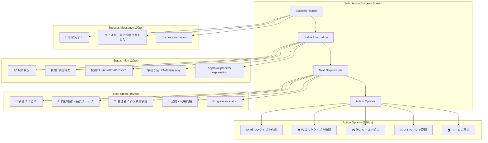

## 状態別表示

### エラー状態

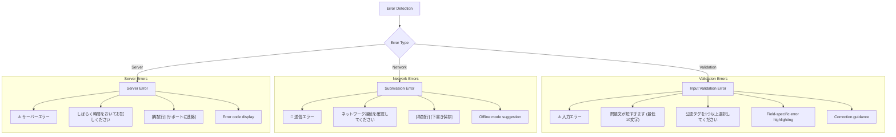

### 下書き管理

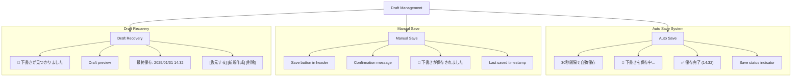

## インタラクション設計

### フォーム操作

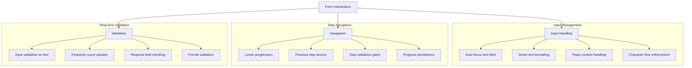

### プレビュー機能

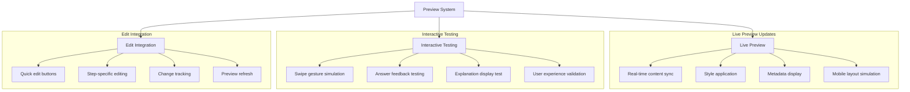

## レスポンシブ対応

### モバイル最適化

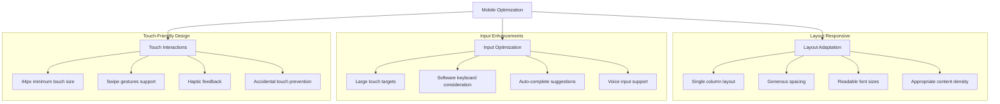

## データ構造

### 作成フォームデータ

```javascript
interface QuizCreationForm {
  // Step 1: Question
  question: {
    text: string;
    isValid: boolean;
    errors: string[];
  };
  
  // Step 2: Answer
  correctAnswer: {
    value: boolean | null;
    isValid: boolean;
  };
  
  // Step 3: Explanation
  explanation: {
    text: string;
    isOptional: true;
    isValid: boolean;
  };
  
  // Step 4: Tags
  tags: {
    official: string[];
    user: string[];
    isValid: boolean;
  };
  
  // Form state
  currentStep: 1 | 2 | 3 | 4 | 'preview';
  isComplete: boolean;
  isDraft: boolean;
  lastSaved?: Date;
}
```

### バリデーションルール

```javascript
const validationRules = {
  question: {
    minLength: 10,
    maxLength: 500,
    required: true,
    pattern: /^[^<>]*$/, // No HTML tags
  },
  
  correctAnswer: {
    required: true,
    type: 'boolean',
  },
  
  explanation: {
    maxLength: 1000,
    required: false,
    pattern: /^[^<>]*$/,
  },
  
  tags: {
    official: {
      minCount: 1,
      maxCount: 3,
    },
    user: {
      maxCount: 5,
      pattern: /^[a-zA-Z0-9\u3040-\u309F\u30A0-\u30FF\u4E00-\u9FAF\s]+$/,
    },
  },
};
```

## パフォーマンス要件

### レスポンス時間

- **ステップ遷移**: ≤ 200ms
- **リアルタイム検証**: ≤ 100ms
- **下書き保存**: ≤ 1000ms
- **プレビュー更新**: ≤ 300ms
- **投稿処理**: ≤ 3000ms

### データ管理

- **自動保存**: 30秒間隔
- **入力遅延**: 300ms後にバリデーション実行
- **メモリ効率**: 効率的な状態管理
- **データ永続化**: LocalStorage + IndexedDB

## アクセシビリティ

### フォームアクセシビリティ

```javascript
const accessibilityFeatures = {
  labels: {
    question: "クイズの問題文を入力",
    correctAnswer: "正解を選択",
    explanation: "解説を入力（任意）",
    tags: "タグを設定",
  },
  
  descriptions: {
    characterCount: "残り文字数",
    validationStatus: "入力検証結果",
    saveStatus: "保存状態",
  },
  
  announcements: {
    stepChange: "ステップ {current} / {total} に移動しました",
    validation: "入力エラーが {count} 件あります",
    saveSuccess: "下書きが保存されました",
  },
};
```

### キーボードナビゲーション

- **Tab順序**: 論理的なフォーカス順序
- **Enter**: 次ステップへの進行
- **Escape**: モーダル・ドロップダウンの閉じる
- **Arrow Keys**: ラジオボタン・タグ選択

## 関連ドキュメント

- [ホームページ](home-page.md)
- [回答履歴ページ](answer-history-page.md)
- [クイズ作成フロー](../2.01_user-flows/quiz-creation-flow.md)

---
**作成工程**: UI設計  
**作成日**: 2025-01-31  
**更新日**: 2025-01-31
