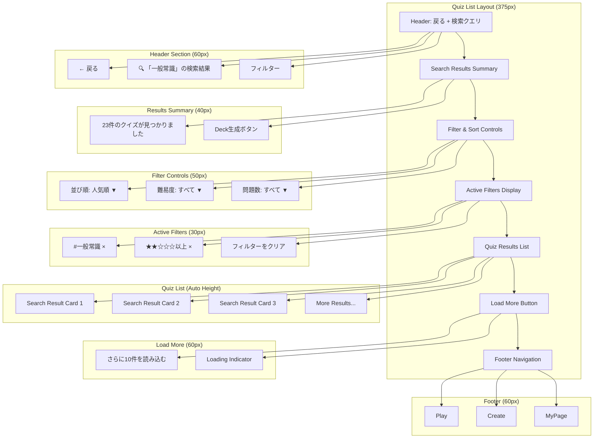
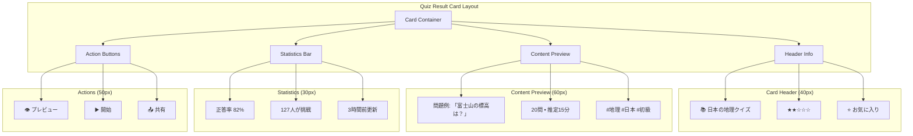
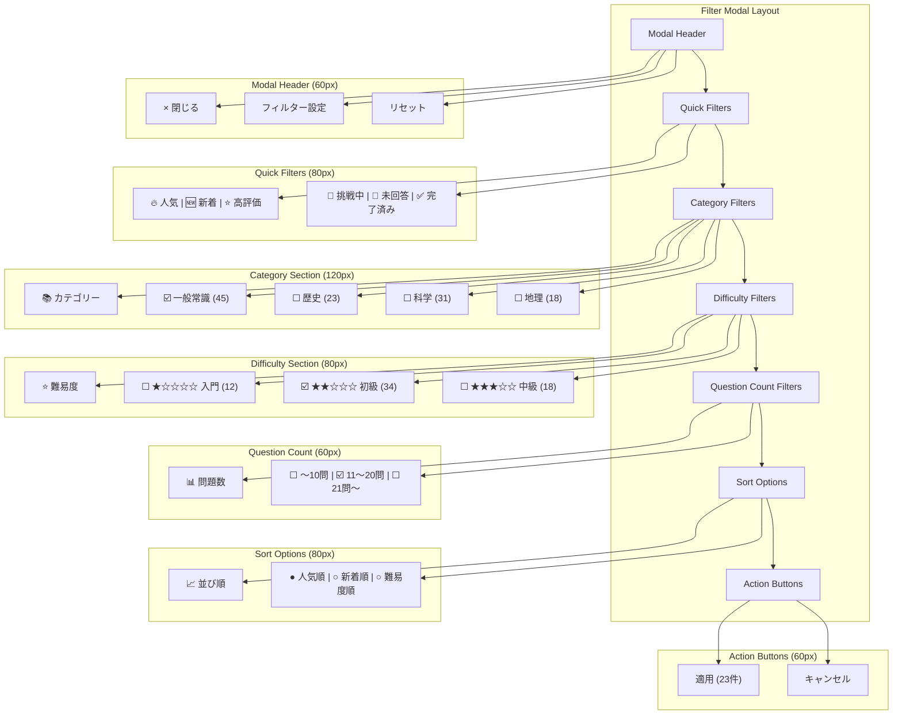
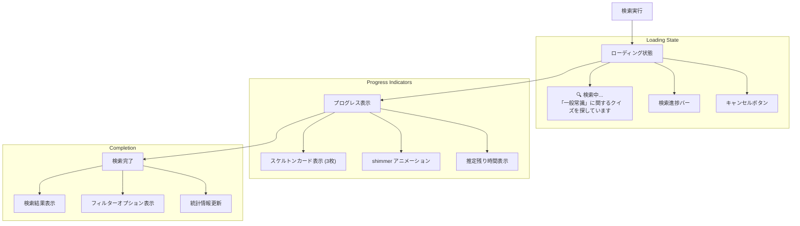
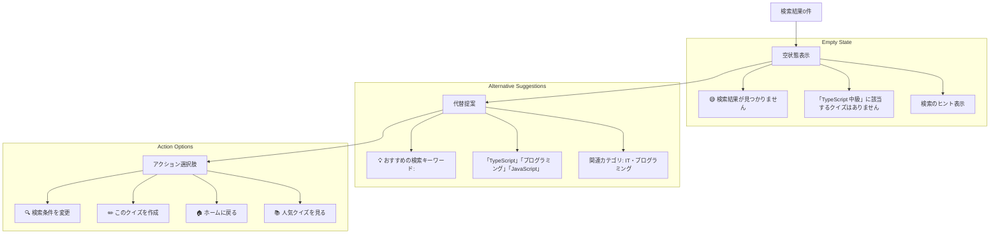
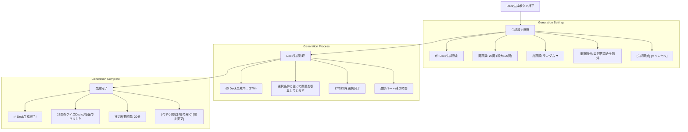
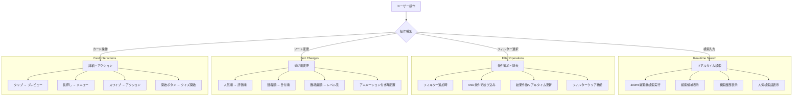
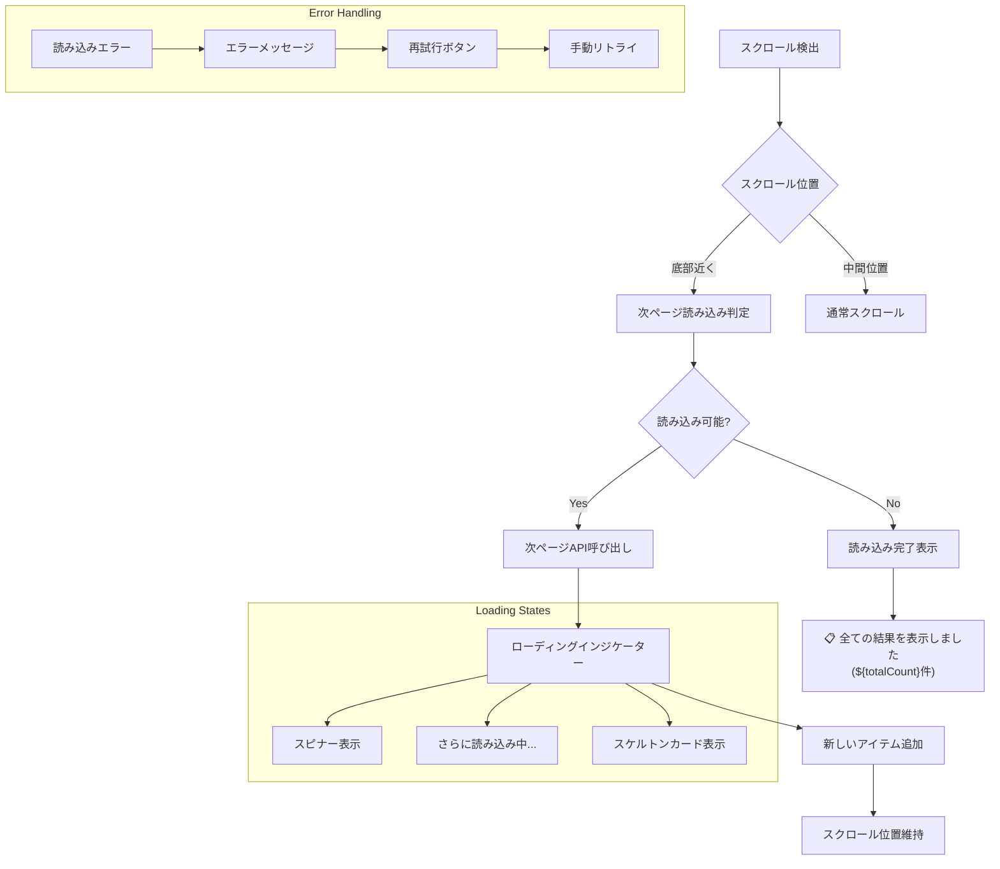
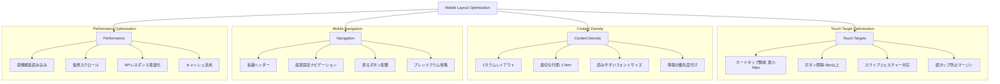

# クイズ一覧ページワイヤーフレーム

## 概要

検索・フィルター機能を持つクイズ一覧表示画面のワイヤーフレーム設計です。タグ別絞り込み、検索結果表示、Deck生成機能を提供し、ユーザーが目的のクイズを効率的に見つけられるUI設計を実現します。

## 参照ドキュメント

- [サイトマップ: クイズ一覧画面](../1.01_sitemap.yaml)
- [US-01: クイズ回答UI要件](../1.02_user-stories/us-01_quiz-answering.md)
- [クイズ回答フロー](../2.01_user-flows/quiz-answering-flow.md)

## ワイヤーフレーム設計

### メインレイアウト（検索結果表示）



### 検索結果カード詳細



### フィルター・ソート画面



## 状態別表示

### 検索中ローディング



### 検索結果なし



### Deck生成機能



## インタラクション設計

### 検索・フィルター操作



### 無限スクロール



## レスポンシブ対応

### モバイル最適化（375px基準）



## データ表示

### 検索結果データ構造

```javascript
interface SearchResult {
  query: string;
  totalCount: number;
  filteredCount: number;
  page: number;
  hasMore: boolean;
  quizzes: Quiz[];
  appliedFilters: Filter[];
  sortOrder: SortOption;
  searchTime: number; // ms
}

interface Quiz {
  id: string;
  title: string;
  description: string;
  questionCount: number;
  difficulty: 1 | 2 | 3 | 4 | 5;
  tags: string[];
  statistics: {
    averageScore: number;
    attemptCount: number;
    completionTime: number;
  };
  metadata: {
    createdAt: Date;
    updatedAt: Date;
    approvalStatus: 'approved' | 'pending' | 'rejected';
  };
}
```

### フィルターオプション

```javascript
interface FilterOptions {
  categories: {
    id: string;
    name: string;
    count: number;
    selected: boolean;
  }[];
  
  difficulty: {
    level: number;
    label: string;
    count: number;
    selected: boolean;
  }[];
  
  questionCount: {
    range: string;
    min: number;
    max: number;
    count: number;
    selected: boolean;
  }[];
  
  sortOptions: {
    value: string;
    label: string;
    selected: boolean;
  }[];
}
```

## パフォーマンス要件

### レスポンス時間

- **検索実行**: ≤ 500ms
- **フィルター適用**: ≤ 300ms
- **ソート変更**: ≤ 200ms
- **ページング**: ≤ 400ms
- **Deck生成**: ≤ 2000ms

### メモリ効率

- **仮想スクロール**: 50アイテム表示上限
- **画像最適化**: WebP + 適切なサイズ
- **キャッシュ管理**: 検索結果10件まで保持
- **メモリリーク防止**: コンポーネント破棄時クリーンアップ

## アクセシビリティ

### スクリーンリーダー対応

```javascript
const ariaLabels = {
  searchResults: `${totalCount}件のクイズが見つかりました`,
  quizCard: `${title}、${questionCount}問、難易度${difficulty}、正答率${averageScore}%`,
  filterButton: "検索条件を絞り込む",
  sortButton: "並び順を変更",
  loadMore: "さらにクイズを読み込む",
  deckGenerate: "選択したクイズでDeckを生成"
};
```

### キーボードナビゲーション

- **Tab順序**: 論理的なフォーカス移動
- **Enter/Space**: ボタン・リンクの実行
- **Escape**: モーダル・フィルターの閉じる
- **矢印キー**: リスト内ナビゲーション

## 関連ドキュメント

- [ホームページ](home-page.md)
- [クイズ回答ページ](quiz-answer-page.md)
- [クイズ回答フロー](../2.01_user-flows/quiz-answering-flow.md)

---
**作成工程**: UI設計  
**作成日**: 2025-01-31  
**更新日**: 2025-01-31
